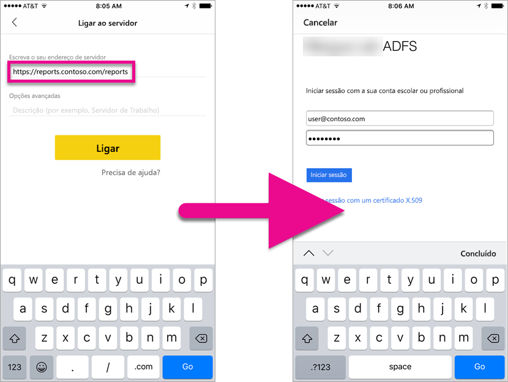
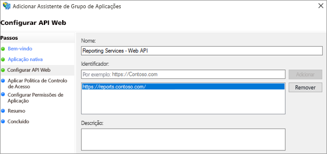

# <a name="using-oauth-to-connect-to-power-bi-report-server-and-ssrs"></a>Utilizar OAuth para ligar ao Power BI Report Server e SSRS

Saiba como configurar o ambiente para suportar a autenticação OAuth com a aplicação móvel do Power BI, para se ligar ao Power BI Report Server e ao SQL Server Reporting Services 2016 ou posterior.



Pode utilizar o OAuth para se ligar ao Power BI Report Server e aos Reporting Services para apresentar relatórios móveis ou KPIs. O Windows Server 2016 inclui algumas melhorias na função do Proxy de Aplicações Web (WAP) para permitir este tipo de autenticação.

   > [!NOTE]
   > Ver relatórios do Power BI alojado no servidor de relatórios do Power BI através de WAP para autenticar é atualmente suportado apenas na aplicação iOS. Aplicação Android não é oficialmente suportada neste momento.

## <a name="requirements"></a>Requirements

O Windows Server 2016 é necessário para os servidores do Proxy de Aplicações Web (WAP) e dos Serviços de Federação do Active Directory (AD FS). Não precisa de ter um domínio de nível funcional do Windows 2016.

## <a name="domain-name-services-dns-configuration"></a>Configuração dos Serviços de Nomes de Domínio (DNS)

Terá de determinar o URL público a que a aplicação móvel do Power BI se irá ligar. Por exemplo, deve ser semelhante ao seguinte.

```https
https://reports.contoso.com
```

Tem de apontar o seu registo de DNS de **relatórios** para o endereço IP público do servidor Proxy de Aplicações Web (WAP). Também terá de configurar um registo DNS público para o servidor do ADFS. Por exemplo, poderá ter configurado o servidor do ADFS com o seguinte URL.

```https
https://fs.contoso.com
```

Tem de apontar o seu registo de DNS de **relatórios** para o endereço IP público do servidor Proxy de Aplicações Web (WAP), uma vez que será publicado como parte da aplicação WAP.

## <a name="certificates"></a>Certificados

Terá de configurar certificados para a aplicação WAP e o servidor do ADFS. Ambos estes certificados têm de fazer parte de uma autoridade de certificação válida que os seus dispositivos móveis reconhecem.

## <a name="reporting-services-configuration"></a>Configuração do Reporting Services

A configuração do Reporting Services é muito simples. Temos de nos certificar de que temos um Nome do Principal do Serviço (SPN) válido para ativar a autenticação Kerberos adequada a ocorrer e que o servidor do Reporting Services está ativado para a autenticação de negociação.

### <a name="service-principal-name-spn"></a>Nome do Principal do Serviço (SPN)

O SPN é um identificador exclusivo para um serviço que utiliza a autenticação Kerberos. Terá de se certificar de que tem um SPN HTTP adequado para o seu servidor de relatórios.

Para obter informações sobre como configurar o Nome do Principal do Serviço (SPN) adequado para o servidor de relatórios, veja [Register a Service Principal Name (SPN) for a Report Server (Registar um Nome do Principal do Serviço (SPN) para um Servidor de Relatórios)](https://msdn.microsoft.com/library/cc281382.aspx).

### <a name="enabling-negotiate-authentication"></a>Ativar a autenticação de negociação

Para permitir que um servidor de relatórios utilize a autenticação Kerberos, terá de configurar o Tipo de Autenticação do servidor de relatórios para ser RSWindowsNegotiate. Isto é realizado no ficheiro rsreportserver.config.

```xml
<AuthenticationTypes>  
    <RSWindowsNegotiate />  
    <RSWindowsKerberos />  
    <RSWindowsNTLM />  
</AuthenticationTypes>
```

Para obter mais informações, veja [Modify a Reporting Services Configuration File (Modificar um Ficheiro de Configuração do Reporting Services)](https://msdn.microsoft.com/library/bb630448.aspx) e [Configure Windows Authentication on a Report Server (Configurar a Autenticação do Windows num Servidor de Relatórios)](https://msdn.microsoft.com/library/cc281253.aspx).

## <a name="active-directory-federation-services-adfs-configuration"></a>Configuração do Active Directory Federation Services (ADFS)

Terá de configurar o AD FS num servidor do Windows 2016 no seu ambiente. Isto pode ser feito através do Gestor do Servidor, ao selecionar Adicionar Funções e Funcionalidades em Gerir. Para obter mais informações, veja [Active Directory Federation Services](https://technet.microsoft.com/windows-server-docs/identity/active-directory-federation-services).

### <a name="create-an-application-group"></a>Criar um grupo de aplicações

No ecrã de Gestão do AD FS, irá criar um grupo de aplicações para o Reporting Services que irá incluir informações das aplicações móveis do Power BI.

Pode criar o grupo de aplicações com os seguintes passos.

1. Na aplicação de Gestão do AD FS, clique com o botão direito do rato em **Grupos de Aplicações** e selecione **Adicionar Grupo de Aplicações...**

   

2. No Assistente Adicionar Grupo de Aplicações, indique um **nome** para o grupo de aplicações e selecione **Aplicação nativa a aceder a uma API Web**.

   

3. Selecione **Seguinte**.

4. Indique um **nome** para a aplicação que está a adicionar. 

5. Enquanto o **ID de Cliente** é automaticamente gerado para si, introduza *484d54fc-b481-4eee-9505-0258a1913020* para iOS e Android.

6. Deve adicionar os seguintes **URLs de Redirecionamento**:

   **Entradas do Power BI Mobile – iOS:**  
   msauth://code/mspbi-adal://com.microsoft.powerbimobile  
   msauth://code/mspbi-adalms://com.microsoft.powerbimobilems  
   mspbi-adal://com.microsoft.powerbimobile  
   mspbi-adalms://com.microsoft.powerbimobilems

   **As aplicações Android apenas precisam do seguinte:**  
   urn:ietf:wg:oauth:2.0:oob

   
7. Selecione **Seguinte**.

8. Apresente o URL para o Servidor de Relatórios. Este é o URL externo que irá aceder ao Proxy de Aplicações Web. Deve estar no seguinte formato.

   > [!NOTE]
   > Este URL é sensível a maiúsculas e minúsculas!

   *https://< url do servidor de relatórios > / relatórios*

   
9. Selecione **Seguinte**.

10. Escolha a **Política de Controlo de Acesso** que se adequa às necessidades da sua organização.

    

11. Selecione **Seguinte**.

12. Selecione **Seguinte**.

13. Selecione **Seguinte**.

14. Selecione **Fechar**.

Quando tiver terminado, as propriedades do grupo de aplicações deverão ser semelhantes ao seguinte.


## <a name="web-application-proxy-wap-configuration"></a>Configuração de Proxy de Aplicações Web (WAP)

Deverá ativar a função do Proxy de Aplicações Web (Função) do Windows num servidor do seu ambiente. Tem de ser num servidor do Windows 2016. Para obter mais informações, veja [Web Application Proxy in Windows Server 2016 (Proxy de Aplicações Web no Windows Server 2016)](https://technet.microsoft.com/windows-server-docs/identity/web-application-proxy/web-application-proxy-windows-server) e [Publishing Applications using AD FS Preauthentication (Publicar aplicações com a Pré-autenticação do AD FS)](https://technet.microsoft.com/windows-server-docs/identity/web-application-proxy/publishing-applications-using-ad-fs-preauthentication#a-namebkmk14apublish-an-application-that-uses-oauth2-such-as-a-windows-store-app).

### <a name="constrained-delegation-configuration"></a>Configuração de delegação restrita

Para realizar a transição da autenticação OAuth para a autenticação do Windows, precisamos de utilizar a delegação restrita com a transição do protocolo. Isto faz parte da configuração Kerberos. Já definimos o SPN do Reporting Services na respetiva configuração.

Precisamos de configurar a delegação restrita na conta de computador do servidor do WAP do Active Directory. Se não tiver direitos do Active Directory, terá de trabalhar com um administrador de domínio.

Para configurar a delegação restrita, deverá realizar o seguinte.

1. Num computador que tenha as ferramentas do Active Directory instaladas, inicie **Utilizadores e Computadores do Active Directory**.

2. Encontre a conta de computador do servidor do WAP. Por predefinição, isto será no contentor do computador.

3. Clique com o botão direito do rato no servidor do WAP e aceda a **Propriedades**.

4. Selecione o separador **Delegação**.

5. Selecione **Confiar neste computador para delegação apenas de serviços especificados** e, em seguida, **Utilizar qualquer protocolo de autenticação**.

   

   Esta ação configura a delegação restrita para esta conta de computador do servidor do WAP. Em seguida, especificamos os serviços que esta máquina tem permissão para delegar.

6. Selecione **Adicionar...** na caixa de serviços.

   

7. Selecione **Utilizadores ou Computadores...**

8. Introduza a conta de serviço que está a utilizar para o Reporting Services. Esta é a conta que adicionou o SPN à configuração do Reporting Services.

9. Selecione o SPN para o Reporting Services e, em seguida, selecione **OK**.

   > [!NOTE]
   > Só poderá ver o SPN do NetBIOS. Na realidade, seleciona os SPNs do NetBIOS e do FQDN, se existirem ambos.

   

10. O resultado deve ser semelhante ao seguinte quando selecionar a caixa de verificação **Expandido**.

    

11. Selecione **OK**.

### <a name="add-wap-application"></a>Adicionar Aplicação WAP

Embora possa publicar aplicações na Consola de Gestão de Acesso de Relatórios, iremos criar a aplicação através do PowerShell. Eis o comando para adicionar a aplicação.

```powershell
Add-WebApplicationProxyApplication -Name "Contoso Reports" -ExternalPreauthentication ADFS -ExternalUrl https://reports.contoso.com/ -ExternalCertificateThumbprint "0ff79c75a725e6f67e3e2db55bdb103efc9acb12" -BackendServerUrl http://ContosoSSRS/ -ADFSRelyingPartyName "Reporting Services - Web API" -BackendServerAuthenticationSPN "http/ContosoSSRS.contoso.com" -UseOAuthAuthentication
```

| Parâmetro | Comentários |
| --- | --- |
| **ADFSRelyingPartyName** |Este é o nome da API Web que criou como parte do Grupo de Aplicações no ADFS. |
| **ExternalCertificateThumbprint** |Este é o certificado a utilizar para os utilizadores externos. É importante que este certificado seja válido em dispositivos móveis e seja proveniente de uma autoridade de certificação fidedigna. |
| **BackendServerUrl** |Este é o URL do Servidor de Relatórios a partir do servidor do WAP. Se o servidor do WAP estiver numa DMZ, poderá ter de utilizar um nome de domínio completamente qualificado. Certifique-se de que pode aceder a este URL a partir do browser no servidor do WAP. |
| **BackendServerAuthenticationSPN** |Este é o SPN que criou como parte da configuração do Reporting Services. |

### <a name="setting-integrated-authentication-for-the-wap-application"></a>Definir Autenticação Integrada da Aplicação do WAP

Depois de adicionar a aplicação do WAP, terá de definir o BackendServerAuthenticationMode para utilizar a IntegratedWindowsAuthentication. Para definir esta opção, precisará do ID da Aplicação do WAP.

```powershell
Get-WebApplicationProxyApplication “Contoso Reports” | fl
```


Execute o comando seguinte para definir o BackendServerAuthenticationMode com o ID da Aplicação do WAP.

```powershell
Set-WebApplicationProxyApplication -id 30198C7F-DDE4-0D82-E654-D369A47B1EE5 -BackendServerAuthenticationMode IntegratedWindowsAuthentication
```


## <a name="connecting-with-the-power-bi-mobile-app"></a>Ligar à Aplicação do Power BI Mobile

Na aplicação móvel do Power BI, irá ligar à sua instância do Reporting Services. Para fazê-lo, indique o **URL Externo** da sua Aplicação do WAP.


Quando seleciona **Ligar**, será direcionado para a página de início de sessão do AD FS. Introduza as credenciais válidas para o seu domínio.


Depois de selecionar **Iniciar sessão**, verá os elementos do seu servidor do Reporting Services.


## <a name="multi-factor-authentication"></a>Autenticação multifator

Pode ativar a autenticação multifator para ativar segurança adicional no seu ambiente. Para obter mais informações, veja [Configure AD FS 2016 and Azure MFA (Configurar o AD FS 2016 e o MFA do Azure)](https://technet.microsoft.com/windows-server-docs/identity/ad-fs/operations/configure-ad-fs-2016-and-azure-mfa).

## <a name="troubleshooting"></a>Resolução de problemas

### <a name="you-receive-the-error-failed-to-login-to-ssrs-server-please-verify-server-configuration"></a>Vê o erro Falha ao iniciar sessão no servidor SSRS. Verifique a configuração do servidor.


Pode configurar o [Fiddler](http://www.telerik.com/fiddler) para atuar como um proxy para os seus dispositivos móveis, para até onde chegou o pedido. Para ativar um proxy do Fiddler para o seu dispositivo móvel, terá de configurar o [CertMaker para iOS e Android](http://www.telerik.com/fiddler/add-ons) no computador com o Fiddler. Este é um suplemento da Telerik para o Fiddler.

Se o início de sessão for bem-sucedido ao utilizar o Fiddler, pode ter um problema de certificado com a aplicação de WAP ou o servidor do ADFS. Pode utilizar uma ferramenta como o [Microsoft Message Analyzer](https://www.microsoft.com/download/details.aspx?id=44226), para verificar se os certificados são válidos.

## <a name="next-steps"></a>Passos seguintes

[Registar um Nome do Principal do Serviço (SPN) para um Servidor de Relatórios](https://msdn.microsoft.com/library/cc281382.aspx)  
[Modificar um Ficheiro de Configuração do Reporting Services](https://msdn.microsoft.com/library/bb630448.aspx)  
[Configurar a Autenticação do Windows num Servidor de Relatórios](https://msdn.microsoft.com/library/cc281253.aspx)  
[Active Directory Federation Services](https://technet.microsoft.com/windows-server-docs/identity/active-directory-federation-services)  
[Proxy de Aplicação Web no Windows Server 2016](https://technet.microsoft.com/windows-server-docs/identity/web-application-proxy/web-application-proxy-windows-server)  
[Publicar Aplicações com a Pré-autenticação do AD FS](https://technet.microsoft.com/windows-server-docs/identity/web-application-proxy/publishing-applications-using-ad-fs-preauthentication#a-namebkmk14apublish-an-application-that-uses-oauth2-such-as-a-windows-store-app)  
[Configurar o AD FS 2016 e o MFA do Azure](https://technet.microsoft.com/windows-server-docs/identity/ad-fs/operations/configure-ad-fs-2016-and-azure-mfa)  
Mais perguntas? [Pergunte à Comunidade do Power BI](http://community.powerbi.com/)
