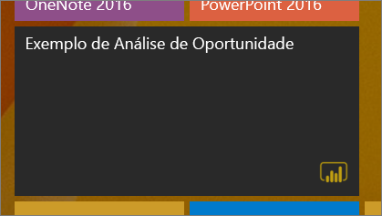
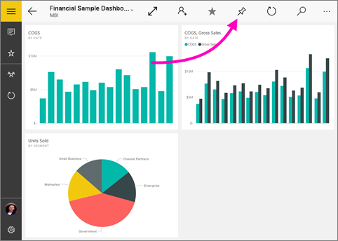
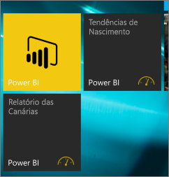

# Afixe um dashboard ao Ecrã inicial do Windows 10 a partir da aplicação móvel do Power BI
Pode afixar dashboards do Power BI ao Ecrã inicial do Windows a partir da aplicação móvel do Power BI para o Windows 10. Quando toca no mosaico no Ecrã inicial, o dashboard abre na aplicação móvel do Power BI para o Windows 10.

>[!NOTE]
>O suporte à aplicação móvel Power BI para **telemóveis com o Windows 10 Mobile** será descontinuado a 16 de março de 2021. [Saiba mais](https://go.microsoft.com/fwlink/?linkid=2121400)

## Afixar um dashboard ao ecrã Início como um mosaico
1. Abre um dashboard.
2. Toque em **Afixar ao ecrã inicial** .
   
   
   
   Aceda ao ecrã Início do seu dispositivo para ver o mosaico.
   
   

## Próximos passos
* [Transferir a aplicação móvel do Power BI para Windows 10](https://go.microsoft.com/fwlink/?LinkID=526478) na Loja Windows  
* [Introdução à aplicação móvel Power BI para Windows 10](mobile-windows-10-phone-app-get-started.md)  
* [O que é o Power BI?](../../fundamentals/power-bi-overview.md)
* Perguntas? [Experimente perguntar à Comunidade do Power BI](https://community.powerbi.com/)
