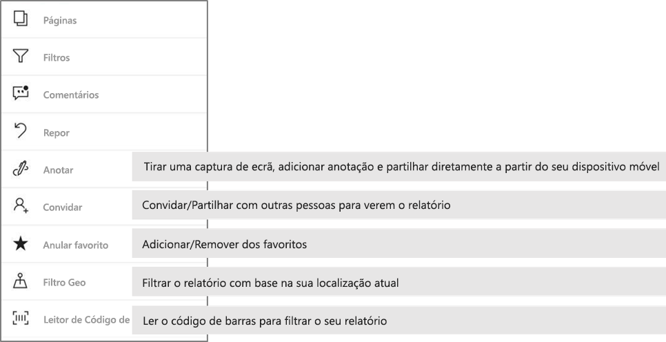

# Explorar relatórios nas aplicações móveis do Power BI
Aplica-se a:

|  |  |  |  |  |
|:---: |:---: |:---: |:---: |:---: |
| iPhones |iPads |Telemóveis Android |Tablets Android |Dispositivos Windows 10 |

Um relatório do Power BI é uma vista interativa dos seus dados, com elementos visuais que representam diferentes descobertas e informações obtidas por meio desses dados. Ver os relatórios nas aplicações móveis do Power BI é o terceiro passo num processo de três passos:

1. [Criar relatórios no Power BI Desktop](../../desktop-report-view.md). Pode mesmo [otimizar um relatório para telemóveis](mobile-apps-view-phone-report.md) no Power BI Desktop.
2. Publique esses relatórios no serviço Power BI [(https://powerbi.com)](https://powerbi.com) ou [) ou no Power BI Report Server](../../report-server/get-started.md).  
3. Interaja com os relatórios nas aplicações móveis do Power BI.

## Abrir um relatório do Power BI na aplicação móvel
Os relatórios do Power BI são armazenados em diferentes locais na aplicação móvel, consoante o local onde os obteve. Podem estar em Aplicações, Partilhado comigo, Áreas de trabalho (incluindo A Minha Área de Trabalho) ou num servidor de relatórios. Pode vezes, percorre um dashboard relacionado para chegar a um relatório, e noutras vezes estes estão listados.

Em listas e menus, irá encontrar um ícone junto ao nome de um relatório para ajudar a compreender que o item se trata de um relatório:

Existem dois ícones para relatórios nas aplicações móveis do Power BI:

*  indica um relatório que será apresentado em orientação horizontal na aplicação. Terá o mesmo aspeto do ícone apresentado num browser.

*  indica um relatório que tem pelo menos uma página otimizada para telemóveis que será apresentada na orientação vertical.

> [!NOTE]
> Ao segurar o seu telemóvel na orientação horizontal, será sempre apresentado o esquema horizontal, mesmo que a página do relatório esteja no esquema de telemóvel.

Para aceder a um relatório a partir de um dashboard, toque nas reticências (...) no canto superior direito de um mosaico e, em seguida, toque em **Abrir relatório**:
  
  
  
  Nem todos os mosaicos podem ser abertos como relatórios. Por exemplo, os mosaicos criados quando faz uma pergunta na caixa de Perguntas e Respostas não abrem os relatórios ao tocar nos mesmos.
  
## Interagir com relatórios
Após abrir um relatório na aplicação, poderá começar a trabalhar com o mesmo. Pode realizar várias ações com o seu relatório e os respetivos dados. No rodapé do relatório, encontrará ações que pode realizar no relatório. Ao tocar sem soltar nos dados apresentados no relatório, também pode dividir e repartir os mesmos.

### Tocar e tocar sem soltar
Um toque tem o mesmo efeito que um clique com o rato. Assim, se quiser fazer um realce cruzado no relatório com base num ponto de dados, toque no mesmo.
Quando tocar num valor de segmentação de dados, este será selecionado e irá dividir o resto do relatório.
Quando tocar numa ligação, num botão ou num marcador, irá ocorrer a ação definida pelo autor do relatório.

Já deve ter reparado que é apresentado um limite sempre que toca num elemento visual. No canto superior direito do limite, são apresentadas reticências (...). Se tocar nas reticências, será apresentado um menu de ações que pode realizar nesse elemento visual:

### Descrição e ações de exploração

Ao tocar sem soltar num ponto de dados, será apresentada uma descrição com os valores que o ponto de dados representa:

Se o autor do relatório tiver configurado uma descrição da página do relatório, esta irá substituir a descrição predefinida:

> [!NOTE]
> As descrições de relatórios são suportadas em dispositivos com janelas viewport de pelo menos 640 por 320 pixéis. Se o seu dispositivo for mais pequeno, a aplicação apresentará descrições predefinidas.

Os autores de relatórios podem definir hierarquias nos dados e nas relações entre as páginas dos relatórios. As hierarquias permitem-lhe desagregar, agregar e explorar outra página de relatório a partir de um elemento visual e um valor. Assim, quando tocar sem soltar num valor, serão apresentadas opções de exploração relevantes no rodapé, para além da descrição:

Ao tocar numa parte específica de um elemento visual e, em seguida, tocar na opção de *pormenorização*, o Power BI irá direcioná-lo para uma página diferente no relatório, filtrada para apresentar o valor no qual tocou. O autor de um relatório pode definir uma ou mais opções de pormenorização que encaminhem o utilizador para diferentes páginas. Nesse caso, poderá escolher que opção pretende explorar. O botão Anterior permite-lhe voltar à página anterior.

Para obter mais informações, saiba mais sobre como [adicionar pormenorização no Power BI Desktop](../../desktop-drillthrough.md).
   
   > [!IMPORTANT]
   > Nas aplicações móveis do Power BI, as ações de pormenorização em elementos visuais de matrizes e tabelas são ativadas apenas com valores de células e não com cabeçalhos de colunas ou linhas.
   
   
   
### Utilizar as ações no rodapé do relatório
A partir do rodapé do relatório, pode realizar várias ações na página atual do relatório ou em todo o relatório. O rodapé proporciona um acesso rápido às ações utilizadas com mais frequência. Pode aceder a outras ações ao tocar no botão de reticências (...):

Pode realizar as seguintes ações a partir do rodapé:
- Repor o estado original do filtro do relatório e das seleções realçadas de forma cruzada.
- Abrir o painel de conversação para ver ou adicionar comentários ao relatório.
- Abrir o painel de filtro para ver ou modificar o filtro atualmente aplicado ao relatório.
- Listar todas as páginas no relatório. Se tocar no nome de uma página, esta será carregada e apresentada.
Pode alternar entre as páginas do relatório ao fazer o gesto de percorrer a partir do limite até ao centro do ecrã.
- Ver todas as ações do relatório.

#### Todas as ações do relatório
Ao tocar no botão de reticências (...) no rodapé do relatório, serão apresentadas todas as ações que pode realizar num relatório:

É possível que algumas das ações estejam desativadas, pois dependem de funcionalidades de relatório específicas.
Por exemplo:

A ação **Filtrar pela localização atual** estará ativa se o autor do relatório tiver categorizado o relatório com dados geográficos. Para obter mais informações, leia sobre a [identificação de dados geográficos num relatório](https://docs.microsoft.com/power-bi/desktop-mobile-geofiltering).

A ação **Ler para filtrar o relatório por código de barras** só estará ativa se o conjunto de dados do seu relatório estiver identificado como **Código de barras**. Para obter mais informações, leia sobre a [identificação de códigos de barras no Power BI Desktop](https://docs.microsoft.com/power-bi/desktop-mobile-barcodes).

A ação **Convidar** só estará ativa se tiver permissão para partilhar o relatório com outras pessoas. Apenas terá permissão caso seja o proprietário do relatório ou caso o proprietário lhe tenha concedido permissão para voltar a partilhar.

As ações **Anotar e partilhar** podem estar desativadas caso exista uma [política de proteção do Intune](https://docs.microsoft.com/intune/app-protection-policies) na sua organização que proíba a partilha a partir da aplicação móvel Power BI.

## Próximos passos
* [Ver e interagir com relatórios do Power BI otimizados para o seu telemóvel](mobile-apps-view-phone-report.md)
* [Criar uma versão de um relatório otimizada para telemóveis](../../desktop-create-phone-report.md)
* Perguntas? [Experimente perguntar à Comunidade do Power BI](http://community.powerbi.com/)

