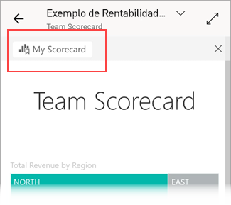
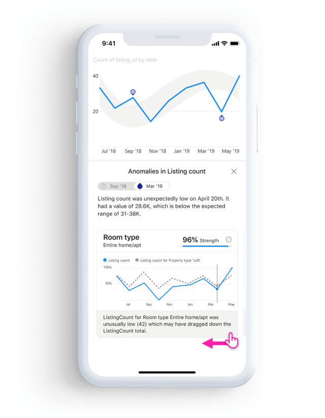

# Explorar relatórios nas aplicações móveis do Power BI
Aplica-se a:

|  |  |  |  |  |
|:---: |:---: |:---: |:---: |:---: |
| iPhones |iPads |Telemóveis Android |Tablets Android |Dispositivos Windows 10 |

>[!NOTE]
>O suporte à aplicação móvel do Power BI para **telemóveis com o Windows 10 Mobile** será descontinuado a 16 de março de 2021. [Saiba mais](/legal/powerbi/powerbi-mobile/power-bi-mobile-app-end-of-support-for-windows-phones)

Um relatório do Power BI é uma vista interativa dos seus dados, com elementos visuais que representam diferentes descobertas e informações obtidas por meio desses dados. Ver os relatórios nas aplicações móveis do Power BI é o terceiro passo num processo de três passos:

1. [Criar relatórios no Power BI Desktop](../../create-reports/desktop-report-view.md). Pode mesmo [otimizar um relatório para telemóveis](mobile-apps-view-phone-report.md) no Power BI Desktop.
2. Publique esses relatórios no serviço Power BI [(https://powerbi.com)](https://powerbi.com) ou [) ou no Power BI Report Server](../../report-server/get-started.md).  
3. Interaja com os relatórios nas aplicações móveis do Power BI.

## Abrir um relatório do Power BI na aplicação móvel
Os relatórios do Power BI são armazenados em diferentes locais na aplicação móvel, consoante o local onde os obteve. Podem estar em Aplicações, Partilhado comigo, Áreas de trabalho (incluindo A Minha Área de Trabalho) ou num servidor de relatórios. Pode vezes, percorre um dashboard relacionado para chegar a um relatório, e noutras vezes estes estão listados.

Em listas e menus, irá encontrar um ícone junto ao nome de um relatório para ajudar a compreender que o item se trata de um relatório:

Existem dois ícones para relatórios nas aplicações móveis do Power BI:

*  indica um relatório que será apresentado em orientação horizontal na aplicação. Terá o mesmo aspeto do ícone apresentado num browser.

*  indica um relatório que tem pelo menos uma página otimizada para telemóveis que será apresentada na orientação vertical.

> [!NOTE]
> Ao segurar o seu telemóvel na orientação horizontal, será sempre apresentado o esquema horizontal, mesmo que a página do relatório esteja no esquema de telemóvel.

Para aceder a um relatório a partir de um dashboard, toque em **Mais opções** (...) no canto superior direito de um mosaico e, em seguida, toque em **Abrir relatório**:
  
  
  
  Nem todos os mosaicos podem ser abertos como relatórios. Por exemplo, os mosaicos criados quando faz uma pergunta na caixa de Perguntas e Respostas não abrem os relatórios ao tocar nos mesmos.
  
## Ampliar os seus dados   
Utilize o gesto de aproximar os dedos para ampliar os relatórios e examiná-los em maior detalhe. Afaste os dedos para reduzir novamente. O gesto de aproximar os dedos para ampliar é suportado em telemóveis e tablets Android e iOS.

## Interagir com relatórios
Após abrir um relatório na aplicação, poderá começar a trabalhar com o mesmo. Pode realizar várias ações com o seu relatório e os respetivos dados. No rodapé do relatório, encontrará ações que pode realizar no relatório. Ao tocar sem soltar nos dados apresentados no relatório, também pode dividir e repartir os mesmos.

### Interação com toque único versus duplo toque
Quando transfere a aplicação móvel do Power BI, a mesma encontra-se definida para interação com toque único. Isto significa que, quando toca num elemento visual para fazer algo, como selecionar um item de segmentação de dados, realces cruzados, clicar numa ligação ou num botão, etc., o toque seleciona o elemento visual e executa a ação que pretende.

Se preferir, pode desativar a interação com duplo toque. Na interação com duplo toque, começa por tocar num elemento visual para selecionar o mesmo, e depois toca novamente no elemento visual para executar a ação pretendida.

Para mudar para a interação com duplo toque, ou para voltar à interação com toque único, aceda a [definições de interação da aplicação](./mobile-app-interaction-settings.md).

### Modo de seleção única versus modo de seleção múltipla da seleção de pontos de dados

Num relatório, pode tocar num ponto de dados para o selecionar. Pode escolher se quer utilizar o modo de seleção única ou o modo de seleção múltipla. No modo de seleção única, quando toca num ponto de dados para o selecionar, essa seleção substitui qualquer seleção anterior que tenha feito. No modo de seleção múltipla, quando toca num ponto de dados para o selecionar, a sua seleção é *adicionada* a qualquer seleção que tenha atualmente selecionada e o resultado combinado de todas as seleções é realçado em todos os elementos visuais do relatório.

Para cancelar a seleção de um ponto de dados, basta tocar no mesmo novamente.

Para alternar entre o modo de seleção única e o modo de seleção múltipla, aceda às [definições de interação da aplicação](./mobile-app-interaction-settings.md).

### Tocar e tocar sem soltar
Um toque tem o mesmo efeito que um clique com o rato. Assim, se quiser fazer um realce cruzado no relatório com base num ponto de dados, toque no mesmo.
Quando tocar num valor de segmentação de dados, este será selecionado e irá dividir o resto do relatório.
Quando tocar numa ligação, num botão ou num marcador, irá ocorrer a ação definida pelo autor do relatório.

Já deve ter reparado que é apresentado um limite sempre que toca num elemento visual. No canto superior direito do limite, são apresentadas **Mais opções** (...). Se tocar nas reticências, será apresentado um menu de ações que pode realizar nesse elemento visual:

### Descrição e ações de exploração
Ao tocar sem soltar num ponto de dados, será apresentada uma descrição com os valores que o ponto de dados representa:

Se o autor do relatório tiver configurado uma descrição da página do relatório, esta irá substituir a descrição predefinida:

> [!NOTE]
> As descrições de relatórios são suportadas em dispositivos com janelas viewport de pelo menos 640 por 320 pixéis. Se o seu dispositivo for mais pequeno, a aplicação apresentará descrições predefinidas.

Os autores de relatórios podem definir hierarquias nos dados e nas relações entre as páginas dos relatórios. As hierarquias permitem-lhe desagregar, agregar e explorar outra página de relatório a partir de um elemento visual e um valor. Assim, quando tocar sem soltar num valor, serão apresentadas opções de exploração relevantes no rodapé, para além da descrição:

Ao tocar numa parte específica de um elemento visual e, em seguida, tocar na opção de *pormenorização*, o Power BI irá direcioná-lo para uma página diferente no relatório, filtrada para apresentar o valor no qual tocou. O autor de um relatório pode definir uma ou mais opções de pormenorização que encaminhem o utilizador para diferentes páginas. Nesse caso, poderá escolher que opção pretende explorar. O botão Anterior permite-lhe voltar à página anterior.

Para obter mais informações, saiba mais sobre como [adicionar pormenorização no Power BI Desktop](../../create-reports/desktop-drillthrough.md).
   
   > [!IMPORTANT]
   > Nas aplicações móveis do Power BI, as ações de pormenorização em elementos visuais de matrizes e tabelas são ativadas apenas com valores de células e não com cabeçalhos de colunas ou linhas.
   
   
   
### Utilizar as ações no rodapé do relatório
A partir do rodapé do relatório, pode realizar várias ações na página atual do relatório ou em todo o relatório. O rodapé proporciona um acesso rápido às ações utilizadas com mais frequência. Pode aceder a outras ações ao tocar no botão **Mais opções** (...):

Pode realizar as seguintes ações a partir do rodapé:
* Repor o estado original do filtro do relatório e das seleções realçadas de forma cruzada.
* Abrir o painel de conversação para ver ou adicionar comentários ao relatório.
* Abrir o painel de filtro para ver ou modificar o filtro atualmente aplicado ao relatório.
* Listar todas as páginas no relatório. Se tocar no nome de uma página, esta será carregada e apresentada.
Pode alternar entre as páginas do relatório ao fazer o gesto de percorrer a partir do limite até ao centro do ecrã.
* Ver todas as ações do relatório.

#### Todas as ações do relatório
Ao tocar no botão **Mais opções** (...) no rodapé do relatório, serão apresentadas todas as ações que pode realizar num relatório:

É possível que algumas das ações estejam desativadas, pois dependem de funcionalidades de relatório específicas.
Por exemplo:

**Marcadores** só está presente se tiverem sido definidos [marcadores](mobile-reports-in-the-mobile-apps.md#bookmarks) no relatório. São apresentados os dois marcadores pessoais que pode definir no serviço Power BI e os marcadores definidos pelo criador do relatório. Se um dos marcadores tiver sido definido como o marcador predefinido, o relatório abrir-se-á nessa vista quando for carregado.

As ações **Anotar e partilhar** podem estar desativadas caso exista uma [política de proteção do Intune](/intune/app-protection-policies) na sua organização que proíba a partilha a partir da aplicação móvel Power BI.

A ação **Convidar** só estará ativa se tiver permissão para partilhar o relatório com outras pessoas. Apenas terá permissão caso seja o proprietário do relatório ou caso o proprietário lhe tenha concedido permissão para voltar a partilhar.

A ação **Filtrar pela localização atual** estará ativa se o autor do relatório tiver categorizado o relatório com dados geográficos. Para obter mais informações, leia sobre a [identificação de dados geográficos num relatório](../../transform-model/desktop-mobile-geofiltering.md).

A ação **Ler para filtrar o relatório por código de barras** só estará ativa se o conjunto de dados do seu relatório estiver identificado como **Código de barras**. Para obter mais informações, leia sobre a [identificação de códigos de barras no Power BI Desktop](../../transform-model/desktop-mobile-barcodes.md).

### Marcadores

A aplicação móvel do Power BI suporta marcadores de relatório definidos pelo criador do relatório e marcadores pessoais que tenha definido no serviço Power BI. Pode encontrar o menu de marcadores em **Mais opções** (...) na [barra de ferramentas das ações do relatório](mobile-reports-in-the-mobile-apps.md#all-report-actions).

Os marcadores predefinidos são indicados com um ícone especial. Para marcadores pessoais, pode definir, anular ou alterar a predefinição ao tocar em **Mais opções (...)** junto ao marcador que pretende alterar e selecionar **Predefinir** ou **Limpar predefinição**.

Quando é aberta uma vista de marcador de um relatório, o nome do marcador aparece na parte superior do relatório.

[Leia mais sobre marcadores no serviço Power BI](../end-user-bookmarks.md).

## Investigar anomalias em dados de série temporal

A [deteção de anomalias](https://powerbi.microsoft.com/blog/anomaly-detection-preview/) é uma funcionalidade do Power BI que deteta automaticamente as anomalias (ou seja, os valores fora dos intervalos esperados) em gráficos de linhas com dados de série temporal. Além disso, apresenta possíveis explicações, classificadas de acordo com a força explicativa, para a causa dos valores anormais. A deteção de anomalias estará disponível se tiver sido ativada no gráfico pelo criador do relatório. 

Ao ver um relatório com a deteção de anomalias ativada num gráfico com dados de série temporal, verá as anomalias indicadas no gráfico, tal como veria no serviço Power BI e no Power BI Desktop. 

Para ver informações adicionais e as explicações, tem de abrir o painel Anomalias. Existem várias formas de o fazer:
* Toque na indicação de anomalia no gráfico. 
* Toque em **Mais opções (...)** e escolha **Mostrar anomalias** no menu apresentado.    
* Toque no ponto de dados para apresentar uma descrição e escolha **Anomalias**.

A imagem abaixo ilustra as três formas de abrir o painel Anomalias.

No painel de anomalias, verá uma explicação em linguagem natural da anomalia detetada, bem como os fatores associados ordenados pela força explicativa. Deslize da direita para a esquerda para ver todos os fatores relevantes e as forças.

Enquanto o painel Anomalias está visível, o relatório móvel continua a ser deslocável por baixo do mesmo, para que possa continuar a interagir com o relatório, ao dividir e repartir para compreender melhor as anomalias nos dados. Para cada interação, o Power BI executa novamente a deteção de anomalias para detetar anomalias nos dados no âmbito. 

## Atualizar os seus dados

Se não tiver a certeza se está a ver os dados mais atualizados, pode extrair novos dados para o relatório a partir do serviço Power BI:

* Em dispositivos iOS e tablets Android, puxe um pouco de cima para baixo na página do relatório.
* Em telemóveis Android, pode usar a ação de puxar para baixo ou um botão atualizar, consoante tiver configurado nas [definições de interação](mobile-app-interaction-settings.md).
* Em dispositivos Windows, use o botão atualizar no canto superior direito do ecrã.

    As páginas do relatório que têm [atualização automática de página](../../create-reports/desktop-automatic-page-refresh.md) serão automaticamente atualizadas como configuradas (apenas na aplicação do Windows).

>[!NOTE]
>Os métodos de atualização acima não atualizam o conjunto de dados subjacente. Em vez disso, atualizam o relatório que está a ver na aplicação móvel com os novos dados que podem existir no Power BI.

### Como faço para saber quando o meu relatório foi atualizado pela última vez?

Para descobrir quando o seu relatório foi atualizado pela última vez, toque no cabeçalho do relatório. A árvore de navegação para o relatório será apresentada, incluindo a data e a hora da última atualização. 

 
## Configurar a sua experiência em relatórios
A aplicação móvel do Power BI tem uma série de definições que lhe permitem controlar a sua experiência de relatórios. Atualmente, pode configurar:
* **Interação com elementos visuais de relatórios**: pode optar por utilizar uma interação com toque único ou duplo toque.
* **Método de atualização de dados**: pode optar por ter um botão de atualização ou uma ação de puxar para baixo para atualizar os dados dos relatórios.
* **Visibilidade de rodapé de relatório**: pode optar por ter um rodapé ancorado que esteja sempre visível ou um rodapé dinâmico que se oculte e surja consoante as suas ações (por exemplo, deslocamento).

Veja as [definições de interação de aplicações](./mobile-app-interaction-settings.md) para obter informações sobre como alterar estas definições.

## Passos seguintes
* [Ver e interagir com relatórios do Power BI otimizados para o seu telemóvel](mobile-apps-view-phone-report.md)
* [Criar uma versão de um relatório otimizada para telemóveis](../../create-reports/desktop-create-phone-report.md)
* Perguntas? [Experimente perguntar à Comunidade do Power BI](https://community.powerbi.com/)