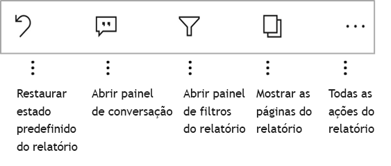

# Explorar relatórios nas aplicações móveis do Power BI
Aplica-se a:

|  |  |  |  |  |
|:--- |:--- |:--- |:--- |:--- |
| iPhones |iPads |Telemóveis Android |Tablets Android |Dispositivos Windows 10 |

Um relatório do Power BI é uma vista interativa dos seus dados, com visuais que representam diferentes descobertas e informações obtidas por meio desses dados. Ver os relatórios nas aplicações móveis do Power BI é o terceiro passo num processo de três passos.

1. [Criar relatórios no Power BI Desktop](../../desktop-report-view.md). Pode mesmo [otimizar um relatório para telemóveis](mobile-apps-view-phone-report.md) no Power BI Desktop. 
2. Publique esses relatórios no serviço Power BI [(https://powerbi.com)](https://powerbi.com) ou [) ou no Power BI Report Server](../../report-server/get-started.md).  
3. Em seguida, interaja com esses relatórios nas aplicações móveis do Power BI.

## Abrir um relatório do Power BI na aplicação móvel
Os relatórios do Power BI são armazenados em diferentes locais na aplicação móvel, consoante o local onde os obteve. Podem estar em Aplicações, Partilhado comigo, Áreas de trabalho (incluindo A Minha Área de Trabalho) ou num servidor de relatórios. Pode vezes, percorre um dashboard relacionado para chegar a um relatório, e noutras vezes estes estão listados.

Em listas e menus, irá encontrar um ícone junto ao nome de um relatório para ajudar a compreender que este item se trata de um relatório. 

 

Existem dois ícones para relatórios nas aplicações móveis do Power BI:

*  Indica um relatório que será apresentado na orientação horizontal na aplicação e terá um aspeto igual ao que tem no browser.

*  Indica um relatório que tem, pelo menos, uma página de relatório otimizada para telemóveis, que será apresentada na orientação vertical. 

Note: se segurar o seu telemóvel na horizontal, será sempre apresentado o esquema horizontal, mesmo se a página do relatório tiver o esquema de telemóvel. 

Para aceder a um relatório a partir de um dashboard, toque nas reticências (...) no canto superior direito de um mosaico > **Abrir relatório**.
  
  
  
  Nem todos os mosaicos têm a opção de abrir num relatório. Por exemplo, os mosaicos criados ao fazer uma pergunta na caixa de Perguntas e Respostas não abrem os relatórios ao tocar nos mesmos. 
  
## Interagir com relatórios
Quando tiver um relatório aberto na aplicação, poderá começar a trabalhar com a mesma. Pode realizar várias ações com o seu relatório e os respetivos dados. No rodapé do relatório, encontrará ações que pode realizar no mesmo. Ao tocar e tocar sem soltar nos dados apresentados no relatório, também poderá segmentar e dividir os dados.

### Tocar e tocar sem soltar
Um toque é igual a um clique do rato. Assim, se quiser fazer um realce cruzado no relatório com base nesse ponto de dados, toque no mesmo.
Se tocar num valor de segmentação de dados, seleciona esse valor e segmenta o resto do relatório por esse valor. Se tocar num marcador, botão ou ligação, irá ativá-lo com base na ação definida pelo autor.

Já deve ter reparado que é apresentado um limite sempre que toca num elemento visual. No canto superior direito do limite, existem umas reticências (...). Tocar nas mesmas irá apresentar um menu com ações que pode efetuar nesse elemento visual.

### Descrição e ações de exploração

Ao tocar sem soltar num ponto de dados, será apresentada uma descrição com os valores que este ponto de dados representa. 

Se o autor do relatório tiver configurado a descrição da página do relatório, a descrição predefinida será substituída pela mesma.

> [!NOTE]
> As descrições de relatório são suportadas em dispositivos com mais de 640 píxeis e 320 janelas viewport. Caso o seu dispositivo seja mais pequeno, a aplicação utilizará descrições predefinidas.

Os autores de relatórios podem definir hierarquias nos dados e nas relações entre as páginas dos relatórios. A hierarquia permite desagregar, agregar e explorar outra página de relatório a partir de um elemento visual e um valor. Assim, quando tocar sem soltar num valor, serão apresentadas opções de exploração relevantes no rodapé, para além da descrição. 

Com a *pormenorização*, ao tocar numa parte específica de um elemento visual, o Power BI direciona-o para uma página diferente no relatório, filtrada para apresentar o valor no qual tocou.  O autor de um relatório pode definir uma ou mais opções de pormenorização que encaminhem o utilizador para diferentes páginas. Nesse caso, poderá escolher que página pretende explorar. O botão Anterior permite-lhe voltar à página anterior do relatório.

Saiba mais sobre como [adicionar a pormenorização no Power BI Desktop](../../desktop-drillthrough.md).
   
   > [!IMPORTANT]
   > Na aplicação Power BI Mobile, a exploração em elementos visuais de tabela e matriz é ativada apenas através de um valor de célula e não por cabeçalhos de linha e coluna.
   
   
   
### Utilizar as ações no rodapé do relatório
O rodapé do relatório inclui ações que pode efetuar na página atual do relatório ou em todo o relatório. O rodapé permite-lhe aceder rapidamente às ações mais úteis e pode aceder a todas as ações a partir das reticências (...).

As ações que pode efetuar a partir do rodapé são as seguintes:
1) Repor o estado original do filtro do relatório e das seleções realçadas de forma cruzada.
2) Abrir o painel de conversação para ver ou adicionar comentários a este relatório.
3) Abrir o painel de filtro para ver e modificar o filtro atualmente aplicado ao relatório.
4) Listar todas as páginas neste relatório. Tocar no nome da página irá carregar e apresentar essa página.
Pode alternar entre as páginas do relatório ao fazer o gesto de percorrer a partir do limite até ao centro do ecrã.
5) Ver todas as ações do relatório.

#### Todas as ações do relatório
Tocar na opção "..." no rodapé do relatório apresenta todas as ações que pode efetuar num relatório. 

É possível que algumas das ações estejam desativadas, pois dependem de funcionalidades de relatório específicas.
Por exemplo:
1) **Filtrar pela localização atual** – esta ação está ativada se os dados do relatório foram categorizados pelo autor com dados geográficos. [Saiba como identificar dados geográficos no seu relatório](https://docs.microsoft.com/power-bi/desktop-mobile-geofiltering).
2) **Ler para filtrar o relatório por código de barras** – esta ação só está ativada se o conjunto de dados do seu relatório foi identificado como um código de barras. [Identificar códigos de barras no Power BI Desktop](https://docs.microsoft.com/power-bi/desktop-mobile-barcodes). 
3) **Convidar** – esta ação só está ativada se tiver permissão para partilhar este relatório com outras pessoas. Apenas terá permissão caso seja o proprietário do relatório ou caso lhe tenha sido concedida permissão para voltar a partilhar pelo proprietário.
4) **Anotar e partilhar** – estas ações podem estar desativadas caso exista uma [política de proteção do Intune](https://docs.microsoft.com/intune/app-protection-policies) na sua organização que impeça a partilha a partir da aplicação Power BI Mobile. 

## Próximos passos
* [Ver e interagir com relatórios do Power BI otimizados para o seu telemóvel](mobile-apps-view-phone-report.md)
* [Criar uma versão de um relatório otimizada para telemóveis](../../desktop-create-phone-report.md)
* Perguntas? [Experimente perguntar à Comunidade do Power BI](http://community.powerbi.com/)

