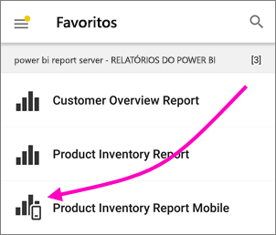

# Explorar relatórios nas aplicações móveis do Power BI
Aplica-se a:

|  |  |  |  |  |
|:--- |:--- |:--- |:--- |:--- |
| iPhones |iPads |Telemóveis Android |Tablets Android |Dispositivos Windows 10 |

Um relatório do Power BI é uma vista interativa dos seus dados, com visuais que representam diferentes descobertas e informações obtidas por meio desses dados. Ver os relatórios nas aplicações móveis do Power BI é o terceiro passo num processo de três passos.

1. [Criar relatórios no Power BI Desktop](../../desktop-report-view.md). Pode mesmo [otimizar um relatório para telemóveis](mobile-apps-view-phone-report.md) no Power BI Desktop. 
2. Publique esses relatórios no serviço Power BI [(https://powerbi.com)](https://powerbi.com) ou [) ou no Power BI Report Server](../../report-server/get-started.md).  
3. Em seguida, interaja com esses relatórios nas aplicações móveis do Power BI.

## Abrir um relatório do Power BI na aplicação móvel
Os relatórios do Power BI são armazenados em diferentes locais na aplicação móvel, consoante o local onde os obteve. Podem estar em Aplicações, Partilhado comigo, Áreas de trabalho (incluindo A Minha Área de Trabalho) ou num servidor de relatórios. Pode vezes, percorre um dashboard relacionado para chegar a um relatório, e noutras vezes estes estão listados.

* Num dashboard, toque nas reticências (...) no canto superior direito de um mosaico > **Abrir relatório**.
  
  
  
  Nem todos os mosaicos têm a opção de abrir num relatório. Por exemplo, os mosaicos criados ao fazer uma pergunta na caixa de Perguntas e Respostas não abrem os relatórios ao tocar nos mesmos. 
  
  Num telemóvel, o relatório é aberto no modo horizontal, a menos que esteja [otimizado para visualização num telemóvel](mobile-reports-in-the-mobile-apps.md#view-reports-optimized-for-phones).
  
  

## Ver relatórios otimizados para telemóveis
Os autores de relatórios do Power BI podem criar um esquema de relatório especificamente otimizado para telemóveis. As páginas do relatório otimizadas para telemóveis têm mais funcionalidades: por exemplo, pode desagregar e ordenar por elementos visuais, e pode aceder aos [filtros que o autor do relatório adicionou à página do relatório](mobile-apps-view-phone-report.md#filter-the-report-page-on-a-phone). O relatório abre-se no seu telemóvel filtrado com os valores a serem filtrados no relatório na Web, com uma mensagem a indicar que existem filtros ativos na página. Pode alterar os filtros no seu telemóvel.

Numa lista de relatórios, um relatório otimizado tem um ícone especial :

Quando vê esse relatório num telemóvel, este é aberto numa vista vertical.

 Um relatório pode ter uma mistura de páginas que estão e não estão otimizadas para telemóveis. Se for o caso, quando percorrer o relatório, a vista irá alternar entre horizontal e vertical para cada página.

Saiba mais sobre os [relatórios otimizados para a vista de telemóvel](mobile-apps-view-phone-report.md).

## Usar a segmentação para filtrar um relatório
Quando criar um relatório no Power BI Desktop ou no serviço Power BI, considere [adicionar segmentações de dados a uma página de relatório](../../visuals/power-bi-visualization-slicers.md). O utilizador e os seus colegas podem adicionar as segmentações de dados para filtrar a página num browser e nas aplicações móveis. Quando vê o relatório num telemóvel, pode ver e interagir com as segmentações de dados no modo horizontal e numa página otimizada para o modo vertical do telemóvel. Se selecionar um valor numa segmentação de dados ou filtro no browser, o valor será selecionado quando o utilizador visualizar a página também na aplicação móvel. Aparece uma mensagem a indicar que existem filtros ativos na página.  

* Quando selecionar um valor numa segmentação na página de relatório, este filtra os outros visuais na página.
  
  
  
  Nesta ilustração, a segmentação está a filtrar o gráfico de colunas para mostrar apenas valores de julho.

## Realizar a filtragem cruzada e realçar um relatório
Quando seleciona um valor num visual, este não filtra os outros visuais. Realça os valores relacionados nos outros visuais.

* Toque num valor num visual.
  
  
  
  Tocar na coluna Grande num visual realça os valores relacionados nos outros visuais. 

## Ordenar um visual num iPad ou num tablet
* Toque no gráfico, toque nas reticências (**...**) e toque no nome do campo.
  
   
* Para reverter a ordenação, toque novamente nas reticências (**...**) e, em seguida, toque novamente no mesmo nome de campo.

## Desagregar e agregar num elemento visual
Se o autor do relatório tiver adicionado uma capacidade de desagregação a um elemento visual, poderá desagregar no elemento visual para ver os valores que constituem uma parte do mesmo. Pode [adicionar desagregações a um visual](../../power-bi-visualization-drill-down.md) no Power BI Desktop ou no serviço Power BI. 

* Toque sem soltar numa barra ou ponto específico num elemento visual para apresentar a respetiva descrição. Se estiver desagregado, a parte inferior da descrição incluirá setas nas quais pode tocar. 
  
  

* Para voltar a agregar, toque na seta para cima na descrição.
  
  

* Também pode desagregar em todos os pontos de dados num elemento visual. Abra o elemento visual no modo de detalhe, toque no ícone Explorar e, em seguida, opte entre mostrar todos os níveis seguintes ou expandir para mostrar o nível atual e o seguinte.

   

## Explorar de uma página à outra

Com a *pormenorização*, ao tocar numa parte específica de um elemento visual, o Power BI direciona-o para uma página diferente no relatório, filtrada para apresentar o valor no qual tocou. O autor de um relatório pode definir uma ou mais opções de pormenorização que encaminhem o utilizador para diferentes páginas. Nesse caso, poderá escolher que página pretende explorar. No exemplo seguinte, ao tocar no valor no medidor, pode escolher entre pormenorizar a página **gastos por área de negócio** ou **planeamento por área de negócio**.

Ao explorar, o botão de retroceder leva-o até à página anterior do relatório.

Saiba mais sobre como [adicionar a pormenorização no Power BI Desktop](../../desktop-drillthrough.md).

## Próximos passos
* [Ver e interagir com relatórios do Power BI otimizados para o seu telemóvel](mobile-apps-view-phone-report.md)
* [Criar uma versão de um relatório otimizada para telemóveis](../../desktop-create-phone-report.md)
* Perguntas? [Experimente perguntar à Comunidade do Power BI](http://community.powerbi.com/)

