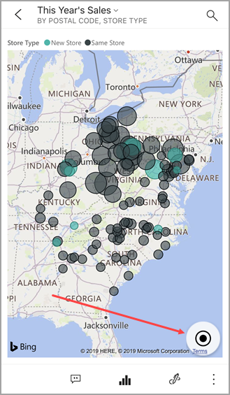
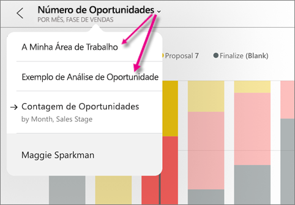
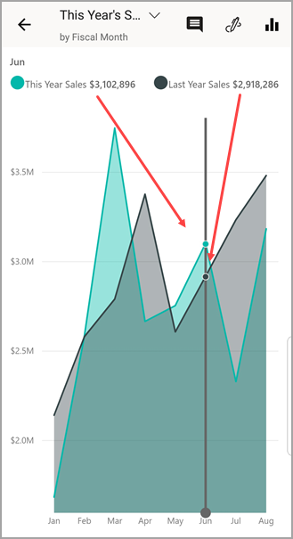
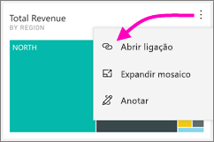
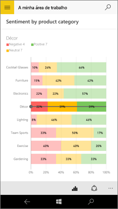

# Explorar mosaicos nas aplicações móveis do Power BI
Aplica-se a:

|  |  |  |  |  |
|:--- |:--- |:--- |:--- |:--- |
| iPhones |iPads |Telemóveis Android |Tablets Android |Dispositivos Windows 10 |

Os mosaicos são instantâneos dinâmicos dos seus dados, afixados a um dashboard. Os seus valores são alterados à medida que os dados são alterados. **O utilizador [adiciona mosaicos a um dashboard no serviço Power BI](../end-user-tiles.md).** 

Em seguida, nas aplicações móveis do Power BI, abre os mosaicos no modo de detalhe e interage com eles. É possível abrir mosaicos com todos os tipos de elementos visuais, incluindo mosaicos baseados em Bing e R.

## Mosaicos nas aplicações iOS

1. Abra um [dashboard na aplicação móvel para iOS](mobile-apps-view-dashboard.md).
2. Toque num mosaico. O mosaico abre no modo de detalhe, onde é mais fácil ver e explorar os dados do mosaico. No modo de detalhe, pode:
   
   Num gráfico de linhas, barras ou colunas, toque para ver os valores para partes específicas da visualização.
   
    
   
   *Por exemplo, neste gráfico de linhas, os valores selecionados são para **Vendas deste Ano** e **Vendas do Último Ano** em **agosto**.*  
   
   Num gráfico circular, toque num setor do gráfico para mostrar o valor do setor na parte superior do gráfico.  
   
   
3. Num mapa, toque no ícone **Centrar Mapa** para centrar o mapa na sua localização atual.

   

4. Toque no ícone de lápis  para [anotar um mosaico](mobile-annotate-and-share-a-tile-from-the-mobile-apps.md#annotate-and-share-the-tile-report-or-visual) e, em seguida, toque no ícone Partilhar  para [o partilhar com outras pessoas](mobile-annotate-and-share-a-tile-from-the-mobile-apps.md#annotate-and-share-the-tile-report-or-visual).

5. [Adicione um alerta ao mosaico](mobile-set-data-alerts-in-the-mobile-apps.md). Se os valores ficarem acima ou abaixo dos valores alvo, o Power BI irá notificá-lo.

6. Por vezes, o criador do dashboard adiciona uma ligação a um mosaico. Se for esse o caso, inclui um ícone de ligação  quando está no modo de detalhe:
   
    
   
    As ligações podem ir para outros dashboards do Power BI ou para um URL externo. Pode [tocar na ligação](../../create-reports/service-dashboard-edit-tile.md#hyperlink) para abrir a mesma dentro da aplicação do Power BI. Se for um site externo, o Power BI pede-lhe para permiti-lo.
   
    
   
    Depois de abrir a ligação na aplicação do Power BI, pode copiar a ligação e abri-la numa janela do browser.
7. [Abra o relatório](mobile-reports-in-the-mobile-apps.md)  no qual o mosaico se baseia.
8. Para sair do modo de detalhe do mosaico, toque no nome do mosaico e, em seguida, toque no nome do dashboard ou em **A Minha Área de Trabalho**.
   
    

## Mosaicos na aplicação móvel para telemóveis e tablets Android
1. Abra um [dashboard na aplicação móvel do Power BI](mobile-apps-view-dashboard.md).
2. Toque num mosaico para abrir o mesmo no modo de detalhe, onde é mais fácil ver e explorar os dados do mosaico.
   
   
   
    No modo de detalhe, pode:
   
   * Toque no gráfico para mover a barra num gráfico de linhas, barras, colunas ou bolhas, para ver os valores de um ponto específico na visualização.  
   * Toque no ícone de lápis  para [anotar um mosaico](mobile-annotate-and-share-a-tile-from-the-mobile-apps.md#annotate-and-share-the-tile-report-or-visual) e, em seguida, toque no ícone Partilhar instantâneo  para [o partilhar com outras pessoas](mobile-annotate-and-share-a-tile-from-the-mobile-apps.md#annotate-and-share-the-tile-report-or-visual).
   * Tocar no ícone Abrir relatório  para [ver o relatório](mobile-reports-in-the-mobile-apps.md) na aplicação móvel.
3. Por vezes, o criador do dashboard adiciona uma ligação a um mosaico. Se for esse o caso, ao tocar nas reticências verticais ( **...** ), verá **Abrir ligação** :
   
    
   
    As ligações podem ir para outros dashboards do Power BI ou para um URL externo. Pode [tocar na ligação](../../create-reports/service-dashboard-edit-tile.md#hyperlink) para abrir a mesma dentro da aplicação do Power BI. Se for um site externo, o Power BI pede-lhe para permiti-lo.
   
    
   
    Depois de abrir a ligação na aplicação do Power BI, pode copiar a ligação e abri-la numa janela do browser.
4. Toque na seta no canto superior esquerdo para fechar o mosaico e voltar ao dashboard.

## Mosaicos na aplicação móvel Windows 10

>[!NOTE]
>O suporte à aplicação móvel Power BI para **telemóveis com o Windows 10 Mobile** será descontinuado a 16 de março de 2021. [Saiba mais](https://go.microsoft.com/fwlink/?linkid=2121400)

1. Abra um [dashboard na aplicação móvel do Power BI](mobile-apps-view-dashboard.md) para Windows 10.
2. Toque na reticências verticais no mosaico. A partir daqui, pode: 
   
    
   
    [Partilhar um instantâneo do mosaico](mobile-windows-10-phone-app-get-started.md).
   
    Toque em **Abrir Relatório**  para [ver o relatório subjacente](mobile-reports-in-the-mobile-apps.md).
   
    [Abra a ligação](../../create-reports/service-dashboard-edit-tile.md#hyperlink), se houver uma ligação. As ligações podem levar a dashboards do Power BI ou a um URL externo.
3. Toque em **Expandir Mosaico** . O mosaico abre no modo de detalhe, onde é mais fácil ver e explorar os dados do mosaico. Neste modo pode:
   
   Girar o gráfico circular para mostrar os valores do setor na parte superior do setor.  
   
   
   
   Toque no gráfico para mover a barra num gráfico de linhas, barras, colunas ou bolhas, para ver os valores de um ponto específico na visualização.  
   
   
   
   *Neste gráfico de barras, os valores da barra **Decor** são apresentados na parte superior do gráfico.*
   
   Toque no ícone **Ecrã inteiro** para abrir o mosaico em modo de ecrã inteiro, sem as barras de navegação e de menus.
   
   > [!NOTE]
   > Também pode [ver os dashboards e relatórios no modo de ecrã inteiro](mobile-windows-10-app-presentation-mode.md) na aplicação móvel do Power BI para Windows 10.
   > 
   > 
   
   Num mapa, toque no ícone **Centrar Mapa** para centrar o mapa na sua localização atual.
   
   
   
   Toque no ícone Partilhar Instantâneo  para [partilhar um mosaico](mobile-windows-10-phone-app-get-started.md) com outras pessoas.   
   
   Toque no ícone Abrir Relatório  para [ver o relatório](mobile-reports-in-the-mobile-apps.md) no qual o mosaico se baseia. 
4. Toque na seta ou no botão anterior para fechar o mosaico e voltar ao dashboard.

## Próximos passos
* [O que é o Power BI?](../../fundamentals/power-bi-overview.md)
* Perguntas? [Experimente perguntar à Comunidade do Power BI](https://community.powerbi.com/)
