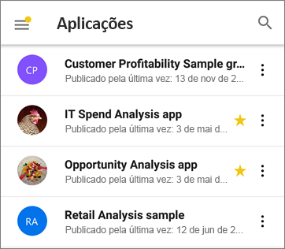
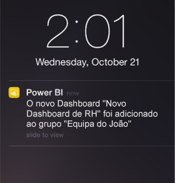

# Novidades em aplicações móveis para o Power BI
Para informações sobre “Novidades” relacionadas, veja:

* [Blogue da equipa do Power BI para as aplicações móveis](https://powerbi.microsoft.com/blog/tag/mobile/)
* [Novidades do Power BI Desktop](../../desktop-latest-update.md)  
* [Novidades do serviço Power BI](../../service-whats-new.md)  

## Dezembro de 2018

### O filtro já está disponível para relatórios horizontais 

O painel de filtro do relatório está agora disponível para os relatórios horizontais (para além dos relatórios no telemóvel).

## Novembro de 2018

### Cabeçalho de elemento visual moderno 

Os relatórios que utilizam o novo “cabeçalho de elemento visual moderno” deixarão de atribuir espaço para os cabeçalhos, o que resultará em menos espaço vazio e mais espaço para as visualizações.

### Otimizar o modo de apresentação (Windows)

Modo de apresentação avançado para dispositivos Surface Hub e Windows 10.  Desfrute de uma experiência de sala de reunião avançada no Surface Hub com ferramentas de apresentação e colaboração melhoradas e uma vista otimizada “chromeless” de grandes dimensões para que se possa concentrar nos seus dados. O modo de apresentação também disponibiliza ferramentas como a escrita para o ajudar a apresentar e a debater os seus dados com eficiência. Saiba mais sobre o modo de apresentação [aqui](https://powerbi.microsoft.com/en-us/blog/presentation-mode-in-power-bi-windows-app/).

### Esquema de relatório vertical em tablets (iOS e Android)

Agora, utilizamos o esquema de relatório de telemóvel, quando existe, para apresentar relatórios no tablet no modo vertical. Saiba mais sobre [como criar o esquema de telemóvel no serviço Power BI ou no Power BI Desktop](https://docs.microsoft.com/en-us/power-bi/desktop-create-phone-report/).

### Suporte para a cadeia de consulta do relatório 

A ligação do relatório que inclui a cadeia de consulta agora será aberta na aplicação móvel e será previamente filtrada com base nas condições definidas na cadeia de consulta. Saiba mais sobre [como criar o URL do relatório com a cadeia de consulta](https://docs.microsoft.com/en-us/power-bi/service-url-filters/).  

### Credenciais partilhadas (agora no Android)

Iniciar sessão no Power BI na aplicação móvel nunca foi tão fácil. Com as credenciais partilhadas, simplificámos o processo de início de sessão através da utilização de outras credenciais da aplicação do Office 365 no dispositivo para o autenticar no serviço Power BI.

### URLs na aplicação (agora no Android) 

As ligações nos relatórios que apontam para outros artefactos do Power BI agora abrem diretamente dentro da aplicação. Tal permite-lhe criar fluxos personalizados de navegação, por exemplo, ligar de um relatório para um dashboard.

### Mostrar dados e valores de cópia

O menu de ação do elemento visual do relatório (...) agora tem a opção de apresentar os dados subjacentes no formato de tabela. Uma vez na tabela, pode premir sem soltar para selecionar e copiar os valores da tabela (partindo do princípio de que não há nenhuma política do Intune que impeça a cópia).

## Outubro de 2018

### Pré-visualização dos relatórios paginados (todos os dispositivos)

Os relatórios paginados estão agora disponíveis no serviço Power BI. Os utilizadores com acesso a relatórios paginados no serviço Power BI também podem aceder a estes relatórios a partir da aplicação móvel. 

Leia a [mensagem de blogue do Power BI sobre os relatórios paginados na aplicação móvel](https://powerbi.microsoft.com/en-us/blog/power-bi-paginated-reports-also-available-in-power-bi-mobile-apps-preview/).

### Credenciais partilhadas (iOS)

Iniciar sessão no Power BI na aplicação móvel nunca foi tão fácil. Com as credenciais partilhadas, simplificámos o processo de início de sessão através da utilização de outras credenciais da aplicação do Office 365 no dispositivo para o autenticar no serviço Power BI.

### URLs da aplicação (iOS) 

As ligações nos relatórios que apontam para outros artefactos do Power BI agora abrem diretamente dentro da aplicação. Tal permite-lhe criar fluxos personalizados de navegação, por exemplo, ligar de um relatório para um dashboard.

### Suporte iOS12 e watchOS 5 

Atualizámos a aplicação do Power BI para iOS para funcionar perfeitamente com o novo sistema operativo nos dispositivos móveis e no relógio.

## Setembro de 2018

### Edição de relatório de telemóvel no browser (todos os dispositivos)

Agora, pode criar um esquema de relatório de telemóvel para um relatório que já está publicado no serviço Power BI e não apenas no Power BI Desktop. Cria-o no modo Edição no seu browser.

### Comentários no dashboard (iOS e Android) 

Pode adicionar comentários diretamente nos dashboards e mosaicos específicos para debater os seus dados e qualquer pessoa que visualize o dashboard irá ver os seus comentários. Também pode chamar outras pessoas na sua organização para a conversa ao @mentioning-las. Aqueles a quem @mentioned, recebem uma notificação push com a sua mensagem no telemóvel.

Atualmente disponível para dispositivos iOS e Android. Suporte para Windows em breve.

Leia a [mensagem de blogue do Power BI sobre comentários de dashboard](https://powerbi.microsoft.com/blog/announcing-dashboard-comments-in-power-bi/).

### Início de Sessão Único (Windows)

Início de Sessão Único (SSO) é uma das capacidades mais pedidas para o Power BI Mobile para Windows. Agora pode utilizar a sua conta organizacional principal não apenas para iniciar sessão nos seus dispositivos móveis de Windows associados a um domínio, mas também para iniciar sessão diretamente no serviço Power BI. Leia mais sobre [SSO e aplicações móveis Windows](mobile-windows-10-app-single-sign-on-sso.md).

## Meses anteriores

### Julho de 2018

#### Apenas iOS e Android

**Filtros partilhados**

Agora pode receber relatórios com segmentações de dados e filtros partilhados.

**Suporte da imagem de fundo**

Quando visualiza um relatório no modo horizontal no dispositivo móvel, pode ver as mesmas imagens de fundo no Power BI na Web.

### Junho de 2018

#### Relatórios de tela completa

As barras de ação superiores e inferiores agora desaparecem pouco depois de o seu relatório carregar, pelo que pode ver mais do seu relatório de uma vez.

#### Tamanho da tela de relatórios no telemóvel aumentado

Aumentámos o tamanho da tela de relatórios no telemóvel para criar espaço para ainda mais elementos visuais.

### May 2018

#### Exploração móvel: todas as aplicações móveis

Pode explorar a partir de um ponto de dados selecionado para outra página de relatório nas aplicações móveis, caso o autor do relatório tenha definido essa ação. 

#### Botão Anterior: todas as aplicações móveis

Agora, quando navegar através de um relatório ao deslizar, ao escolher uma página de relatório na barra de ação ou ao utilizar a exploração, o botão Anterior leva-o de volta à página anterior que estava a procurar. 

#### Temas do dashboard: todas as aplicações móveis

Quando os autores dos relatórios personalizam temas do dashboard no serviço Power BI, o aspeto e funcionalidade do dashboard também serão alterados na aplicação móvel. No entanto, não verá as imagens de fundo.

#### iOS: Configurar o acesso da aplicação móvel do Power BI para iOS a um servidor de relatórios remotamente

O seu administrador de TI pode agora utilizar uma ferramenta MDM para configurar o acesso da aplicação para iOS do Power BI a um servidor de relatórios. Veja [Configurar o acesso da aplicação móvel do Power BI para iOS a um servidor de relatórios remotamente](../../report-server/configure-powerbi-mobile-apps-remote.md) para obter detalhes.

#### Aplicação Power BI for Mixed Reality (Pré-visualização)

A aplicação Power BI for Mixed Reality está agora na Microsoft Store. Veja os seus dashboards e relatórios enquanto está envolvido pelo mundo virtual ou coloque-os e veja-os em localizações específicas no contexto do seu ambiente. Veja o novo vídeo [Introducing Power BI on Hololens](https://www.youtube.com/watch?v=J_X_nOFUBss) (Introdução ao Power BI no HoloLens) para obter contexto ou leia o artigo sobre a nova [Aplicação Power BI for Mixed Reality](mobile-mixed-reality-app.md).

### Abril de 2018

#### Desagregar e agregar num dispositivo móvel

Agora pode desagregar e agregar para aprofundar os elementos visuais do relatório no dispositivo móvel. Para aceder a esta nova funcionalidade, toque e mantenha o dedo para abrir o menu de descrição num elemento visual de relatório e, em seguida, toque nos botões de desagregação/agregação para explorar os dados em profundidade. Mais sobre a [agregação e desagregação nas aplicações móveis](https://powerbi.microsoft.com/blog/drill-down-up-in-power-bi-mobile-apps/).

#### Filtros persistentes

Atualizámos recentemente os filtros de relatório e as segmentações de dados, para que sejam guardados automaticamente a partir do Power BI na Web para a aplicação móvel do Power BI. Agora, os filtros e as segmentações de dados que definiu na aplicação móvel são guardados automaticamente no Power BI na Web.

### Março de 2018

#### Aplicação Power BI for Mixed Reality (Pré-visualização)

Com o intuito de levar os dados ao local onde se encontra, criámos a aplicação Power BI for Mixed Reality. Veja os seus dashboards e relatórios enquanto está envolvido pelo mundo virtual ou coloque-os e veja-os em localizações específicas no contexto do seu ambiente. Leia mais sobre a nova [aplicação Power BI for Mixed Reality](mobile-mixed-reality-app.md).

#### Partilhar relatórios e dashboards externamente

Partilhe dashboards e relatórios com utilizadores fora da sua organização, diretamente a partir da aplicação. A partilha externa está ativada para contas organizacionais e sociais. 

#### Filtros persistentes

Quando definir os filtros e segmentações de dados no Power BI na Web, as opções de filtros também são guardadas na sua aplicação móvel, pelo que pode retomar a atividade a partir de onde tiver parado.

#### Atualizar relatórios no iPad

Os relatórios do Power BI passaram a ter um botão de atualização na aplicação iPad.

### Fevereiro de 2018

#### Relatórios de partilha

Agora pode partilhar um relatório diretamente a partir de aplicações móveis. Saiba mais sobre como [partilhar dashboards e relatórios a partir de aplicações móveis](mobile-share-dashboard-from-the-mobile-apps.md)

#### Descrições melhoradas

Ao tocar sem soltar no elemento visual de um relatório para aceder a descrições, pode agora arrastar o seu dedo ao longo deste elemento visual para explorar detalhes sobre cada ponto de dados ao longo do percurso.

### Janeiro de 2018

#### Relatórios favoritos

Atribua etiquetas de favoritos a relatórios para serem apresentados na página **Favoritos**. Saiba mais sobre os [favoritos nas aplicações móveis do Power BI](mobile-apps-favorites.md).

#### Ver relatórios partilhados

Agora, quando alguém partilhar um relatório consigo, é listado na página **Partilhado comigo** juntamente com os dashboards.

#### Suporte de hiperligação melhorado

Agora, pode tocar nas hiperligações nos elementos visuais personalizados para os abrir no browser do dispositivo móvel.

#### Integração com o Intune (Android)

Suporte para o acesso condicional através da gestão de dispositivos móveis do Intune.

### Dezembro de 2017

#### Gestão de segurança melhorada 

Adicionámos o suporte para o acesso condicional (CA) e para a gestão de dispositivos móveis do Microsoft Intune (MDM) em dispositivos Android, para proteger melhor os dados da sua organização. Já está disponível em dispositivos iOS.

#### Gestão de permissões melhorada

Foram feitas algumas alterações que permitem a gestão mais precisa das permissões de utilizador para conjuntos de dados, dashboards e relatórios.

#### Aplicações instaladas automaticamente

Não precisa de instalar algumas das aplicações no Power BI. Os criadores de aplicações do Power BI na sua organização podem criar *aplicações* que contenham uma coleção de dashboards e relatórios. Em seguida, podem publicar a aplicação e configurá-la para ser instalada automaticamente no serviço Power BI e nas aplicações móveis do Power BI. Quando uma aplicação está configurada para ser instalada automaticamente, aparece no seu menu **Aplicações**:

### Novembro de 2017
#### Otimização para iPhone X

Otimizámos o esquema da aplicação para iPhone X, para que possa explorar os seus dados com um visual apelativo em todos os dispositivos.

### Outubro de 2017
#### Filtros para relatórios de telemóvel no Android

Se criar um relatório com páginas otimizadas para telemóvel no Power BI Desktop e o relatório tiver filtros poderá agora aplicar esses filtros ao relatório de telemóvel do seu Android. Leia mais sobre os filtros dos relatórios do Power BI em dispositivos Android.

#### Mostrar dados nos relatórios

Agora pode alterar os elementos visuais nos relatórios para uma vista de tabela para ver os números dos dados. Para aceder a esta funcionalidade, toque em "Mostrar dados" a partir do menu de elementos visuais no seu relatório ou no ícone novo no menu de ação do elemento visual expandido.

### Setembro de 2017
#### Filtros para relatórios de telemóvel em iPhones
Se criar um relatório com páginas otimizadas para telemóvel no Power BI Desktop, e o relatório tiver filtros, pode agora aplicar esses filtros ao relatório de telemóvel do seu iPhone. Leia mais sobre os [filtros dos relatórios do Power BI em iPhones](https://powerbi.microsoft.com/blog/filters-coming-for-phone-reports-on-ios/).

### Agosto de 2017
#### Suporte para definições de proxy em iOS
Agora, pode configurar as definições de proxy na aplicação móvel iOS do Power BI. Isto significa que o Power BI irá agora funcionar com ligações VPN no dispositivo móvel, permitindo que mais utilizadores e organizações tirem partido, com segurança, do poder do Power BI em qualquer lugar.

### Julho de 2017
Leia o [resumo de funcionalidades para aplicações móveis publicado em julho de 2017](https://powerbi.microsoft.com/blog/power-bi-service-and-mobile-july-feature-summary/#ios-preview)

#### Dispositivos iOS
**Nova experiência de Perguntas e Respostas em dispositivos iOS (pré-visualização)** Em vez de apenas receber uma resposta à sua pergunta, agora pode utilizar linguagem natural para obter informações com âmbito definido. Mesmo se não tiver a certeza do que procura, as Perguntas e Respostas analisam proativamente as informações relevantes para os seus dados. A nova experiência de Perguntas e Respostas em dispositivos móveis, desenvolvida em colaboração com a equipa do Microsoft Research, demonstra poderosas tecnologias do nosso produto. Consulte o tutorial [Fazer perguntas sobre os seus dados nas aplicações móveis iOS](mobile-apps-ios-qna.md).

### Elementos visuais reativos
**Elemento visual reativo para relatórios e dashboards de telemóvel** Pode definir os elementos visuais no seu dashboard ou relatório para que sejam *reativos*, para que sejam alterados dinamicamente para apresentarem a quantidade máxima de dados e informações, independentemente do tamanho do ecrã. Leia o [blogue sobre elementos visuais reativos](https://powerbi.microsoft.com/blog/power-bi-desktop-july-feature-summary-2/#responsiveVisuals).

### Junho de 2107
#### Todos os dispositivos
**Torne as aplicações em favoritas** Já pode tornar um dashboard em favorito. Recentemente, o [Power BI adicionou aplicações](../../service-create-distribute-apps.md) e agora também pode tornar as aplicações em favoritas. 

### Maio de 2017
#### Todos os dispositivos
**Novo menu: Partilhado comigo** Aceda a Partilhado comigo no menu da aplicação móvel para ver todo o conteúdo que foi partilhado consigo.

**Novo menu: Aplicações** Uma aplicação é uma coleção de dashboards e relatórios criados pela sua organização para fornecer as principais métricas para tomar decisões condicionadas por dados mais rápida e facilmente.

Leia mais sobre [como o conteúdo do Power BI está organizado](mobile-apps-quickstart-view-dashboard-report.md).

#### Dispositivos iOS e Android
**Pré-visualização do Power BI Report Server** Crie e publique os relatórios do Power BI no local. Em seguida, [visualize e interaja com os mesmos no seu dispositivo móvel iOS ou Android](mobile-app-ssrs-kpis-mobile-on-premises-reports.md). 

### Abril de 2017
Leia o [resumo de funcionalidades para aplicações móveis publicado em abril de 2017](https://powerbi.microsoft.com/blog/power-bi-mobile-apps-feature-summary-march-april-2017/)

#### Todos os dispositivos
**Cor de fundo para relatórios de telemóvel** Ao definir uma cor de fundo para um relatório do Power BI Desktop, o relatório de telemóvel terá a mesma cor de fundo. Mais informações sobre como [otimizar as páginas de relatório para telemóveis](../../desktop-create-phone-report.md).

**Desenvolver elementos visuais personalizados, compatíveis com dispositivos móveis** Leia este [Guia para programadores](https://github.com/Microsoft/PowerBI-visuals/blob/master/Tutorial/MobileGuideline.md), para obter sugestões sobre como criar elementos visuais personalizados que têm bom aspeto e funcionam bem em dispositivos móveis.

#### Dispositivos iOS
**Fale com os seus dados: faça perguntas conversando** já pode [fazer perguntas sobre os seus dados com as Perguntas e Respostas](mobile-apps-ios-qna.md), ao falar com em vez de escrever. 

### Março de 2017
Leia o [resumo de funcionalidades para aplicações móveis publicado em março de 2017](https://powerbi.microsoft.com/blog/power-bi-mobile-apps-feature-summary-march-2017/).

#### Todos os dispositivos
**Interações de segmentação de dados**

Melhorámos a interação tátil para a segmentação de dados de tempo.

#### Dispositivos iOS
**Faça perguntas sobre os seus dados com as Perguntas e Respostas – e envie-nos comentários** Tente fazer perguntas sobre os seus dados com as Perguntas e Respostas e, em seguida, envie-nos uma cara sorridente ou triste.

**Utilizar o 3D touch para ações comuns** Prima o ícone da aplicação do Power BI no ecrã inicial do seu iPhone 6s ou posterior para aceder a notificações, pesquisa e dashboards recentemente utilizados.

**Suporte para idiomas da direita para a esquerda** As aplicações móveis do Power BI agora suportam idiomas da direita para a esquerda. Neste contexto, "idiomas da direita para a esquerda" refere-se aos sistemas de escrita hebraico e árabe, que são escritos da direita para a esquerda e requerem uma formação contextual. Veja a lista de [Idiomas suportados nas aplicações móveis do Power BI](mobile-apps-supported-languages.md).

#### Dispositivos Android
**Ligar a mais do que um servidor SSRS** 

Agora, pode ter ligações de até cinco servidores do SQL Server Reporting Services (SSRS) ao mesmo tempo.

**Pedir acesso aos dashboards** 

Se digitalizar um código QR de um dashboard ao qual não tem acesso, pode agora enviar um pedido para obter o direito de acesso a partir da aplicação móvel.

### Fevereiro de 2017
#### Todos os dispositivos
**Deslocamento mais fácil** 

Agora, pode percorrer gráficos de barras e de colunas num relatório ao tocar no próprio gráfico, em vez de tocar na barra de deslocamento lateral.

#### Dispositivos iOS
**Faça perguntas dos seus dados com uma pré-visualização de Perguntas e Respostas** 

Com as Perguntas e Respostas, faça perguntas sobre os seus dados nas suas próprias palavras, e o Power BI fornece as respostas. As Perguntas e Respostas já se encontram no serviço Power BI, em http://powerbi.com. Agora também está [disponível na aplicação móvel no seu iPhone ou iPad](mobile-apps-ios-qna.md).

**Ligar a mais do que um servidor SSRS** 

Agora, pode ter ligações de até cinco servidores do SQL Server Reporting Services (SSRS) ao mesmo tempo.

#### Tablets Android
**A aplicação móvel do Power BI** para tablets Android está agora disponível globalmente. Introdução ao [Power BI para tablet Android](mobile-android-app-get-started.md).

#### Dispositivos iOS e Android
**Novo menu novo para mosaicos do dashboard** Navegue para o relatório subjacente, expanda o mosaico ou faça a gestão de um alerta, tudo isto diretamente a partir de um menu no mosaico de um dashboard. 

Este menu é uma novidade para telemóveis iOS e Android no modo horizontal, e para tablets Android. Já estava disponível em telemóveis Windows e Android no modo vertical.

### Janeiro de 2017
Leia o [Resumo das funcionalidades do blogue de aplicações móveis publicado em janeiro de 2017](https://powerbi.microsoft.com/blog/power-bi-mobile-apps-feature-summary-january-2017).

#### Todos os dispositivos
**Carregar mais do que 100 linhas em tabelas e matrizes** Agora, se tiver uma grande tabela ou matriz no seu dashboard ou relatório, mostramos a maior quantidade possível de dados no mosaico. Assim, no modo de detalhe, pode deslocar para baixo para carregar mais linhas.

**Relatório de telemóvel - disponibilidade geral** Os relatórios de telemóvel do Power BI estão agora geralmente disponíveis. No Power BI Desktop, pode personalizar uma vista vertical de um relatório existente para visualizadores em dispositivos móveis. Saiba mais sobre a [criação de relatórios de telemóvel no Power BI Desktop](../../desktop-create-phone-report.md) e a [experiência de relatório em telemóveis](mobile-apps-view-phone-report.md).

#### iOS
**Autenticação SSRS através da Pré-visualização dos Serviços de Federação do Active Directory (AD FS)** Agora, pode iniciar sessão em servidores do SQL Server Reporting Services no local a partir do dispositivo móvel, com a sua conta profissional. Leia mais sobre como [utilizar OAuth para ligar a servidores SSRS](mobile-oauth-ssrs.md).

#### Android
**Autenticação SSRS através da Pré-visualização dos Serviços de Federação do Active Directory (AD FS)** Agora, pode iniciar sessão em servidores do SQL Server Reporting Services no local a partir do dispositivo móvel, com a sua conta profissional. Leia mais sobre como [utilizar OAuth para ligar a servidores SSRS](mobile-oauth-ssrs.md).

**Novo e melhorado: Anote e partilhe informações rapidamente** A partilha e a anotação são agora totalmente funcionais em dispositivos Android. O menu melhorado torna mais fácil e rápido anotar e partilhar informações, e também pode partilhar um relatório anotado ou diretamente da aplicação do Power BI.

### Dezembro de 2016
Leia o [Resumo das funcionalidades do blogue de aplicações móveis publicado em dezembro de 2016](https://powerbi.microsoft.com/blog/power-bi-mobile-apps-feature-summary-december-2016).

#### Todos os dispositivos
**Atualização offline em segundo plano**

Para ter a certeza de que consegue aceder aos dados mais recentes estando offline, efetuámos uma atualização da aplicação em segundo plano para que as suas informações comerciais estejam atualizadas, mesmo se não tiver acedido às mesmas durante um tempo. Para certificar-se de que determinados dashboards estão sempre atualizados, basta marcá-los como favoritos. Saiba mais sobre as [capacidades offline das aplicações móveis do Power BI](mobile-apps-offline-data.md).

#### Dispositivos iOS
**Anotar e partilhar**

Agora, pode anotar e partilhar um mosaico, relatório ou visualização da aplicação móvel Power BI para iOS. 

* [No iPhone](mobile-annotate-and-share-a-tile-from-the-mobile-apps.md)
* [No iPad](mobile-annotate-and-share-a-tile-from-the-mobile-apps.md)

**Pedir acesso aos dashboards**

Se digitalizar um código QR de um dashboard ao qual não tem acesso, pode agora enviar um pedido para obter o direito de acesso a partir da aplicação móvel.

**URL personalizado no mosaico da imagem**

Se um mosaico da imagem tiver um URL personalizado definido pelo proprietário do dashboard, ao tocar no mosaico é diretamente direcionado para esse URL, sem abrir o mosaico no modo de detalhe. 

#### iPhone
**Melhorias do Apple Watch**

Agora, pode atualizar os dados do Apple Watch diretamente a partir da aplicação Watch. Na página do índice do dashboard, prima para atualizar os dados. (A aplicação móvel do Power BI tem de estar a ser executada em segundo plano no iPhone para isto funcionar).

#### Android
**URL personalizado no mosaico da imagem**

Se um mosaico da imagem tiver um URL personalizado definido pelo proprietário do dashboard, ao tocar no mosaico é diretamente direcionado para esse URL, sem abrir o mosaico no modo de detalhe. Além disso, os mosaicos do dashboard que contêm os URLs personalizados predefinidos agora podem redirecionar os leitores para relatórios na aplicação.

### Novembro de 2016
Leia o [Resumo de funcionalidades para aplicações do Power BI publicado em novembro de 2016](https://powerbi.microsoft.com/blog/power-bi-mobile-apps-feature-summary-november-2016/).

#### Tablets Android
**Aplicação móvel do Power BI para tablets Android** Sim, a pré-visualização está disponível.

* Experimente o [Power BI no seu tablet Android](mobile-android-app-get-started.md)
* Explorar os [Relatórios móveis e KPIs do Reporting Services no tablet Android](mobile-app-ssrs-kpis-mobile-on-premises-reports.md)

#### Dispositivos Android
**Pré-visualização: Gestão de Aplicações Móveis do Intune** O suporte do Power BI para o Microsoft Intune Mobile Application Manager (MAM) está agora em pré-visualização para utilizadores do Power BI Pro em dispositivos Android. 

**Favoritos** Marque os seus dashboards favoritos no dispositivo Android, e veja todos os [dashboards do Power BI, relatórios móveis e KPIs favoritos do Reporting Services](mobile-android-app-get-started.md#view-your-favorite-dashboards-kpis-and-reports) reunidos numa localização mais prática. 

#### Dispositivos iOS
**Ligações** Os URLs nos mosaicos e visualizações são agora clicáveis e abrem num browser.

#### Dispositivos Windows
**Centre um mapa** para focar os dados perto de si na sua localização

### Setembro/Outubro 2016
Leia o [Resumo de funcionalidades para aplicações móveis do Power BI publicado em outubro de 2016](https://powerbi.microsoft.com/blog/power-bi-mobile-apps-feature-summary-october-2016/).

#### Todos os dispositivos
**Favoritos como página de destino** Se tiver marcado quaisquer dashboards como favoritos, a página de destino será a entrada dos seus Favoritos. 

**Navegação melhorada** A navegação principal tem um novo aspeto, e a navegação em grupos foi movida para o catálogo de grupos. 

**Desempenho melhorado de relatórios e dashboards** Foi melhorada a experiência de carregamento de relatórios e dashboards nas aplicações móveis do Power BI

**Notificações de alertas melhoradas** As notificações para os seus alertas de dados contêm agora mais informações sobre o que acionou o alerta e o motivo.

#### iOS em iPhones
**Atualização do Apple Watch melhorada** A aplicação móvel Apple Watch foi melhorada para Watch OS3

#### Telemóveis Android
**Atualização manual de mosaicos adicionada** Agora, pode atualizar manualmente os mosaicos do dashboard. Para os mosaicos baseados no DirectQuery, isto irá obter os dados mais recentes do conjunto de dados.

#### Telemóveis Windows 10
**Geofiltragem** No seu telemóvel Windows 10, pode agora filtrar o seu relatório com base na sua localização atual e ver apenas os dados de que precisa.

**Visualização SandDance** Esta visualização personalizada está agora disponível no Surface Hub

### Agosto de 2016
#### Todos os telemóveis
**Favoritos** Veja os seus dashboards favoritos a partir de todas as aplicações móveis do Power BI, e gira a lista de favoritos a partir das aplicações móveis do Power BI para dispositivos móveis iOS e Windows 10. Saiba mais sobre os [favoritos nas aplicações móveis do Power BI](mobile-apps-favorites.md).

**Classificação de dados do dashboard** Veja as classificações de dados que os proprietários de dashboards atribuíram aos respetivos dashboards. Leia mais sobre [classificar dashboards](../../service-data-classification.md).

**Alertas condicionados por dados** Seja notificado através de um alerta quando os dados são alterados em formas predefinidas de mosaicos de KPI, medidor e cartão. Saiba mais sobre:

* [Alertas na aplicação do Power BI para telemóveis Android](mobile-set-data-alerts-in-the-mobile-apps.md). 
* [Alertas nas aplicações do Power BI para iOS](mobile-set-data-alerts-in-the-mobile-apps.md). 
* [Alertas na aplicação do Power BI para dispositivos Windows 10](mobile-set-data-alerts-in-the-mobile-apps.md).

#### iOS em iPhones e iPads
**Mosaicos em ecrã inteiro no modo de detalhe em iPad** Quando toca num mosaico no seu iPad, o mosaico agora abre em ecrã inteiro no modo de detalhe, tomando partido de todo o tamanho do ecrã do iPad.

**Atualizar manualmente os mosaicos** Atualize manualmente os seus mosaicos, ao abrir o dashboard na aplicação móvel do Power BI para iOS e ao puxar a parte superior do ecrã para baixo. 

**Suporte para MAM do Intune** Foi adicionado suporte para capacidades do Microsoft Intune mobile application management (MAM).

Leia mais sobre o [Microsoft Intune em aplicações móveis do Power BI](../../service-admin-mobile-intune.md).

#### Dispositivos Windows 10
**Modos de ecrã inteiro e apresentação** Apresente relatórios no modo de apresentação do Surface Hub e apresente dashboards, relatórios e mosaicos no modo de ecrã inteiro em dispositivos Windows 10.

### Julho de 2016
#### Todos os telemóveis
No serviço Power BI, pode agora [criar uma vista de dashboard especificamente para telemóveis](../../service-create-dashboard-mobile-phone-view.md) no modo vertical. 

#### Telemóveis Android
**Separador Favoritos** Aceda a todos os dashboards favoritos a partir de uma única localização.

**Melhoria da gestão de segurança** Selecione uma classificação de risco dos dados de negócio apresentada num dashboard específico.

**Avisos e faixas melhorados** Melhorámos os avisos e as faixas da aplicação móvel.

**Códigos QR para páginas de relatório** Um código QR gerado no serviço irá ligar a uma página específica, em vez de a todo o relatório.

**Alertas melhorados** Os alertas condicionados por dados são agora formatados com base na região do dispositivo.

#### iOS em iPhones e iPads
**Melhoria da gestão de segurança** Selecione uma classificação de risco dos dados de negócio apresentada num dashboard específico.

**Informações móveis** Veja os dados de resumo (máximo, mínimo e tudo) em mosaicos de gráficos de colunas em cluster.

**Atualização manual melhorada** Agora, pode atualizar manualmente os mosaicos do dashboard. Para os mosaicos baseados no DirectQuery, isto obtém os dados mais recentes do modelo de dados.

**Avisos e faixas melhorados** Melhorámos os avisos e as faixas da aplicação móvel.

**Códigos QR para páginas de relatório** Um código QR gerado no serviço irá ligar a uma página específica, em vez de a todo o relatório.

**Melhoramentos gerais** Melhorámos as mensagens de erro dos mosaicos na aplicação móvel.

#### Dispositivos Windows 10
**Melhoria da gestão de segurança** Selecione uma classificação de risco dos dados de negócio apresentada num dashboard específico.

**Avisos e faixas melhorados** Melhorámos os avisos e as faixas da aplicação móvel.

### Junho de 2016
Consulte a [mensagem de blogue sobre aplicações móveis do Power BI](https://powerbi.microsoft.com/blog/power-bi-mobile-apps-update-june-2016/) para obter mais detalhes.

#### Os códigos QR são agora apresentados em realidade aumentada (iOS)
Agora, ao digitalizar um código QR gerado pelo serviço Power BI, o mosaico é apresentado em realidade aumentada. 

Mais sobre [ligar a origens de dados no mundo real](mobile-apps-data-in-real-world-context.md).

#### Filtrar dados com códigos de barras (iPhone)
Agora, pode digitalizar códigos de barras impressos em produtos ou prateleiras na loja para apresentar relatórios relacionados do Power BI, filtrados pelo valor digitalizado. 

Mais informações sobre como [filtrar os seus dados com códigos de barras](mobile-apps-scan-barcode-iphone.md).

#### Relatórios móveis do SQL Server 2016 Reporting Services
Agora, pode pesquisar através de um KPI ou um relatório móvel do Reporting Services para outro relatório móvel ou para qualquer URL personalizado.

#### Centro de notificações
O centro de notificações da sua aplicação móvel do Power BI mostra novos dados ou dashboards que são partilhados consigo ou as alterações nos grupos aos quais pertence.

### Maio de 2016
#### Dispositivos iOS e telemóveis Android
* Os **códigos QR** estão agora também disponíveis **para relatórios**. Digitalize o código com a sua aplicação do Power BI para ir diretamente para um relatório relacionado, sem necessidade de qualquer navegação ou pesquisa.
* **Melhoria da gestão de dados** para o SQL Server 2016 Reporting Services: Tempos de carregamento e consumo de dados reduzidos no seu dispositivo.
* **Relatórios móveis com temas do SQL Server 2016**: Veja temas para relatórios móveis no seu dispositivo.
* **Geofiltragem**: filtre os relatórios pela sua localização atual.

### Abril de 2016
Consulte o [blogue sobre Aplicações do Power BI Mobile publicado em abril](https://powerbi.microsoft.com/blog/power-bi-mobile-apps-update-april-2016/) para obter mais detalhes.

#### Todas as aplicações
* Selecione mais do que uma opção numa segmentação de dados de relatório.

#### Aplicação móvel para Android
* **SQL Server 2016 [Relatórios móveis do Reporting Services ](mobile-app-ssrs-kpis-mobile-on-premises-reports.md)** agora disponíveis em telemóveis Android.
* **Galeria de relatórios** Abra os seus relatórios diretamente na galeria de relatórios.
* Suporte de **autenticação NTLM** para relatórios móveis no SQL Server 2016 Reporting Services.

#### Aplicação Power BI para dispositivos Windows 10
* **Modo de apresentação** Apresente dashboards e relatórios do Power BI no modo de apresentação, a partir da aplicação do Power BI.
* **SQL Server 2016 [Relatórios móveis do Reporting Services ](mobile-app-windows-10-ssrs-kpis-mobile-reports.md)** agora disponíveis em dispositivos Windows 10.
* Veja as **descrições de dados** ao pairar o ponteiro do rato sobre um mosaico de dashboard.

### Março de 2016
Leia o [blogue de Aplicações Power BI Mobile publicado em março de 2016](https://powerbi.microsoft.com/blog/power-bi-mobile-apps-update-march-2016/).

#### Aplicação móvel para iPhone
**Apple Watch** Veja os mosaicos e KPIs do Power BI no [Apple Watch](mobile-apple-watch.md).

**iOS 9.0 e posterior** Para acomodar a melhor experiência possível e as novas funcionalidades do Power BI, agora só oferecemos suporte a dispositivos que executam o iOS 9.0 e posterior.

**Pesquisa global** Adição de uma nova lista de “recentemente visualizados” e a pesquisa global, para que possa encontrar os dados de que precisa rapidamente.

**Galeria de relatórios** Abra os seus relatórios diretamente na galeria de relatórios.

**Dados atualizados offline** A nova atualização em segundo plano atualiza automaticamente os dados armazenados em cache quando estiver online, para que tenha os dados mais recentes [mesmo quando estiver offline](mobile-apps-offline-data.md). 

**Mosaicos do Bing e do R** Abra mosaicos do Bing e do R no modo de detalhe.

#### Aplicação móvel para Android
**Relatórios móveis e KPIs SQL Server 2016** [Veja relatórios móveis e KPIs do SQL Server 2016](mobile-app-ssrs-kpis-mobile-on-premises-reports.md) e navegue entre as pastas do SSRS.

**Ver relatórios** Abra relatórios de mosaicos nos dashboards.

**Dados atualizados offline** A nova atualização em segundo plano atualiza automaticamente os dados armazenados em cache quando estiver online, para que tenha os dados mais recentes [mesmo quando estiver offline](mobile-apps-offline-data.md). 

#### Aplicação Power BI para dispositivos Windows 10
**Acesso rápido** Aceda aos dashboards, relatórios e grupos rapidamente, com uma nova lista de “recentemente visualizados” e uma pesquisa global para encontrar os dados necessários.

**Mosaicos do Bing e do R** Abra mosaicos do Bing e do R no modo de detalhe.

**Mais mosaicos dinâmicos no ecrã Iniciar** [Afixe KPIs e cartões de linhas ao ecrã Iniciar](mobile-pin-dashboard-start-screen-windows-10-phone-app.md) como mosaicos dinâmicos, para que possa ver todas as métricas críticas imediatamente.

**Aproxime os dedos para aplicar zoom** Aproxime os dedos para aplicar zoom no tablet, para examinar os dashboards mais detalhadamente.

**Notificações** Receba notificações quando os conjuntos de dados, relatórios e dashboards forem atualizados com novos dados.

**Galeria de relatórios** Abra os seus relatórios diretamente na galeria de relatórios.

### Fevereiro de 2016
#### Android
Veja dashboards no [modo horizontal em telemóveis Android](mobile-apps-view-dashboard.md#view-dashboards-on-your-android-phone). 

#### Aplicação Power BI para dispositivos Windows 10
Veja dashboards no [modo horizontal em telemóveis Windows 10](mobile-apps-view-dashboard.md#view-dashboards-on-your-windows-10-device).

Veja [relatórios no seu telemóvel Windows 10](mobile-reports-in-the-mobile-apps.md).

Maior rapidez das [informações nos dashboards móveis do Windows 10](mobile-tiles-in-the-mobile-apps.md): Partilhe um instantâneo do mosaico ou abra um relatório diretamente a partir do dashboard.

### Janeiro de 2016
Todas as melhorias feitas em janeiro já estão incluídas na nova [aplicação Power BI para telemóveis Windows 10](mobile-windows-10-phone-app-get-started.md), lançada em dezembro de 2015. Estão agora a ser implementadas noutras aplicações Power BI para dispositivos móveis. Leia a mensagem de blogue sobre estas melhorias.

**Suporte para dados em tempo real** Atualização de dashboards em tempo real para que não precise de atualizá-los manualmente.

**Indicadores offline** Quando não houver sinal, encontrará um indicador offline na parte superior do dashboard.

**Acesso a dados em cache** Os dados em cache já não expiram, portanto tem acesso aos dados em cache indefinidamente enquanto estiver offline.

**Mosaicos do R e widgets da Web** Veja estes novos tipos de mosaico no seu dispositivo móvel.

**Dashboards do Bing** No serviço Power BI, agora é possível criar [dashboards com os resultados da pesquisa do Bing](../../service-connect-to-services.md) e vê-los no seu dispositivo móvel.

**Páginas de relatório afixadas como mosaicos em dashboards** Agora, pode afixar uma página de relatório inteira num dashboard no serviço Power BI, pode visualizar páginas de relatório na aplicação do Power BI do seu iPhone ou telemóvel Android.

### Dezembro de 2015
A equipa do Power BI terminou 2015 em grande, com várias adições e atualizações importantes.

#### Relatórios móveis do SQL Server 2016 Reporting Services no iOS
Agora, pode ver os relatórios móveis do SQL Server na aplicação Power BI no seu dispositivo iOS, seja ele um iPad ou um iPhone. Leia mais:

* Mensagem de blogue [SQL 16 SSRS na aplicação Power BI para iOS](http://blogs.msdn.com/b/powerbi/archive/2015/12/30/sql-16-ssrs-on-power-bi-app-for-ios.aspx)
* Veja a documentação de [Relatórios móveis e KPIs do SQL Server em aplicações iPhone e iPad](mobile-app-ssrs-kpis-mobile-on-premises-reports.md)

#### Aplicação Power BI para telemóveis Windows 10
A nova aplicação Power BI para telemóveis Windows 10 é otimizada para produtividade por toque e móvel. Explore dashboards e relatórios, convide os colegas para verem dados e partilhe informações por e-mail para envolver a equipa. Além disso, pode [afixar dashboards do Power BI no ecrã inicial do Windows Phone](mobile-pin-dashboard-start-screen-windows-10-phone-app.md).

* Leia a [mensagem de blogue da aplicação Power BI para telemóveis Windows 10](http://blogs.msdn.com/b/powerbi/archive/2015/12/30/announcing-the-power-bi-app-for-windows-10-mobile.aspx).
* [Introdução à aplicação Power BI para telemóveis Windows 10](mobile-windows-10-phone-app-get-started.md).

#### Outras adições
Leia a [mensagem de blogue publicada em dezembro sobre as aplicações móveis do Power BI](http://blogs.msdn.com/b/powerbi/archive/2015/12/30/power-bi-mobile-apps-update-_2d00_-december-2015.aspx) para obter mais detalhes.

* Receba notificações quando um colega partilhar um dashboard consigo. (iOS)
* Veja todas as páginas do relatório afixadas nos seus dashboards. (iOS e Android)
* [Digitalize um código QR](http://blogs.msdn.com/b/powerbi/archive/2015/12/08/bridge-the-gap-between-your-physical-world-and-your-bi-using-qr-codes.aspx) e vá diretamente para um mosaico relevante no seu telemóvel Android.

### Novembro de 2015
Leia a [mensagem de blogue do Power BI Mobile publicada em novembro de 2015](http://blogs.msdn.com/b/powerbi/archive/2015/11/24/power-bi-mobile-apps-update-_2d00_-november-2015.aspx).

#### Todas as aplicações móveis do Power BI
* Uma nova experiência de boas-vindas.
* Capacidade melhorada de dados de gráficos.

#### Aplicações móveis para iOS e Android
* As empresas podem agora [configurar aplicações móveis do Power BI para iOS e Android com o Microsoft Intune](../../service-admin-mobile-intune.md) para gerirem dispositivos e aplicações.

#### Aplicação móvel para iPhone
* [Adicione um mosaico de imagem a um dashboard](mobile-iphone-app-get-started.md) diretamente do iPhone.
* [Crie códigos QR no serviço Power BI](../../service-create-qr-code-for-tile.md) e digitalize-os no iPhone para abrir a aplicação Power BI num mosaico específico.

#### A aplicação Power BI para dispositivos Windows
* [Ligue diretamente de um mosaico a um URL específico](../../service-dashboard-edit-tile.md#hyperlink).

### Outubro de 2015
Leia a [mensagem de blogue do Power BI Mobile publicada em meados de outubro](http://blogs.msdn.com/b/powerbi/archive/2015/10/21/power-bi-mobile-mid-october-updates-are-here.aspx).

#### Todas as aplicações móveis do Power BI
* Os gráficos de linhas com um eixo Y baseado em percentagem agora calculam o intervalo de elementos visuais de acordo com os dados reais. O gráfico agora é iniciado a partir do ponto de dados mais baixo no gráfico, em vez de um valor predefinido.
* Os gráficos de linhas, colunas e barras agora podem ter etiquetas de dados. 
  
    

#### iPhone
* Mantenha-se atualizado com os mais recentes dashboards dos seus grupos - receba notificações no seu iPhone sempre que um membro da equipa adicionar um dashboard a um dos grupos.
  
    
* Agora, pode ver dashboards horizontalmente, apenas rodando o telemóvel. Leia mais sobre o [modo horizontal na aplicação iPhone](http://blogs.msdn.com/b/powerbi/archive/2015/11/02/enjoy-the-landscape-with-the-power-bi-iphone-app.aspx).
  
    

### Setembro de 2015
Melhorias nas aplicações móveis do Power BI, Android, iOS (iPhone e iPad) e Windows. Leia a [mensagem de blogue do Power BI Mobile publicada em meados de setembro](http://blogs.msdn.com/b/powerbi/archive/2015/09/23/power-bi-mobile-mid-september-updates-are-here.aspx).

#### Android
* Suporte para áreas de trabalho de grupo: colabore com colegas em áreas de trabalho de grupo. 
* Suporte para utilizadores não autenticados:  para alguns cenários em que os utilizadores não conseguirem iniciar sessão na aplicação, adicionámos uma forma rápida e prática de entrar em contacto com o suporte e enviar comentários.
* Melhor experiência de utilizador ao aceder a dashboards com a segurança baseada em funções.          
* Formatação melhorada de dados de gráficos e alinhamento de todos os mosaicos no dashboard. 

#### iOS (iPhone e iPad)
* Navegação nova e melhorada: a nova navegação de gaveta otimiza o espaço no ecrã e melhora a navegação pela aplicação. 
* Áreas de trabalho de grupo: colabore com colegas em áreas de trabalho de grupo. 
* Atualização do processo de atualização As melhorias de qualidade, desempenho e funcionalidade otimizam o processo de autenticação da aplicação, incluindo o suporte para SSO (Início de Sessão Único). 
* Representação de dados melhorada dos mosaicos do gráfico de linhas para comprimir melhor o eixo x.
* Experiência de utilizador melhorada com a segurança baseada em funções.
* Melhorias otimizadas de toque para os mosaicos de gráfico matriz: agora pode percorrer facilmente os dados de matriz e visualizar todos os dados, facilmente e de forma intuitiva.
* Formatação melhorada de dados de gráficos e alinhamentos de todos os mosaicos do dashboard. 
* Remoção do suporte para iOS 7: para manter os mais altos padrões de segurança para o Power BI, deixámos de oferecer suporte para os dispositivos com o iOS 7 instalado. É necessário o iOS 8 e superior. 
* Adição da função de enviar comentários e classificações na aplicação: foi adicionada a função de enviar comentários e fornecer classificações na aplicação, para que possamos aumentar a influência da comunidade no nosso plano e resolver problemas, de forma fácil e direta a partir da aplicação.

#### Windows
* Composição melhorada de mosaico de mapa no modo de detalhe para maximizar o espaço no ecrã.
* Melhor experiência de utilizador ao aceder a dashboards com a segurança baseada em funções. 
* Uma nova função permite-lhe navegar para a frente e para trás através dos mosaicos do dashboard, explorando-os diretamente no modo de detalhe sem a necessidade de voltar ao dashboard para selecionar o próximo mosaico.
* Estabilidade adicional e melhorias de desempenho. 

