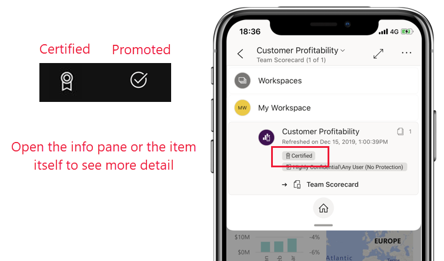
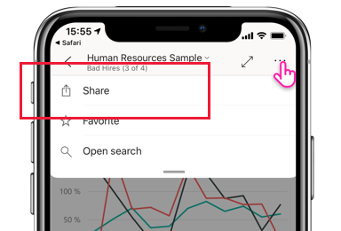

# Novidades em aplicações móveis para o Power BI
Para informações sobre “Novidades” relacionadas, veja:

* [Blogue da equipa do Power BI para as aplicações móveis](https://powerbi.microsoft.com/blog/tag/mobile/)
* [Novidades do Power BI Desktop](../../fundamentals/desktop-latest-update.md)  
* [Novidades do serviço Power BI](../../fundamentals/service-whats-new.md)

>[!NOTE]
>O suporte à aplicação móvel do Power BI para **telemóveis com o Windows 10 Mobile** será descontinuado a 16 de março de 2021. [Saiba mais](/legal/powerbi/powerbi-mobile/power-bi-mobile-app-end-of-support-for-windows-phones)

## Dezembro de 2020
### Adicionámos a deteção de anomalias às aplicações móveis
Se o criador do relatório tiver configurado a deteção de anomalias para um elemento visual do relatório, poderá ver se existem picos inesperadamente altos ou quedas nos dados provocados por valores atípicos dos dados (ou seja, anomalias). [Saiba mais!](mobile-reports-in-the-mobile-apps.md#investigate-anomalies-in-time-series-data)

### Localizar facilmente os conteúdos endossados da organização
Os conteúdos que foram [promovidos ou certificados](../../collaborate-share/service-endorsement-overview.md) no serviço Power BI agora são marcados na aplicação com um destaque. Os criadores de relatórios promovem os conteúdos para mostrar que estão prontos para utilização (promovidos) ou certificam os conteúdos para mostrar que foram aprovados pela organização (certificados).

### Adicionámos o modo escuro à aplicação móvel do Power BI (Android)
Experimente o novo modo escuro na aplicação móvel do Power BI para dispositivos Android. No modo escuro, verá o texto claro num fundo escuro, o que reduz o brilho do ecrã e facilita a visualização do conteúdo. Pode alternar entre temas nas definições de aspeto da aplicação. [Saiba mais](mobile-apps-dark-mode.md)

### Aumente o campo de visão com o modo de ecrã inteiro (iPads)
Adicionámos agora um novo botão à aplicação móvel para iPads que lhe permite remover os cabeçalhos e rodapés da aplicação, para ter mais espaço para ver os conteúdos. Basta tocar no botão de ecrã inteiro  no canto superior direito do ecrã para alternar entre os modos.

## Novembro de 2020
### Aumente o seu campo de visão com o modo de ecrã inteiro (tablets Android)
Adicionámos um novo botão à aplicação móvel para tablets Android que lhe permite remover os cabeçalhos e rodapés da aplicação, o que lhe dá o espaço máximo para ver os seus conteúdos. Basta tocar no botão de ecrã inteiro  no canto superior direito do ecrã para alternar entre os modos.

## Outubro de 2020
### A atualização automática de páginas é agora suportada (Windows)

Agora, as páginas de relatório configuradas com [atualização automática de página](../../create-reports/desktop-automatic-page-refresh.md) também serão atualizadas automaticamente na aplicação Power BI para dispositivos Windows. E isto não significa apenas na vista de relatório normal. Com a atualização automática de páginas, as suas [apresentações e apresentações de diapositivos](mobile-windows-10-app-presentation-mode.md#slideshows) também serão atualizadas em tempo real, o que garante que apresenta sempre os dados e informações empresariais mais recentes.

### Suporte para ecrãs notch (iOS)
Adicionámos suporte para ecrãs notch em iPhones e iPads, o que lhe vai oferecer mais espaço de ecrã para os seus relatórios e dashboards. 

## Setembro de 2020
### A aplicação Power BI (pré-visualização) para o HoloLens 2 está à venda!

A aplicação Power BI para o HoloLens 2 oferece-lhe uma experiência totalmente imersiva. Através do nosso sistema de gestos do HoloLens 2, pode obter os relatórios e os dashboards favoritos fora do toolbelt, redimensioná-los e colocá-los no espaço onde precisa deles e até navegar nas páginas do relatório. Os relatórios e os dashboards são atualizados enquanto estiver a usar a aplicação, portanto, se existirem alterações de dados, verá essas alterações imediatamente. Saiba mais na nossa [documentação](mobile-hololens2-app.md) e no nosso [blogue](https://powerbi.microsoft.com/blog/power-bi-app-for-mixed-reality-now-available-for-hololens-2/)!

## Agosto de 2020
### Melhorámos a forma como navega para os conteúdos (iOS e Android)
Agora, pode navegar nos seus conteúdos de forma rápida e fácil com uma **nova árvore de navegação**, disponível no menu pendente do cabeçalho nos relatórios, dashboards e aplicações. Verá a hierarquia de localização dos seus conteúdos de relance, e pode facilmente subir na hierarquia de conteúdos, aceder a conteúdos colaterais ou até voltar rapidamente à home page. Se o item que estiver a ver fizer parte de uma aplicação, a árvore irá mostrar todo o conteúdo da aplicação: secções, ligações e todos os relatórios e dashboards. Se o item que estiver a ver for um relatório, encontrará também uma lista de todas as páginas de relatório visíveis. Nunca foi tão fácil ir de uma página para a outra! Veja por si mesmo! 

### Partilhar do Power BI com as suas aplicações favoritas (iOS e Android)
Agora, pode partilhar ligações para conteúdos do Power BI com os seus contactos. Utilize a nova ação Partilhar no cabeçalho para enviar a ligação, com qualquer aplicação de colaboração que tenha no dispositivo, como o Microsoft Teams, uma aplicação de correio, etc. A ligação captura a vista atual, para que possa até partilhar vistas de relatórios filtradas.

### O gesto de aproximar os dedos para ampliar está agora disponível em todas as vistas de relatório, em telemóveis e tablets (iOS e Android)   
Ativámos a funcionalidade aproximar e ampliar em todas as vistas de relatório, o que torna mais fácil ampliar e reduzir o conteúdo do seu relatório, esteja no telemóvel ou no tablet.

### Reproduzir automaticamente uma apresentação de diapositivos ao iniciar (Windows)
Pode escolher um relatório para reproduzir automaticamente em apresentação de diapositivos quando a aplicação Power BI para Windows for aberta. Esta opção é útil para criar uma experiência de quiosque que executa um relatório em apresentações públicas sem qualquer intervenção manual. [Saiba mais!](mobile-windows-10-app-presentation-mode.md#auto-play-a-slideshow-on-startup)

## Julho de 2020
### A aplicação móvel Power BI para Windows suporta agora a imagem corporativa organizacional
Agora, todas as alterações que o administrador fizer ao aspeto e funcionalidade do Power BI para corresponder ao tema da imagem corporativa da sua organização também serão refletidas na aplicação móvel Power BI. Tais alterações podem incluir um novo esquema de cores para a barra de navegação superior, o logótipo da sua organização e uma imagem da faixa.  

### Desativar o início de sessão único através de uma configuração remota (iOS e Android)
Os administradores de TI podem agora desativar remotamente o início de sessão único na aplicação móvel Power BI, aumentando a segurança e conformidade de permissões em dispositivos de múltiplos utilizadores. [Saiba mais!](mobile-app-configuration.md#disable-single-sign-on-ios-and-android)

## Junho de 2020
### Mostrar os marcadores em apresentações de diapositivos (Windows)
Agora, pode incluir marcadores de relatório e marcadores pessoais nas apresentações de diapositivos, automaticamente como parte da apresentação, para realçar informações específicas nos dados.
[Dê uma vista de olhos!](mobile-windows-10-app-presentation-mode.md#use-presentation-mode)

## Maio de 2020
### Adicionámos o modo escuro ao Power BI Mobile (iOS)
Experimente o novo modo escuro na aplicação Power BI Mobile para o iOS13. No modo escuro, verá o texto claro num fundo escuro, o que reduz o brilho do ecrã e facilita a visualização do conteúdo. Pode alternar entre temas nas definições de aspeto da aplicação. [Saiba mais](mobile-apps-dark-mode.md)

### Aplicar marcadores no modo de apresentação (Windows)
Agora, ao apresentar um relatório no modo de apresentação, pode aplicar marcadores pessoais e de relatório para reportar páginas e contar a história dos dados. [Dê uma vista de olhos!](mobile-windows-10-app-presentation-mode.md#use-presentation-mode)

## Abril de 2020

### A partilha a partir de áreas de trabalho está agora disponível
Adicionámos a capacidade de partilhar relatórios e dashboards a partir de áreas de trabalho. Pode agora partilhar o seu conteúdo a partir de "A minha área de trabalho" e de outras áreas de trabalho se o proprietário da área de trabalho o permitir, tal como no serviço Power BI. 

### Os dashboards suportam agora o modo de ecrã inteiro (iOS e Android)
Agora, pode ver os seus dashboards em modo de ecrã inteiro, dando-lhe mais espaço para ver o conteúdo do seu dashboard. 

## Março de 2020

### Utilizar atalhos e a Pesquisa Google para iniciar o conteúdo (Android)
Simplificámos a forma como localiza e inicia os seus dados ao integrar os atalhos e a Pesquisa Google com a aplicação Power BI. Crie atalhos para facilitar o acesso aos seus relatórios e dashboards favoritos diretamente do ecrã principal do seu dispositivo. Utilize a Pesquisa Google para procurar rapidamente e abrir os seus conteúdos do Power BI. Saiba mais sobre [atalhos da aplicação no Android](mobile-app-quick-access-shortcuts.md) e a [Pesquisa Google](mobile-app-find-access-google-search.md)!

### Segurança avançada com proteção de dispositivo (pré-visualização) (Android)
Utilize as funcionalidades de proteção incorporadas do seu dispositivo para proteger a sua aplicação Power BI e obter a privacidade de que necessita. A necessidade de autenticação biométrica (ID de Impressão Digital) para aceder à aplicação Power BI garante que os seus dados são mantidos privados e vistos apenas por si. [Saiba mais sobre acesso seguro nativo](mobile-native-secure-access.md)

### A leitura de códigos já está disponível no iPad
Diretamente no seu iPad, pode ler códigos de barras para filtrar os seus relatórios e utilizar os códigos QR para abrir relatórios rapidamente.  

### Experiência de filtragem atualizada
Os filtros na aplicação Power BI têm novas funcionalidades e um novo design. Inclui visibilidade melhorada dos filtros aplicados que afetam os elementos visuais do relatório e a capacidade de bloquear e até mesmo ocultar filtros. Estas alterações também fornecem uma melhor compatibilidade com filtragem no serviço Power BI.

## Fevereiro de 2020

### Modo de seleção múltipla (Android e iOS)

Adicionámos a capacidade de selecionar múltiplos pontos de dados numa página de relatório. Quando a seleção múltipla está ligada, cada ponto de dados em que toca é adicionado a outros pontos de dados selecionados, com os resultados combinados automaticamente realçados em todos os elementos visuais da página. Para ativar o modo de seleção múltipla, aceda à página de [definições das aplicações móveis](./mobile-app-interaction-settings.md).

>[!NOTE]
>O modo de seleção múltipla será suportado no Power BI Report Server na próxima versão do Report Server.

### O rodapé do relatório pode agora estar sempre visível na aplicação móvel para iPhones

No iPhone, tal como no telemóvel Android, pode optar por ancorar o rodapé do relatório na parte inferior da página do relatório, onde ficará sempre visível e disponível, sejam quais forem as suas ações na página. Isto facilita a utilização de todas as opções disponíveis. Para ancorar o rodapé, ative o botão **Rodapé do relatório ancorado** na página de [definições das aplicações móveis](./mobile-app-interaction-settings.md).

### Suporte para relatórios PBIRS (pré-visualização) (Windows)

Agora, pode abrir os relatórios do Power BI Report Server (PBIRS) na aplicação Power BI.

### Aceder rapidamente aos itens recentes (Windows)

Clique com o botão direito do rato no ícone da aplicação Power BI na barra de tarefas do Windows para obter uma lista de todos os itens recentemente visualizados. Clique em qualquer item na lista para fazer uma visita rápida de volta.

## Janeiro de 2020

### Partilhar anotações criadas no modo de apresentação (Windows)

As anotações criadas durante as apresentações tornam-se uma parte importante das apresentações e um componente essencial dos debates. Agora, quando anotar um relatório no modo de apresentação, poderá partilhar um instantâneo da página do relatório com os seus colegas. [Saiba mais](./mobile-windows-10-app-presentation-mode.md#use-presentation-mode)

## Dezembro de 2019

### Rodapé de relatório ancorado e um botão de atualização: novas experiências de interação com relatórios (Android)

Os nossos utilizadores de Android disseram-nos que a sua experiência na utilização de relatórios não era a melhor, que era difícil utilizar o rodapé dos relatórios e que a funcionalidade de puxar para atualizar é demasiado sensível em alguns dispositivos. Por isso, mudámos estes comportamentos nesta versão:
* **Rodapé de relatório ancorado**: agora, quando abrir um relatório no telemóvel, encontrará o rodapé do relatório ancorado na parte inferior da página do relatório, onde ficará sempre visível e disponível, sejam quais forem as suas ações na página. Isto facilita a utilização de todas as opções disponíveis.
* **Botão de atualização no cabeçalho do relatório**: encontrará também um botão de atualização no cabeçalho do relatório, para que seja fácil atualizar o relatório exatamente quando quiser.

Os utilizadores que preferirem o comportamento anterior podem restaurar estes comportamentos com as novas e expandidas [definições de interação](./mobile-app-interaction-settings.md) da aplicação móvel.

Além disso, os administradores de TI podem [substituir remotamente as novas predefinições](./mobile-app-configuration.md#interaction-settings-ios-and-android) em nome dos seus utilizadores, com a ferramenta MDM de eleição e com um ficheiro de configuração de aplicação. Desta forma, todos os utilizadores numa organização podem ter o mesmo comportamento configurado.

> [!NOTE]
> As definições de interação para o botão de atualização e para ancorar o rodapé do relatório não têm atualmente efeito em relatórios do Report Server. Isto vai mudar com a versão do Report Server de janeiro!

### Definir marcadores predefinidos a partir da aplicação móvel
Agora, pode predefinir marcadores para os seus relatórios diretamente na aplicação móvel do Power BI. Depois, sempre que abrir um relatório, o marcador predefinido será aplicado automaticamente. [Saiba mais!](./mobile-reports-in-the-mobile-apps.md#bookmarks)

### Filtrar por localização em tablets Android
Os filtros geográficos permitem-lhe filtrar os seus relatórios com base na sua localização atual. Esta funcionalidade encontra-se agora também disponível na aplicação do Power BI para tablets Android. [Saiba mais!](./mobile-apps-geographic-filtering.md)

## Novembro de 2019

### O novo aspeto da aplicação Power BI está agora ativado por predefinição
 
Agora, ao abrir a aplicação, o novo aspeto e as barras de navegação são ativadas automaticamente, o que simplifica a forma como encontra e abre conteúdos. Utilize a [home page](mobile-apps-home-page.md) da aplicação como ponto de partida. Desta forma, irá obter acesso rápido aos seus conteúdos mais importantes, bem como ao [feed de atividades](mobile-apps-home-page.md#activity-feed) que o mantém a par dos últimos alertas, notificações e mais.

### Ver toda a sua atividade do Power BI mais recente
 
O feed de atividades ajuda-o a acompanhar em tempo real o que está a acontecer com os seus conteúdos do Power BI. Aceda à home page da aplicação e abra o separador Atividade para ver todas as últimas notificações, alertas, comentários, @mentions e mais. [Saiba mais](mobile-apps-home-page.md#activity-feed).

### Utilizar marcadores nos relatórios

Agora, a aplicação móvel Power BI suporta marcadores criados no Power BI. Ao abrir a aplicação, pode tirar partido de marcadores criados pelo autor do relatório e de quaisquer marcadores pessoais que tenha criado. [Saiba mais](mobile-reports-in-the-mobile-apps.md#bookmarks).

## Outubro de 2019

### Suporte do Android para a configuração remota das definições de acesso ao Servidor de Relatórios

Adicionámos suporte do Android para a configuração remota das definições de acesso ao Servidor de Relatórios das aplicações móveis do Power BI. Os administradores de TI podem agora utilizar a ferramenta MDM das respetivas organizações para configurar essas definições em dispositivos iOS e Android. Veja [Configurar o acesso da aplicação móvel do Power BI ao Servidor de Relatórios remotamente](../../report-server/configure-powerbi-mobile-apps-remote.md) para obter detalhes.

### Pormenorização de relatório cruzado

Este mês, adicionámos suporte para a pormenorização entre relatórios. Agora, pode tocar num ponto de dados para pormenorizar e aceder a outros relatórios e páginas de relatórios. Ao pormenorizar para uma página de destino, os conteúdos nessa página são filtrados com base nas definições de pormenorização.

> [!NOTE]
> A pormenorização entre relatórios apenas estará disponível se tiver sido ativada durante a criação do relatório. [Saiba mais sobre a pormenorização entre relatórios](../../create-reports/desktop-cross-report-drill-through.md).

### Etiquetas de confidencialidade dos dados

Agora, pode ver as etiquetas de confidencialidade que os proprietários de conteúdos definiram em relatórios, dashboards, conjuntos de dados e fluxos de dados para classificar a confidencialidade dos respetivos dados. As etiquetas de confidencialidade determinam como os conteúdos podem ser partilhados com outros utilizadores. [Saiba mais sobre as etiquetas de confidencialidade de dados no Power BI](../../admin/service-security-data-protection-overview.md).

### Suporte para navegação de aplicações personalizadas (Windows)

O suporte para navegação de aplicações personalizadas foi adicionado para dispositivos Windows, além de iOS e Android (ver a [entrada de setembro das Novidades](#september-2019)).

## Setembro de 2019

### Suporte para navegação personalizada de aplicações (iOS e Android)

Adicionámos suporte para navegação personalizada de aplicações. Agora, quando abrir uma aplicação no Power BI Mobile, a experiência de navegação personalizada concebida pelo criador de aplicações estará disponível. A navegação da aplicação pode ser organizada por conteúdo e incluir novos itens, tais como ligações e secções que podem ser fechadas.
Leia mais sobre a [navegação personalizada](https://powerbi.microsoft.com/blog/designing-custom-navigation-for-power-bi-apps-is-now-available/).

## Agosto de 2019

### Apresentação do novo aspeto do Power BI Mobile (pré-visualização) (iOS e Android)

Atualizámos a nossa aplicação e introduzimos novas experiências, adicionámos uma home page que fornece acesso rápido ao conteúdo utilizado com frequência e novos painéis de navegação que lhe permitem navegar facilmente pela aplicação. Com as experiências novas e atualizadas, agora é mais rápido e mais fácil encontrar o que precisa, quando precisa.
Como o novo aspeto está em pré-visualização, precisará de ativá-lo para poder disfrutar.
Saiba mais sobre o [Novo aspeto do Power BI Mobile](https://powerbi.microsoft.com/blog/introducing-power-bi-mobile-apps-new-look-preview/).

### Acesso protegido com o Proxy da Aplicação do Azure Active Directory (AD) (iOS e Android)

Estabelecemos parceria com a equipa do Azure Active Directory para integrar aplicações móveis do Power BI com o Proxy da Aplicação do Azure Active Directory (Azure AD). Com esta configuração, pode ligar-se ao Servidor de Relatórios alojado dentro dos limites da empresa a partir da aplicação Power BI Mobile, sem ter de fazer uma complexa configuração no local. Leia mais sobre a [integração do Power BI Mobile e do Proxy de Aplicações do Azure AD](https://powerbi.microsoft.com/blog/access-on-prem-report-server-from-your-power-bi-mobile-app-with-azure-active-directory-application-proxy/). Saiba [como configurar o Proxy de Aplicações do Azure AD e o Power BI](/azure/active-directory/manage-apps/application-proxy-integrate-with-power-bi).

## Julho de 2019

### Descrições de página do relatório

As descrições da página de relatório são agora suportadas durante a visualização de relatórios na sua aplicação móvel. Basta tocar sem soltar num elemento visual que tenha uma descrição de relatório associada para que esta seja apresentada.  

 
> [!NOTE]
> As descrições de relatório são suportadas em dispositivos com mais de 640 píxeis e 320 janelas viewport. Os dispositivos de menores dimensões utilizam descrições predefinidas.

## Junho de 2019

### A leitura de códigos de barras está agora disponível para Android
Agora, pode utilizar a aplicação Power BI em Android (telemóvel e tablet) para ler códigos de barras impressos em produtos ou prateleiras de lojas para apresentar relatórios relacionados do Power BI filtrados pelo valor lido. Mais informações sobre como [filtrar os seus dados com códigos de barras](mobile-apps-scan-barcode-iphone.md).

### Suporte para relatórios do PBIX alojados no PBI-RS com uma configuração do ADFS (iOS, Android)

Os Relatórios do Power BI (PBIX) alojados no PBI-RS com uma configuração do ADFS podem agora ser acedidos a partir das aplicações móveis do Power BI.

## Maio de 2019

### Suporte para Atalhos do Siri (iOS)
Os utilizadores podem criar Atalhos do Siri para os respetivos relatórios e dashboards do Power BI e, em seguida, abri-los diretamente a partir da interface de voz do Siri. [Leia sobre como utilizar Atalhos do Siri na aplicação Power BI para iOS](https://powerbi.microsoft.com/blog/introducing-siri-integration-with-power-bi-mobile-ios-app-preview/).

### Pesquisa de dispositivos (iOS)
Integração do Power BI na pesquisa de dispositivos do iOS (Spotlight). A pesquisa de conteúdos num iPhone ou iPad irá agora também incluir itens do Power BI. Quando os utilizadores utilizarem a pesquisa nativa do dispositivo, os relatórios, dashboards, aplicações, áreas de trabalho e pessoas do Power BI que correspondam aos critérios de pesquisa serão também listados nos resultados. [Visite a mensagem de blogue para saber mais](https://powerbi.microsoft.com/blog/introducing-siri-integration-with-power-bi-mobile-ios-app-preview/).

### A interação de toque único em relatórios está agora disponível para o público

A funcionalidade de toque único está agora disponível para o público e será a interação de toque predefinida para novos utilizadores. Os utilizadores poderão desativar a funcionalidade e terão a opção de fazer duplo toque nas definições da aplicação.

### Proteção de acesso condicional melhorada (iOS e Android)

Integrámos no Azure AD uma [nova funcionalidade de acesso condicional à aplicação baseado na proteção](/azure/active-directory/conditional-access/app-protection-based-conditional-access) para aumentar a segurança, limitando o acesso ao Power BI antes de a política da aplicação ser aplicada.

### Proteção de dispositivos (iOS)

Os utilizadores podem utilizar a proteção incorporada do dispositivo para proteger o Power BI, ao pedir o Face ID, Touch ID ou código de acesso para aceder à aplicação. Esta funcionalidade tanto pode ser controlada pelo utilizador nas definições da aplicação, como por administradores através do Intune e de quaisquer outras ferramentas MDM. [Saiba mais](./mobile-native-secure-access.md).

### Apresentação de diapositivos de relatórios de uma página (Windows)

Os relatórios de uma página agora também suportam a atualização automática na apresentação de diapositivos. Assim, se a origem de dados subjacente do relatório for atualizada, atualizaremos os dados na página.

## Abril de 2019

### Elemento visual de Influenciadores Principais 

O elemento visual de Influenciadores Principais está agora disponível na sua aplicação móvel. Este elemento visual permite-lhe analisar fatores determinantes nos seus dados com apenas alguns toques.

### Adicione comentários a conteúdos de relatórios (Android e iOS)

Agora pode utilizar comentários para colaborar e partilhar o seu feedback em elementos visuais e páginas de relatórios. Leia mais sobre os comentários em relatórios no Serviço e na Aplicação Móvel Power BI [nesta mensagem de blogue](https://powerbi.microsoft.com/blog/announcing-report-commenting-for-power-bi-service-and-mobile/). 

### Aumente o seu campo de visão com o modo de ecrã inteiro (Android e iOS)

Adicionámos um novo botão que lhe permite controlar quando quer focar-se nos seus dados ao remover cabeçalhos e rodapés de relatórios para lhe dar ainda mais espaço para ver os seus relatórios.

## Março de 2019

### Suporte de utilizadores convidados externos nas aplicações do Power BI (iOS e Android)

Pode aceder aos conteúdos do Power BI partilhados consigo por outra organização diretamente na aplicação (também conhecida como B2B). Leia mais sobre as aplicações móveis B2B do Power BI [aqui](https://powerbi.microsoft.com/blog/power-bi-mobile-apps-now-support-azure-ad-b2b-guest-users/).

### Melhoria do modo de apresentação do Windows com a apresentação de diapositivos (Windows)

Com a [apresentação de diapositivos](https://powerbi.microsoft.com/blog/enhancing-presentation-mode-with-slideshow-in-windows-power-bi-app/), pode utilizar ecrãs públicos localizados no seu escritório para executar relatórios do Power BI em ecrã inteiro e alternar automaticamente entre as páginas do relatório.  

### Suporte para relatórios do PBI-RS na configuração do ADFS e WAP (apenas iOS)

Os Relatórios do Power BI (PBIX) alojados no PBI-RS com uma configuração do ADFS podem agora ser acedidos a partir da aplicação Power BI para iOS.

### Implementámos a interação de toque único em elementos visuais de relatórios

Alterámos a interação em relatórios para que seja necessário apenas um toque num elemento visual, botão ou segmentação de dados para interagir com os respetivos dados imediatamente. Os utilizadores já não terão de tocar num elemento visual para o selecionar e voltar a tocar-lhe para interagir com o mesmo. Será preciso um único toque para realizar ambas as ações.

> [!NOTE]
> Os utilizadores existentes terão de ativar esta funcionalidade nas definições da aplicação. Para obter mais informações, veja o artigo [Como configurar a interação de toque único em relatórios](./mobile-app-interaction-settings.md).

## Janeiro – fevereiro de 2019
 
### Elementos visuais do Visio

Ative o Início de sessão único (SSO) nos elementos visuais do Visio para não ser preciso realizar qualquer passo de início de sessão adicional quando visualizar o relatório com o elemento visual do Visio na aplicação. 

### Os comentários do dashboard estão a chegar à aplicação do Power BI Mobile para Windows

Pode adicionar comentários diretamente nos dashboards e mosaicos específicos para debater os seus dados e qualquer pessoa que visualize o dashboard irá ver os seus comentários. 

## Dezembro de 2018

### O filtro já está disponível para relatórios horizontais 

O painel de filtro do relatório está agora disponível para os relatórios horizontais (para além dos relatórios no telemóvel).

## Novembro de 2018

### Cabeçalho de elemento visual moderno 

Os relatórios que utilizam o novo “cabeçalho de elemento visual moderno” deixarão de alocar espaço para os cabeçalhos, o que resultará em menos espaço vazio e mais espaço para as visualizações.

### Otimizar o modo de apresentação (Windows)

Modo de apresentação avançado para dispositivos Surface Hub e Windows 10.  Desfrute de uma experiência de sala de reunião avançada no Surface Hub com ferramentas de apresentação e colaboração melhoradas e uma vista otimizada “chromeless” de grandes dimensões para que se possa concentrar nos seus dados. O modo de apresentação também disponibiliza ferramentas como a escrita para o ajudar a apresentar e a debater os seus dados com eficiência. Saiba mais sobre o modo de apresentação [aqui](https://powerbi.microsoft.com/blog/presentation-mode-in-power-bi-windows-app/).

### Esquema de relatório vertical em tablets (iOS e Android)

Agora, utilizamos o esquema de relatório de telemóvel, quando existe, para apresentar relatórios no tablet no modo vertical. Saiba mais sobre [como criar o esquema de telemóvel no serviço Power BI ou no Power BI Desktop](/power-bi/desktop-create-phone-report/).

### Suporte para a cadeia de consulta do relatório 

A ligação do relatório que inclui a cadeia de consulta agora será aberta na aplicação móvel e será previamente filtrada com base nas condições definidas na cadeia de consulta. Saiba mais sobre [como criar o URL do relatório com a cadeia de consulta](/power-bi/service-url-filters/).  

### Credenciais partilhadas (agora no Android)

Iniciar sessão no Power BI na aplicação móvel nunca foi tão fácil. Com as credenciais partilhadas, simplificámos o processo de início de sessão através da utilização de outras credenciais da aplicação Microsoft 365 no dispositivo para o autenticar no serviço Power BI.

### URLs na aplicação (agora no Android) 

As ligações nos relatórios que apontam para outros artefactos do Power BI agora abrem diretamente dentro da aplicação. Tal permite-lhe criar fluxos personalizados de navegação, por exemplo, ligar de um relatório para um dashboard.

### Mostrar dados e valores de cópia

O menu de ação do elemento visual do relatório (...) agora tem a opção de apresentar os dados subjacentes no formato de tabela. Uma vez na tabela, pode premir sem soltar para selecionar e copiar os valores da tabela (partindo do princípio de que não há nenhuma política do Intune que impeça a cópia).

## Outubro de 2018

### Pré-visualização dos relatórios paginados (todos os dispositivos)

Os relatórios paginados estão agora disponíveis no serviço Power BI. Os utilizadores com acesso a relatórios paginados no serviço Power BI também podem aceder a estes relatórios a partir da aplicação móvel. 

Leia a [mensagem de blogue do Power BI sobre os relatórios paginados na aplicação móvel](https://powerbi.microsoft.com/blog/power-bi-paginated-reports-also-available-in-power-bi-mobile-apps-preview/).

### Credenciais partilhadas (iOS)

Iniciar sessão no Power BI na aplicação móvel nunca foi tão fácil. Com as credenciais partilhadas, simplificámos o processo de início de sessão através da utilização de outras credenciais da aplicação Microsoft 365 no dispositivo para o autenticar no serviço Power BI.

### URLs da aplicação (iOS) 

As ligações nos relatórios que apontam para outros artefactos do Power BI agora abrem diretamente dentro da aplicação. Tal permite-lhe criar fluxos personalizados de navegação, por exemplo, ligar de um relatório para um dashboard.

### Suporte iOS12 e watchOS 5 

Atualizámos a aplicação do Power BI para iOS para funcionar perfeitamente com o novo sistema operativo nos dispositivos móveis e no relógio.

## Setembro de 2018

### Edição de relatório de telemóvel no browser (todos os dispositivos)

Agora, pode criar um esquema de relatório de telemóvel para um relatório que já está publicado no serviço Power BI e não apenas no Power BI Desktop. Cria-o no modo Edição no seu browser.

### Comentários no dashboard (iOS e Android) 

Pode adicionar comentários diretamente nos dashboards e mosaicos específicos para debater os seus dados e qualquer pessoa que visualize o dashboard irá ver os seus comentários. Também pode chamar outras pessoas na sua organização para a conversa ao @mentioning-las. Aqueles a quem @mentioned, recebem uma notificação push com a mensagem no telemóvel.

Atualmente disponível para dispositivos iOS e Android. Suporte para Windows em breve.

Leia a [mensagem de blogue do Power BI sobre comentários de dashboard](https://powerbi.microsoft.com/blog/announcing-dashboard-comments-in-power-bi/).

### Início de Sessão Único (Windows)

Início de Sessão Único (SSO) é uma das capacidades mais pedidas para o Power BI Mobile para Windows. Agora pode utilizar a sua conta organizacional principal não apenas para iniciar sessão nos seus dispositivos móveis de Windows associados a um domínio, mas também para iniciar sessão diretamente no serviço Power BI. Leia mais sobre [SSO e aplicações móveis Windows](mobile-windows-10-app-single-sign-on-sso.md).

## Meses anteriores

### Julho de 2018

#### Apenas iOS e Android

**Filtros partilhados**

Agora pode receber relatórios com segmentações de dados e filtros partilhados.

**Suporte da imagem de fundo**

Quando visualiza um relatório no modo horizontal no dispositivo móvel, pode ver as mesmas imagens de fundo no Power BI na Web.

### Junho de 2018

#### Relatórios de tela completa

As barras de ação superiores e inferiores agora desaparecem pouco depois de o seu relatório carregar, pelo que pode ver mais do seu relatório de uma vez.

#### Tamanho da tela de relatórios no telemóvel aumentado

Aumentámos o tamanho da tela de relatórios no telemóvel para criar espaço para ainda mais elementos visuais.

### May 2018

#### Exploração móvel: todas as aplicações móveis

Pode explorar a partir de um ponto de dados selecionado para outra página de relatório nas aplicações móveis, caso o autor do relatório tenha definido essa ação. 

#### Botão Anterior: todas as aplicações móveis

Agora, quando navegar através de um relatório ao deslizar, ao escolher uma página de relatório na barra de ação ou ao utilizar a exploração, o botão Anterior leva-o de volta à página anterior que estava a procurar. 

#### Temas do dashboard: todas as aplicações móveis

Quando os autores dos relatórios personalizam temas do dashboard no serviço Power BI, o aspeto e funcionalidade do dashboard também serão alterados na aplicação móvel. No entanto, não verá as imagens de fundo.

#### iOS: Configurar o acesso da aplicação móvel do Power BI para iOS a um servidor de relatórios remotamente

O seu administrador de TI pode agora utilizar uma ferramenta MDM para configurar o acesso da aplicação para iOS do Power BI a um servidor de relatórios. Veja [Configurar o acesso da aplicação móvel do Power BI para iOS a um servidor de relatórios remotamente](../../report-server/configure-powerbi-mobile-apps-remote.md) para obter detalhes.

#### Aplicação Power BI for Mixed Reality (Pré-visualização)

A aplicação Power BI for Mixed Reality está agora na Microsoft Store. Veja os seus dashboards e relatórios enquanto está envolvido pelo mundo virtual ou coloque-os e veja-os em localizações específicas no contexto do seu ambiente. Veja o novo vídeo [Introdução ao Power BI no HoloLens](https://www.youtube.com/watch?v=J_X_nOFUBss) para obter contexto ou leia o artigo sobre a nova [Aplicação Power BI for Mixed Reality](./mobile-hololens2-app.md).

### Abril de 2018

#### Desagregar e agregar num dispositivo móvel

Agora pode desagregar e agregar para aprofundar os elementos visuais do relatório no dispositivo móvel. Para aceder a esta nova funcionalidade, toque e mantenha o dedo para abrir o menu de descrição num elemento visual de relatório e, em seguida, toque nos botões de desagregação/agregação para explorar os dados em profundidade. Mais sobre a [agregação e desagregação nas aplicações móveis](https://powerbi.microsoft.com/blog/drill-down-up-in-power-bi-mobile-apps/).

#### Filtros persistentes

Atualizámos recentemente os filtros de relatório e as segmentações de dados, para que sejam guardados automaticamente a partir do Power BI na Web para a aplicação móvel do Power BI. Agora, os filtros e as segmentações de dados que definiu na aplicação móvel são guardados automaticamente no Power BI na Web.

### Março de 2018

#### Aplicação Power BI for Mixed Reality (Pré-visualização)

Com o intuito de levar os dados ao local onde se encontra, criámos a aplicação Power BI for Mixed Reality. Veja os seus dashboards e relatórios enquanto está envolvido pelo mundo virtual ou coloque-os e veja-os em localizações específicas no contexto do seu ambiente. Leia mais sobre a nova [aplicação Power BI for Mixed Reality](./mobile-hololens2-app.md).

#### Partilhar relatórios e dashboards externamente

Partilhe dashboards e relatórios com utilizadores fora da sua organização, diretamente a partir da aplicação. A partilha externa está ativada para contas organizacionais e sociais. 

#### Filtros persistentes

Quando definir os filtros e segmentações de dados no Power BI na Web, as opções de filtros também são guardadas na sua aplicação móvel, pelo que pode retomar a atividade a partir de onde tiver parado.

#### Atualizar relatórios no iPad

Os relatórios do Power BI passaram a ter um botão de atualização na aplicação iPad.

### Fevereiro de 2018

#### Relatórios de partilha

Agora pode partilhar um relatório diretamente a partir de aplicações móveis. Saiba mais sobre como [partilhar dashboards e relatórios a partir de aplicações móveis](mobile-share-dashboard-from-the-mobile-apps.md)

#### Descrições melhoradas

Ao tocar sem soltar no elemento visual de um relatório para aceder a descrições, pode agora arrastar o seu dedo ao longo deste elemento visual para explorar detalhes sobre cada ponto de dados ao longo do percurso.

### Janeiro de 2018

#### Relatórios favoritos

Atribua etiquetas de favoritos a relatórios para serem apresentados na página **Favoritos**. Saiba mais sobre os [favoritos nas aplicações móveis do Power BI](mobile-apps-favorites.md).

#### Ver relatórios partilhados

Agora, quando alguém partilhar um relatório consigo, é listado na página **Partilhado comigo** juntamente com os dashboards.

#### Suporte de hiperligação melhorado

Agora, pode tocar nas ligações nos elementos visuais do Power BI para os abrir no browser do dispositivo móvel.

#### Integração com o Intune (Android)

Suporte para o acesso condicional através da gestão de dispositivos móveis do Intune.

### Dezembro de 2017

#### Gestão de segurança melhorada 

Adicionámos suporte para o acesso condicional (CA) e para a gestão de dispositivos móveis do Microsoft Intune (MDM) em dispositivos Android, para proteger melhor os dados da sua organização. Já está disponível em dispositivos iOS.

#### Gestão de permissões melhorada

Foram feitas algumas alterações que permitem a gestão mais precisa das permissões dos utilizadores para conjuntos de dados, dashboards e relatórios.

#### Aplicações instaladas automaticamente

Não precisa de instalar algumas das aplicações no Power BI. Os criadores de aplicações do Power BI na sua organização podem criar *aplicações* que contenham uma coleção de dashboards e relatórios. Em seguida, podem publicar a aplicação e configurá-la para ser instalada automaticamente no serviço Power BI e nas aplicações móveis do Power BI. Quando uma aplicação está configurada para ser instalada automaticamente, aparece no seu menu **Aplicações**:

### Novembro de 2017
#### Otimização para iPhone X

Otimizámos o esquema da aplicação para o iPhone X, para que possa explorar os dados com um visual apelativo em todos os dispositivos.

### Outubro de 2017
#### Filtros para relatórios de telemóvel no Android

Se criar um relatório com páginas otimizadas para telemóvel no Power BI Desktop e o relatório tiver filtros poderá agora aplicar esses filtros ao relatório de telemóvel do seu Android. Leia mais sobre os filtros dos relatórios do Power BI em dispositivos Android.

#### Mostrar dados nos relatórios

Agora pode alterar os elementos visuais nos relatórios para uma vista de tabela para ver os números dos dados. Para aceder a esta funcionalidade, toque em "Mostrar dados" a partir do menu de elementos visuais no seu relatório ou no ícone novo no menu de ação do elemento visual expandido.

### Setembro de 2017
#### Filtros para relatórios de telemóvel em iPhones
Se criar um relatório com páginas otimizadas para telemóvel no Power BI Desktop, e o relatório tiver filtros, pode agora aplicar esses filtros ao relatório de telemóvel do seu iPhone. Leia mais sobre os [filtros dos relatórios do Power BI em iPhones](https://powerbi.microsoft.com/blog/filters-coming-for-phone-reports-on-ios/).

### Agosto de 2017
#### Suporte para definições de proxy em iOS
Agora, pode configurar as definições de proxy na aplicação móvel iOS do Power BI. Isto significa que o Power BI irá agora funcionar com ligações VPN no dispositivo móvel, permitindo que mais utilizadores e organizações tirem partido, com segurança, do poder do Power BI em qualquer lugar.

### Julho de 2017
Leia o [resumo de funcionalidades para aplicações móveis publicado em julho de 2017](https://powerbi.microsoft.com/blog/power-bi-service-and-mobile-july-feature-summary/#ios-preview)

#### Dispositivos iOS
**Nova experiência de Perguntas e Respostas em dispositivos iOS (pré-visualização)** Em vez de apenas receber uma resposta à sua pergunta, agora pode utilizar linguagem natural para obter informações com âmbito definido. Mesmo se não tiver a certeza do que procura, as Perguntas e Respostas analisam proativamente as informações relevantes para os seus dados. A nova experiência de Perguntas e Respostas em dispositivos móveis, desenvolvida em colaboração com a equipa do Microsoft Research, demonstra poderosas tecnologias do nosso produto. Consulte o tutorial [Fazer perguntas sobre os seus dados nas aplicações móveis iOS](mobile-apps-ios-qna.md).

### Elementos visuais reativos
**Elemento visual reativo para relatórios e dashboards de telemóvel** Pode definir os elementos visuais no seu dashboard ou relatório para que sejam *reativos*, para que sejam alterados dinamicamente para apresentarem a quantidade máxima de dados e informações, independentemente do tamanho do ecrã. Leia o [blogue sobre elementos visuais reativos](https://powerbi.microsoft.com/blog/power-bi-desktop-july-feature-summary-2/#responsiveVisuals).

### Junho de 2107
#### Todos os dispositivos
**Torne as aplicações em favoritas** Já pode tornar um dashboard em favorito. Recentemente, o [Power BI adicionou aplicações](../../collaborate-share/service-create-distribute-apps.md) e agora também pode tornar as aplicações em favoritas. 

### Maio de 2017
#### Todos os dispositivos
**Novo menu: Partilhado comigo** Aceda a Partilhado comigo no menu da aplicação móvel para ver todo o conteúdo que foi partilhado consigo.

**Novo menu: Aplicações** Uma aplicação é uma coleção de dashboards e relatórios criados pela sua organização para fornecer as principais métricas para tomar decisões condicionadas por dados mais rápida e facilmente.

Leia mais sobre [como o conteúdo do Power BI está organizado](mobile-apps-quickstart-view-dashboard-report.md).

#### Dispositivos iOS e Android
**Pré-visualização do Power BI Report Server** Crie e publique os relatórios do Power BI no local. Em seguida, [visualize e interaja com os mesmos no seu dispositivo móvel iOS ou Android](mobile-app-ssrs-kpis-mobile-on-premises-reports.md). 

### Abril de 2017
Leia o [resumo de funcionalidades para aplicações móveis publicado em abril de 2017](https://powerbi.microsoft.com/blog/power-bi-mobile-apps-feature-summary-march-april-2017/)

#### Todos os dispositivos
**Cor de fundo para relatórios de telemóvel** Ao definir uma cor de fundo para um relatório do Power BI Desktop, o relatório de telemóvel terá a mesma cor de fundo. Mais informações sobre como [otimizar as páginas de relatório para telemóveis](../../create-reports/desktop-create-phone-report.md).

**Desenvolver um elemento visual do Power BI, compatível com dispositivos móveis** Leia este [Guia para programadores](https://github.com/PowerBi-Projects/PowerBI-visuals/blob/master/Tutorial/MobileGuideline.md), para obter sugestões sobre como criar elementos visuais do Power BI que têm um aspeto apelativo e funcionam bem em dispositivos móveis.

#### Dispositivos iOS
**Fale com os seus dados: faça perguntas conversando** já pode [fazer perguntas sobre os seus dados com as Perguntas e Respostas](mobile-apps-ios-qna.md), ao falar com em vez de escrever. 

### Março de 2017
Leia o [resumo de funcionalidades para aplicações móveis publicado em março de 2017](https://powerbi.microsoft.com/blog/power-bi-mobile-apps-feature-summary-march-2017/).

#### Todos os dispositivos
**Interações de segmentação de dados**

Melhorámos a interação tátil para a segmentação de dados de tempo.

#### Dispositivos iOS
**Faça perguntas sobre os seus dados com as Perguntas e Respostas – e envie-nos feedback** Experimente fazer perguntas sobre os seus dados com as Perguntas e Respostas e, em seguida, envie-nos uma cara sorridente ou triste para sabermos como nos saímos.

**Utilizar o 3D touch para ações comuns** Prima o ícone da aplicação do Power BI no ecrã inicial do seu iPhone 6s ou posterior para aceder a notificações, pesquisa e dashboards recentemente utilizados.

**Suporte para idiomas da direita para a esquerda** As aplicações móveis do Power BI agora suportam idiomas da direita para a esquerda. Neste contexto, "idiomas da direita para a esquerda" refere-se aos sistemas de escrita hebraico e árabe, que são escritos da direita para a esquerda e requerem uma formação contextual. Veja a lista de [Idiomas suportados nas aplicações móveis do Power BI](mobile-apps-supported-languages.md).

#### Dispositivos Android
**Ligar a mais do que um servidor SSRS** 

Agora, pode ter ligações de até cinco servidores do SQL Server Reporting Services (SSRS) ao mesmo tempo.

**Pedir acesso aos dashboards** 

Se digitalizar um código QR de um dashboard ao qual não tem acesso, pode agora enviar um pedido para obter o direito de acesso a partir da aplicação móvel.

### Fevereiro de 2017
#### Todos os dispositivos
**Deslocamento mais fácil** 

Agora, pode percorrer gráficos de barras e de colunas num relatório ao tocar no próprio gráfico, em vez de tocar na barra de deslocamento lateral.

#### Dispositivos iOS
**Faça perguntas dos seus dados com uma pré-visualização de Perguntas e Respostas** 

Com as Perguntas e Respostas, faça perguntas sobre os seus dados nas suas próprias palavras, e o Power BI fornece as respostas. As Perguntas e Respostas já se encontram no serviço Power BI, em https://powerbi.com. Agora também está [disponível na aplicação móvel no seu iPhone ou iPad](mobile-apps-ios-qna.md).

**Ligar a mais do que um servidor SSRS** 

Agora, pode ter ligações de até cinco servidores do SQL Server Reporting Services (SSRS) ao mesmo tempo.

#### Tablets Android
**A aplicação móvel do Power BI** para tablets Android está agora disponível globalmente. Introdução ao [Power BI para tablet Android](mobile-android-app-get-started.md).

#### Dispositivos iOS e Android
**Novo menu novo para mosaicos do dashboard** Navegue para o relatório subjacente, expanda o mosaico ou faça a gestão de um alerta, tudo isto diretamente a partir de um menu no mosaico de um dashboard. 

Este menu é uma novidade para telemóveis iOS e Android no modo horizontal, e para tablets Android. Já estava disponível em telemóveis Windows e Android no modo vertical.

### Janeiro de 2017
Leia o [Resumo das funcionalidades do blogue de aplicações móveis publicado em janeiro de 2017](https://powerbi.microsoft.com/blog/power-bi-mobile-apps-feature-summary-january-2017).

#### Todos os dispositivos
**Carregar mais do que 100 linhas em tabelas e matrizes** Agora, se tiver uma grande tabela ou matriz no seu dashboard ou relatório, mostramos a maior quantidade possível de dados no mosaico. Assim, no modo de detalhe, pode deslocar para baixo para carregar mais linhas.

**Relatório de telemóvel - disponibilidade geral** Os relatórios de telemóvel do Power BI estão agora geralmente disponíveis. No Power BI Desktop, pode personalizar uma vista vertical de um relatório existente para visualizadores em dispositivos móveis. Saiba mais sobre a [criação de relatórios de telemóvel no Power BI Desktop](../../create-reports/desktop-create-phone-report.md) e a [experiência de relatório em telemóveis](mobile-apps-view-phone-report.md).

#### iOS
**Autenticação SSRS através da Pré-visualização dos Serviços de Federação do Active Directory (AD FS)** Agora, pode iniciar sessão em servidores do SQL Server Reporting Services no local a partir do dispositivo móvel, com a sua conta profissional. Leia mais sobre como [utilizar OAuth para ligar a servidores SSRS](mobile-oauth-ssrs.md).

#### Android
**Autenticação SSRS através da Pré-visualização dos Serviços de Federação do Active Directory (AD FS)** Agora, pode iniciar sessão em servidores do SQL Server Reporting Services no local a partir do dispositivo móvel, com a sua conta profissional. Leia mais sobre como [utilizar OAuth para ligar a servidores SSRS](mobile-oauth-ssrs.md).

**Novo e melhorado: Anote e partilhe informações rapidamente** A partilha e a anotação são agora totalmente funcionais em dispositivos Android. O menu melhorado torna mais fácil e rápido anotar e partilhar informações, e também pode partilhar um relatório anotado ou diretamente da aplicação do Power BI.

### Dezembro de 2016
Leia o [Resumo das funcionalidades do blogue de aplicações móveis publicado em dezembro de 2016](https://powerbi.microsoft.com/blog/power-bi-mobile-apps-feature-summary-december-2016).

#### Todos os dispositivos
**Atualização offline em segundo plano**

Para ter a certeza de que consegue aceder aos dados mais recentes quando está offline, efetuámos uma atualização da aplicação em segundo plano para que as suas informações comerciais estejam atualizadas, mesmo se não tiver acedido às mesmas durante algum tempo. Para certificar-se de que determinados dashboards estão sempre atualizados, basta marcá-los como favoritos. Saiba mais sobre as [capacidades offline das aplicações móveis do Power BI](mobile-apps-offline-data.md).

#### Dispositivos iOS
**Anotar e partilhar**

Agora, pode anotar e partilhar um mosaico, relatório ou visualização da aplicação móvel Power BI para iOS. 

* [No iPhone](mobile-annotate-and-share-a-tile-from-the-mobile-apps.md)
* [No iPad](mobile-annotate-and-share-a-tile-from-the-mobile-apps.md)

**Pedir acesso aos dashboards**

Se digitalizar um código QR de um dashboard ao qual não tem acesso, pode agora enviar um pedido para obter o direito de acesso a partir da aplicação móvel.

**URL personalizado no mosaico da imagem**

Se um mosaico da imagem tiver um URL personalizado definido pelo proprietário do dashboard, ao tocar no mosaico é diretamente direcionado para esse URL, sem abrir o mosaico no modo de detalhe. 

#### iPhone
**Melhorias do Apple Watch**

Agora, pode atualizar os dados do Apple Watch diretamente a partir da aplicação Watch. Na página do índice do dashboard, prima para atualizar os dados. (A aplicação móvel do Power BI tem de estar a ser executada em segundo plano no iPhone para isto funcionar).

#### Android
**URL personalizado no mosaico da imagem**

Se um mosaico da imagem tiver um URL personalizado definido pelo proprietário do dashboard, ao tocar no mosaico é diretamente direcionado para esse URL, sem abrir o mosaico no modo de detalhe. Além disso, os mosaicos do dashboard que contêm os URLs personalizados predefinidos agora podem redirecionar os leitores para relatórios na aplicação.

### Novembro de 2016
Leia o [Resumo de funcionalidades para aplicações do Power BI publicado em novembro de 2016](https://powerbi.microsoft.com/blog/power-bi-mobile-apps-feature-summary-november-2016/).

#### Tablets Android
**Aplicação móvel do Power BI para tablets Android** Sim, a pré-visualização está disponível.

* Experimente o [Power BI no seu tablet Android](mobile-android-app-get-started.md)
* Explorar os [Relatórios móveis e KPIs do Reporting Services no tablet Android](mobile-app-ssrs-kpis-mobile-on-premises-reports.md)

#### Dispositivos Android
**Pré-visualização: Gestão de Aplicações Móveis do Intune** O suporte do Power BI para o Microsoft Intune Mobile Application Manager (MAM) está agora em pré-visualização para utilizadores do Power BI Pro em dispositivos Android. 

**Favoritos** Marque os seus dashboards favoritos no dispositivo Android, e veja todos os [dashboards do Power BI, relatórios móveis e KPIs favoritos do Reporting Services](mobile-android-app-get-started.md#view-your-favorite-dashboards-and-reports) reunidos numa localização mais prática. 

#### Dispositivos iOS
**Ligações** Os URLs nos mosaicos e visualizações são agora clicáveis e abrem num browser.

#### Dispositivos Windows
**Centre um mapa** para focar os dados perto de si na sua localização

### Setembro/Outubro 2016
Leia o [Resumo de funcionalidades para aplicações móveis do Power BI publicado em outubro de 2016](https://powerbi.microsoft.com/blog/power-bi-mobile-apps-feature-summary-october-2016/).

#### Todos os dispositivos
**Favoritos como página de destino** Se tiver marcado quaisquer dashboards como favoritos, a página de destino será a entrada dos Favoritos. 

**Navegação melhorada** A navegação principal tem um novo aspeto, e a navegação em grupos foi movida para o catálogo de grupos. 

**Desempenho melhorado de relatórios e dashboards** Foi melhorada a experiência de carregamento de relatórios e dashboards nas aplicações móveis do Power BI

**Notificações de alertas melhoradas** As notificações para os seus alertas de dados contêm agora mais informações sobre o que acionou o alerta e o motivo.

#### iOS em iPhones
**Atualização do Apple Watch melhorada** A aplicação móvel Apple Watch foi melhorada para Watch OS3

#### Telemóveis Android
**Atualização manual de mosaicos adicionada** Agora, pode atualizar manualmente os mosaicos do dashboard. Para os mosaicos baseados no DirectQuery, isto irá obter os dados mais recentes do conjunto de dados.

#### Telemóveis Windows 10
**Geofiltragem** No seu telemóvel Windows 10, pode agora filtrar o seu relatório com base na sua localização atual e ver apenas os dados de que precisa.

**Visualização SandDance** Esta visualização personalizada está agora disponível no Surface Hub

### Agosto de 2016
#### Todos os telemóveis
**Favoritos** Veja os seus dashboards favoritos a partir de todas as aplicações móveis do Power BI, e gira a lista de favoritos a partir das aplicações móveis do Power BI para dispositivos móveis iOS e Windows 10. Saiba mais sobre os [favoritos nas aplicações móveis do Power BI](mobile-apps-favorites.md).

**Classificação de dados do dashboard** Veja as classificações de dados que os proprietários de dashboards atribuíram aos respetivos dashboards. Leia mais sobre [classificar dashboards](../../create-reports/service-data-classification.md).

**Alertas condicionados por dados** Seja notificado através de um alerta quando os dados são alterados em formas predefinidas de mosaicos de KPI, medidor e cartão. Saiba mais sobre:

* [Alertas na aplicação do Power BI para telemóveis Android](mobile-set-data-alerts-in-the-mobile-apps.md). 
* [Alertas nas aplicações do Power BI para iOS](mobile-set-data-alerts-in-the-mobile-apps.md). 
* [Alertas na aplicação do Power BI para dispositivos Windows 10](mobile-set-data-alerts-in-the-mobile-apps.md).

#### iOS em iPhones e iPads
**Mosaicos em ecrã inteiro no modo de detalhe em iPad** Quando toca num mosaico no seu iPad, o mosaico agora abre em ecrã inteiro no modo de detalhe, tomando partido de todo o tamanho do ecrã do iPad.

**Atualizar manualmente os mosaicos** Atualize manualmente os seus mosaicos, ao abrir o dashboard na aplicação móvel do Power BI para iOS e ao puxar a parte superior do ecrã para baixo. 

**Suporte para MAM do Intune** Foi adicionado suporte para capacidades do Microsoft Intune mobile application management (MAM).

Leia mais sobre o [Microsoft Intune em aplicações móveis do Power BI](../../admin/service-admin-mobile-intune.md).

#### Dispositivos Windows 10
**Modos de ecrã inteiro e apresentação** Apresente relatórios no modo de apresentação do Surface Hub e apresente dashboards, relatórios e mosaicos no modo de ecrã inteiro em dispositivos Windows 10.

### Julho de 2016
#### Todos os telemóveis
No serviço Power BI, pode agora [criar uma vista de dashboard especificamente para telemóveis](../../create-reports/service-create-dashboard-mobile-phone-view.md) no modo vertical. 

#### Telemóveis Android
**Separador Favoritos** Aceda a todos os dashboards favoritos a partir de uma única localização.

**Melhoria da gestão de segurança** Selecione uma classificação de risco dos dados de negócio apresentada num dashboard específico.

**Avisos e faixas melhorados** Melhorámos os avisos e as faixas da aplicação móvel.

**Códigos QR para páginas de relatório** Um código QR gerado no serviço irá ligar a uma página específica, em vez de a todo o relatório.

**Alertas melhorados** Os alertas condicionados por dados são agora formatados com base na região do dispositivo.

#### iOS em iPhones e iPads
**Melhoria da gestão de segurança** Selecione uma classificação de risco dos dados de negócio apresentada num dashboard específico.

**Informações móveis** Veja os dados de resumo (máximo, mínimo e tudo) em mosaicos de gráficos de colunas em cluster.

**Atualização manual melhorada** Agora, pode atualizar manualmente os mosaicos do dashboard. Para os mosaicos baseados no DirectQuery, isto obtém os dados mais recentes do modelo de dados.

**Avisos e faixas melhorados** Melhorámos os avisos e as faixas da aplicação móvel.

**Códigos QR para páginas de relatório** Um código QR gerado no serviço irá ligar a uma página específica, em vez de a todo o relatório.

**Melhoramentos gerais** Melhorámos as mensagens de erro dos mosaicos na aplicação móvel.

#### Dispositivos Windows 10
**Melhoria da gestão de segurança** Selecione uma classificação de risco dos dados de negócio apresentada num dashboard específico.

**Avisos e faixas melhorados** Melhorámos os avisos e as faixas da aplicação móvel.

### Junho de 2016
Consulte a [mensagem de blogue sobre aplicações móveis do Power BI](https://powerbi.microsoft.com/blog/power-bi-mobile-apps-update-june-2016/) para obter mais detalhes.

#### Os códigos QR são agora apresentados em realidade aumentada (iOS)
Agora, ao digitalizar um código QR gerado pelo serviço Power BI, o mosaico é apresentado em realidade aumentada. 

Mais sobre [ligar a origens de dados no mundo real](mobile-apps-data-in-real-world-context.md).

#### Filtrar dados com códigos de barras (iPhone)
Agora, pode digitalizar códigos de barras impressos em produtos ou prateleiras na loja para apresentar relatórios relacionados do Power BI, filtrados pelo valor digitalizado. 

Mais informações sobre como [filtrar os seus dados com códigos de barras](mobile-apps-scan-barcode-iphone.md).

#### Relatórios móveis do SQL Server 2016 Reporting Services
Agora, pode pesquisar através de um KPI ou um relatório móvel do Reporting Services para outro relatório móvel ou para qualquer URL personalizado.

#### Centro de notificações
O centro de notificações da sua aplicação móvel do Power BI mostra novos dados ou dashboards que são partilhados consigo ou as alterações nos grupos aos quais pertence.

### Maio de 2016
#### Dispositivos iOS e telemóveis Android
* Os **códigos QR** estão agora também disponíveis **para relatórios**. Digitalize o código com a sua aplicação do Power BI para ir diretamente para um relatório relacionado, sem necessidade de qualquer navegação ou pesquisa.
* **Melhoria da gestão de dados** para o SQL Server 2016 Reporting Services: Tempos de carregamento e consumo de dados reduzidos no seu dispositivo.
* **Relatórios móveis com temas do SQL Server 2016**: Veja temas para relatórios móveis no seu dispositivo.
* **Filtro geográfico**: filtre os relatórios pela sua localização atual.

### Abril de 2016
Consulte o [blogue sobre Aplicações do Power BI Mobile publicado em abril](https://powerbi.microsoft.com/blog/power-bi-mobile-apps-update-april-2016/) para obter mais detalhes.

#### Todas as aplicações
* Selecione mais do que uma opção numa segmentação de dados de relatório.

#### Aplicação móvel para Android
* **SQL Server 2016 [Relatórios móveis do Reporting Services](mobile-app-ssrs-kpis-mobile-on-premises-reports.md)** agora disponíveis em telemóveis Android.
* **Galeria de relatórios** Abra os seus relatórios diretamente na galeria de relatórios.
* Suporte de **autenticação NTLM** para relatórios móveis no SQL Server 2016 Reporting Services.

#### Aplicação Power BI para dispositivos Windows 10
* **Modo de apresentação** Apresente dashboards e relatórios do Power BI no modo de apresentação, a partir da aplicação do Power BI.
* **SQL Server 2016 [Relatórios móveis do Reporting Services](mobile-app-windows-10-ssrs-kpis-mobile-reports.md)** agora disponíveis em dispositivos Windows 10.
* Veja as **descrições de dados** ao pairar o ponteiro do rato sobre um mosaico de dashboard.

### Março de 2016
Leia o [blogue de Aplicações Power BI Mobile publicado em março de 2016](https://powerbi.microsoft.com/blog/power-bi-mobile-apps-update-march-2016/).

#### Aplicação móvel para iPhone
**Apple Watch** Veja os mosaicos e KPIs do Power BI no [Apple Watch](mobile-apple-watch.md).

**iOS 9.0 e posterior** Para acomodar a melhor experiência possível e as novas funcionalidades do Power BI, agora só oferecemos suporte a dispositivos que executam o iOS 9.0 e posterior.

**Pesquisa global** Adição de uma nova lista de “recentemente visualizados” e a pesquisa global, para que possa encontrar os dados de que precisa rapidamente.

**Galeria de relatórios** Abra os seus relatórios diretamente na galeria de relatórios.

**Dados atualizados offline** A nova atualização em segundo plano atualiza automaticamente os dados armazenados em cache quando estiver online, para que tenha os dados mais recentes [mesmo quando estiver offline](mobile-apps-offline-data.md). 

**Mosaicos do Bing e do R** Abra mosaicos do Bing e do R no modo de detalhe.

#### Aplicação móvel para Android
**Relatórios móveis e KPIs do SQL Server 2016** [Veja relatórios móveis e KPIs do SQL Server 2016](mobile-app-ssrs-kpis-mobile-on-premises-reports.md) e navegue entre as pastas do SSRS.

**Ver relatórios** Abra relatórios de mosaicos nos dashboards.

**Dados atualizados offline** A nova atualização em segundo plano atualiza automaticamente os dados armazenados em cache quando estiver online, para que tenha os dados mais recentes [mesmo quando estiver offline](mobile-apps-offline-data.md). 

#### Aplicação Power BI para dispositivos Windows 10
**Acesso rápido** Aceda aos dashboards, aos relatórios e aos grupos rapidamente, com uma nova lista de “recentemente visualizados” e uma pesquisa global para encontrar os dados necessários.

**Mosaicos do Bing e do R** Abra mosaicos do Bing e do R no modo de detalhe.

**Mais mosaicos dinâmicos no ecrã Iniciar** [Afixe KPIs e cartões de linhas ao ecrã Iniciar](mobile-pin-dashboard-start-screen-windows-10-phone-app.md) como mosaicos dinâmicos, para que possa ver todas as métricas críticas imediatamente.

**Aproxime os dedos para aplicar zoom** Aproxime os dedos para aplicar zoom no tablet, para examinar os dashboards mais detalhadamente.

**Notificações** Receba notificações quando os conjuntos de dados, relatórios e dashboards forem atualizados com novos dados.

**Galeria de relatórios** Abra os seus relatórios diretamente na galeria de relatórios.

### Fevereiro de 2016
#### Android
Veja dashboards no [modo horizontal em telemóveis Android](mobile-apps-view-dashboard.md#view-dashboards-on-your-android-phone). 

#### Aplicação Power BI para dispositivos Windows 10
Veja [relatórios no seu telemóvel Windows 10](mobile-reports-in-the-mobile-apps.md).

Maior rapidez das [informações nos dashboards móveis do Windows 10](mobile-tiles-in-the-mobile-apps.md): Partilhe um instantâneo do mosaico ou abra um relatório diretamente a partir do dashboard.

### Janeiro de 2016
Todas as melhorias feitas em janeiro já estão incluídas na nova [aplicação Power BI para telemóveis Windows 10](mobile-windows-10-phone-app-get-started.md), lançada em dezembro de 2015. Estão agora a ser implementadas noutras aplicações Power BI para dispositivos móveis. Leia a mensagem de blogue sobre estas melhorias.

**Suporte para dados em tempo real** Atualização de dashboards em tempo real para que não precise de atualizá-los manualmente.

**Indicadores offline** Quando não houver sinal, encontrará um indicador offline na parte superior do dashboard.

**Acesso a dados em cache** Os dados em cache já não expiram, portanto tem acesso aos dados em cache indefinidamente enquanto estiver offline.

**Mosaicos do R e widgets da Web** Veja estes novos tipos de mosaico no seu dispositivo móvel.

**Dashboards do Bing** No serviço Power BI, agora é possível criar [dashboards com os resultados da pesquisa do Bing](../../connect-data/service-connect-to-services.md) e vê-los no seu dispositivo móvel.

**Páginas de relatório afixadas como mosaicos em dashboards** Agora, pode afixar uma página de relatório inteira num dashboard no serviço Power BI, pode visualizar páginas de relatório na aplicação do Power BI do seu iPhone ou telemóvel Android.

### Dezembro de 2015
A equipa do Power BI terminou 2015 em grande, com várias adições e atualizações importantes.

#### Relatórios móveis do SQL Server 2016 Reporting Services no iOS
Agora, pode ver os relatórios móveis do SQL Server na aplicação Power BI no seu dispositivo iOS, seja ele um iPad ou um iPhone. Leia mais:

* Mensagem de blogue [SQL 16 SSRS na aplicação Power BI para iOS](https://powerbi.microsoft.com/blog/sql-16-ssrs-on-power-bi-app-for-ios/
)
* Veja a documentação de [Relatórios móveis e KPIs do SQL Server em aplicações iPhone e iPad](mobile-app-ssrs-kpis-mobile-on-premises-reports.md)

#### Aplicação Power BI para telemóveis Windows 10
A nova aplicação Power BI para telemóveis Windows 10 é otimizada para produtividade por toque e móvel. Explore dashboards e relatórios, convide os colegas para verem dados e partilhe informações por e-mail para envolver a equipa. Além disso, pode [afixar dashboards do Power BI no ecrã inicial do Windows Phone](mobile-pin-dashboard-start-screen-windows-10-phone-app.md).

* Leia a [mensagem de blogue da aplicação Power BI para telemóveis Windows 10](https://powerbi.microsoft.com/blog/announcing-the-power-bi-app-for-windows-10-mobile/).
* [Introdução à aplicação Power BI para telemóveis Windows 10](mobile-windows-10-phone-app-get-started.md).

#### Outras adições
Leia a [mensagem de blogue publicada em dezembro sobre as aplicações móveis do Power BI](https://powerbi.microsoft.com/blog/power-bi-mobile-apps-update-2d00-december-2015/) para obter mais detalhes.

* Receba notificações quando um colega partilhar um dashboard consigo. (iOS)
* Veja todas as páginas do relatório afixadas nos seus dashboards. (iOS e Android)
* [Digitalize um código QR](https://powerbi.microsoft.com/blog/bridge-the-gap-between-your-physical-world-and-your-bi-using-qr-codes/) e vá diretamente para um mosaico relevante no seu telemóvel Android.

### Novembro de 2015
Leia a [mensagem de blogue do Power BI Mobile publicada em novembro de 2015](https://powerbi.microsoft.com/blog/power-bi-mobile-apps-update-2d00-november-2015/).

#### Todas as aplicações móveis do Power BI
* Uma nova experiência de boas-vindas.
* Capacidade melhorada de dados de gráficos.

#### Aplicações móveis para iOS e Android
* As empresas podem agora [configurar aplicações móveis do Power BI para iOS e Android com o Microsoft Intune](../../admin/service-admin-mobile-intune.md) para gerirem dispositivos e aplicações.

#### Aplicação móvel para iPhone
* [Adicione um mosaico de imagem a um dashboard](mobile-iphone-app-get-started.md) diretamente do iPhone.
* [Crie códigos QR no serviço Power BI](../../create-reports/service-create-qr-code-for-tile.md) e digitalize-os no iPhone para abrir a aplicação Power BI num mosaico específico.

#### A aplicação Power BI para dispositivos Windows
* [Ligue diretamente de um mosaico a um URL específico](../../create-reports/service-dashboard-edit-tile.md#hyperlink).

### Outubro de 2015
Leia a [mensagem de blogue do Power BI Mobile publicada em meados de outubro](https://powerbi.microsoft.com/blog/power-bi-mobile-mid-october-updates-are-here/).

#### Todas as aplicações móveis do Power BI
* Os gráficos de linhas com um eixo Y baseado em percentagem agora calculam o intervalo de elementos visuais de acordo com os dados reais. O gráfico agora é iniciado a partir do ponto de dados mais baixo no gráfico, em vez de um valor predefinido.
* Os gráficos de linhas, colunas e barras agora podem ter etiquetas de dados. 
  
    

#### iPhone
* Mantenha-se atualizado com os mais recentes dashboards dos seus grupos - receba notificações no seu iPhone sempre que um membro da equipa adicionar um dashboard a um dos grupos.
  
    
* Agora, pode ver dashboards horizontalmente, apenas rodando o telemóvel. Leia mais sobre o [modo horizontal na aplicação iPhone](https://powerbi.microsoft.com/blog/enjoy-the-landscape-with-the-power-bi-iphone-app/).
  
    

### Setembro de 2015
Melhorias nas aplicações móveis do Power BI, Android, iOS (iPhone e iPad) e Windows. Leia a [mensagem de blogue do Power BI Mobile publicada em meados de setembro](https://powerbi.microsoft.com/blog/power-bi-mobile-mid-september-updates-are-here/).

#### Android
* Suporte para áreas de trabalho de grupo: colabore com colegas em áreas de trabalho de grupo. 
* Suporte para utilizadores não autenticados:  em alguns cenários em que os utilizadores não consigam iniciar sessão na aplicação, adicionámos uma forma rápida e prática de entrar em contacto com o suporte e enviar comentários.
* Melhor experiência de utilizador ao aceder a dashboards com a segurança baseada em funções.          
* Formatação melhorada de dados de gráficos e alinhamento de todos os mosaicos no dashboard. 

#### iOS (iPhone e iPad)
* Navegação nova e melhorada: a nova navegação de gaveta otimiza o espaço no ecrã e melhora a navegação pela aplicação. 
* Áreas de trabalho de grupo: colabore com colegas em áreas de trabalho de grupo. 
* Atualização do processo de atualização As melhorias de qualidade, desempenho e funcionalidade otimizam o processo de autenticação da aplicação, incluindo o suporte para SSO (Início de Sessão Único). 
* Representação de dados melhorada dos mosaicos do gráfico de linhas para comprimir melhor o eixo x.
* Experiência de utilizador melhorada com a segurança baseada em funções.
* Melhorias otimizadas de toque para os mosaicos de gráfico matriz: agora pode percorrer facilmente os dados de matriz e visualizar todos os dados, facilmente e de forma intuitiva.
* Formatação melhorada de dados de gráficos e alinhamentos de todos os mosaicos do dashboard. 
* Remoção do suporte para iOS 7: para manter os mais altos padrões de segurança para o Power BI, deixámos de oferecer suporte para os dispositivos com o iOS 7 instalado. É necessário o iOS 8 e superior. 
* Adição da função de enviar comentários e classificações na aplicação: foi adicionada a função de enviar comentários e de permitir classificações na aplicação, para que possamos aumentar a influência da comunidade no nosso plano e resolver problemas, de forma fácil e direta a partir da aplicação.

#### Windows
* Composição melhorada de mosaico de mapa no modo de detalhe para maximizar o espaço no ecrã.
* Melhor experiência de utilizador ao aceder a dashboards com a segurança baseada em funções. 
* Uma nova função permite-lhe navegar para a frente e para trás através dos mosaicos do dashboard, explorando-os diretamente no modo de detalhe sem a necessidade de voltar ao dashboard para selecionar o próximo mosaico.
* Estabilidade adicional e melhorias de desempenho.