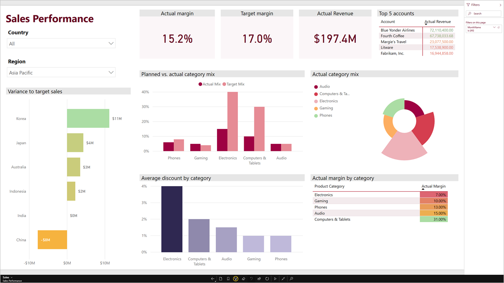
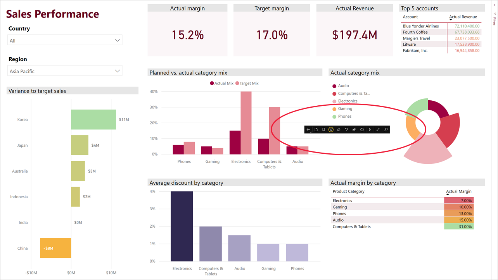

# Ver relatórios e dashboards no modo de apresentação no Surface Hub e em dispositivos com o Windows 10
Pode utilizar o modo de apresentação para ver relatórios e dashboards em ecrã inteiro em dispositivos com o Windows 10 e no Surface Hub. 

O modo de apresentação é útil para mostrar o Power BI numa reunião ou conferência, num projetor de escritório dedicado ou simplesmente para maximizar o espaço num ecrã pequeno. 

Ao utilizar o modo de apresentação na aplicação móvel Power BI para Windows 10, todos os comandos, como as barras de menu e navegação, são removidos para que você e os membros da sua equipa possam concentrar-se nos dados do relatório. É disponibilizada uma barra de ferramentas com ações que lhe permite interagir e colaborar com os seus dados no modo de apresentação.

Pode também [ver dashboards e relatórios em modo de ecrã inteiro a partir do serviço Power BI](../end-user-focus.md) na Web.

> [!NOTE]
> O modo de apresentação é diferente do [modo de detalhe para mosaicos](mobile-tiles-in-the-mobile-apps.md).
> 
> 

## Utilizar o modo de apresentação
Na aplicação móvel Power BI, toque no ícone **Ecrã inteiro** para entrar no modo de ecrã inteiro.
 Os comandos da aplicação desaparecerão e será apresentada uma barra de ferramentas na parte inferior do ecrã ou nos lados direito e esquerdo (consoante o tamanho do seu ecrã).

Na barra de ferramentas, pode realizar as seguintes ações:

1. Toque no ícone Anterior  para voltar à página anterior. Se tocar prolongadamente no ícone, serão apresentadas as janelas de trilhos, permitindo-lhe navegar para a pasta que contém o seu relatório ou dashboard.
2. O ícone Tinta Digital  permite-lhe escolher uma cor quando utilizar a caneta do Surface para desenhar e anotar na página do seu relatório. 
3. Utilize o ícone Páginas  para substituir a página de relatório que está a apresentar.
4. O ícone de reprodução   vai ocultar a barra de ação e iniciar a apresentação de slides, onde a aplicação será automaticamente Rodar entre as páginas de relatório. 
5. Toque no ícone de pesquisa  para procurar outros artefactos no Power BI.
6. Para sair do modo de apresentação, toque no ícone com duas setas voltadas uma para a outra  na barra de ferramentas.

Pode desancorar a barra de ferramentas e arrastá-la para a colocar em qualquer parte do ecrã. Isto é útil para ecrãs grandes, quando quer concentrar-se numa área específica do seu relatório e ter as ferramentas disponíveis próximo dessa área. Basta colocar o dedo na barra de ferramentas e arrastá-la para a tela do relatório.

## Próximos passos
* [Ver dashboards e relatórios em modo de ecrã inteiro a partir do serviço Power BI](../end-user-focus.md)
* Perguntas? [Experimente perguntar à Comunidade do Power BI](http://community.powerbi.com/)

