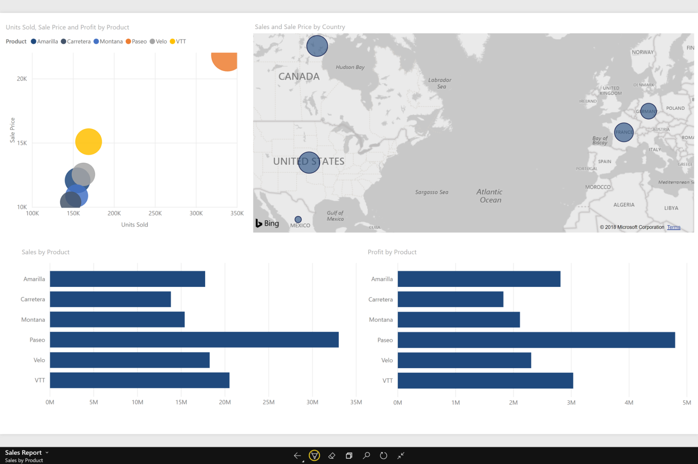

# Ver relatórios no modo de apresentação no Surface Hub e Windows 10 - Power BI
Pode apresentar relatórios no modo de apresentação do Surface Hub e apresentar dashboards, relatórios e mosaicos no modo de ecrã inteiro em dispositivos Windows 10. 

Os modos de apresentação e ecrã inteiro são úteis para mostrar o Power BI numa reunião ou conferência, num projetor de escritório dedicado ou simplesmente para maximizar o espaço num ecrã pequeno. 

No modo de ecrã inteiro, na aplicação móvel do Power BI, todo o "cromado", como as barras de menu e de navegação, será removido, exceto os separadores de páginas e o painel de filtros nos relatórios.

Quando mostrar um relatório em modo de apresentação no Surface Hub, pode desenhar nas páginas com diferentes cores de tinta digital e navegar entre as páginas do relatório.

Pode também [ver dashboards e relatórios em modo de ecrã inteiro a partir do serviço Power BI](../end-user-focus.md) na Web.

> [!NOTE]
> O modo de apresentação é diferente do [modo de detalhe para mosaicos](mobile-tiles-in-the-mobile-apps.md).
> 
> 

## Mostrar dashboards, relatórios e mosaicos em modo de ecrã inteiro
1. Na aplicação móvel do Power BI num dashboard, relatório ou mosaico, toque no ícone de **Ecrã inteiro**  para entrar em modo de ecrã inteiro.
2. No modo de apresentação, pode filtrar um relatório ou procurar outros dashboards e relatórios.
   
    Expanda o painel Filtros para definir ou remover filtros.
   
    
   
     Toque no ícone de pesquisa  para procurar outros dashboards.
   
    
3. Para sair do modo de ecrã inteiro, toque no ícone com duas setas voltadas uma para a outra  que se encontra na barra de ferramentas, ou percorra os dedos da parte superior para baixo e toque nas duas setas voltadas uma para a outra .

## Ativar o modo de apresentação para o Surface Hub
O modo de apresentação está ativado por predefinição no Surface Hub mas, se estiver desativado, pode voltar a ativá-lo.

1. Toque no ícone das Definições  na parte inferior da barra de navegação à esquerda.
2. Toque em **Opções** e, em seguida, deslize a opção **Ativar o modo de apresentação Microsoft Surface Hub** para **Ativado**.
   
    

## Apresentar e desenhar em relatórios no Surface Hub
1. Num relatório, toque no ícone de **Ecrã inteiro**  para aceder ao modo de apresentação do Surface Hub.
   
    Irá ver uma barra de ação minimizável em ambos os lados do ecrã. 
   
   * Para abrir, deslize ou toque na alça.
   * Para fechar, percorra com os dedos ou toque no X na parte superior.
2. Em dispositivos que suportem a escrita com uma caneta, pode começar a escrever imediatamente. 
3. Para alterar a cor da tinta digital, toque na caneta na barra de ação à esquerda ou à direita.
   
    
4. Toque na borracha ou na seta de anular para remover toda ou parte da tinta digital.
5. Toque na seta circular para atualizar os conteúdos do relatório.
6. Toque nas setas laterais para aceder a outras páginas no relatório.
   
    
7. Para sair do modo de ecrã inteiro, percorra os dedos da parte superior para baixo e toque nas duas setas voltadas uma para a outra .

## Próximos passos
* [Ver dashboards e relatórios em modo de ecrã inteiro a partir do serviço Power BI](../end-user-focus.md)
* Perguntas? [Experimente perguntar à Comunidade do Power BI](http://community.powerbi.com/)

