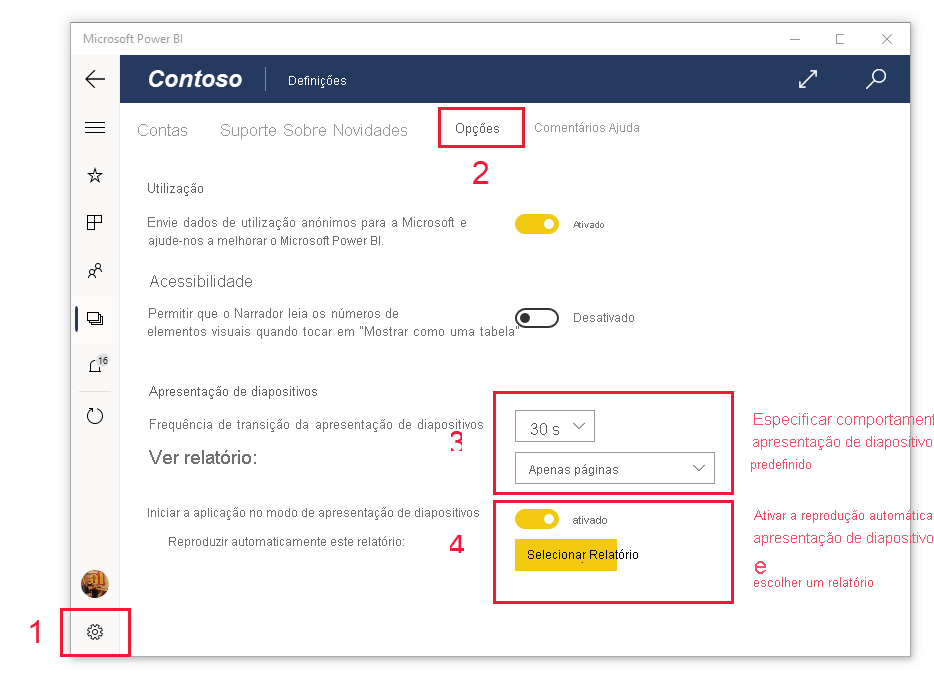

# Ver relatórios e dashboards no modo de apresentação no Surface Hub e em dispositivos com o Windows 10
Pode utilizar o modo de apresentação para ver relatórios e dashboards em ecrã inteiro em dispositivos com o Windows 10 e no Surface Hub. O modo de apresentação é útil para mostrar o Power BI em reuniões ou conferências, num projetor de escritório dedicado ou simplesmente para maximizar o espaço num ecrã pequeno.

No modo de apresentação:
* Todo o “cromado” (como as barras de navegação e de menus) desaparece, o que facilita a concentração nos dados do relatório.
* Fica disponível uma barra de ferramentas de ação para que possa interagir com os dados e controlar a apresentação.
* Pode reproduzir uma apresentação de diapositivos que percorre automaticamente páginas, marcadores ou páginas e marcadores.

>[!NOTE]
>O suporte à aplicação móvel Power BI para **telemóveis com o Windows 10 Mobile** será descontinuado a 16 de março de 2021. [Saiba mais](/legal/powerbi/powerbi-mobile/power-bi-mobile-app-end-of-support-for-windows-phones)

## Utilizar o modo de apresentação
Na aplicação móvel Power BI, toque no ícone **Ecrã inteiro** para entrar no modo de ecrã inteiro.
 O cromado da aplicação desaparece e é apresentada uma barra de ferramentas de ação na parte inferior do ecrã ou nos lados direito e esquerdo (consoante o tamanho do ecrã).

Na barra de ferramentas, pode tocar para realizar as seguintes ações:

| Ícone | Ação |
|------|--------|
||**Voltar** para a página anterior. Se tocar prolongadamente no ícone, são apresentadas as janelas de trilhos, que lhe permitem navegar para a pasta que contém o relatório ou o dashboard.|
||**Mudar para outra página** do relatório na apresentação.|
||**Aplicar um marcador** para apresentar a vista específica dos dados que esse marcador captura. Pode aplicar marcadores pessoais e de relatório.|
||**Escolher uma cor de tinta digital** quando utilizar a caneta para Surface para desenhar e anotar na página de relatório.|
||**Apagar marcas de tinta digital** feitas com a caneta para Surface para desenhar e anotar na página de relatório.          |
||**Repor a vista predefinida** e limpar quaisquer filtros, segmentações de dados ou outras alterações à vista de dados que possa ter feito durante a apresentação.|
||**Partilhar** uma imagem da vista de apresentação com os seus colegas. A imagem irá incluir todas as anotações realizadas com a caneta para Surface durante a apresentação.|
||**Atualizar** o relatório.|
||**Reproduzir a apresentação de diapositivos** ao ocultar a barra de ação e iniciar a apresentação de diapositivos. Um seletor permite-lhe optar por rodar automaticamente entre páginas, marcadores ou páginas e marcadores. Por predefinição, a apresentação de diapositivos roda automaticamente entre páginas uma vez a cada 30 segundos. Pode alterar estas definições em [**Definições > Opções**](#slideshow-settings). Veja [mais detalhes](#slideshows) sobre as apresentações de diapositivos|
||**Sair** do modo de apresentação.|
||**Pesquisar** outros artefactos no Power BI.|

Pode desancorar a barra de ferramentas e arrastá-la e largá-la em qualquer parte do ecrã. Isto é útil para ecrãs grandes, quando quer concentrar-se numa área específica do seu relatório e ter as ferramentas disponíveis próximo dessa área. Basta colocar o dedo na barra de ferramentas e arrastá-la para a tela do relatório.

## Apresentações de diapositivos

Pode reproduzir uma apresentação de diapositivos para percorrer automaticamente a apresentação. Pode definir a apresentação de diapositivos para percorrer páginas, marcadores ou páginas e marcadores. Durante a apresentação de diapositivos, as páginas do relatório com [atualização automática da página](../../create-reports/desktop-automatic-page-refresh.md) vão continuar a ser atualizadas automaticamente conforme configurado, o que garante que são sempre apresentados os dados mais atuais.

Quando selecionar o botão **Reproduzir** na barra de ferramentas de ação, a apresentação de diapositivos será iniciada. Aparece um controlador que lhe permite colocar em pausa a apresentação de diapositivos ou alterar o que está a ser reproduzido: páginas, marcadores ou páginas e marcadores.

 O controlador mostra o nome da vista atualmente apresentada (página ou marcador e página). Na imagem acima, vemos que no relatório chamado **Vendas** , estamos atualmente a ver o marcador **Ásia-Pacífico** na página **Desempenho de Vendas** .

Por predefinição, uma apresentação de diapositivos percorre apenas as páginas, a uma velocidade de uma a cada 30 segundos. Pode altera o comportamento predefinido nas [Definições de apresentação de diapositivos](#slideshow-settings).

### Reproduzir automaticamente uma apresentação de diapositivos ao iniciar

Pode configurar a aplicação móvel Power BI para começar a reproduzir uma apresentação de diapositivos automaticamente sempre que a aplicação for aberta. Esta opção é útil para criar uma experiência de quiosque que executa um relatório em ecrãs públicos sem qualquer intervenção manual. Veja as [Definições de apresentação de diapositivos](#slideshow-settings) para obter detalhes sobre como configurar um relatório para reprodução automática.

### Definições da apresentação de diapositivos

Por predefinição, uma apresentação de diapositivos percorre apenas as páginas, a uma velocidade de uma a cada 30 segundos. Pode alterar este comportamento predefinido em **Definições > Opções** , conforme ilustrado abaixo. Também pode ativar a reprodução automática e escolher um relatório para reprodução.

1. Selecione o ícone das Definições.

1. Abra o separador Opções.

1. Se pretender, altere as predefinições sobre o ciclo da apresentação de diapositivos (páginas, marcadores ou ambos) e a frequência de transição entre diapositivos.

1. Se quiser que o relatório comece a reprodução automaticamente ao abrir a aplicação, ative o botão e selecione **Selecionar Relatório** . Pode procurar os relatórios aos quais tem acesso.

## Próximos passos
* [Ver dashboards e relatórios em modo de ecrã inteiro a partir do serviço Power BI](../end-user-focus.md)
* Perguntas? [Experimente perguntar à Comunidade do Power BI](https://community.powerbi.com/)