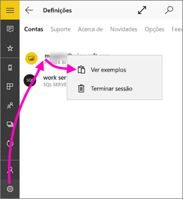

# Introdução à aplicação móvel do Power BI para Windows 10
A aplicação móvel Power BI para Windows 10 traz o Power BI para o seu tablet ou telemóvel. Obtém acesso móvel atualizado e tátil às suas informações empresariais. Veja e interaja com os seus dashboards de empresa de qualquer lugar, diretamente no [ecrã de Início do Windows](mobile-pin-dashboard-start-screen-windows-10-phone-app.md).

Pode [criar dashboards e relatórios no serviço Power BI](../../fundamentals/service-get-started.md) com os seus dados. 

Em seguida, interaja com os seus dashboards e relatórios, explore os dados e partilhe-os, tudo a partir da aplicação móvel do Power BI para Windows 10.

## As coisas mais importantes primeiro
* [**Obtenha a aplicação móvel do Power BI para Windows 10**](https://go.microsoft.com/fwlink/?LinkID=526478) na Windows Store.
  
  O seu dispositivo deve executar o Windows 10. A aplicação funciona em dispositivos com pelo menos 3 GB de RAM e 8 GB de armazenamento interno.

  >[!NOTE]
  >O suporte à aplicação móvel Power BI para **telemóveis com o Windows 10 Mobile** será descontinuado a 16 de março de 2021. [Saiba mais](https://go.microsoft.com/fwlink/?linkid=2121400)
   
* Descubra as [novidades nas aplicações móveis Power BI](mobile-whats-new-in-the-mobile-apps.md).

## Inscrever-se no serviço Power BI na Web
Se ainda não se inscreveu, aceda ao [serviço Power BI](https://powerbi.com/). Inscreva-se numa conta própria, para criar e armazenar dashboards e relatórios, e coloque os seus dados no mesmo local. Em seguida, entre no Power BI do seu dispositivo Windows 10 para ver os seus próprios dashboards, a partir de qualquer lugar.

1. No serviço do Power BI, toque em [Inscrever-se](https://go.microsoft.com/fwlink/?LinkID=513879) para criar uma conta do Power BI.
2. Comece a [criar os seus próprios dashboards e relatórios](../../fundamentals/service-get-started.md).

## Introdução à aplicação Power BI
1. No ecrã Inicial do seu dispositivo Windows 10, abra a aplicação Power BI.
   
   
2. Para ver os seus dashboards e relatórios do Power BI, toque em **Power BI**. Entre com as mesmas credenciais da sua conta do Power BI na Web. 
   
   Para ver os seus relatórios móveis e KPIs do Reporting Services, toque em **SQL Server 2016 Reporting Services**. Inicie sessão com as suas credenciais do SQL Server Reporting Services.
   
   
3. Toque em **Começar a explorar**  para ver os seus próprios dashboards.

## Experimente os exemplos do Power BI e do Reporting Services
Mesmo sem se inscrever, pode experimentar os exemplos do Power BI e do Reporting Services. Depois de transferir a aplicação, pode ver os exemplos ou começar. Volte para os exemplos sempre que quiser, na página inicial dos dashboards.

### Amostras do Power BI
Pode ver e interagir com os exemplos no dashboard do Power BI. No entanto, há coisas que não pode fazer com os mesmos. Não pode abrir os relatórios correspondentes aos dashboards, partilhar os exemplos com outras pessoas ou torná-los favoritos.

1. Toque no botão de navegação global  no canto superior esquerdo.
2. Toque no ícone das **Definições**, toque no seu nome e, em seguida, toque em **Ver exemplos**.
   
   
3. Escolha uma função e explore o dashboard de exemplo para essa função.  
   
   

### Exemplos de relatórios móveis do Reporting Services
1. Toque no botão de navegação global  no canto superior esquerdo.
2. Toque no ícone das **Definições**, clique com o botão direito do rato, ou mantenha premido **Ligar ao servidor** e, em seguida, toque em **Ver exemplos**.
   
   
3. Abra a pasta Relatórios de Revenda ou Relatórios de Vendas para explorar os respetivos KPIs e relatórios móveis.
   
   

## Procurar dashboards, relatórios e aplicações
Encontre os seus dashboards, relatórios e aplicações rapidamente ao escrever na caixa de pesquisa, sempre na parte superior da aplicação.

1. Toque no ícone de pesquisa no canto superior direito.
   
   
   
   O Power BI mostra os seus dashboards, relatórios e aplicações mais recentes.
   
   
2. À medida que começa a escrever, o Power BI apresenta todos os resultados relevantes.
   
   

## Encontre os seus conteúdos nas aplicações móveis do Power BI
Os seus dashboards e relatórios são armazenados em locais diferentes nas aplicações móveis do Power BI, consoante a sua proveniência. Saiba mais sobre [encontrar conteúdos em aplicações móveis](mobile-apps-quickstart-view-dashboard-report.md). Além disso, pode sempre procurar qualquer elemento que tiver nas aplicações móveis do Power BI. 

## Ver os dashboards, KPIs e relatórios favoritos
Ver os seus dashboards favoritos do Power BI, juntamente com relatórios móveis e KPIs do Reporting Services, na página Favoritos nas aplicações móveis. Quando tornar um dashboard *favorito* na aplicação móvel do Power BI, pode aceder ao mesmo em todos os seus dispositivos, incluindo o serviço Power BI no seu browser. 

* Toque em **Favoritos**.
  
   
  
   Os seus favoritos do Power BI e os seus favoritos do portal web do Reporting Services encontram-se nesta página.
  
   

Saiba mais sobre os [favoritos nas aplicações móveis do Power BI](mobile-apps-favorites.md).

## Próximos passos
Eis outras coisas que pode fazer na aplicação do Power BI para dispositivos Windows 10 com dashboards e relatórios no Power BI e relatórios móveis e KPIs do Reporting Services no portal Web do Reporting Services.

### Dashboards e relatórios do Power BI
* Veja [as suas aplicações](../../collaborate-share/service-create-distribute-apps.md).
* Veja os seus [dashboards](mobile-apps-view-dashboard.md).
* [Afixe mosaicos e dashboards do Power BI](mobile-pin-dashboard-start-screen-windows-10-phone-app.md) no ecrã Inicial do dispositivo como mosaicos dinâmicos.
* [Partilhe mosaicos](mobile-windows-10-phone-app-get-started.md).
* Partilhe [dashboards](mobile-share-dashboard-from-the-mobile-apps.md).

### Relatórios móveis e KPIs do Reporting Services
* [Veja KPIs e relatórios móveis do Reporting Services](mobile-app-windows-10-ssrs-kpis-mobile-reports.md) na aplicação Power BI para dispositivos Windows 10.
* Crie [KPIs no portal Web do Reporting Services](https://msdn.microsoft.com/library/mt683632.aspx).
* [Crie os seus próprios relatórios móveis com o Editor de Relatórios Móveis do SQL Server](https://msdn.microsoft.com/library/mt652547.aspx) e publique-os no portal Web do Reporting Services.

## Próximos passos
* [Transferir a aplicação Power BI](https://go.microsoft.com/fwlink/?LinkID=526478) a partir da Windows Store  
* [O que é o Power BI?](../../fundamentals/power-bi-overview.md)
* Perguntas? [Experimente perguntar à Comunidade do Power BI](https://community.powerbi.com/)
