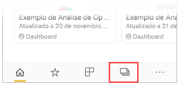
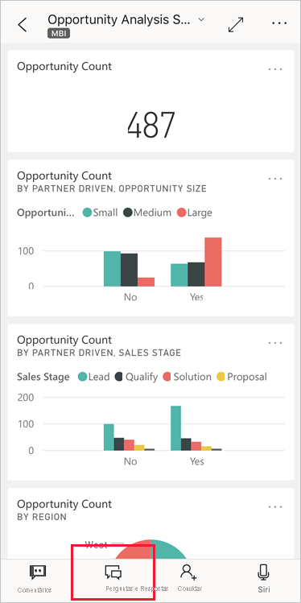
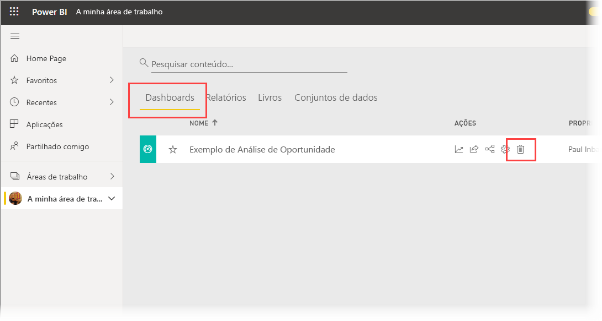
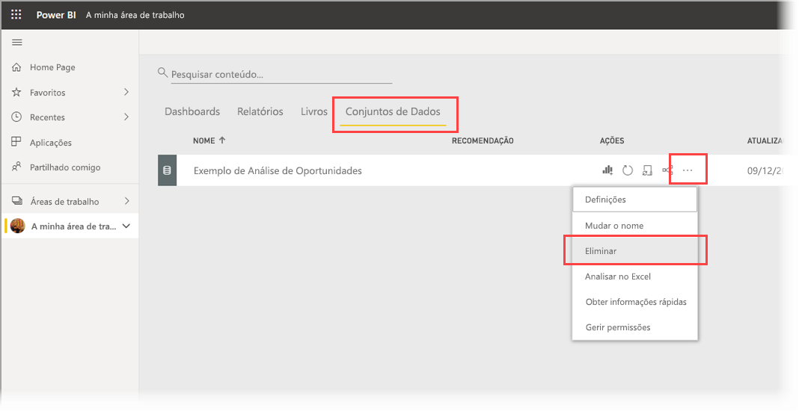

# Tutorial: Fazer perguntas sobre os seus dados com o analista virtual Perguntas e Respostas nas aplicações Power BI para iOS

A forma mais fácil de conhecer os seus dados é fazer perguntas sobre os mesmos por palavras próprias. Neste tutorial, vai fazer perguntas e ver informações em destaque sobre dados de exemplo com o analista virtual Perguntas e Respostas na aplicação móvel Microsoft Power BI no seu iPad ou iPhone. 

Aplica-se a:

|  |  |
|:--- |:--- |
| iPhones |iPads |

O analista virtual Perguntas e Respostas é uma experiência de BI conversacional que acede aos dados subjacentes de Perguntas e Respostas no [serviço Power BI](https://powerbi.com). Sugere-lhe informações de dados e permite-lhe escrever ou falar as suas próprias perguntas.

Neste tutorial, vai:

> [!div class="checklist"]
> * Instalar a aplicação móvel do Power BI para iOS
> * Transferir um dashboard e um relatório de exemplo do Power BI
> * Ver as informações em destaque que a aplicação móvel sugere

## Pré-requisitos

* **Inscrever-se no Power BI**: Se não estiver inscrito no Power BI, [inscreva-se para uma avaliação gratuita](https://app.powerbi.com/signupredirect?pbi_source=web) antes de começar.
* **Instalar a aplicação Power BI para iOS**: [transfira a aplicação para iOS](https://apps.apple.com/app/microsoft-power-bi/id929738808) para o seu iPad, iPhone ou iPod Touch a partir da Apple App Store. As seguintes versões suportam a aplicação Power BI para iOS:
  * iPad com o iOS 11 ou posterior.
  * iPhone 5 e superior com o iOS 11 ou posterior. 
  * iPod Touch com o iOS 11 ou posterior.
* **Transferir dados de exemplo**: o primeiro passo é transferir o **Exemplo de Análise de Oportunidade** para o serviço Power BI. Veja [Downloading samples to My workspace in the Power BI service](./mobile-apps-download-samples.md) (Transferir exemplos para A minha área de trabalho no serviço Power BI) para obter instruções sobre como efetuar este procedimento.

Depois de concluir os pré-requisitos e transferir os dados de exemplo, estará pronto para ver os exemplos no seu dispositivo iOS.

## Experimentar as informações em destaque
1. No seu iPhone ou iPad, abra a aplicação Power BI e inicie sessão com as credenciais da sua conta do Power BI, as mesmas que utilizou no serviço Power BI no browser.

2. Na barra de navegação da home page, toque no ícone **Áreas de Trabalho**.

    

3. Quando a página Áreas de Trabalho for aberta, toque em **As Minhas Áreas de Trabalho** e, em seguida, no dashboard **Exemplo de Análise de Oportunidade** para abri-lo.

3. No dashboard Exemplo de Análise de Oportunidade, toque no ícone do analista virtual Perguntas e Respostas no menu de ação.

    

    O analista virtual Perguntas e Respostas tem algumas sugestões para começar.

    

3. Toque em **informações em destaque**.

4. O analista virtual Perguntas e Respostas sugere algumas informações. Desloque-se para a direita e toque em **Informação 2**.

    

   O analista virtual Perguntas e Respostas mostra a Informação 2.

    

5. Toque no gráfico para abri-lo no modo de detalhe.

    

6. Toque na seta no canto superior esquerdo para voltar à experiência do analista virtual Perguntas e Respostas.

## Limpar recursos

Quando tiver terminado o tutorial, pode eliminar o dashboard, o relatório e o conjunto de dados do exemplo de Análise de Oportunidade.

1. Abra o serviço Power BI ([serviço Power BI](https://app.powerbi.com)) e inicie sessão.

2. Na barra de navegação, selecione **A Minha Área de Trabalho**.

3. Clique no separador Dashboards e, em seguida, na linha Exemplo de Análise de Oportunidade, clique no ícone de caixote do lixo.

    

    Agora, selecione o separador Relatórios e repita o procedimento.

4. Depois, selecione o separador Conjuntos de dados, clique em **Mais opções** (...) e, em seguida, selecione **Eliminar**.

    

## Próximos passos

Já experimentou o assistente virtual Perguntas e Respostas nas aplicações móveis do Power BI para iOS. Leia mais sobre as Perguntas e Respostas no serviço Power BI.
> [!div class="nextstepaction"]
> [Perguntas e Respostas no serviço Power BI](../end-user-q-and-a.md)