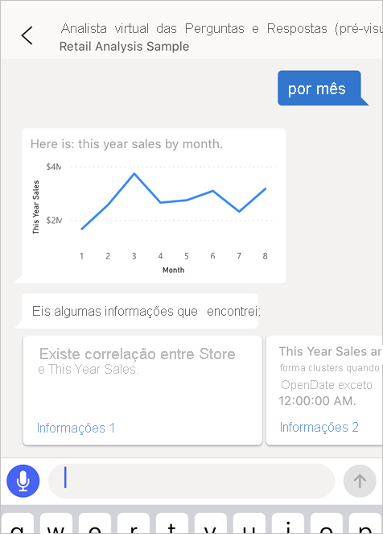
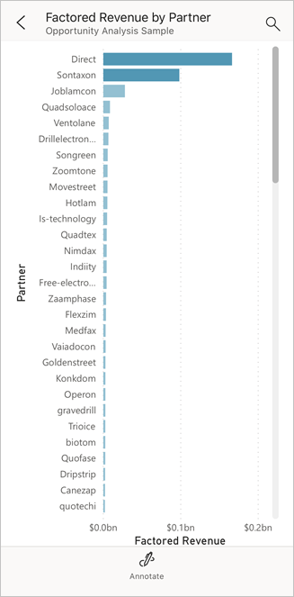

# Tutorial: fazer perguntas sobre os seus dados com o analista virtual Perguntas e Respostas em aplicações iOS – Power BI

A forma mais fácil de conhecer os seus dados é fazer perguntas sobre os mesmos por palavras próprias. Neste tutorial, vai fazer perguntas e ver informações de destaque sobre dados de exemplo com o analista virtual Perguntas e Respostas na aplicação móvel do Microsoft Power BI no iPad, iPhone e iPod Touch. 

Aplica-se a:

|  |  |
|:--- |:--- |
| iPhones |iPads |

O analista virtual Perguntas e Respostas é uma experiência de diálogo para o BI que acede aos dados subjacentes de Perguntas e Respostas no serviço Power BI [(https://powerbi.com)](https://powerbi.com). Sugere-lhe informações de dados e permite-lhe escrever ou falar as suas próprias perguntas.

Neste tutorial, vai:

> [!div class="checklist"]
> * Instalar a aplicação móvel do Power BI para iOS
> * Transferir um dashboard e um relatório de exemplo do Power BI
> * Ver as informações em destaque que a aplicação móvel sugere

Se não estiver inscrito no Power BI, [inscreva-se para uma avaliação gratuita](https://app.powerbi.com/signupredirect?pbi_source=web) antes de começar.

## Pré-requisitos

### Instalar a aplicação Power BI para iOS
[Transfira a aplicação para iOS](http://go.microsoft.com/fwlink/?LinkId=522062 "Transfira a aplicação para iPhone") da Apple App Store para o seu iPad, iPhone ou iPod Touch.

Estas versões suportam a aplicação Power BI para iOS:
- iPad com o iOS 10 ou posterior.
- iPhone 5 e superior com o iOS 10 ou posterior. 
- iPod Touch com o iOS 10 ou posterior.

### Transferir o exemplo de Análise de Oportunidade
O primeiro passo no tutorial é transferir o exemplo de Análise de Oportunidades no serviço Power BI.

1. Abra o serviço Power BI no seu browser (app.powerbi.com) e inicie sessão.

1. Selecione o ícone de navegação global para abrir o painel de navegação à esquerda.

    

2. No painel de navegação à esquerda, selecione **Áreas de Trabalho** > **A Minha Área de Trabalho**.

    

3. No canto inferior esquerdo, selecione **Obter Dados**.
   
    

3. Na página Obter Dados, selecione o ícone **Exemplos**.
   
   

4. Selecione o **Exemplo de Análise de Oportunidade**.
 
    
 
8. Selecione **Ligar**.  
  
   
   
5. O Power BI importa o exemplo e adiciona um novo dashboard, relatório e conjunto de dados a A Minha Área de Trabalho do utilizador.
   
   

OK, está pronto para ver o exemplo no seu dispositivo iOS.

## Experimentar as informações em destaque
1. No seu iPhone ou iPad, abra a aplicação Power BI e inicie sessão com as credenciais da sua conta do Power BI, as mesmas que utilizou no serviço Power BI no browser.

1.  Toque no botão de navegação global  > **Áreas de trabalho** > **A Minha Área de Trabalho** e abra o dashboard Exemplo de Análise de Oportunidade.

2. Toque no ícone do analista virtual Perguntas e Respostas  no menu de ação na parte inferior da página (na parte superior da página num iPad).

     

     O analista virtual Perguntas e Respostas do Power BI tem algumas sugestões para começar.

     
3. Toque em **informações em destaque**.

     O analista virtual Perguntas e Respostas sugere algumas informações.
4. Desloque-se para a direita e toque em **Informação 2**.

    

     O analista virtual Perguntas e Respostas mostra a Informação 2.

    
5. Toque no gráfico para abri-lo no modo de detalhe.

    
6. Toque na seta no canto superior esquerdo para voltar à experiência do analista virtual Perguntas e Respostas.

## Limpar recursos

Quando tiver terminado o tutorial, pode eliminar o dashboard, o relatório e o conjunto de dados do exemplo de Análise de Oportunidade.

1. Abra o serviço Power BI (app.powerbi.com) e inicie sessão.

2. No painel de navegação à esquerda, selecione **Áreas de Trabalho** > **A Minha Área de Trabalho**.

3. No separador **Dashboards**, selecione o ícone **Eliminar** de caixote do lixo junto ao dashboard Análise de Oportunidade.

    

4. Selecione o separador **Relatórios** e faça o mesmo para o relatório de Análise de Oportunidade.

5. Selecione o separador **Conjuntos de dados** e faça o mesmo para o conjunto de dados de Análise de Oportunidade.

## Próximos passos

Já experimentou o assistente virtual Perguntas e Respostas nas aplicações móveis do Power BI para iOS. Leia mais sobre as Perguntas e Respostas no serviço Power BI.
> [!div class="nextstepaction"]
> [Perguntas e Respostas no serviço Power BI](../end-user-q-and-a.md)

