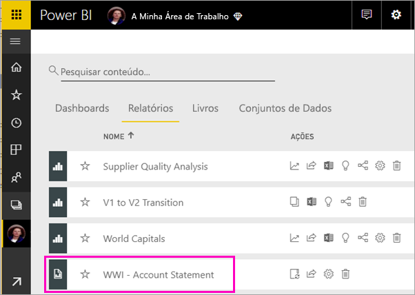
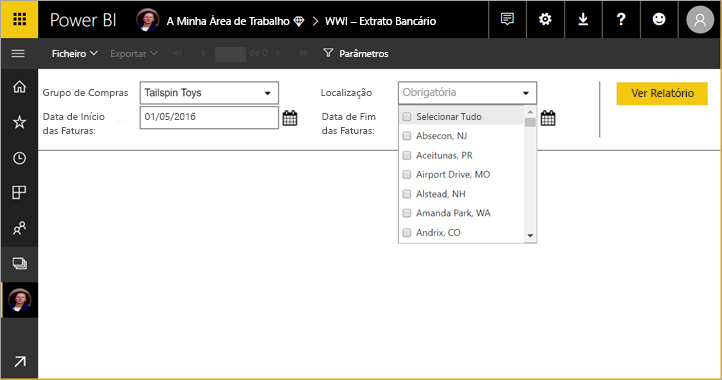
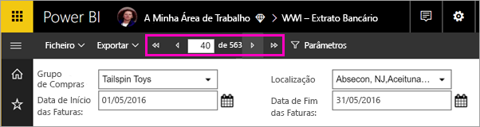
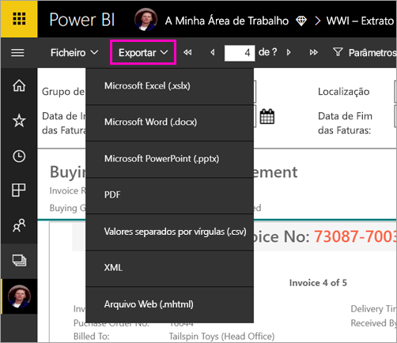

# Visualizar um relatório paginado no serviço Power BI

Neste artigo, vai aprender sobre a visualização de um relatório paginado no serviço Power BI. Os relatórios paginados são relatórios criados no Report Builder e carregados para qualquer área de trabalho numa capacidade Premium. Procure o ícone do losango  junto ao nome da área de trabalho. 

Os relatórios paginados têm um ícone próprio .

Também pode exportar relatórios paginados para vários formatos: 

- Microsoft Excel
- Microsoft Word
- Microsoft PowerPoint
- PDF
- Valores separados por vírgulas
- XML
- Arquivo Web (.mhtml)

## Ver um relatório paginado

1. Selecione o relatório paginado na área de trabalho.

    

2. Se o relatório tiver parâmetros, como este tem, poderá não ver o relatório quando o abrir pela primeira vez. Selecione os parâmetros e, em seguida, **Ver Relatório**. 

     

    Também pode alterar os parâmetros a qualquer momento.

1. Desloque-se através das páginas do relatório ao selecionar as setas na parte superior da página ou ao digitar um número de página na caixa.
    
   

4. Selecione **Exportar** para localizar um formato para exportar os relatórios paginados.

    

## Próximas etapas

[Relatórios paginados no serviço Power BI](end-user-paginated-report.md)
