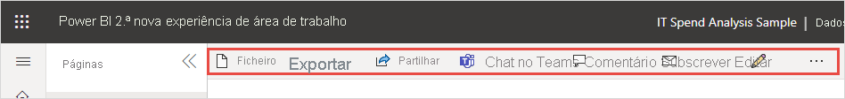

# O "novo aspeto" do serviço Power BI

O serviço Power BI (app.powerbi.com) tem um novo aspeto que facilita a visualização dos seus relatórios e a interação com os mesmos. O novo aspeto é mais simples e baseia-se na sua familiaridade com outros produtos da Microsoft. Fizemos dos conteúdos dos relatórios o principal foco do serviço Power BI, ao atualizarmos os ícones e mudarmos para um tema de cores mais claro. 

Procura informações sobre o novo aspeto do **Power BI Desktop** ? Veja [Utilizar o friso atualizado no Power BI Desktop](../create-reports/desktop-ribbon.md).

Eis uma descrição geral das alterações do novo aspeto. Veja as secções numeradas para obter mais detalhes:

Procura uma ação específica? Veja [The "new look": Where did the actions go?](service-new-look-where-actions.md) (O “novo aspeto”: onde se encontram as ações?)

## 1. Lista vertical de páginas 
Na Vista de leitura, os nomes das páginas do relatório estão incluídos numa lista num painel vertical. Encontram-se destacados para que possa reparar neles facilmente e a navegação é semelhante à do Word ou PowerPoint. Pode aumentar ou diminuir a restante área do relatório: Redimensione o painel vertical ou selecione as setas duplas para o fechar por completo.

Se tiver permissão para editar um relatório, pode defini-lo de modo a que os nomes das páginas estejam na parte inferior, tal como estão na Vista de edição do relatório. Veja [Definir o painel Páginas](../create-reports/power-bi-report-settings.md#set-the-pages-pane) no artigo "Alterar as definições de relatórios do Power BI" para obter mais informações.

## 2. Barra de ação simplificada 

A barra de ação simplificada na parte superior da página apresenta os comandos mais relevantes para os consumidores de relatórios numa posição destacada. É mais fácil exportar, partilhar, conversar no Teams e subscrever. 

## 3. Onde estão os comandos do relatório?

Não removemos nenhuma das funcionalidades do antigo aspeto. Selecione **Mais opções (…)** para outros comandos mais avançados. Veja [O "novo aspeto": onde se encontram as ações?](service-new-look-where-actions.md) para obter mais informações.

## 4. Nova experiência de filtro

Com o novo aspeto, verá o novo painel Filtros do relatório por predefinição. Quando pairar o cursor sobre o ícone de Filtro de um elemento visual, verá todos os filtros e segmentações de dados que afetam esse elemento visual.

## Ver detalhes do relatório 

Veja rapidamente detalhes, como a data da última atualização e as informações de contacto, diretamente na faixa superior.  Abra o menu para ver detalhes adicionais sobre o relatório. Até pode enviar um e-mail ao proprietário do relatório.

## Sem alterações ao modo de edição do relatório 

Mantivemos a experiência de criação semelhante à experiência do Desktop. As alterações do novo aspeto aplicam-se apenas à vista de leitura.

## A experiência do "novo aspeto" do dashboard 

Os dashboards também têm uma barra de ação simplificada. São como relatórios e aplicações, para uma experiência consistente, mas mantêm as diferenças funcionais. Veja onde se encontram agora as ações num dashboard.
 

## Passos seguintes

- [Use the updated ribbon in Power BI Desktop (Utilizar o friso atualizado no Power BI Desktop)](../create-reports/desktop-ribbon.md)
- [Aceitar o “novo aspeto” da área de trabalho](../collaborate-share/service-workspaces-new-look.md)
- [Power BI para consumidores](end-user-consumer.md)
