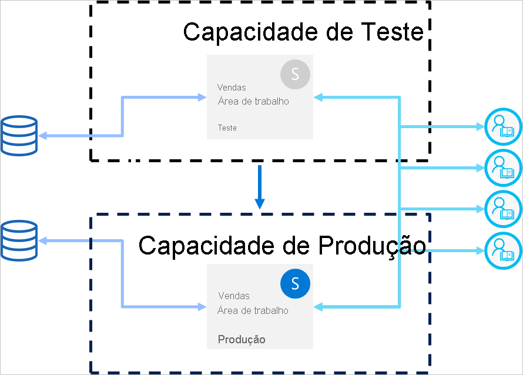

# Deployment pipelines best practices (Melhores práticas dos pipelines de implementação)

Este artigo disponibiliza orientação para os criadores de BI que estão a gerir o conteúdo durante o ciclo de vida. Aborda como tirar partido dos pipelines de implementação como uma ferramenta de gestão do ciclo de vida do conteúdo de BI.

O artigo está dividido em quatro secções:

* **Preparação do conteúdo** – prepare o conteúdo para gestão do ciclo de vida.

* **Desenvolvimento** – conheça as melhores formas de criar conteúdo na fase de desenvolvimento dos pipelines de implementação.

* **Teste** – compreenda como utilizar a fase de teste dos pipelines de implementação para testar o ambiente.

* **Produção** – utilize a fase de produção dos pipelines de implementação ao disponibilizar o conteúdo para consumo.

## Preparação do conteúdo

Prepare o conteúdo para uma gestão contínua durante o ciclo de vida. Reveja as informações nesta secção antes de fazer qualquer uma das seguintes ações:

* Disponibilizar o conteúdo para produção

* Começar a utilizar um pipeline de implementação para uma área de trabalho específica

* Publicar o trabalho

### Tratar cada área de trabalho como um pacote de análise completo

Idealmente, uma área de trabalho deve conter uma vista completa de um aspeto (como departamento, unidade de negócio, projeto ou vertical) da sua organização. Este processo facilita a gestão de permissões dos diferentes utilizadores e permite controlar a disponibilização do conteúdo a toda a área de trabalho de acordo com um agendamento planeado.  

Se estiver a utilizar [conjuntos de dados centralizados](../connect-data/service-datasets-across-workspaces.md) utilizados na organização, recomendamos que crie dois tipos de áreas de trabalho:

* **Áreas de trabalho de dados e modelação** – estas áreas de trabalho irão conter todos os conjuntos de dados centralizados

* **Áreas de trabalho de relatórios** – estas áreas de trabalho irão conter todos os relatórios e dashboards dependentes

### Planear o modelo de permissões

Um pipeline de implementação é um objeto do Power BI com as suas próprias [permissões](deployment-pipelines-process.md#permissions). Além disso, o pipeline contém áreas de trabalho, que têm as suas próprias permissões.

Para implementar um fluxo de trabalho seguro e fácil, planeie quem tem acesso a cada parte do pipeline. Algumas das considerações a ter em conta:

* Quem deve ter acesso ao pipeline?

* Que operações podem os utilizadores com acesso ao pipeline realizar em cada fase?

* Quem está a rever o conteúdo na fase de teste?

* Os revisores da fase de teste devem ter acesso ao pipeline?

* Quem supervisionará a implementação na fase de produção?

* Que área de trabalho está a atribuir?

* A que fase está a atribuir a área de trabalho?

* Tem de fazer alterações às permissões da área de trabalho que está a atribuir?

### Ligar diferentes fases a diferentes bases de dados

Uma base de dados de produção deve ser sempre estável e estar disponível. É melhor não a sobrecarregar com consultas geradas pelos criadores de BI para os conjuntos de dados de desenvolvimento ou teste. Crie bases de dados separadas para as fases de desenvolvimento e de teste. Esta ação ajuda a proteger os dados de produção e não sobrecarrega a base de dados de desenvolvimento com todo o volume de dados de produção, o que pode atrasar o processo.

>[!NOTE]
>Se a sua organização estiver a utilizar [conjuntos de dados centralizados partilhados](../connect-data/service-datasets-share.md), poderá ignorar esta recomendação.

### Utilizar parâmetros no modelo

Como não pode editar as origens de dados dos conjuntos de dados no serviço Power BI, recomendamos a utilização de [parâmetros](/power-query/power-query-query-parameters) para armazenar os detalhes da ligação, como nomes das instâncias e os nomes das bases de dados, em vez de utilizar uma cadeia de ligação estática. Este processo permite-lhe gerir as ligações através do portal Web do serviço Power BI ou [utilizar APIs](/rest/api/power-bi/datasets/updateparametersingroup), numa fase posterior.

Nos pipelines de implementação, pode configurar regras de parâmetros para definir valores específicos para as fases de desenvolvimento, de teste e de produção.

Se não utilizar parâmetros na cadeia de ligação, poderá definir regras de origens de dados para especificar uma cadeia de ligação para um determinado conjunto de dados. No entanto, este procedimento não é suportado para todas as origens de dados nos pipelines de implementação. Para verificar se pode configurar as regras da origem de dados, veja as [limitações das regras de conjuntos de dados](deployment-pipelines-get-started.md#dataset-rule-limitations).

Os parâmetros têm utilizações adicionais, tais como fazer alterações às consultas, aos filtros e ao texto apresentados no relatório.

## Desenvolvimento

Esta secção disponibiliza orientação para trabalhar com a fase de desenvolvimento dos pipelines de implementação.

### Utilizar o Power BI Desktop para editar os relatórios e os conjuntos de dados

Considere o Power BI Desktop como o seu ambiente de desenvolvimento local. O Power BI Desktop permite-lhe experimentar, explorar e rever as atualizações feitas aos relatórios e aos conjuntos de dados. Após a conclusão do trabalho, pode carregar a nova versão para a fase de desenvolvimento. Devido às razões seguintes, é recomendado editar os ficheiros .pbix no Desktop (e não no serviço Power BI):

* Será mais fácil colaborar com os outros criadores no mesmo ficheiro .pbix se todas as alterações estiverem a ser feitas na mesma ferramenta.

 * Fazer alterações online, transferir o ficheiro .pbix e, em seguida, carregá-lo novamente, cria duplicação de relatórios e conjuntos de dados.

* Pode utilizar o controlo de versões para manter os ficheiros .pbix atualizados.

### Controlo de versões dos ficheiros .pbix

Se quiser gerir o histórico de versões dos relatórios e dos conjuntos de dados, utilize a [sincronização automática do Power BI com o OneDrive](../collaborate-share/service-connect-to-files-in-app-workspace-onedrive-for-business.md). Esta funcionalidade manterá os ficheiros atualizados com a versão mais recente. Também lhe permitirá obter versões mais antigas, se necessário.

>[!NOTE]
>Utilize a sincronização automática com o OneDrive (ou qualquer outro repositório) apenas com os ficheiros .pbix na fase de desenvolvimento dos pipelines de implementação. Não sincronize os ficheiros .pbix nas fases de teste e produção dos pipelines de implementação. Esta ação causará problemas na implementação do conteúdo no pipeline.

### Desenvolvimento de modelação separado do desenvolvimento de relatórios e dashboards

Para implementações à escala empresarial, é recomendado separar o desenvolvimento dos conjuntos de dados do desenvolvimento de relatórios e dashboards. Para promover alterações apenas a um relatório ou conjunto de dados, utilize a opção de implementação seletiva dos pipelines de implementação.  

Esta abordagem deve começar no Power BI Desktop, através da criação de um ficheiro .pbix separado para os conjuntos de dados e os relatórios. Por exemplo, pode criar um ficheiro .pbix do conjunto de dados e carregá-lo para a fase de desenvolvimento. Mais tarde, os autores do relatório podem criar um novo .pbix apenas para o relatório e [ligá-lo ao conjunto de dados publicado](../connect-data/service-datasets-discover-across-workspaces.md) com uma ligação em direto. Esta técnica permite que diferentes criadores trabalhem separadamente na modelação e nas visualizações, e as implementem na fase de produção de forma independente.

Também pode utilizar este método em áreas de trabalho com [conjuntos de dados partilhados](../connect-data/service-datasets-share.md).

### Gerir modelos com capacidades de leitura/escrita XMLA

Separar o desenvolvimento de modelação do desenvolvimento de relatórios e dashboards permite-lhe utilizar capacidades avançadas, como o controlo de origens, a intercalação de alterações diferenciais e os processos automatizados. Estas alterações devem ser realizadas na fase de desenvolvimento, de modo a que o conteúdo finalizado possa ser implementados nas fases de teste e de produção. Este processo permite que as alterações passem por um processo unificado com outros itens dependentes, antes de serem implementadas na fase de produção.

Pode separar o desenvolvimento de modelação das visualizações ao gerir um [conjunto de dados partilhado](../connect-data/service-datasets-share.md) numa área de trabalho externa, através das capacidades de leitura/escrita XMLA. O conjunto de dados partilhado pode ligar a vários relatórios em diversas áreas de trabalho geridas em múltiplos pipelines.

## Testar

Esta secção disponibiliza orientação para trabalhar com a fase de teste de pipelines de implementação.

### Simular o ambiente de produção

Além de verificar se os novos relatórios ou dashboards estão corretos, também é importante ver como funcionam do ponto de vista do utilizador final. A fase de teste dos pipelines de implementação permite-lhe simular um ambiente de produção real para fins de teste.

Verifique se estes três fatores são abordados no ambiente de teste:

* Volume de dados

* Volume de utilização

* Uma capacidade semelhante à de produção

Ao testar, pode utilizar a mesma capacidade da fase de produção. No entanto, pode tornar a produção instável durante os testes da carga. Para evitar uma produção instável, utilize outra capacidade semelhante nos recursos para a capacidade de produção, para fins de teste. Para evitar custos adicionais, pode utilizar as [capacidades do Azure](../developer/embedded/azure-pbie-create-capacity.md) para pagar apenas pelo tempo de teste.

### Utilizar as regras de conjuntos de dados com uma origem de dados real

Se estiver a utilizar a fase de teste para simular uma utilização de dados real, será recomendado separar as origens de dados de desenvolvimento e de teste. A base de dados de desenvolvimento deve ser relativamente pequena e a base de dados de teste deve ser tão semelhante quanto possível à base de dados de produção. Utilize as [regras de origens de dados](deployment-pipelines-get-started.md#step-4---create-dataset-rules) para mudar as origens de dados na fase de teste.

Controlar a quantidade de dados que importa da origem de dados será útil se estiver a utilizar uma origem de dados de produção na fase de teste. Para tal, adicione um parâmetro à consulta da origem de dados no Power BI Desktop. Utilize as regras de parâmetros para controlar a quantidade de dados importados ou editar o valor do parâmetro.
Também pode utilizar esta abordagem se não quiser sobrecarregar a sua capacidade.

### Medição do desempenho

Quando simular uma fase de produção, [verifique a carga de relatórios e as interações](../guidance/monitor-report-performance.md), e saiba se foram afetadas pelas alterações realizadas.

Também é necessário [monitorizar a carga na capacidade](../admin/service-admin-premium-monitor-capacity.md), para que possa detetar cargas extremas antes de atingirem a produção.  

>[!NOTE]
>É recomendado monitorizar as cargas de capacidade novamente, depois de implementar atualizações na fase de produção.

### Verificar os itens relacionados

Os itens relacionados podem ser afetados por alterações realizadas a conjuntos de dados ou relatórios. Durante o teste, verifique se as alterações não afetaram ou danificaram o desempenho dos itens existentes, que podem estar dependentes dos itens atualizados.

Pode encontrar facilmente os itens relacionados através da [vista de linhagem](../collaborate-share/service-data-lineage.md) da área de trabalho.

### Testar a aplicação

Se estiver a distribuir conteúdo para os utilizadores finais através de uma aplicação, analise a nova versão da aplicação, antes de estar em produção. Como cada fase do pipeline de implementação tem a sua própria área de trabalho, pode facilmente publicar e atualizar aplicações nas fases de desenvolvimento e teste. Este procedimento irá permitir-lhe testar a aplicação do ponto de vista do utilizador final.

>[!IMPORTANT]
>O processo de implementação não inclui a atualização do conteúdo ou das definições da aplicação. Para aplicar alterações ao conteúdo ou às definições, é necessário atualizar manualmente a aplicação na fase dos pipelines necessária.

## Produção

Esta secção disponibiliza orientação para a fase de produção dos pipelines de implementação.

### Gerir quem pode implementar na fase de produção

Como a implementação na fase de produção deve ser processada atentamente, o ideal é permitir que apenas pessoas específicas possam gerir esta operação sensível. No entanto, provavelmente quer que todos os criadores de BI de uma área de trabalho específica tenham acesso ao pipeline. Esta parte pode ser gerida com as [permissões da área de trabalho](deployment-pipelines-process.md#permissions) de produção.  

Para implementar conteúdo entre as fases, os utilizadores precisam de ter permissões de membro ou de administrador para ambas as fases. Verifique se apenas as pessoas que deseja que implementem na fase de produção têm permissões na área de trabalho de produção. Os outros utilizadores podem ter funções de contribuidor ou de visualizador na área de trabalho de produção. Conseguirão ver o conteúdo no pipeline, mas não poderão implementar nada.

Além disso, deve limitar o acesso ao pipeline ao ativar apenas as permissões do pipeline para os utilizadores que fazem parte do processo de criação de conteúdo.

### Definir regras para garantir a disponibilidade da fase de produção

As [regras de conjuntos de dados](deployment-pipelines-get-started.md#step-4---create-dataset-rules) são uma forma avançada de garantir que os dados em produção estão sempre ligados e disponíveis para os utilizadores. Uma vez aplicadas as regras de conjuntos de dados, as implementações podem ser executadas enquanto tem a garantia de que os utilizadores finais verão as informações relevantes sem perturbações.

Defina regras de conjuntos de dados de produção para as origens de dados e os parâmetros definidos no conjunto de dados.

### Atualizar a aplicação de produção

A implementação num pipeline atualiza o conteúdo da área de trabalho, mas não atualiza automaticamente a aplicação associada. Se estiver a utilizar uma aplicação para a distribuição de conteúdo, não se esqueça de a atualizar depois de ser implementada na fase de produção, para que os utilizadores finais possam utilizar de imediato a versão mais recente.  

### Correções rápidas ao conteúdo

No caso de existirem erros na fase de produção que exijam uma correção rápida, não carregue uma nova versão do .pbix diretamente para a fase de produção nem faça nenhuma alteração online no serviço Power BI. Não será possível implementar retroativamente nas fases de teste e de desenvolvimento se já existir conteúdo nessas fases. Além disso, implementar uma correção sem a testar primeiro é uma má prática. Por conseguinte, a forma correta de tratar este problema é implementar a correção na fase de desenvolvimento e aplicá-la nas restantes fases do pipeline de implementação. Assim, pode verificar se a correção funciona, antes de a implementar na fase de produção. A implementação no pipeline demora apenas alguns minutos.

## Próximos passos

>[!div class="nextstepaction"]
>[Introdução aos pipelines de implementação](deployment-pipelines-overview.md)

>[!div class="nextstepaction"]
>[Começar a utilizar os pipelines de implementação](deployment-pipelines-get-started.md)

>[!div class="nextstepaction"]
>[Compreender o processo dos pipelines de implementação](deployment-pipelines-process.md)

>[!div class="nextstepaction"]
>[Resolução de problemas dos pipelines de implementação](deployment-pipelines-troubleshooting.md)