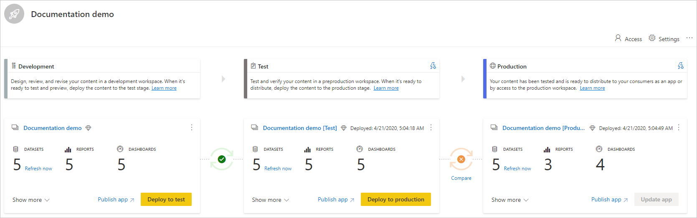

# Começar a utilizar os pipelines de implementação (pré-visualização)

Este artigo explica as definições básicas necessárias para a utilização dos pipelines de implementação.

## Aceder aos pipelines de implementação

Se as seguintes condições forem satisfeitas, conseguirá aceder à funcionalidade dos pipelines de implementação:

* É um [utilizador Pro](../admin/service-admin-purchasing-power-bi-pro.md) do Power BI

* Pertence a uma organização com capacidade Premium

* É administrador de uma [nova experiência de área de trabalho](../collaborate-share/service-create-the-new-workspaces.md)

>[!NOTE]
> Também poderá ver o botão dos pipelines de implementação se tiver criado anteriormente um pipeline ou se tiver sido partilhado consigo um pipeline.

## Passo 1 – Criar um pipeline de implementação

Para criar um pipeline de implementação, faça o seguinte:

1. No serviço Power BI, no painel de navegação, selecione **Pipelines de implementação** e clique em **Criar pipeline**.

2. Na caixa de diálogo *Criar um pipeline de implementação*, introduza um nome e uma descrição para o pipeline e clique em **Criar**.

Após a criação do pipeline, pode partilhá-lo com outros utilizadores ou eliminá-lo. Quando partilhar um pipeline com outras pessoas, os utilizadores com quem o partilhar terão [acesso ao pipeline](deployment-pipelines-process.md#user-with-pipeline-access). O acesso ao pipeline permite aos utilizadores ver, partilhar, editar e eliminar o pipeline.

## Passo 2 – Atribuir uma área de trabalho a um pipeline de implementação

Depois de criar um pipeline, tem de adicionar o conteúdo que quer gerir ao pipeline. A adição de conteúdo ao pipeline é feita ao atribuir uma área de trabalho à fase do pipeline. Pode atribuir uma área de trabalho a qualquer fase. 

Pode atribuir uma área de trabalho a um pipeline de implementação. Os pipelines de implementação irão criar clones do conteúdo da área de trabalho, a utilizar em diferentes fases do pipeline.

Siga estes passos para atribuir uma área de trabalho num pipeline de implementação:

1. No pipeline de implementação recém-criado, clique em **Atribuir uma área de trabalho**.

2. No menu pendente *Escolher a área de trabalho*, selecione a área de trabalho que quer atribuir ao pipeline.

3. Selecione a fase à qual quer atribuir a área de trabalho.

### Limitações de atribuição da área de trabalho

* A área de trabalho tem de ser uma [nova experiência de área de trabalho](../collaborate-share/service-create-the-new-workspaces.md).

* Tem de ser um administrador da área de trabalho.

* A área de trabalho não está atribuída a nenhum outro pipeline.

* A área de trabalho tem de residir numa  [capacidade premium](../admin/service-premium-what-is.md).

* Não pode atribuir uma área de trabalho com [exemplos do Power BI](../create-reports/sample-datasets.md) a uma fase do pipeline.

>[!NOTE]
>Apenas as áreas de trabalho que podem ser utilizadas com pipelines de implementação serão apresentadas na lista de áreas de trabalho que pode selecionar.

## Passo 3 – Implementar numa fase vazia

Qualquer [utilizador Pro](../admin/service-admin-purchasing-power-bi-pro.md) que seja membro ou administrador na área de trabalho de origem pode implementar conteúdo numa fase vazia (uma fase sem conteúdo). A área de trabalho tem de residir numa capacidade para a implementação ser concluída.

Ao implementar conteúdo numa fase vazia, as relações entre os itens são mantidas. Por exemplo, um relatório associado a um conjunto de dados na fase de origem será clonado juntamente com o conjunto de dados e os clones estarão igualmente associados na área de trabalho de destino.

Uma vez concluída a implementação, atualize o conjunto de dados. Para obter mais informações, veja [Implementar conteúdo numa fase vazia](deployment-pipelines-process.md#deploying-content-to-an-empty-stage).

### Implementar todo o conteúdo

Selecione a fase a partir da qual quer implementar e clique no botão de implementação. O processo de implementação cria uma área de trabalho duplicada na fase de destino. Esta área de trabalho inclui todo o conteúdo existente na fase atual.

### Implementação seletiva

Para implementar apenas itens específicos, clique na ligação **Mostrar mais** e selecione os itens que quer implementar. Ao clicar no botão de implementação, apenas os itens selecionados são implementados na fase seguinte.

Uma vez que os dashboards, os relatórios e os conjuntos de dados estão relacionados e têm dependências, pode utilizar o botão Selecionar relacionados para selecionar todos os itens relacionados. Por exemplo, se quiser implementar um relatório na fase seguinte, clicar no botão Selecionar relacionados marcará o conjunto de dados a que o relatório está associado para que ambos sejam implementados em simultâneo e o relatório não falhe.

>[!NOTE]
> * Não poderá implementar um relatório ou dashboard na fase seguinte se os itens dependentes não existirem na fase na qual está a implementar.
> * Poderá obter resultados inesperados se optar por implementar um relatório ou dashboard sem o conjunto de dados. Tal pode acontecer quando o conjunto de dados na fase de destino for alterado e já não for idêntico ao da fase a partir da qual está a implementar.

### Implementação retroativa

Pode optar por implementar numa fase anterior, por exemplo, num cenário em que atribui uma área de trabalho existente a uma fase de produção e, em seguida, a implementa de forma retroativa, primeiro na fase de teste e depois na fase de desenvolvimento.

A implementação numa fase anterior só funcionará se a fase anterior não tiver conteúdo. Ao implementar na fase anterior, não pode selecionar itens específicos. Todo o conteúdo na fase será implementado.

## Passo 4 – Criar regras de conjuntos de dados

Quando utilizar um pipeline de implementação, as várias fases podem ter diferentes configurações. Por exemplo, cada fase pode ter bases de dados ou parâmetros de consulta diferentes. A fase de desenvolvimento pode consultar os dados de exemplo da base de dados, enquanto as fases de teste e produção consultam toda a base de dados.

Quando implementar conteúdo entre as fases do pipeline, a configuração de regras de conjuntos de dados permite-lhe fazer alterações ao conteúdo e manter algumas definições intactas.

As regras de conjuntos de dados são definidas em origens de dados e parâmetros, em cada conjunto de dados. Determinam os valores das origens de dados ou dos parâmetros de um conjunto de dados específico. Por exemplo, se quiser que um conjunto de dados numa fase de produção aponte para uma base de dados de produção, pode definir uma regra para tal. A regra é definida na fase de produção, no conjunto de dados adequado. Uma vez definida a regra, o conteúdo implementado da fase de teste na fase de produção herdará o valor definido nas regras de conjuntos de dados e serão sempre aplicadas desde que a regra permaneça inalterada e válida.

>[!NOTE]
> As regras de conjuntos de dados só funcionam quando os dados de origem e de destino forem do mesmo tipo.

### Criar uma regra de conjunto de dados

1. Na fase do pipeline para a qual quer criar uma regra de conjunto de dados, clique em **Definições de implementação**.

    

2. No painel Definições de implementação, selecione o conjunto de dados para o qual quer criar uma regra.

    

3. Selecione o tipo de regra que quer criar, expanda a lista e clique em **Adicionar regra**.

     

### Tipos de regras de conjuntos de dados

Existem dois tipos de regras que pode criar:

* **Regras de origens de dados** – a lista de origens de dados é obtida do conjunto de dados da fase do pipeline de origem. Na lista de origens de dados, selecione uma origem de dados a substituir. Utilize um dos seguintes métodos para selecionar um valor para substituir o da fase de origem:

    1. Selecione numa lista.

    2. Clique em **Outro** e adicione manualmente a nova origem de dados. Só pode alterar para uma origem de dados do mesmo tipo.

* **Regras de parâmetros** – selecione um parâmetro na lista de parâmetros. É apresentado o valor atual. Edite o valor para o que quer aplicar após cada implementação.

### Limitações das regras de conjuntos de dados

* Tem de ser o proprietário do conjunto de dados para criar uma regra de conjunto de dados.

* As regras de conjuntos de dados não podem ser criadas na fase de desenvolvimento.

* Quando um item é removido ou eliminado, as regras também são eliminadas. Estas regras não podem ser restauradas.

* Se a origem de dados ou os parâmetros definidos numa regra forem alterados ou removidos do conjunto de dados de origem, a regra não será válida e a implementação falhará.

* As regras de origens de dados só podem ser definidas para as seguintes origens de dados:
    * Azure Analysis Services
    * SQL Server Analysis Services (SSAS)
    * Azure SQL Server
    * Servidor SQL
    * Feed OData
    * Oracle
    * SapHana (apenas suportado no modo de importação e não no modo de consulta direta)
    * SharePoint
    * Teradata

    Para outras origens de dados, recomendamos a [utilização de parâmetros para configurar a origem de dados](deployment-pipelines-best-practices.md#use-parameters-in-your-model).

## Passo 5 – Implementar conteúdo de uma fase noutra

Depois de ter conteúdo numa fase do pipeline, pode implementá-lo na fase seguinte. A implementação de conteúdo noutra fase é geralmente feita depois de ter realizado algumas ações no pipeline. Por exemplo, fez alterações de desenvolvimento ao conteúdo na fase de desenvolvimento ou testou o conteúdo na fase de teste. Um fluxo de trabalho típico para mover conteúdo entre fases é da fase de desenvolvimento para a fase de teste e, em seguida, da fase de teste para a fase de produção. Pode obter mais informações sobre este processo na secção [Implementar conteúdo numa área de trabalho existente](deployment-pipelines-process.md#deploy-content-to-an-existing-workspace).

Para implementar conteúdo na fase seguinte do pipeline de implementação, clique no botão Implementar na parte inferior da fase.

Ao consultar os cartões das fases de teste e produção, pode ver a hora da última implementação. É indicada a última vez que o conteúdo foi implementado na fase.

A hora de implementação é útil para saber quando uma fase foi atualizada pela última vez. Também pode ser útil se quiser acompanhar o tempo entre as implementações de teste e de produção.

## Comparar fases

Quando duas fases sequenciais têm conteúdo, o conteúdo é comparado com base nos metadados dos itens de conteúdo. Esta comparação não inclui dados de comparação nem a hora de atualização entre as fases.

 

Para permitir uma rápida perceção visual das diferenças entre duas fases sequenciais, é apresentado um indicador de comparação entre ambas. O indicador de comparação tem dois estados:

* **Indicador verde** – os metadados de cada item de conteúdo em ambas as fases são idênticos.

* **Indicador laranja** – será apresentado se uma das seguintes condições for satisfeita:
    * Alguns dos itens de conteúdo em cada fase foram alterados ou atualizados (têm metadados diferentes).
    * Existe uma diferença no número de itens entre as fases.

Quando duas fases sequenciais não são idênticas, é apresentada uma ligação de **comparação** por baixo do ícone de comparação laranja. Clicar na ligação abre a lista de itens de conteúdo em ambas as fases na Vista de comparação. A Vista de comparação ajuda-o a monitorizar as alterações ou diferenças entre os itens, em cada fase do pipeline. Os itens alterados obtêm uma das seguintes etiquetas:

* **Novo** – um novo item na fase de origem. Trata-se de um item que não existe na fase de destino. Após a implementação, este item será clonado na fase de destino.

* **Diferente** – um item que existe nas fases de origem e destino, em que uma das versões foi alterada após a última implementação. Após a implementação, o item na fase de origem substituirá o item na fase de destino, independentemente do local onde a alteração foi feita.

* **Em falta** – esta etiqueta indica que um item aparece na fase de destino, mas não na fase de origem.

    >[!NOTE]
    >A implementação não afetará os itens *em falta*.

 

## Conteúdo substituído

Quando implementar depois de fazer alterações ao conteúdo na fase de origem, o conteúdo alterado na fase de destino será substituído. Depois de clicar em *Implementar*, receberá um aviso com o número de itens que serão substituídos.

Pode saber mais sobre [os itens que são copiados para a fase seguinte](deployment-pipelines-process.md#deployed-items) e [os itens que não são copiados](deployment-pipelines-process.md#unsupported-items) em [Compreender o processo de implementação](deployment-pipelines-process.md).

## Próximos passos

>[!div class="nextstepaction"]
>[Introdução aos pipelines de implementação](deployment-pipelines-overview.md)

>[!div class="nextstepaction"]
>[Compreender o processo dos pipelines de implementação](deployment-pipelines-process.md)

>[!div class="nextstepaction"]
>[Resolução de problemas dos pipelines de implementação](deployment-pipelines-troubleshooting.md)

>[!div class="nextstepaction"]
>[Melhores práticas dos pipelines de implementação](deployment-pipelines-best-practices.md)
