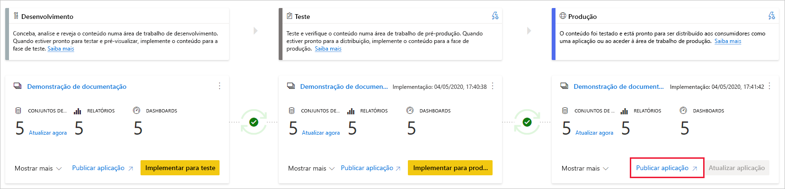
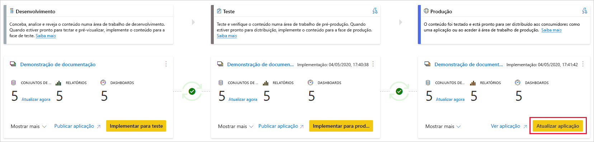

# Compreender o processo de implementação (pré-visualização)

O processo de implementação permite clonar conteúdo de uma fase no pipeline para outra, normalmente da fase de desenvolvimento para a fase de teste e da fase de teste para a fase de produção.

Durante a implementação, o Power BI copia o conteúdo da fase atual para a fase de destino. As ligações entre os itens copiados são mantidas durante o processo de cópia. O Power BI também aplica as regras de conjuntos de dados configuradas ao conteúdo atualizado na fase de destino. A implementação de conteúdo pode demorar, consoante o número de itens que estão a ser implementados. Durante este tempo, pode navegar para outras páginas no portal do Power BI, mas não pode utilizar o conteúdo na fase de destino.

## Implementar conteúdo numa fase vazia

Quando implementa conteúdo numa fase vazia, os metadados dos relatórios, dos dashboards e dos conjuntos de dados na área de trabalho a partir da qual está a implementar são copiados para a fase na qual está a implementar. É criada uma nova área de trabalho numa capacidade Premium para a fase na qual implementou o conteúdo.

Existem duas formas de implementar conteúdo de uma fase para outra. Pode implementar todo o conteúdo ou [selecionar os itens de conteúdo a implementar](deployment-pipelines-get-started.md#selective-deployment).

Também pode implementar conteúdo de forma retroativa, de uma fase posterior no pipeline de implementação para uma anterior.

Depois de concluída a implementação, atualize os conjuntos de dados para que possa utilizar o conteúdo copiado recentemente. A atualização do conjunto de dados é necessária porque os dados não são copiados de uma fase para outra. Para compreender que propriedades dos itens são e não são copiadas durante o processo de implementação, reveja a secção [Propriedades de itens copiadas durante a implementação](#item-properties-copied-during-deployment).

### Criar uma área de trabalho de capacidade Premium

Durante a primeira implementação, os pipelines de implementação verificam se tem permissões de capacidade Premium.  

Se tiver permissões de capacidade, o conteúdo da área de trabalho será copiado para a fase na qual está a implementar e será criada uma nova área de trabalho para essa fase na capacidade Premium.

Se não tiver permissões de capacidade, a área de trabalho será criada, mas o conteúdo não será copiado. Pode pedir a um administrador de capacidade para adicionar a sua área de trabalho a uma capacidade ou solicitar permissões de atribuição para a capacidade. Mais tarde, quando a área de trabalho for atribuída a uma capacidade, poderá implementar conteúdo nesta área de trabalho.

### Propriedade da área de trabalho e do conteúdo

O utilizador que está a fazer a implementação torna-se automaticamente no proprietário dos conjuntos de dados clonados e o único administrador da nova área de trabalho.

## Implementar conteúdo numa área de trabalho existente

A implementação de conteúdo num pipeline de produção em funcionamento, numa fase com uma área de trabalho existente, inclui o seguinte:

* Implementar novo conteúdo como adição a uma fase que já tem conteúdo.

* O novo conteúdo implementado substitui o conteúdo antigo, numa fase atual em funcionamento.

### Processo de implementação

O conteúdo da fase atual é copiado para a fase de destino. O Power BI identifica o conteúdo existente na fase de destino e substitui-o. Para identificar o item de conteúdo que tem de ser substituído, os pipelines de implementação utilizam a ligação entre o item principal e os clones. Esta ligação é mantida quando for criado novo conteúdo. A operação de substituição apenas substitui o conteúdo do item. O ID, o URL e as permissões do item permanecem inalterados.

Na fase de destino, as [propriedades de itens que não são copiadas](deployment-pipelines-process.md#item-properties-that-are-not-copied) permanecem como eram antes da implementação. O novo conteúdo e os novos itens são copiados da fase atual para a fase de destino.

### Atualizar o conjunto de dados

Os dados no conjunto de dados de destino são mantidos sempre que possível. Se não houver alterações num conjunto de dados, os dados serão mantidos como eram antes da implementação.

Com pequenas alterações, como a adição de uma tabela ou medidas, o Power BI mantém os dados originais e a atualização é otimizada para atualizar apenas o que é necessário. Para alterações de esquema interruptivas ou alterações na ligação da origem de dados, é necessária uma atualização completa.

### Requisitos de implementação numa fase com uma área de trabalho existente

Enquanto o conteúdo implementado residir numa [capacidade premium](../admin/service-premium-what-is.md), um utilizador que cumpra as condições seguintes pode implementá-lo numa fase com uma área de trabalho existente:

* [Utilizador Pro](../admin/service-admin-purchasing-power-bi-pro.md), que seja membro ou administrador de ambas as áreas de trabalho nas fases de implementação de origem e destino.

* Proprietário de todos os conjuntos de dados na área de trabalho de destino que estão prestes a ser implementados.

Para obter mais informações, reveja a secção [Permissões](#permissions).

## Itens implementados

Quando implementa conteúdo de uma fase do pipeline para outra, o conteúdo copiado contém os seguintes itens do Power BI:

* Conjuntos de Dados

* Relatórios

* Dashboards

### Itens não suportados

Os pipelines de implementação não suportam os seguintes itens:

* Conjuntos de dados que não tenham origem num .pbix

* Relatórios baseados em conjuntos de dados não suportados

* A área de trabalho não pode utilizar uma aplicação de modelo

* Relatórios paginados

* Fluxos de Dados

* Conjuntos de dados PUSH

* Livros

## Propriedades de itens copiadas durante a implementação

Durante a implementação, as seguintes propriedades de itens são copiadas e substituem as propriedades de itens na fase de destino:

* Origens de dados (são suportadas [regras de conjuntos de dados](deployment-pipelines-get-started.md#step-4---create-dataset-rules))

* Parâmetros (são suportadas [regras de conjuntos de dados](deployment-pipelines-get-started.md#step-4---create-dataset-rules))

* Elementos visuais do relatório

* Páginas do relatório

* Os mosaicos do dashboard

* Metadados do modelo

* Relações de itens

### Propriedades de itens que não são copiadas

As seguintes propriedades de itens não são copiadas durante a implementação:

* Dados – os dados não são copiados, apenas os metadados

* URL

* ID

* Permissões – para uma área de trabalho ou um item específico

* Definições da área de trabalho – cada fase tem a sua própria área de trabalho

* Conteúdo e definições de aplicações – para implementar as aplicações, veja [Implementar aplicações do Power BI](#deploying-power-bi-apps)

As propriedades de conjuntos de dados seguintes também não são copiadas durante a implementação:

* Atribuição de função
    
* Agenda de atualizações
    
* Credenciais da origem de dados
    
* Definições de colocação em cache de consultas (podem ser herdadas da capacidade)
    
* Definições de endossamento

## Implementar aplicações do Power BI

As [aplicações do Power BI](../consumer/end-user-apps.md) são a forma recomendada de distribuir conteúdo aos consumidores do Power BI gratuito. Com os pipelines de implementação, pode gerir as aplicações do Power BI num pipeline de implementação para ter mais controlo e flexibilidade no que diz respeito ao ciclo de vida da aplicação.

Crie uma aplicação para cada fase do pipeline de implementação, para que possa testar cada atualização da aplicação do ponto de vista do utilizador final. Um pipeline de implementação permite-lhe gerir este processo facilmente. Utilize o botão de publicação ou visualização no cartão da área de trabalho para publicar ou ver a aplicação numa fase específica do pipeline.

Na fase de produção, o botão de ação principal no canto inferior esquerdo abre a página Atualizar aplicação no Power BI, para que quaisquer atualizações de conteúdo fiquem disponíveis para os utilizadores da aplicação.

>[!IMPORTANT]
>O processo de implementação não inclui a atualização do conteúdo ou das definições da aplicação. Para aplicar alterações ao conteúdo ou às definições, tem de atualizar manualmente a aplicação na fase dos pipelines necessária.

## Permissões

As permissões dos pipelines e as permissões das áreas de trabalho são concedidas e geridas separadamente. Por exemplo, um utilizador com acesso ao pipeline que não tenha permissões para a área de trabalho pode ver o pipeline e partilhá-lo com outras pessoas. No entanto, este utilizador não pode ver o conteúdo da área de trabalho no pipeline nem na página da área de trabalho e não pode fazer implementações.

### Utilizador com acesso ao pipeline

Os utilizadores com acesso ao pipeline têm as seguintes permissões:

* Ver o pipeline
    
* Partilhar o pipeline com outras pessoas
    
* Editar e eliminar o pipeline

>[!NOTE]
>O acesso ao pipeline não concede permissões para ver ou realizar ações no conteúdo da área de trabalho.

### Visualizador da área de trabalho

Os visualizadores da área de trabalho com *acesso ao pipeline* também podem fazer o seguinte:

* Consumir conteúdo

>[!NOTE]
>Os visualizadores da área de trabalho não podem aceder ao conjunto de dados nem editar o conteúdo da área de trabalho.

### Contribuidor da área de trabalho

Os contribuidores da área de trabalho com *acesso ao pipeline* também podem fazer o seguinte:

* Consumir conteúdo

* Comparar fases

* Ver conjuntos de dados

### Membro da área de trabalho

Os membros da área de trabalho com *acesso ao pipeline* também podem fazer o seguinte:

* Ver o conteúdo da área de trabalho
    
* Comparar fases
    
* Implementar relatórios e dashboards

* Remover áreas de trabalho

### Administrador da área de trabalho

Os administradores da área de trabalho com *acesso ao pipeline* podem realizar as ações do *membro da área de trabalho* e também fazer o seguinte:

* Atribuir áreas de trabalho

* Remover áreas de trabalho

### Proprietário dos conjuntos de dados

Os proprietários dos conjuntos de dados que sejam membros ou administradores da área de trabalho também podem fazer o seguinte:

* Atualizar conjuntos de dados
    
* Configurar regras

>[!NOTE]
>Esta secção descreve as permissões do utilizador nos pipelines de implementação. As permissões listadas nesta secção podem ter aplicações diferentes noutras funcionalidades do Power BI.

## Limitações

Esta secção lista a maioria das limitações nos pipelines de implementação.

* A área de trabalho tem de residir numa  [capacidade premium](../admin/service-premium-what-is.md).

* Os itens do Power BI, como relatórios e dashboards com [etiquetas de confidencialidade](../admin/service-security-sensitivity-label-overview.md), não podem ser implementados.

* O número máximo de itens do Power BI que podem ser implementados numa única implementação é de 300.

* Para obter uma lista das limitações da área de trabalho, veja [Limitações de atribuição da área de trabalho](deployment-pipelines-get-started.md#workspace-assignment-limitations).

* Para obter uma lista de itens não suportados, veja [Itens não suportados](#unsupported-items).

### Limitações dos conjuntos de dados

* Os conjuntos de dados configurados com a [atualização incremental](../admin/service-premium-incremental-refresh.md) não podem ser implementados.

* Os conjuntos de dados que utilizam conectividade de dados em tempo real não podem ser implementados.

* Durante a implementação, se o conjunto de dados de destino estiver a utilizar uma [ligação em direto](../connect-data/desktop-report-lifecycle-datasets.md), o conjunto de dados de origem também terá de utilizar este modo de ligação.

* Após a implementação, não será suportada a transferência de um conjunto de dados (a partir da fase na qual foi implementado).

* Para obter uma lista das limitações das regras de conjuntos de dados, veja [Limitações das regras de conjuntos de dados](deployment-pipelines-get-started.md#dataset-rule-limitations).

## Próximos passos

>[!div class="nextstepaction"]
>[Introdução aos pipelines de implementação](deployment-pipelines-overview.md)

>[!div class="nextstepaction"]
>[Melhores práticas dos pipelines de implementação](deployment-pipelines-best-practices.md)

>[!div class="nextstepaction"]
>[Começar a utilizar os pipelines de implementação](deployment-pipelines-get-started.md)

>[!div class="nextstepaction"]
>[Resolução de problemas dos pipelines de implementação](deployment-pipelines-troubleshooting.md)