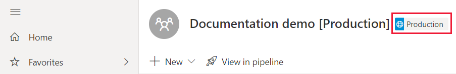

# Resolução de problemas dos pipelines de implementação

Utilize este artigo para resolver problemas em pipelines de implementação.

## Geral

### O que são os pipelines de implementação no Power BI?

Para compreender o que são os pipelines de implementação no Power BI, veja a [descrição geral dos pipelines de implementação](deployment-pipelines-overview.md).

### Como posso começar a utilizar os pipelines de implementação?

Comece a utilizar os pipelines de implementação com as [instruções de introdução](deployment-pipelines-get-started.md).

### Por que não consigo ver o botão dos pipelines de implementação?

Se as seguintes condições não forem satisfeitas, não conseguirá ver o botão dos pipelines de implementação.

* É um [utilizador Pro](../admin/service-admin-purchasing-power-bi-pro.md) do Power BI

* Pertence a uma organização com capacidade Premium

* Uma área de trabalho só pode ser atribuída a um único pipeline

* É administrador de uma área de trabalho nova.

### Por que não consigo ver a etiqueta das fases do pipeline na minha área de trabalho?

Os pipelines de implementação apresentam uma etiqueta das fases do pipeline nas áreas de trabalho atribuídas a um pipeline. As etiquetas das fases de *Desenvolvimento* e de *Teste* estão sempre visíveis. No entanto, só verá a etiqueta de *Produção* se tiver [acesso ao pipeline](deployment-pipelines-process.md#user-with-pipeline-access) ou se for [administrador da área de trabalho](deployment-pipelines-process.md#workspace-admin).

> [!div class="mx-imgBorder"]
> 

## Licensing

### Que licenças são necessárias para trabalhar com os pipelines de implementação?

Para utilizar os pipelines de implementação, tem de ser um [utilizador Pro](../admin/service-admin-purchasing-power-bi-pro.md) com [capacidade Premium](../admin/service-premium-what-is.md). Para obter mais informações, veja como [aceder aos pipelines de implementação](deployment-pipelines-get-started.md#accessing-deployment-pipelines).

### Que tipo de capacidade posso atribuir a uma área de trabalho num pipeline?

Todas as áreas de trabalho num pipeline de implementação têm de residir dentro de uma capacidade dedicada para que o pipeline esteja funcional. No entanto, pode utilizar diferentes capacidades para diferentes áreas de trabalho num pipeline. Também pode utilizar diferentes tipos de capacidade para diferentes áreas de trabalho no mesmo pipeline.

Para desenvolvimento e teste, pode utilizar a capacidade A ou EM juntamente com uma conta Pro do Power BI para cada utilizador.

Para áreas de trabalho de produção, precisa de uma capacidade P. Se for um ISV que distribui conteúdo através de aplicações incorporadas, também poderá utilizar as capacidades A ou EM para produção.

## Parte Técnica

### Por que não consigo ver todas as minhas áreas de trabalho quando tento atribuir uma área de trabalho a um pipeline?

Para atribuir uma área de trabalho a um pipeline, têm de ser satisfeitas as seguintes condições:

* A área de trabalho tem de ser uma [nova experiência de área de trabalho](../collaborate-share/service-create-the-new-workspaces.md)

* É um administrador da área de trabalho

* A área de trabalho não está atribuída a nenhum outro pipeline

* A área de trabalho reside numa [capacidade premium](../admin/service-premium-what-is.md)

As áreas de trabalho que não satisfaçam estas condições não são apresentadas na lista de áreas de trabalho que pode selecionar.

### Como posso atribuir áreas de trabalho a todas as fases num pipeline?

Pode atribuir uma área de trabalho por pipeline. Depois de uma área de trabalho ser atribuída a um pipeline, pode implementá-la nas próximas fases do pipeline. Durante a primeira implementação, é criada uma nova área de trabalho com cópias dos itens na fase de origem. As relações dos itens copiados são mantidas. Para obter mais informações, veja como [atribuir uma área de trabalho a um pipeline de implementação](deployment-pipelines-get-started.md#step-2---assign-a-workspace-to-a-deployment-pipeline).

### Porque é que a minha primeira implementação falhou?

A primeira implementação pode ter falhado devido a várias razões. Veja na tabela abaixo algumas das razões.

|Erro  |Ação  |
|---------|---------|
|Não tem [permissões de capacidade premium](deployment-pipelines-process.md#creating-a-premium-capacity-workspace).     |Para obter permissões de capacidade premium, peça a um administrador de capacidade para adicionar a sua área de trabalho a uma capacidade ou solicite permissões de atribuição para a capacidade. Depois de a área de trabalho estar numa capacidade, implemente-a novamente.        |
|Não tem permissões para a área de trabalho.     |Para implementar, tem de ser membro da área de trabalho. Peça ao administrador da área de trabalho para lhe conceder as permissões adequadas.         |
|O administrador do Power BI desativou a criação de áreas de trabalho.     |Contacte o administrador do Power BI para obter suporte.         |
|A área de trabalho não é uma [nova experiência de área de trabalho](../collaborate-share/service-create-the-new-workspaces.md).     |Crie o conteúdo na nova experiência de área de trabalho. Se tiver conteúdo numa área de trabalho clássica, pode [atualizá-lo](../collaborate-share/service-upgrade-workspaces.md) para uma nova experiência de área de trabalho.         |
|Está a utilizar uma [implementação seletiva](deployment-pipelines-get-started.md#selective-deployment) e não está a selecionar o conjunto de dados do conteúdo.     |Faça um dos seguintes:   Desmarque o conteúdo associado ao conjunto de dados. O conteúdo não selecionado (como relatórios ou dashboards) não será copiado para a fase seguinte.   Selecione o conjunto de dados associado ao conteúdo selecionado. O conjunto de dados será copiado para a fase seguinte.         |

### Estou a receber um aviso de que tenho “artefactos não suportados” na minha área de trabalho quando estou a tentar implementar. Como posso saber que artefactos não são suportados?

Para obter uma lista completa dos itens e artefactos não suportados nos pipelines de implementação, veja as seguintes secções:

* [Itens não suportados](deployment-pipelines-process.md#unsupported-items)

* [Propriedades de itens que não são copiadas](deployment-pipelines-process.md#item-properties-that-are-not-copied)

### Porque é que a minha implementação falhou devido a regras quebradas?

Se tiver problemas em configurar as regras de conjuntos de dados, veja [regras de conjuntos de dados](deployment-pipelines-get-started.md#step-4---create-dataset-rules), e siga as [limitações das regras de conjuntos de dados](deployment-pipelines-get-started.md#dataset-rule-limitations).

Se a implementação tiver sido anteriormente bem-sucedida e de repente falhar com regras quebradas, poderá ser devido à nova publicação de um conjunto de dados. As alterações seguintes ao conjunto de dados de origem resultam numa implementação com falhas:

**Regras de parâmetros**

* Um parâmetro removido

* Um nome de parâmetro alterado

**Regras de origens de dados**

Faltam valores nas regras do conjunto de dados. Este erro poderá ocorrer se o conjunto de dados tiver sido alterado.

Quando uma implementação anteriormente bem-sucedida falhar devido a ligações quebradas, é apresentado um aviso. Pode selecionar **Configurar regras** para navegar para o painel de definições de implementação, onde o conjunto de dados com falha está marcado. Quando seleciona o conjunto de dados, as regras quebradas estão marcadas.

Para implementar com êxito, corrija ou remova as regras quebradas e volte a implementar.

### Como posso alterar a origem de dados nas fases do pipeline?

Não pode alterar a ligação da origem de dados no serviço Power BI.

Se quiser alterar a origem de dados nas fases de teste ou de produção, poderá utilizar as [regras de conjuntos de dados](deployment-pipelines-get-started.md#step-4---create-dataset-rules) ou as [APIs](/rest/api/power-bi/datasets/updateparametersingroup). As regras de conjuntos de dados só entrarão em vigor após a próxima implementação.

### Corrigi um erro na produção, mas agora não consigo selecionar o botão para implementar na fase anterior. Por que está a cinzento?

Só pode implementar retroativamente numa fase vazia. Se tiver conteúdo na fase de teste, não poderá implementar retroativamente a partir da produção.

Depois de criar o pipeline, utilize a fase de desenvolvimento para desenvolver o conteúdo e as fases de teste para o rever e testar. Pode corrigir os erros nestas fases e, em seguida, implementar o ambiente fixo na fase de produção.

>[!NOTE]
>A implementação retroativa apenas suporta a [implementação total](deployment-pipelines-get-started.md#deploying-all-content). Não suporta a [implementação seletiva](deployment-pipelines-get-started.md#selective-deployment)

### Os pipelines de implementação suportam várias áreas geográficas?

São suportadas várias áreas geográficas. Pode demorar mais tempo a implementar conteúdo entre fases em diferentes áreas geográficas.

## Permissões

### Qual é o modelo de permissões dos pipelines de implementação?

O modelo de permissões dos pipelines de implementação está descrito na secção [Permissões](deployment-pipelines-process.md#permissions).

### Quem pode implementar conteúdo entre fases?

O conteúdo pode ser implementado numa fase vazia ou numa fase com conteúdo. O conteúdo tem de residir numa [capacidade premium](../admin/service-premium-what-is.md).

* **Implementar numa fase vazia** – qualquer [utilizador Pro](../admin/service-admin-purchasing-power-bi-pro.md) que seja membro ou administrador na área de trabalho de origem.

* **Implementar numa fase com conteúdo** – qualquer [utilizador Pro](../admin/service-admin-purchasing-power-bi-pro.md) que seja membro ou administrador de ambas as áreas de trabalho nas fases de implementação de origem e destino.

* **Substituir um conjunto de dados** – a implementação substitui cada conjunto de dados incluído na fase de destino, mesmo que o conjunto de dados não tenha sido alterado. O utilizador tem de ser o proprietário de todos os conjuntos de dados da fase de destino especificados na implementação.

### De que permissões preciso para configurar as regras de conjuntos de dados?

Para configurar as regras de conjuntos de dados em pipelines de implementação, tem de ser o proprietário do conjunto de dados.

### Por que não consigo ver áreas de trabalho no pipeline?

As permissões de pipeline e área de trabalho são geridas separadamente. Pode ter permissões de pipeline, mas não permissões de área de trabalho. Para obter mais informações, reveja a secção [Permissões](deployment-pipelines-process.md#permissions).

## Próximos passos

>[!div class="nextstepaction"]
>[Introdução aos pipelines de implementação](deployment-pipelines-overview.md)

>[!div class="nextstepaction"]
>[Começar a utilizar os pipelines de implementação](deployment-pipelines-get-started.md)

>[!div class="nextstepaction"]
>[Compreender o processo dos pipelines de implementação](deployment-pipelines-process.md)

>[!div class="nextstepaction"]
>[Melhores práticas dos pipelines de implementação](deployment-pipelines-best-practices.md)
