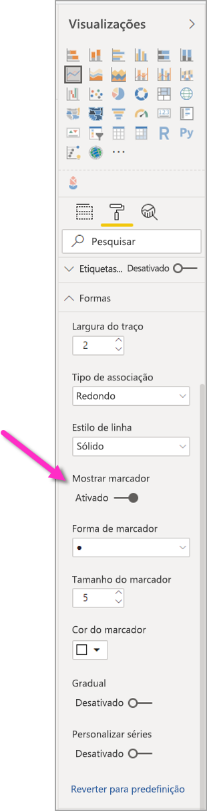

# Criar relatórios do Power BI para acessibilidade
Pode conceber e criar relatórios apelativos não negligenciando a acessibilidade. Sempre que criar um relatório, independentemente da audiência a que se destina, deve criá-lo para ser utilizável pelo máximo número de pessoas possível, sem necessidade de ser adaptado a um tipo de conceção especial.

Este artigo descreve as funcionalidades e ferramentas de acessibilidade para criar relatórios acessíveis no Power BI.

De uma forma geral, ao utilizar o Power BI com um leitor de ecrã, recomendamos que desligue o modo de análise ou o modo de procura.

Para otimizar o processo de criação de relatórios com leitores de ecrã, está disponível um menu de contexto. Este menu permite mover campos na secção para cima ou para baixo na lista **Campos**. Também permite mover o campo para outras secções, como **Legenda**, **Valor**, entre outras.

## Tipos de funcionalidades de acessibilidade

O Power BI proporciona capacidade para criar relatórios acessíveis, mas, enquanto autor do relatório, cabe-lhe a si incorporar essa acessibilidade nos seus relatórios. Este artigo descreve três categorias de funcionalidades de acessibilidade:

* Funcionalidades de acessibilidade incorporadas (nenhuma configuração necessária)
* Funcionalidades de acessibilidade incorporadas (configuração necessária)
* Outras sugestões e considerações

Falaremos sobre cada uma destas categorias nas secções que se seguem.

## Funcionalidades de acessibilidade incorporadas

O Power BI dispõe de funcionalidades de acessibilidade incorporadas no produto, que não exigem qualquer configuração da parte do autor do relatório. Essas funcionalidades são as seguintes:

* Navegação através do teclado
* Compatibilidade com o leitor de ecrã
* Vista com cores de alto contraste
* Modo de detalhe
* Mostrar tabela de dados

Também há funcionalidades que ajudam com a experiência de consumo de relatórios. Os artigos que descrevem essas funcionalidades podem ser consultados na secção [Próximos passos](#next-steps), no final deste artigo.

Vamos analisar cada uma destas funcionalidades de acessibilidade incorporadas. 

### Navegação através do teclado

Enquanto autor de um relatório, não precisa de se preocupar se os seus consumidores podem ou não utilizar o teclado para navegar num relatório. Os elementos visuais do Power BI são todos navegáveis por teclado, pelo que o consumidor dos seus relatórios pode percorrer os pontos de dados nos elementos visuais, mudar de separador de página e ter acesso a capacidades interativas, incluindo o realce cruzado, a filtragem e a segmentação de dados.

Quando o consumidor de um relatório navega num relatório, o foco é apresentado para indicar em que ponto do relatório é que o utilizador se encontra. Dependendo do browser que estiver a utilizar, o modo de detalhe pode ser diferente.

Para aceder aos atalhos de teclado mais utilizados, pode premir *?* para ver uma caixa de diálogo com os atalhos de teclado. Para saber mais, veja estes artigos sobre experiências de consumo acessíveis e atalhos de teclado na secção [Próximos passos](#next-steps) no final deste artigo.

### Compatibilidade com o leitor de ecrã

Em geral, cada objeto no Power BI que tenha navegação por teclado também é compatível com leitores de ecrã. Quando o consumidor de um relatório navega para um elemento visual, o leitor de ecrã lê em voz alta o título, o tipo de elemento visual e qualquer texto alternativo, caso tenha sido definido.

### Vista com cores de alto contraste

O Power BI dispõe de suporte de alto contraste para os relatórios. Se utilizar um modo de alto contraste no Windows, o Power BI Desktop deteta automaticamente qual o tema de alto contraste que está a ser utilizado no Windows e aplica essas definições aos seus relatórios. Essas cores de alto contraste são mantidas no relatório quando for publicado no serviço Power BI ou noutro local.

O serviço Power BI também tenta detetar as definições de alto contraste selecionadas para o Windows, mas a eficácia e precisão dessa deteção depende do browser que está a ser utilizado para o serviço Power BI. Se quiser definir o tema manualmente no serviço Power BI, no canto superior direito, pode selecionar **V > Cores de alto contraste** e, em seguida, selecionar o tema que pretende aplicar ao relatório.

### Modo de detalhe
Se o consumidor de um relatório estiver a analisar um elemento visual num dashboard, pode expandir o elemento visual de modo a preencher mais o ecrã ao navegar até ao menu de contexto do elemento visual e selecionar **Abrir no modo de detalhe**.

### Mostrar tabela de dados
Os consumidores de relatórios também podem ver os dados de um elemento visual no formato tabular ao premir **Alt+Shift+F11**. Esta tabela é semelhante à que surge quando se prime o botão **Mostrar Dados** no menu de contexto do elemento visual, mas é uma tabela compatível com leitores de ecrã.

## Funcionalidades de acessibilidade incorporadas de configuração necessária

O Power BI dispõe de funcionalidades de acessibilidade que estão incorporadas no produto e que exigem configuração da parte do autor do relatório.  Essas funcionalidades incluem:

* Texto alternativo
* Ordem de tabulação
* Títulos e etiquetas
* Marcadores
* Temas de relatório

## Texto alternativo

O texto alternativo (descrições de texto alternativo) é utilizado para descrever o aspeto e a função de elementos visuais e imagens na página do relatório para os utilizadores de leitor de ecrã. Os autores de relatórios devem adicionar texto alternativo a todos os objetos que transmitam informações significativas num relatório. A disponibilização de texto alternativo garante que os consumidores do seu relatório compreendem o que está a tentar comunicar com um elemento visual, mesmo que não consigam ver o elemento visual, imagem, forma ou caixa de texto. Pode fornecer texto alternativo para qualquer objeto num relatório do Power BI Desktop. Para isso, selecione o objeto (por exemplo, um elemento visual, forma, etc.) e, no painel **Visualizações**, selecione a secção **Formato**, expanda **Geral**, desloque-se para a parte inferior e preencha a caixa de texto **Texto Alternativo**. A caixa de texto **Texto Alternativo** tem um limite de 250 carateres.

O texto alternativo deve incluir informações que gostaria que o consumidor do relatório retirasse de um elemento visual. Dado que um leitor de ecrã lê em voz alta o título e o tipo de elemento visual, só tem de preencher uma descrição. Um exemplo de texto alternativo para o seguinte elemento visual podia ser: *Satisfação efetiva dos utilizadores por cor do produto vendido, segmentada ainda por classe de produto.*

Lembre-se de que indicar informações ou determinados pontos de dados por voz pode não ser a melhor opção para o texto alternativo estático porque, no Power BI, os dados são dinâmicos. Se quiser utilizar texto alternativo dinâmico, veja a secção seguinte que descreve a formatação condicional para o texto alternativo.

### Formatação condicional para texto alternativo

Uma funcionalidade que torna o Power BI tão apelativo é que os dados são dinâmicos. Pode utilizar medidas DAX e formatação condicional para criar texto alternativo dinâmico. Desse modo, os leitores de ecrã conseguem ler em voz alta valores específicos dos dados que o consumidor do relatório está a ver.

### Ordem de tabulação
Definir a ordem de tabulação ajuda os utilizadores do teclado a navegar no relatório pela ordem que corresponde à forma como os utilizadores processam visualmente os elementos visuais do relatório. Se incluir formas e imagens decorativas no relatório, deve removê-las da ordem de tabulação. 

Para definir a ordem de tabulação, selecione o separador **Ver** no friso e selecione o botão **Painel de Seleção** para ver o painel de seleção.

No painel **Seleção**, se selecionar **Ordem de tabulação**, é apresentada a ordem de tabulação atual do relatório. Pode selecionar um objeto e, em seguida, utilizar os botões de seta para cima e seta para baixo para mover o objeto na hierarquia. Em alternativa, pode selecionar um objeto com o rato e arrastá-lo para a posição pretendida na lista. Se clicar no número junto a um objeto, ocultará o objeto da ordem de tabulação.

### Títulos e etiquetas
Os títulos dos elementos visuais e páginas do relatório são funcionalidades de acessibilidade importantes que orientam o consumidor do relatório. Evite utilizar acrónimos ou jargão nos títulos dos seus relatórios; se partilhar o relatório com um novo utilizador ou alguém externo à sua organização, essa pessoa pode não saber o que significam os seus termos ou acrónimos. A seguinte imagem mostra um elemento visual com um acrónimo no título (à esquerda) e um título mais claro para o elemento visual à direita.

Num elemento visual, certifique-se de que todos os títulos, etiquetas de eixos, valores de legendas e etiquetas de dados sejam fáceis de ler e compreender. Compare as seguintes imagens, em que a primeira imagem tem poucos números ou descrições dos dados e a segunda tem muitos.

Com as etiquetas de dados, pode até optar por ativar ou desativar as etiquetas de cada série no elemento visual ou posicioná-las acima ou abaixo de uma série. Embora o Power BI faça o melhor para posicionar as etiquetas de dados acima ou abaixo de uma linha, por vezes, não fica muito claro. No elemento visual que se segue, as etiquetas de dados estão confusas e não são fáceis de ler.

O facto de posicionar as suas etiquetas de dados acima ou abaixo da série pode ajudar, sobretudo se utilizar um gráfico de linhas com múltiplas linhas. Com alguns ajustes, as etiquetas de dados têm agora melhor aspeto.

### Marcadores

Uma prática recomendada é evitar a utilização de cores (incluindo formatação condicional) como a única forma de transmitir informações. Pode antes utilizar marcadores para transmitir diferentes séries.

Para os elementos visuais de Linha, Área e Combinação, bem como para os elementos visuais Dispersão e Bolhas, pode ativar os marcadores e utilizar uma forma de marcador diferente para cada linha.

Para ativar os Marcadores, selecione a secção Formato no painel Visualizações, expanda a secção **Formas** e, em seguida, desloque-se para baixo para localizar o botão de alternar **Mostrar marcador** e **ativá-lo**, conforme ilustrado na imagem que se segue. 

Também pode utilizar **Personalizar séries** para selecionar o nome de cada linha (ou área, se utilizar um gráfico de área) na caixa pendente dessa secção Formas. Abaixo da caixa pendente, pode ajustar muitos aspetos do marcador utilizado para a linha selecionada, incluindo a respetiva forma, cor e tamanho.

Apesar de sugerirmos que os autores de relatórios ativem as etiquetas de dados e os marcadores, ativá-los todos para cada elemento visual pode atrapalhar e tornar o seu relatório menos acessível. Na seguinte imagem, pode comparar um elemento visual com as etiquetas de dados e os marcadores ativados e, em seguida, uma versão mais compreensível com as etiquetas de dados desativadas.

Se achar que o seu elemento visual ou relatório poderá estar demasiado confuso, teste-o através da ferramenta [The Squint Test](https://chrome.google.com/webstore/detail/the-squint-test/gppnipfbappicilfniaimcnagbpfflpg).  Se os seus olhos forem mais atraídos para as etiquetas de dados do que para os pontos de dados, desative as etiquetas de dados.

### Temas, contraste e cores adequadas para daltónicos

Deve certificar-se de que os seus relatórios têm suficiente contraste entre o texto e as cores de fundo. O critério de sucesso 1.4.3 das diretrizes WCAG 2.1 estipula que o texto e a cor de fundo devem ter uma relação de contraste de pelo menos 4.5:1. Existem várias ferramentas, como o [Colour Contrast Analyser](https://developer.paciellogroup.com/resources/contrastanalyser/), o [WebAIM](https://webaim.org/resources/contrastchecker/) e o [Accessible Colors](https://accessible-colors.com/), que pode utilizar para verificar as cores do seu relatório.

Também deve ter em consideração que algumas pessoas que virem os seus relatórios poderão ter uma perceção deficiente das cores. Ferramentas como o [Coblis](https://www.color-blindness.com/coblis-color-blindness-simulator/) e o [Vischeck](https://www.vischeck.com/vischeck/vischeckImage.php) simulam o que as pessoas com visão defetiva das cores veem quando abrem os relatórios.  A utilização de menos cores ou de uma paleta monocromática no seu relatório pode ajudar a mitigar a criação de relatórios que não são acessíveis.

Determinadas combinações de cores são particularmente difíceis de distinguir para os utilizadores com visão defetiva das cores. Essas combinações incluem as seguintes: 

* verde e vermelho
* verde e castanho
* azul e roxo
* verde e azul
* verde claro e amarelo
* azul e cinzento
* verde e cinzento
* verde e preto

Evite utilizar estas cores em conjunto num gráfico ou na mesma página do relatório. O Power BI tem alguns temas incorporados para ajudar a tornar o seu relatório mais acessível, mas é prática recomendada verificar o relatório com algumas das outras ferramentas sugeridas neste artigo.

## Sugestões e considerações
Esta secção fornece algumas orientações, sugestões e considerações a contemplar ao criar relatórios com a acessibilidade em mente.

### Compreenda o que a sua audiência quer

A criação de um relatório é um processo iterativo. Antes de começar a colocar elementos visuais na página, fale com alguns dos consumidores dos seus relatórios para perceber melhor as informações que pretendem obter com o relatório e como gostariam de o ver.  

A incorporação de acessibilidade deve fazer parte deste processo. Poderá aperceber-se de que a sua visão não corresponde àquilo que os consumidores dos seus relatórios têm em mente. Depois de ter preparado uma primeira versão do seu relatório, mostre-a a um consumidor do relatório para obter mais feedback. Enquanto autor de relatórios, a recolha de feedback pode ajudar a mitigar uma futura avalanche de pedidos de alterações por parte de consumidores de relatórios insatisfeitos.

### Mantenha o seu relatório simples e consistente

Mantenha o seu relatório tão simples e consistente quanto possível. Muitas vezes, as pessoas tentam colocar demasiada informação num único elemento visual. Frequentemente, dividir o elemento visual em múltiplos elementos visuais simplifica e facilita a sua compreensão. Considere utilizar múltiplos elementos visuais se estes mostrarem diferentes facetas dos dados e utilize filtros ou interações visuais para criar uma experiência rica. Ao mesmo tempo, mantenha o número de elementos visuais numa página no mínimo. Tente evitar redundâncias desnecessárias e páginas demasiado cheias e confusas. Não precisa de dois elementos visuais para mostrar a mesma coisa. Os consumidores dos relatórios podem ficar sobrecarregados com todas as informações fornecidas por demasiados elementos visuais ou podem ter um período de concentração limitado e ficar distraídos. Além de isto tornar o relatório mais fácil de consumir, o facto de ter muitos elementos visuais numa página pode abrandar o desempenho do relatório.

Mantenha o relatório consistente ao utilizar a mesma cor e estilo de tipo de letra para os elementos visuais em todo o relatório. Utilize o mesmo tamanho de tipo de letra para todos os títulos dos elementos visuais, tal como deve fazer para as etiquetas de dados e os títulos dos eixos. Se utilizar segmentações de dados em múltiplas páginas de relatório, mantenha-as no mesmo local em cada página do relatório.

### Teste para visão reduzida

Uma forma rápida de testar o aspeto de um relatório para os consumidores com visão reduzida seria reduzir a luminosidade do ecrã ou do dispositivo móvel.  Existem suplementos de browser que podem ajudá-lo a executar um teste de olhar.

## Lista de verificação relativa à acessibilidade dos relatórios

Além de fornecer funcionalidades e ferramentas de acessibilidade, o Power BI disponibiliza a seguinte lista de verificação que pode utilizar quando criar relatórios. Esta lista de verificação ajuda a garantir que os seus relatórios sejam acessíveis e estejam disponíveis para a maior audiência possível antes de os publicar. 

### Todos os elementos visuais

* Certifique-se de que o contraste de cores entre o título, a etiqueta do eixo e o texto da etiqueta de dados e o fundo é de pelo menos 4,5:1.
* Evite utilizar cores como a única forma de transmitir informações. Utilize texto ou ícones para complementar ou substituir a cor.
* Substitua todo o jargão ou acrónimos desnecessários.
* Certifique-se de adiciona **texto alternativo** a todos os elementos visuais não decorativos na página.
* Verifique se a página do relatório funciona para os utilizadores com visão defetiva das cores.

### Segmentações
* Se tiver uma coleção de várias segmentações de dados nas páginas do seu relatório, certifique-se de que a conceção é consistente em todas as páginas. Utilize o mesmo tipo de letra, as mesmas cores e a mesma posição espacial tanto quanto possível.

### Caixa de texto
* Certifique-se de que o contraste das cores entre o tipo de letra e o fundo é de pelo menos 4,5:1.
* Assegure-se de que coloca conteúdos de texto na caixa de **texto alternativo** para que os leitores de ecrã os possam ler.

### Interações visuais
* As principais informações só estão acessíveis através de uma interação? Se for o caso, reorganize os elementos visuais de modo a que sejam pré-filtrados para tornar a conclusão importante mais óbvia.
* Está a utilizar marcadores para a navegação? Experimente navegar no relatório com um teclado para garantir que a experiência seja aceitável para os utilizadores que só utilizam teclado.

### Sequência de ordenação
* Definiu intencionalmente a sequência de ordenação de cada elemento visual na página? A tabela acessível **Mostrar Dados** mostra os dados de acordo com a sequência de ordenação que definiu no elemento visual.

### Descrições
* Não utilize descrições para transmitir informações importantes. Os utilizadores com problemas motores e os utilizadores que não utilizam um rato terão dificuldades em aceder às descrições.
* Adicione descrições aos gráficos como informações auxiliares. Estão incluídas na tabela acessível **Mostrar Dados** para cada elemento visual.

### Vídeo
* Evite utilizar vídeos que sejam automaticamente iniciados quando a página é composta.
* Certifique-se de que o vídeo tem legendas ou disponibilize uma transcrição.

### Áudio
* Evite utilizar áudio que seja automaticamente reproduzido quando a página é composta.
* Disponibilize uma transcrição para o áudio.

### Formas
* Assegure-se de que todas as formas decorativas estão marcadas como ocultas na ordem de tabulação, para que não sejam anunciadas por um leitor de ecrã.
* Evite utilizar demasiadas formas decorativas ao ponto de provocarem distração.
* Quando utilizar formas para chamar a atenção para pontos de dados, utilize **texto alternativo** para explicar o que está a ser destacado.

### Imagens
* Quando utilizar imagens para chamar a atenção para pontos de dados, utilize **texto alternativo** para explicar o que está a ser destacado.
* Certifique-se de que todas as imagens decorativas estão marcadas como ocultas na ordem de tabulação, para que não sejam anunciadas por um leitor de ecrã.
* Evite utilizar demasiadas imagens decorativas ao ponto de provocarem distração.

### Elementos Visuais do Power BI
* Verifique os elementos visuais do Power BI na tabela acessível **Mostrar Dados**. Se as informações apresentadas não forem suficientes, procure outro elemento visual.
* Se utilizar o elemento visual personalizado *Eixo de Reprodução*, certifique-se de que o mesmo não é reproduzido automaticamente. Torne evidente que o utilizador tem de premir o botão reproduzir/pausar para iniciar/parar a alteração de valores.

### Em todos os elementos visuais na página
* Defina a ordem de tabulação e desative a ordem de tabulação (marque o item como oculto) nos itens decorativos.

## Considerações e limitações
Existem algumas limitações e problemas conhecidos com as funcionalidades de acessibilidade. As descrições dessas limitações e problemas encontram-se na lista seguinte:

* Ao utilizar leitores de ecrã com o **Power BI Desktop**, terá a melhor experiência se abrir o seu leitor de ecrã antes de abrir ficheiros no **Power BI Desktop**.

## Próximos passos

A coleção de artigos relativos à acessibilidade no Power BI é a seguinte:

* [Descrição geral da acessibilidade no Power BI](desktop-accessibility-overview.md) 
* [Consumir relatórios no Power BI com ferramentas de acessibilidade](desktop-accessibility-consuming-tools.md)
* [Creating Power BI reports with accessibility tool](desktop-accessibility-creating-tools.md) (Criar relatórios no Power BI com as ferramentas de acessibilidade)
* [Accessibility keyboard shortcuts for Power BI reports](desktop-accessibility-keyboard-shortcuts.md) (Atalhos de teclado de acessibilidade para os relatórios do Power BI)
* [Lista de verificação relativa à acessibilidade dos relatórios](#report-accessibility-checklist)
