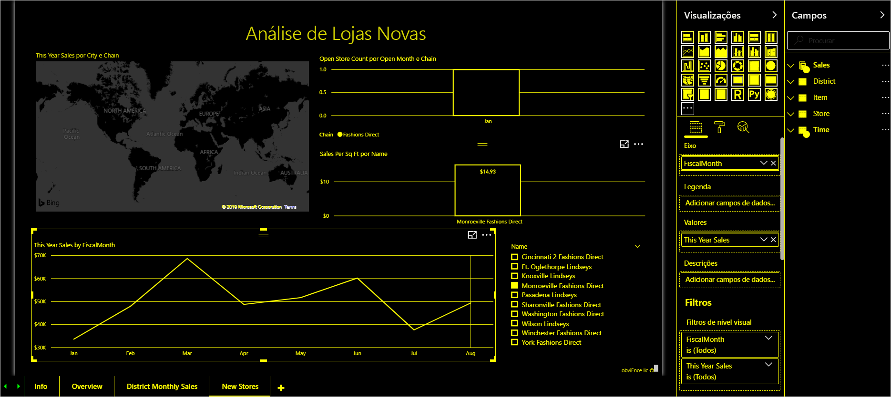

# Criar relatórios no Power BI com as ferramentas de acessibilidade

Para os criadores de relatórios que utilizam ferramentas de acessibilidade para criar relatórios, o Power BI tem muitas capacidades incorporadas que podem ajudar no processo.

Este artigo descreve os vários tipos de ferramentas de acessibilidade disponíveis para os criadores de relatórios no Power BI Desktop.

## Navegação ao nível da aplicação
Ao navegar no Power BI Desktop, pode mover o foco para as áreas principais da aplicação ao premir **Ctrl+F6**. A mudança do foco na área principal de Power BI Desktop faz-se pela seguinte ordem:

1. Objetos na tela
2. Separadores de página
3. Painéis (cada um separadamente, da esquerda para a direita para qualquer um que esteja aberto)
4. Navegador de visualização
5. Rodapé
6. Iniciar sessão
7. Barra amarela de avisos/erros/atualizações

Na maioria dos casos, a utilização da tecla **Enter** para selecionar ou aceder a uma área e, em seguida, a utilização da tecla **ESC** para sair da mesma são procedimentos comuns no Power BI.

## Navegação no friso

Prima **Alt** para ver as pequenas caixas, que se chamam *Informações das Teclas de Atalho*, sobre cada comando disponível na vista atual do friso. Em seguida, pode premir a letra apresentada na *Informação de Tecla de Atalho* que paira sobre o comando que pretende utilizar. 

Por exemplo, na imagem a seguir, a tecla **Alt** foi premida para apresentar as Informações das Teclas de Atalho, que contêm as letras para os comandos acessíveis disponíveis. Em seguida, se premir **M**, abre o separador **Modelação** no friso.

Dependendo da letra que premir, poderá ver outras Informações das Teclas de Atalho. Por exemplo, se o separador **Home Page** estiver ativo e premir **W**, aparece o separador **Ver**, juntamente com as Informações das Teclas de Atalho para os grupos que fazem parte desse separador **Ver** do friso. Pode continuar a premir as letras apresentadas nas Informações das Teclas de Atalho até premir a letra do comando especificamente pretendido. Para mover para o conjunto anterior de Informações das Teclas de Atalho, prima **Esc**. Para cancelar a ação que está a realizar e ocultar as Informações das Teclas de Atalho, prima a tecla **Alt**.

## Navegação no painel de elementos visuais

Para navegar no painel **Visualizações**, tem primeiro de se certificar de que o foco está no painel premindo **Ctrl+F6** até chegar ao painel. Quando um utilizador navega no painel de visualizações, o foco chega primeiro ao cabeçalho. A começar do topo, a ordem de tabulação é a seguinte e está indicada na imagem a seguir:

1. O título do cabeçalho
2. O quilate expandir/fechar
3. O ícone do primeiro elemento visual

Quando chegar aos elementos visuais, pode utilizar as teclas de seta para navegar para um elemento visual específico e premir **Enter** para selecioná-lo. Se estiver a utilizar um leitor de ecrã, este chama a sua atenção por voz caso tenha criado um novo gráfico e indica o tipo de gráfico de que se trata ou informa-o de que alterou um gráfico de um determinado tipo para outro tipo de gráfico. 

Após a secção dos elementos visuais do painel, a ordem do foco muda para os pivôs do painel, conforme mostrado na seguinte imagem.

Quando o foco estiver nos pivôs do painel, as tabulações só chegam ao ícone do painel selecionado. Para mudar para outros painéis, utilize as teclas de seta.

## Conjunto de campos

Quando o foco estiver nos pivôs do painel, conforme descrito na secção anterior, se premir a Tecla de Tabulação novamente, passa o foco para o **conjunto de campos**. 

No **conjunto de campos**, a ordem do foco passa para:

* o título de cada conjunto (primeiro)
* seguido de um determinado campo em cada conjunto (a seguir)
* o botão de lista pendente para abrir o menu de campos (depois disso)
* em seguida, o botão de remoção (por último)

A imagem a seguir mostra a ordem de progressão do foco.

Um leitor de ecrã lê em voz alta o nome do conjunto e respetiva descrição. Para cada campo de um conjunto, um leitor de ecrã lê em voz alta o nome do campo e respetiva descrição. Se um conjunto estiver vazio, o foco deverá passar para o conjunto vazio como um todo. O leitor de ecrã deverá ler em voz alta o nome do conjunto, a descrição e que o conjunto está vazio.

Quando o menu de campos estiver aberto, pode deslocar-se no mesmo ao utilizar a **Tecla de Tabulação** ou **Shift+Tecla de Tabulação**, ou as teclas **Seta Para Cima** / **Seta Para Baixo**. Um leitor de ecrã indica por voz os nomes das opções.

Se quiser mover um campo de um registo no conjunto de campos para outro registo, pode utilizar o teclado e a opção **Mover para** no menu do conjunto de campos, conforme mostrado na imagem a seguir.

## Painel de formatação

A ordem do foco no painel **Formatação** passa do topo para baixo seguindo a ordem dos cartões. O foco rodeia o nome do cartão, seguido do respetivo botão de **ativar/desativar**, se existir. Quando o foco estiver no nome do cartão, um leitor de ecrã lê o nome do cartão em voz alta e indica se o cartão está expandido ou fechado. Pode premir a tecla **Enter** para expandir ou fechar o cartão. A tecla **Enter** também funciona para colocar o botão de alternar na posição **ativado** ou **desativado**.

Se um cartão estiver aberto, a tecla **Tab** percorre os controlos no cartão antes de passar para o cartão seguinte. Para os controlos num cartão, um leitor de ecrã indica por voz o título, o valor atual e o tipo de controlo.  

## Navegação na lista de campos

Pode premir a tecla **Tab** para navegar na lista **Campos**. De forma semelhante ao painel de formatação, se as tabelas estiverem fechadas, o foco passa pela seguinte ordem:

1. O cabeçalho da lista **Campos**
2. A barra de pesquisa
3. O nome de cada tabela

Para expandir todas as tabelas no conjunto **Campos**, prima **Alt+Shift+9**. Para fechar todas as tabelas, prima **Alt+Shift+1**. Para expandir uma única tabela, prima a tecla da **seta para a direita**. Para fechar uma única tabela, prima a tecla da **seta para a esquerda**. De forma semelhante ao painel de formatação, se uma tabela estiver expandida, a tabulação e a navegação na lista de campos incluem os campos que estão apresentados. Um leitor de ecrã indica por voz se o utilizador expandiu ou fechou uma tabela.

Pode selecionar um campo ao navegar até o campo pretendido e premindo **Enter**.   Um leitor de ecrã indica por voz o campo com o foco e se o campo está selecionado ou desselecionado.

Os utilizadores do rato normalmente arrastam e largam os campos na tela ou nos registos de filtro pretendidos. Se quiser utilizar o teclado, pode adicionar um campo a um registo de filtro ao aceder ao menu de contexto do campo e premindo **Shift+F10**, utilizar as teclas de seta para navegar até **Adicionar aos filtros** e, em seguida, premir **Enter** no tipo de filtro ao qual pretende adicionar o campo.

## Navegação no painel de seleção
O painel **Seleção** tem a seguinte ordem de progressão do foco:

1. Título do cabeçalho
2. Botão de sair
3. Alternador da ordem das camadas/de tabulação
4. Botão mover para cima nas camadas
5. Botão mover para baixo nas camadas
6. Botão Mostrar
7. Botão Ocultar
8. Objetos

Pode percorrer a ordem do foco com a tecla de tabulação e premir **Enter** para selecionar o elemento do seu interesse.  

Quando chegar ao alternador da ordem das camadas/de tabulação, utilize as teclas de seta para a esquerda e para a direita para alternar entre a ordem das camadas e a ordem de tabulação.

Quando chegar aos objetos no painel **Seleção**, prima **F6** para ativar o painel **Seleção**. Depois de ativar o painel **Seleção**, pode utilizar as teclas de seta para cima/para baixo para navegar até aos diferentes objetos no painel **Seleção**.
Depois de ter navegado até ao objeto de interesse, pode realizar determinadas ações:

* Prima **Ctrl+Shift+S** para ocultar/mostrar um objeto
* Prima **Ctrl+Shift+F** para mover um objeto para cima na ordem das camadas
* Prima **Ctrl+Shift+B** para mover um objeto para baixo na ordem das camadas
* Prima **Ctrl+Barra de Espaço** para selecionar múltiplos objetos

## Caixas de diálogo do Power BI Desktop

Todas as caixas de diálogo no Power BI Desktop podem ser acedidas através da navegação por teclado e funcionam com leitores de ecrã.

As caixas de diálogo no Power BI Desktop incluem o seguinte:

* Caixa de diálogo Medidas rápidas
* Caixa de diálogo Formatação Condicional e barras de dados
* Caixa de diálogo Explorer de Perguntas e Respostas
* Caixa de diálogo Introdução
* Menu Ficheiro e caixa de diálogo Acerca de
* Caixa de diálogo Aviso
* Caixa de diálogo Restauro de Ficheiros
* Caixa de diálogo Feedback Negativo

## Suporte de alto contraste

Quando utiliza modos de alto contraste no Windows, essas definições e a paleta que seleciona também são aplicadas aos relatórios no Power BI Desktop.

O Power BI Desktop deteta automaticamente qual o tema de alto contraste que está a ser utilizado no Windows e aplica essas definições aos seus relatórios. Essas cores de alto contraste são mantidas no relatório quando for publicado no serviço Power BI, ou noutro local.

## Próximos passos

A coleção de artigos relativos à acessibilidade no Power BI é a seguinte:

* [Descrição geral da acessibilidade no Power BI](desktop-accessibility-overview.md) 
* [Criar relatórios acessíveis no Power BI](desktop-accessibility-creating-reports.md) 
* [Consumir relatórios no Power BI com ferramentas de acessibilidade](desktop-accessibility-consuming-tools.md)
* [Accessibility keyboard shortcuts for Power BI reports](desktop-accessibility-keyboard-shortcuts.md) (Atalhos de teclado de acessibilidade para os relatórios do Power BI)
* [Lista de verificação relativa à acessibilidade dos relatórios](desktop-accessibility-creating-reports.md#report-accessibility-checklist)

