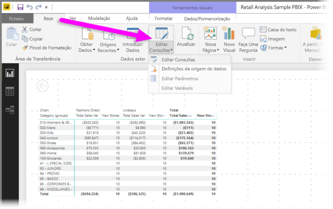

# Adicionar uma coluna personalizada no Power BI Desktop

No Power BI Desktop, pode adicionar facilmente uma nova coluna de dados personalizada ao seu modelo através do Editor de Consultas. Com o Editor de Consultas, pode criar e mudar o nome da sua coluna personalizada para criar [consultas de fórmulas M do Power Query](https://docs.microsoft.com/powerquery-m/quick-tour-of-the-power-query-m-formula-language) para definir a sua coluna personalizada. As consultas de fórmula M do Power Query têm um [conjunto de conteúdos de referência de função abrangente](https://docs.microsoft.com/powerquery-m/power-query-m-function-reference). 

Quando cria uma coluna personalizada no Editor de Consultas, o Power BI Desktop adiciona-a como um **Passo Aplicado** nas **Definições de Consultas** da consulta. Pode ser alterada, movida ou modificada a qualquer altura.

## Utilizar o Editor de Consultas para adicionar uma coluna personalizada

Para começar a criar uma coluna personalizada, siga estes passos:

1. Abra o Power BI Desktop e carregue dados.

2. No separador **Base** do friso, selecione **Editar Consultas** e, em seguida, selecione **Editar Consultas** no menu.

   

   É apresentada a janela do **Editor de Consultas**. 

2. No separador **Adicionar Coluna** no friso, selecione **Coluna Personalizada**.

   

   É apresentada a janela **Adicionar Coluna Personalizada**.

## Janela Adicionar Coluna Personalizada

A janela **Adicionar Coluna Personalizada** tem as seguintes funcionalidades: 
- Uma lista de colunas disponíveis, na lista de **Colunas disponíveis** à direita.

- O nome inicial da sua coluna personalizada, na caixa **Novo nome de coluna**. Pode mudar o nome desta coluna.

- [Consultas de fórmula M do Power Query](https://docs.microsoft.com/powerquery-m/power-query-m-function-reference), na caixa **Fórmula de coluna personalizada**. Crie estas consultas ao compilar a fórmula na qual se define a sua nova coluna personalizada. 

   

## Criar fórmulas para a coluna personalizada

1. Selecione uma coluna na lista **Colunas disponíveis** à direita e selecione **Inserir** abaixo da lista para adicioná-las à fórmula da coluna personalizada. Pode também adicionar uma coluna ao fazer duplo clique na mesma na lista.

2. Ao introduzir a fórmula e compilar a sua coluna, repare no indicador na parte inferior da janela **Adicionar Coluna Personalizada**. 

   Se não houver erros, verá uma marca de verificação verde e a mensagem *Não foram detetados erros de sintaxe*.

   

   Se houver um erro de sintaxe, verá um ícone de aviso amarelo, juntamente com uma ligação para onde o erro ocorreu na sua fórmula.

   

3. Selecione **OK**. 

   O Power BI Desktop adiciona a sua coluna personalizada ao modelo e adiciona o passo **Personalizado Adicionado** à lista de **Passos Aplicados** da sua consulta nas **Definições da Consulta**.

   

4. Para modificar a sua coluna personalizada, faça duplo clique no passo **Personalizado Adicionado** na lista de **Passos Aplicados**. 

   A janela **Adicionar Coluna Personalizada** é apresentada com a fórmula de coluna personalizada que criou.

## Utilizar o Editor Avançado para colunas personalizadas

Após criar a sua consulta, pode também utilizar o **Editor Avançado** para modificar qualquer passo da sua consulta. Para tal, siga estes passos:

1. Na janela do **Editor de Consultas**, selecione o separador **Ver** no friso. 

2. Selecione **Editor Avançado**.

   Será apresentada a página do **Editor Avançado**, que lhe dá controlo total sobre a sua consulta. 

   

   
## Próximas etapas

- Pode criar uma coluna personalizada de outras formas, incluindo a criação de uma coluna com base nos exemplos fornecidos ao Editor de Consultas. Para obter mais informações, veja [Adicionar uma coluna a partir de um exemplo no Power BI Desktop](desktop-add-column-from-example.md).

- Para obter informações de referência sobre a função M no Power Query, veja [Referência da função M do Power Query](/powerquery-m/power-query-m-function-reference).

