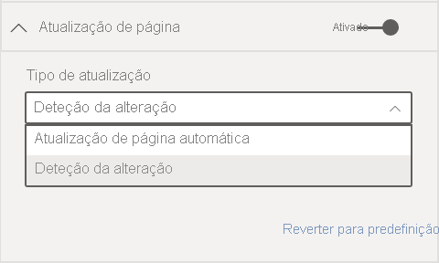
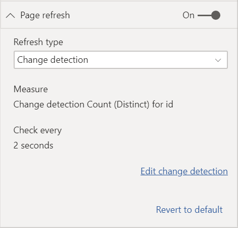

# Atualização automática de páginas no Power BI

Quando monitoriza eventos críticos, é importante que os dados sejam atualizados assim que a origem de dados é atualizada. Por exemplo, na indústria transformadora, é essencial saber quando uma máquina tem problemas de funcionamento ou está perto de os ter. Se está a monitorizar sinais como o sentimento em redes sociais, quer ter conhecimento de mudanças repentinas assim que estas ocorrem.

A atualização automática de páginas no Power BI permite que a página de relatório ativa consulte quanto à existência de novos dados, com uma cadência predefinida, nas [origens do DirectQuery](../connect-data/desktop-directquery-about.md).

## Tipos de atualização

Ao utilizar a atualização de páginas automática, tem dois tipos de atualização à disposição: intervalos fixos e deteção de alterações.

### Intervalo fixo

Este tipo de atualização permite que atualize todos os elementos visuais numa página de relatório com base num intervalo constante, como um segundo ou cinco minutos. Quando este intervalo específico for atingido, todos os elementos visuais nessa página enviam uma consulta de atualização à origem de dados e atualizam-se em conformidade.

### Deteção da alteração

Este tipo de atualização permite-lhe atualizar os elementos visuais numa página com base em detetar alterações nos dados, em vez de um intervalo de atualização específico. Especificamente, esta medida pesquisa por alterações na sua [origem DirectQuery](../connect-data/desktop-directquery-about.md). Além de definir a medida, tem também de selecionar a frequência com que o Power BI Desktop verifica alterações. Ao publicar no serviço, este tipo de atualização só é suportado em áreas de trabalho que fazem parte de uma capacidade Premium.

## Criar relatórios com atualização automática de páginas no Power BI Desktop

A atualização automática de páginas está disponível apenas para [origens DirectQuery](../connect-data/desktop-directquery-about.md), pelo que só estará disponível quando estiver ligado a uma origem de dados do DirectQuery. Esta restrição aplica-se a ambos os tipos de atualização automática de páginas.

Para utilizar a atualização automática de páginas no Power BI Desktop, selecione a página de relatório para a qual deseja ativar a atualização automática de páginas. No painel **Visualizações**, selecione o botão **Formatação** (um rolo de tinta) e localize a secção **Atualização de páginas** próximo da parte inferior do painel.

1. Ativa ou desativa a atualização de páginas.
2. Tipo de atualização
3. Entradas e informações (consoante o tipo de atualização)

O cartão **Atualização de página** só estará disponível se estiver ligado a uma [origem DirectQuery](../connect-data/desktop-directquery-about.md). Para ativar a atualização automática de páginas, o botão tem de estar na posição Ativado. As entradas necessárias e as informações fornecidas irão depender do tipo de atualização selecionado.

### Configuração de intervalo fixo

Ao selecionar **Atualização de páginas automática** como tipo de atualização, tem de fornecer o intervalo de atualização desejado. O valor predefinido é de 30 minutos (o intervalo mínimo de atualização é de um segundo). O relatório começará a ser atualizado com o intervalo definido.

Ao clicar em Mostrar detalhes, o Power BI irá fornecer mais informações sobre:

- Se a funcionalidade for ativada pelo seu administrador (apenas com sessão iniciada na sua conta do Power BI)
- O intervalo mínimo permitido pelo seu administrador (apenas com sessão iniciada na sua conta do Power BI)
- Taxa real de atualização (normalmente mais longo do que o intervalo selecionado)
- Hora da última atualização

### Configuração da deteção de alteração

Ao selecionar **Deteção de alteração** como o tipo de atualização, verá uma ligação para **Adicionar deteção de alteração**. Também pode aceder à janela **deteção de alteração** no separador Modelação no friso. Em seguida, clique no ícone **Deteção de alteração** na secção **Atualização de página**. Por fim, pode clicar com o botão direito do rato ou selecionar a seta pendente junto a qualquer valor na área Valores e selecionar **Deteção de alteração** no menu.

Depois de abrir a janela, é apresentada a opção **Tipo de medida**, onde pode selecionar uma medida existente ou criar uma nova de raiz. Ao selecionar uma existente, basta selecionar a medida desejada na lista de campos ou arrastar e largar a mesma para a secção **Escolher uma medida existente**. Ao criar uma nova medida, pode **Escolher um cálculo** para a medida entre contagem, contagem distinta, mínimo, máximo e soma. Por exemplo, pode utilizar a contagem distinta para contar IDs de clientes e atualizar apenas quando um novo cliente for adicionado à lista. Quando tiver uma medida selecionada, tem de definir a frequência com que o Power BI irá **Procurar alterações**. Este é o intervalo segundo o qual o Power BI irá calcular a medida e pesquisar alterações. Depois de clicar em Aplicar, uma nova medida com o ícone de deteção de alteração aparecerá na lista de campos.

Em seguida, voltando à secção de atualização de página, verá as informações sobre que medida está a ser utilizada para a deteção de alterações e o intervalo definido para sua referência.

> [!NOTE]
> Só é permitida uma medida de deteção de alteração por modelo.

## Determinar o intervalo de atualização

Quando a atualização automática de página está ativada, o Power BI Desktop está constantemente a enviar consultas para a origem de dados do DirectQuery. Depois do envio da consulta, ocorre um atraso até os dados serem devolvidos. Assim, para intervalos de atualização curtos, deve confirmar que as consultas devolveram com êxito os dados da consulta dentro do intervalo configurado. Se os dados não forem devolvidos dentro do intervalo, os elementos visuais serão atualizados com menos frequência do que o configurado.

Estas considerações aplicam-se a ambos os tipos de atualização: intervalo fixo e deteção de alteração. A principal diferença é que, no caso da deteção de alteração, só uma consulta volta para a origem com um intervalo fixo e a atualização de elementos visuais é acionada apenas quando o valor da medida de deteção de alteração muda.

Como melhor prática, o intervalo de atualização deve, pelo menos, corresponder à taxa de chegada esperada dos novos dados:

* Se chegarem novos dados à origem a cada 20 minutos, o intervalo de atualização não poderá ser inferior a 20 minutos.
* Se chagarem novos dados a cada segundo, defina o intervalo para um segundo.

Para intervalos de baixa atualização, como um segundo, tenha em consideração fatores como os seguintes:

- O tipo da origem de dados do DirectQuery
- A carga que as consultas criam no mesmo
- A distância dos visualizadores do relatório do datacenter da capacidade

Pode estimar os tempos de devolução ao utilizar o [Analisador de Desempenho](desktop-performance-analyzer.md) no Power BI Desktop e o menu Mostrar detalhes na secção Atualização de página para o tipo de atualização com intervalo fixo. O Analisador de Desempenho permite-lhe verificar se cada consulta de elemento visual tem tempo suficiente para voltar com os resultados da origem. Também permite determinar onde o tempo é gasto. Com base nos resultados do Analisador de Desempenho, pode ajustar a origem de dados ou experimentar com outros elementos visuais e medidas no relatório.

Esta imagem mostra os resultados de uma origem DirectQuery no Analisador de Desempenho:

Vamos considerar outras características desta origem de dados:

- Os dados chegam a uma taxa de 2 segundos
- O Analisador de Desempenho mostra uma consulta máxima + tempo de apresentação de aproximadamente 4,9 segundos (4,688 milissegundos)
- A origem de dados está configurada para lidar com aproximadamente 1000 consultas simultâneas por segundo
- Espera que aproximadamente 10 utilizadores visualizem o relatório em simultâneo

O que resulta na seguinte equação:

- **5 elementos visuais x 10 utilizadores = aproximadamente 50 consultas**

O resultado deste cálculo mostra muito mais carga do que a origem de dados consegue suportar. Os dados chegam a uma taxa de dois segundos. Assim, esta deve ser a sua taxa de atualização. No entanto, dado que a conclusão da consulta demora cerca de cinco segundos, deve defini-la para mais de cinco segundos.

Note também que este resultado pode diferir à medida que publica o relatório no serviço. Esta diferença ocorre porque o relatório utilizará a instância do Azure Analysis Services alojada na cloud. Pode querer ajustar as taxas de atualização em conformidade.

Para ter em conta o tempo das consultas e de atualização, o Power BI só executará a próxima consulta de atualização quando todas as consultas de atualização restantes forem concluídas. Assim, mesmo que o intervalo de atualização seja menor do que o tempo que as consultas demoram a ser processadas, o Power BI só atualizará novamente quando as consultas restantes forem concluídas.

Estas considerações também se aplicam no caso do tipo de alteração por deteção de alteração. Além disso, o [Analisador de Desempenho](desktop-performance-analyzer.md) mostra os resultados para a consulta da medida de deteção de alteração, apesar de não corresponder a nenhum elemento visual no seu relatório. Fornecemos esta capacidade para que possa resolver problemas relacionados com este tipo de medida específico, seguindo as mesmas orientações que referimos anteriormente. A principal diferença neste tipo de atualização é que apenas uma consulta é enviada para a origem de dados, em vez de todas as consultas de todos os elementos visuais. Isto aplica-se também se múltiplos utilizadores estiverem a visualizar o relatório.

Para o mesmo cenário que referimos anteriormente:

- **1 consulta de medida de deteção de alteração para 5 elementos visuais gera apenas uma consulta para qualquer número de visualizadores**

- **Quando a medida de deteção de alteração acionar uma atualização, pressupondo o mesmo cenário que anteriormente, com 5 elementos visuais x 10 utilizadores = aproximadamente 50 consultas**

Resumindo, quando utilizar a deteção de alteração, apenas uma consulta é enviada para a origem de dados até ser detetada uma alteração. Quando tal acontecer, a mesma lógica utilizada para o tipo de atualização de intervalo fixo aplica-se ao atualizar todos os elementos visuais para todos os utilizadores, gerando o mesmo número de consultas. A longo prazo, esta abordagem deverá ser mais eficiente.

Agora, vamos ver como pode, potencialmente, detetar e diagnosticar problemas de desempenho como um administrador de capacidade. Também pode ver a secção [Perguntas mais frequentes](#frequently-asked-questions) mais adiante neste artigo, para obter mais perguntas e respostas sobre desempenho e a resolução de problemas.

## Atualização automática de página no serviço Power BI

Também pode definir a atualização de página automática para os relatórios que foram publicados no serviço Power BI desde que essa origem de dados seja o [DirectQuery](../connect-data/desktop-directquery-about.md).

Para configurar a atualização automática de páginas para os relatórios no serviço Power BI, os passos são semelhantes aos do Power BI Desktop. Quando está configurada no serviço Power BI, a atualização de página automática também suporta conteúdos do [Power BI Embedded](../developer/embedded/embedding.md). Esta imagem mostra a configuração da **Atualização de páginas** do serviço Power BI:

1. Ativa ou desativa a atualização de páginas.
2. Tipo de atualização
3. Entradas e informações (consoante o tipo de atualização)

> [!NOTE]
> Ao publicar o relatório com a atualização automática de páginas ativada no Power BI Desktop para o serviço, terá de introduzir as credenciais para a origem de dados do DirectQuery no menu de definições do conjunto de dados. Pode configurar as credenciais para que os visualizadores de relatórios acedam a esta origem de dados com identidades próprias, respeitando a segurança configurada na origem. No caso da medida de deteção de alteração, será sempre avaliada com as credenciais do autor.

### Intervalos da atualização de páginas

Os intervalos e tipos da atualização de páginas permitidos no serviço Power BI são afetados pelo tipo de área de trabalho do relatório. Esta situação aplica-se aos seguintes cenários:

* Publicar um relatório numa área de trabalho que tem a atualização automática de páginas ativada
* Editar um intervalo de atualização de páginas que já se encontra numa área de trabalho
* Criar um relatório diretamente no serviço

O Power BI Desktop não tem restrições para os intervalos de atualização, que podem ser tão frequentes como a cada segundo. No entanto, quando os relatórios são publicados no serviço Power BI, aplicam-se certas restrições (descritas nas seguintes secções).

### Restrições dos intervalos de atualização

No serviço Power BI, aplicam-se restrições à atualização automática de páginas com base na área de trabalho em que o relatório está publicado, se está a utilizar os serviços Premium e as definições de administrador da capacidade Premium.

Para esclarecer como estas restrições funcionam, vamos começar com algum contexto sobre as capacidades e áreas de trabalho.

As *capacidades* são um conceito importante do Power BI. Representam um conjunto de recursos (armazenamento, processador e memória) utilizados para alojar e fornecer conteúdo do Power BI. As capacidades podem ser partilhadas ou dedicadas. Uma *capacidade partilhada* é partilhada com outros clientes da Microsoft. Uma *capacidade dedicada* está totalmente comprometida com um único cliente. Para obter uma introdução às capacidades dedicadas, veja [Gerir as capacidades Premium](../admin/service-premium-capacity-manage.md).

Na capacidade partilhada, as cargas de trabalho são executadas em recursos computacionais partilhados com outros clientes. Dado que a capacidade tem de partilhar recursos, são impostos limites para garantir *fair play*, como definir um tamanho máximo de modelo (1 GB) e uma frequência máxima de atualização diária (oito vezes por dia).

As *áreas de trabalho* do Power BI residem nas capacidades. Representam contentores de segurança, colaboração e implementação. Cada utilizador do Power BI tem uma área de trabalho pessoal conhecida como **A Minha Área de Trabalho**. Podem ser criadas áreas de trabalho adicionais para permitir a colaboração e implementação. São conhecidas como *áreas de trabalho*. Por predefinição, as áreas de trabalho, incluindo as áreas de trabalho pessoais, são criadas na capacidade partilhada.

Veja a seguir alguns detalhes dos dois cenários de área de trabalho:

**Áreas de trabalho partilhadas**. Para áreas de trabalho normais (áreas de trabalho que não fazem parte de uma capacidade Premium), a atualização automática de páginas tem um intervalo mínimo de 30 minutos (o intervalo mais baixo permitido). O tipo de atualização de deteção de alteração não está disponível em capacidades partilhadas.

**Áreas de trabalho Premium**. A disponibilidade da atualização automática de páginas nas áreas de trabalho Premium (tanto para intervalo fixo como deteção de alteração) depende das definições de carga de trabalho que o administrador Premium configurou para a capacidade Premium do Power BI. Existem duas variáveis que podem afetar a capacidade para configurar a atualização automática de páginas:

 - **Funcionalidade ativada/desativada**. Se o administrador de capacidade tiver desativado a funcionalidade, não conseguirá configurar nenhum tipo de atualização de páginas no relatório publicado. O intervalo fixo e a detecção de alteração podem ser ativados e desativados separadamente.

 - **Intervalo mínimo de atualização**. Ao ativar a atualização de páginas automática para intervalo fixo, o seu administrador de capacidade tem de configurar um intervalo de atualização mínimo (o valor predefinido é de cinco minutos). Se o intervalo for inferior ao mínimo, o serviço Power BI definirá o intervalo para respeitar o intervalo mínimo definido pelo administrador de capacidade.

 - **Intervalo de execução mínimo**. Ao ativar a deteção de alteração, o seu administrador de capacidade tem de configurar um intervalo de execução mínimo (o valor predefinido é de cinco segundos). Se o intervalo for inferior ao mínimo, o serviço Power BI definirá o intervalo para respeitar o intervalo mínimo definido pelo administrador de capacidade.

Esta tabela descreve com mais detalhes onde esta funcionalidade está disponível e os limites para cada tipo de capacidade e [modo de armazenamento](../connect-data/service-dataset-modes-understand.md):

| Modo de armazenamento | Capacidade dedicada | Capacidade partilhada |
| --- | --- | --- |
| DirectQuery | **IF suportado**: Sim  **DC suportado**: Sim  **Mínimo**: 1 segundo  **Definição manual do administrador**: Sim | **IF suportado**: Sim  **DC suportado**: Não  **Mínimo**: 30 minutos  **Definição manual do administrador**: Não |
| Importar | **IF suportado**: Não  **DC suportado**: Não  **Mínimo**: N/D  **Definição manual do administrador**: N/D | **IF suportado**: Não  **DC suportado**: Não  **Mínimo**: N/D  **Definição manual do administrador**: N/D |
| Modo misto (DirectQuery + outras origens de dados) | **IF suportado**: Sim  **DC suportado**: Sim  **Mínimo**: 1 segundo  **Definição manual do administrador**: Sim | **IF suportado**: Sim  **DC suportado**: Não  **Mínimo**: 30 minutos  **Definição manual do administrador**: Não |
| Live Connect AS | **IF suportado**: Não  **DC suportado**: Não  **Mínimo**: N/D  **Definição manual do administrador**: N/D | **IF suportado**: Não  **DC suportado**: Não  **Mínimo**: N/D  **Definição manual do administrador**: N/D |
| Live Connect PBI | **IF suportado**: Não  **DC suportado**: Não  **Mínimo**: N/D  **Definição manual do administrador**: N/D | **IF suportado**: Não  **DC suportado**: Não  **Mínimo**: N/D  **Definição manual do administrador**: N/D |

*Legenda de tabela:*
1. *IF: intervalo fixo*
2. *DC: deteção de alteração*

## Considerações e limitações

Existem algumas coisas a ter em conta ao utilizar a atualização automática de páginas no Power BI Desktop ou no serviço Power BI:

* Os modos de armazenamento Push, LiveConnect e Importação não são suportados pela atualização automática de páginas.  
* São suportados os modelos compostos que têm, pelo menos, uma origem de dados do DirectQuery.
* O Power BI Desktop não tem restrições para intervalos de atualização. O intervalo pode ser tão frequente como a todos os segundos para os tipos de atualização de intervalo fixo e deteção de alteração. Quando os relatórios são publicados no serviço Power BI, aplicam-se determinadas restrições, conforme descrito [anteriormente](#restrictions-on-refresh-intervals) neste artigo.
* Só pode ter uma medida de deteção de alteração por conjunto de dados.
* Pode haver apenas até 10 modelos com deteção de alteração num inquilino do Power BI.

### Diagnósticos de desempenho

A atualização automática de páginas é útil para cenários de monitorização e exploração de dados em rápida mudança. No entanto, por vezes pode colocar uma carga indevida sobre a capacidade ou a origem de dados.

Para evitar uma carga indevida sobre as origens de dados, o Power BI tem as seguintes proteções:

- Todas as consultas de atualização automática de páginas são executadas com uma prioridade mais baixa para garantir que as consultas interativas (como carregamento de páginas e filtragem cruzada de elementos visuais) tenham prioridade.
- Se uma consulta não tiver sido concluída antes do próximo ciclo de atualização, o Power BI não emitirá novas consultas de atualização até que a consulta anterior seja concluída. Por exemplo, se possuir um intervalo de atualização de um segundo e as consultas demorarem uma média de quatro segundos, o Power BI só emitirá efetivamente uma consulta a cada quatro segundos.

Existem duas áreas nas quais ainda pode encontrar estrangulamentos de desempenho:

1. **Capacidade**. A consulta atinge primeiro a capacidade Premium que vai criar e avaliar a consulta DAX gerada a partir das visualizações do relatório para a origem das consultas.
2. **Origem de dados do DirectQuery**. as consultas convertidas no passo anterior são, em seguida, executadas em relação à origem. A origem seria as instâncias do SQL Server, as origens do SAP Hana e assim por diante.

Com a [aplicação Poer BI Premium Capacity Metrics](../admin/service-admin-premium-monitor-capacity.md) disponível para os administradores, pode visualizar quanta da capacidade está a ser utilizada por consultas de baixa prioridade.

As consultas de baixa prioridade consistem em consultas de atualização automática de páginas e consultas de atualização de modelos. Atualmente, não existe forma de distinguir entre a carga de atualização automática de páginas e as consultas de atualização de modelos.

Se notar que a capacidade está sobrecarregada com consultas de baixa prioridade, existem algumas ações que poderá executar:

- Pedir um SKU premium maior.
- Contactar o proprietário do relatório para diminuir o intervalo de atualização.
- No portal de administrador de capacidade, pode:
   - Desativar a atualização automática de páginas para essa capacidade.
   - Aumentar o intervalo de atualização mínimo, o que vai afetar todos os relatórios dessa capacidade.

### Perguntas frequentes

**Sou autor de relatórios. Defini o intervalo de atualização do relatório para um segundo no Power BI Desktop, mas após a publicação, o relatório não está a ser atualizado no serviço.**

* Confirme se a atualização automática de páginas está ativada para a página. Dado que esta definição é por página, tem de garantir que está ativada para cada página no relatório que quer que seja atualizado.
* Verifique se carregou para uma área de trabalho com uma capacidade Premium anexada. Se não o tiver feito, o intervalo de atualização ficará bloqueado nos 30 minutos para intervalo fixo e não estará disponível para a deteção de alteração.
* Se o relatório se encontrar numa área de trabalho Premium, pergunte ao administrador se esta funcionalidade está ativada para a capacidade anexada. Confirme também se o intervalo mínimo de atualização para a capacidade é igual ou inferior ao intervalo do relatório. Isto aplica-se separadamente para o intervalo fixo e a deteção de alteração

**Sou administrador de capacidade. Alterei as definições do intervalo de atualização automática de páginas, mas as alterações não estão refletidas. Por outras palavras, os relatórios ainda estão a ser atualizados a uma taxa que não deveriam ou não estão a ser atualizados apesar de ter ativado a atualização automática de páginas.**

* As alterações à definição de atualização automática de páginas feitas na IU do administrador de capacidade demoram até 5 minutos a serem propagadas nos relatórios.
* Além de ativar a atualização automática de páginas para a capacidade, também tem de ativá-la para as páginas de um relatório em que queira ativá-la.
* Os dois tipos de atualização são geridos separadamente, pelo que deve garantir que o tipo de atualização que está a definir está ativo.

**O meu relatório está a funcionar no modo misto (modo misto significa que o relatório tem uma ligação do DirectQuery e uma origem de dados de Importação). Alguns elementos visuais não estão a ser atualizados.**

- Se os elementos visuais fizerem referência a tabelas de Importação, este comportamento será normal. A atualização automática de páginas não é suportada para Importação.
- Veja a primeira pergunta nesta secção.

**O meu relatório estava a atualizar sem problemas no serviço, mas subitamente parou.**

* Experimente atualizar a página para ver se o problema se resolveu sozinho.
* Verifique junto do administrador de capacidade. O administrador pode ter desativado a funcionalidade ou aumentado o intervalo mínimo de atualização (veja a segunda pergunta nesta secção).

**Sou autor de relatórios. Os meus elementos visuais não estão a ser atualizados na cadência que especifiquei. Estão a ser atualizados a uma taxa mais lenta.**

* Se as consultas estiverem a demorar demasiado a ser executadas, o intervalo de atualização será atrasado. A atualização automática de páginas espera que todas as consultas sejam concluídas antes de executar novas consultas.
* O administrador de capacidade pode ter definido um intervalo de atualização mínimo superior ao que tinha definido no relatório. Peça ao administrador de capacidade para reduzir o intervalo mínimo de atualização.

**As consultas de atualização automática de páginas são servidas a partir da cache?**

* Não. Todas as consultas de atualização automática de páginas ignoram os dados armazenados em cache.

**A minha medida de deteção de alteração não está a acionar atualizações**

* Certifique-se de que a deteção de alteração está ativada na página. Dado que esta definição é por página, tem de garantir que está ativada para cada página no relatório que quer que seja atualizado.
* Verifique se carregou para uma área de trabalho com uma capacidade Premium anexada. Se não o tiver feito, a deteção de alteração não irá funcionar.
* Se o relatório se encontrar numa área de trabalho Premium, pergunte ao administrador se esta funcionalidade está ativada para a capacidade anexada. Confirme também se o intervalo mínimo de execução para a capacidade é igual ou inferior ao intervalo do relatório.
* Se verificou todos os itens mencionados anteriormente, verifique no Power BI Desktop ou no modo de edição se a medida não está a mudar de todo. Para tal, arraste-a para a tela e verifique se o valor muda. Se não mudar, a medida poderá não ser uma boa opção para pesquisar alterações à origem de dados.

## Próximos passos

Para obter mais informações, veja estes artigos:

* [Utilizar o DirectQuery no Power BI](../connect-data/desktop-directquery-about.md)
* [Utilizar modelos compostos no Power BI Desktop](../transform-model/desktop-composite-models.md)
* [Utilizar o Analisador de Desempenho para examinar o desempenho do elemento de relatório](desktop-performance-analyzer.md)
* [Implementar e gerir capacidades Premium do Power BI](../guidance/whitepaper-powerbi-premium-deployment.md)
* [Origens de dados no Power BI Desktop](../connect-data/desktop-data-sources.md)
* [Formatar e combinar dados no Power BI Desktop](../connect-data/desktop-shape-and-combine-data.md)
* [Ligar a livros do Excel no Power BI Desktop](../connect-data/desktop-connect-excel.md)   
* [Introduzir dados diretamente no Power BI Desktop](../connect-data/desktop-enter-data-directly-into-desktop.md)   
