# Criar marcadores no Power BI Desktop para partilhar informações e criar histórias
Com os *marcadores* no Power BI Desktop ajuda-o a capturar a vista atualmente configurada de uma página de relatório, incluindo a filtragem e o estado dos elementos visuais. Posteriormente, pode regressar a esse estado ao selecionar o marcador guardado. 

Também pode criar uma coleção de marcadores, dispô-los pela ordem que quiser e, posteriormente, seguir cada marcador numa apresentação para realçar uma série de informações ou a história que quer contar com os seus elementos visuais e relatórios. 

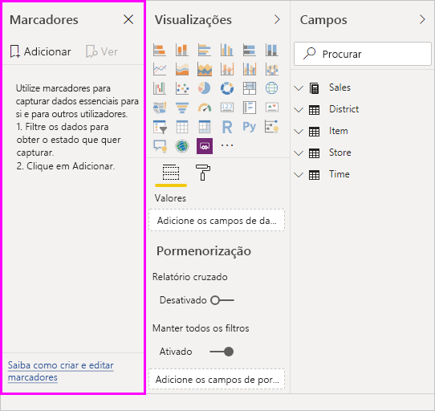

Existem muitas utilizações de marcadores. Por exemplo, pode utilizar os marcadores para controlar o seu próprio progresso de criação de relatórios (os marcadores são fáceis de adicionar, eliminar e mudar o nome) e pode criar uma apresentação do PowerPoint que utilize marcadores por ordem, contando assim uma história com o seu relatório. 

> [!TIP]
> Para obter informações sobre como utilizar marcadores pessoais no serviço Power BI, veja [Anunciar marcadores pessoais no serviço Power BI](https://powerbi.microsoft.com/blog/announcing-personal-bookmarks-in-the-power-bi-service/). 

## Utilizar marcadores
Para utilizar marcadores, selecione o separador **Ver** do friso Power BI Desktop e, em seguida, selecione o **Painel de Marcadores**. 

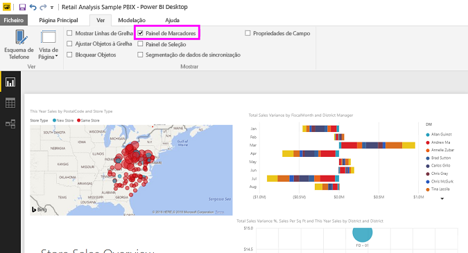

Quando criar um marcador, os elementos seguintes são guardados com o marcador:

* Página atual
* Filtros
* Segmentação de Dados, incluindo o tipo de segmentação de dados (por exemplo, lista pendente ou lista) e o estado da segmentação de dados
* Estado da seleção do elemento visual (por exemplo, os filtros de realce cruzado)
* Sequência de ordenação
* Localização de agregação
* Visibilidade de um objeto (através do painel **Seleção**)
* Os modos de detalhe ou **Em Destaque** de qualquer objeto visível

Configure uma página de relatório conforme quiser que apareça no marcador. Depois de a página de relatório e dos elementos visuais serem dispostos como pretende, selecione **Adicionar** no painel **Marcadores** para adicionar um marcador. 

O Power BI Desktop cria um marcador e atribui-lhe um nome genérico. Pode facilmente **Mudar o nome**, **Eliminar** ou **Atualizar** um marcador ao selecionar as reticências junto ao nome e, em seguida, ao selecionar uma ação no menu apresentado.

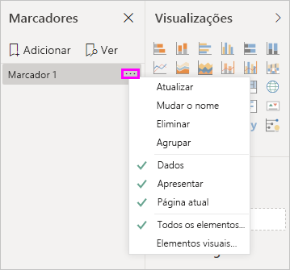

Depois de criar um marcador, apresente-o ao selecioná-lo no painel **Marcadores**. 

Também pode selecionar se cada marcador aplicará propriedades de **Dados** tais como filtros e segmentações de dados; propriedades de **Visualização**, tais como destaque e a sua visibilidade; bem como alterações à **Página atual** que apresenta a página que estava visível quando o marcador foi adicionado. Estas funcionalidades são úteis quando utiliza marcadores para alternar entre vistas de relatórios ou seleções de elementos visuais, caso em que pretenderá, provavelmente, desativar as propriedades dos dados para que os filtros não sejam repostos quando os utilizadores alternarem entre vistas ao selecionar um marcador. 

Para fazer essas alterações, selecione as reticências junto ao nome do marcador, em seguida, selecione ou anule a seleção das marcas de verificação próximas de **Dados**, **Visualização** e outros controlos. 

## Dispor marcadores
À medida que cria marcadores, pode considerar que a ordem pela qual são criados é diferente da ordem pela qual quer apresentá-los ao seu público. Não há problema, pode reorganizar facilmente a ordem dos marcadores.

- No painel **Marcadores**, arraste e solte os marcadores para alterar a respetiva ordem. 

   A barra amarela entre os marcadores designa onde o marcador arrastado será colocado.

   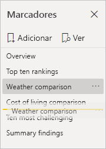

A ordem dos marcadores pode ser importante quando utiliza a funcionalidade **Ver** dos marcadores, conforme descrito na secção seguinte.

## Marcadores como uma apresentação de diapositivos
Quando tiver uma coleção de marcadores que queira apresentar, por ordem, pode selecionar **Ver** no painel **Marcadores** para iniciar uma apresentação de diapositivos.

Quando estiver no modo **Ver**, existem alguns aspetos a ter em consideração.

   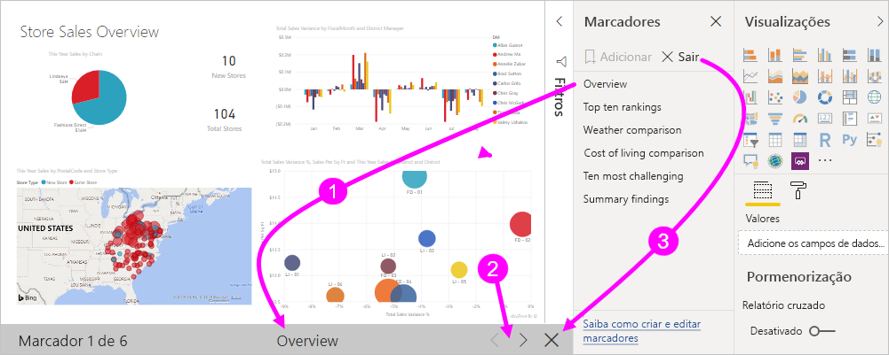

1. O nome do marcador é apresentado na barra de título, que aparece na parte inferior da tela.

2. A barra de título do marcador tem setas que lhe permitem mover para o marcador anterior ou seguinte.

3. Pode sair do modo **Ver** ao selecionar **Sair** no painel **Marcadores** ou ao selecionar o **X** na barra de título do marcador. 

Quando estiver no modo **Ver**, pode fechar o painel **Marcadores**, ao selecionar o **X** nesse painel, para dar mais espaço à sua apresentação. Quando estão no modo **Ver**, todos os elementos visuais são interativos e estão disponíveis para realce cruzado, tal como acontece quando interage diretamente com eles. 

## Visibilidade: Utilizar o painel Seleção
Relacionado com o painel **Marcadores**, o painel **Seleção** fornece uma lista de todos os objetos na página atual e permite-lhe selecionar o objeto e especificar se está visível. 

No painel **Seleção**, seleciona um objeto e alterna se o objeto está visível no momento, ao selecionar o ícone de olho à direita do objeto. 

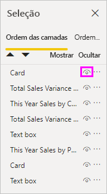

Quando adiciona um marcador, o estado de visibilidade de cada objeto também é guardado com base na respetiva definição no painel **Seleção**. 

É importante ter em atenção que as segmentações de dados continuam a filtrar uma página de relatório, independentemente de estarem visíveis. Como tal, pode criar vários marcadores diferentes, com diversas definições de segmentação de dados e fazer uma única página de relatório parecer diferente (e realçar diferentes informações) em vários marcadores.

> [!NOTE]
> Ao utilizar o painel **Seleção** em combinação com os marcadores, alterar a visibilidade de uma seleção resulta na reversão da sua visibilidade para a predefinição. Depois de efetuar estas alterações, pode clicar com o botão direito do rato num marcador e selecionar *atualizar* para atualizar a sua visibilidade.

## Marcadores para formas e imagens
Também pode ligar formas e imagens a marcadores. Com esta funcionalidade, quando seleciona num objeto, é apresentado o marcador associado a esse objeto. Este recurso pode ser especialmente útil quando trabalha com botões. Para obter mais informações, veja [Utilizar botões no Power BI](desktop-buttons.md). 

Para atribuir um marcador a um objeto: 

1. Selecione o objeto na tela do relatório. Em seguida, no painel **Formatar forma** que aparece, coloque o controlo de deslize **Ação** na posição **Ativado**.

2. Expanda a secção **ação**. Em **Tipo**, selecione **Marcador**.

3. Em **Marcadores**, selecione um marcador.

   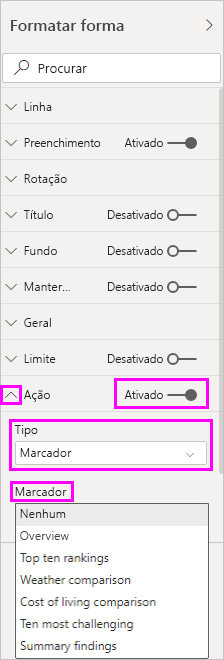

Existem todos os tipos de coisas interessantes que pode fazer com marcadores ligados a objetos. Pode criar um índice visual da página de relatório ou pode fornecer diferentes vistas (por exemplo, tipos visuais) dessas mesmas informações.

Quando estiver no modo de edição, prima **Ctrl** e selecione a ligação para a seguir. Quando não estiver no modo de edição, selecione o objeto para seguir a ligação. 

## Grupos de marcadores

A partir da versão de agosto de 2018 do Power BI Desktop, poderá criar e utilizar grupos de marcadores. Um grupo de marcadores é uma coleção de marcadores que especifica e que pode ser apresentada e organizada como um grupo. 

Para criar um grupo de marcadores: 
1. Prima **Ctrl** e selecione os marcadores que pretende incluir no grupo. 

2. Selecione as reticências ao lado dos marcadores selecionados e, em seguida, selecione **Grupo** no menu que aparece.

   

O Power BI Desktop dá automaticamente o nome ao grupo *Grupo 1*. Pode selecionar as reticências ao lado deste nome, selecionar **Mudar o Nome** e renomeá-lo como quiser.

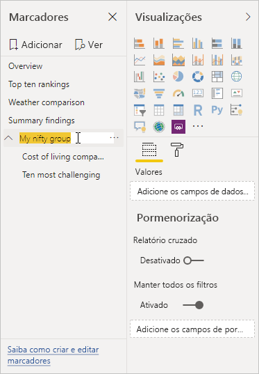

Tal como qualquer grupo de marcadores, expandir o nome do grupo de marcadores só expande ou fecha esse grupo e não representa um marcador individual. 

Ao utilizar a funcionalidade **Ver** dos marcadores, aplicam-se os seguintes detalhes:

* Se o marcador selecionado estiver num grupo quando selecionar **Ver** nos marcadores, apenas os marcadores *nesse grupo* serão apresentados na sessão de visualização. 

* Se o marcador selecionado não estiver num grupo, ou se estiver no nível superior (como o nome de um grupo de marcadores), todos os marcadores de todo o relatório serão apresentados, incluindo os marcadores em qualquer grupo. 

Para desagrupar os marcadores: 
1. Selecione qualquer marcador num grupo e selecione as reticências. 

2. Selecione **Desagrupar** no menu que é apresentado.

   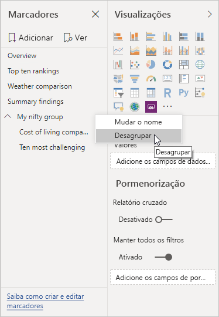

   Selecionar **Desagrupar** em qualquer marcador de um grupo removerá todos os marcadores do grupo; elimina o grupo, mas não os marcadores em si. 

Para remover um único marcador de um grupo: 
1. **Desagrupe** qualquer membro desse grupo, o que elimina todo o agrupamento. 

2. Selecione os membros que pretende incluir no novo grupo ao premir **Ctrl** e selecionar cada marcador, e selecione novamente **Grupo**. 

## Utilizar o modo Em Destaque
Outra funcionalidade lançada com os marcadores é o modo *Em Destaque*. Com o modo Em Destaque, pode chamar a atenção para um gráfico específico, por exemplo, quando apresentar os seus marcadores no modo **Ver**.

Vamos comparar o modo Em Destaque com o modo de detalhe para ver as diferenças:

1. Com o modo de detalhe, seleciona o ícone **Modo de detalhe** de um elemento visual, o que faz com que o elemento visual preencha a tela inteira.

2. Com o modo Em Destaque, seleciona o modo **Em Destaque** das reticências de um elemento visual para realçar um elemento visual no seu tamanho original, o que faz com que todos os outros visuais na página se realcem à transparência próxima. 

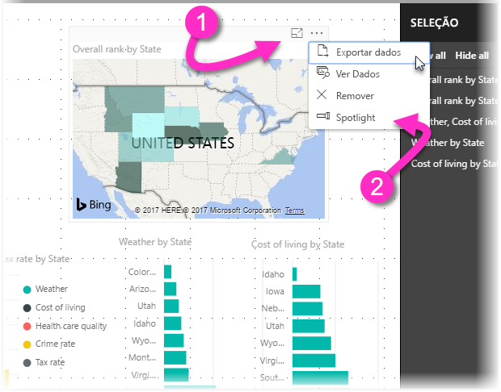

Quando seleciona o ícone **Modo de detalhe** do elemento visual na imagem anterior, a página aparece da seguinte maneira:

Em contrapartida, quando o modo **Em Destaque** é selecionado no menu de reticências do elemento visual, a página aparece como se segue:

Se o modo de detalhe ou o modo Em Destaque for selecionado quando adiciona um marcador, esse modo será mantido no marcador.

## Marcadores no serviço Power BI
Quando publica um relatório no serviço Power BI com, pelo menos, um marcador, pode ver e interagir com esses marcadores no serviço Power BI. Quando os marcadores estão disponíveis num relatório, pode ver os painéis **Seleção** e **Marcadores** ao selecionar **Ver** > **painel de Seleção** ou **Ver** > **painel Marcadores**. 

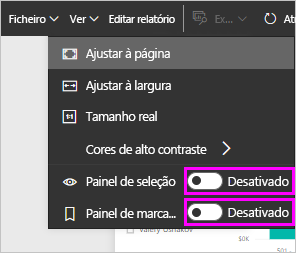

No serviço Power BI, o painel **Marcadores** funciona tal como no Power BI Desktop, incluindo a capacidade de selecionar **Ver** para mostrar os marcadores por ordem, como uma apresentação de diapositivos.

Utilize a barra de título do marcador cinzento, em vez das setas pretas, para navegar pelos marcadores. (As setas pretas permitem-lhe deslocar-se nas páginas do relatório, não nos marcadores.)

## Ativar a pré-visualização de marcadores (versões anteriores a março de 2018)
A partir da versão de março de 2018 do Power BI Desktop, os marcadores estarão disponíveis para todos os utilizadores. 

Recomendamos sempre que atualize para a versão mais recente. Porém, se tiver uma versão anterior do Power BI Desktop, pode experimentar a nova funcionalidade de marcadores a partir da versão de outubro de 2017 do Power BI Desktop e para relatórios compatíveis com marcadores, também no serviço Power BI. 

Para ativar a funcionalidade dos marcadores de pré-visualização: 

1. Selecione **Ficheiro** > **Opções e Definições** > **Opções** > **Funcionalidades de Pré-visualização** e, em seguida, selecione **Marcadores**. 

   

2. Reinicie Power BI Desktop para ativar a versão de pré-visualização dos marcadores.

## Limitações e considerações
Nesta versão das funcionalidades dos marcadores, existem algumas limitações e considerações a não esquecer.

* A maioria dos elementos visuais do Power BI deve funcionar devidamente com a marcação. Contudo, caso se depare com problemas com um marcador e um elemento visual personalizado, contacte o criador desse elemento visual personalizado e peça-lhe para adicionar suporte para marcadores ao elemento visual. 
* Se adicionar um elemento visual numa página de relatório depois de criar um marcador, este é apresentado no estado predefinido. Ou seja, isto também significa que se apresentar uma segmentação de dados numa página onde criou anteriormente marcadores, esta irá estar no estado predefinido.
* Mover o elemento visual depois de ser criado um marcador será refletido automaticamente no marcador. 

## Próximos passos
Para obter mais informações sobre funcionalidades semelhantes ou como interagir com marcadores, veja os seguintes artigos:

* [Utilizar a pormenorização no Power BI Desktop](desktop-drillthrough.md)
* [Apresentar um mosaico do dashboard ou um elemento visual do relatório no modo de detalhe](../consumer/end-user-focus.md)
