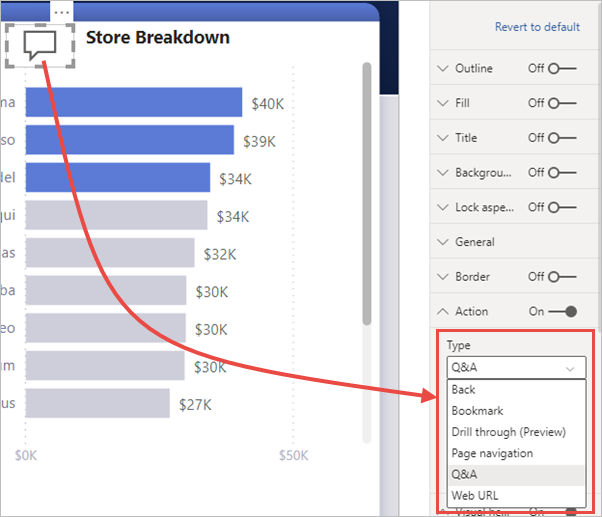

# Utilizar botões no Power BI
A utilização de **botões** no Power BI permite-lhe criar relatórios que têm um comportamento semelhante às aplicações e, deste modo, poderá criar um ambiente apelativo onde os utilizadores podem pairar o rato, clicar e ter uma maior interação com os conteúdos do Power BI. Pode adicionar botões a relatórios no **Power BI Desktop** e no **serviço Power BI**. Quando partilha os seus relatórios no serviço Power BI, estes fornecem uma experiência semelhante a uma aplicação aos seus utilizadores.

## Criar botões em relatórios

### Criar um botão no Power BI Desktop

Para criar um botão no **Power BI Desktop**, no friso **Inserir**, selecione **Botões** e será apresentado um menu pendente, onde poderá selecionar o botão pretendido a partir de um conjunto de opções, conforme indicado na imagem seguinte. 

### Criar um botão no serviço Power BI

Para criar um botão no **serviço Power BI**, abra o relatório na Vista de edição. Selecione **Botões** na barra de menus superior e será apresentado um menu pendente, onde poderá selecionar o botão pretendido a partir de um conjunto de opções, conforme indicado na imagem seguinte. 

## Personalizar um botão

Quer crie o botão no Power BI Desktop ou no serviço Power BI, o resto do processo será igual. Quando seleciona o botão na tela do relatório, o painel **Visualizações** apresenta-lhe as várias formas através das quais pode personalizar o botão para que este se ajuste às suas necessidades. Por exemplo, pode ativar ou desativar o **Texto do Botão** ao ativar o controlo de deslize nesse cartão do painel **Visualizações**. Também pode alterar o ícone e o preenchimento do botão, o título e a ação efetuada quando os utilizadores selecionam o botão num relatório, entre outras propriedades.

## Definir as propriedades de botão para predefinição (inativo), ao pairar com o rato ou quando selecionado

Os botões no Power BI têm três estados: predefinição (a forma como são apresentados quando o rato não está a pairar sobre eles ou quando não estão selecionados), ao pairar com o rato ou quando selecionados (mais conhecido como *clicar*). Muitos dos cartões no painel **Visualizações** podem ser modificados individualmente com base nestes três estados, o que lhe dá uma grande flexibilidade para personalizar os seus botões.

Os seguintes cartões no painel **Visualizações** permitem-lhe ajustar a formatação ou o comportamento de um botão com base nos seus três estados:

* Texto do Botão
* Ícone
* Contorno
* Preenchimento

Para selecionar a forma como um botão deve ser apresentado em cada estado, expanda um desses cartões e selecione a lista pendente apresentada na parte superior do cartão. Na imagem seguinte, pode ver o cartão **Ícone** expandido, com a lista pendente selecionada para apresentar os três estados.

## Selecionar a ação para um botão

Pode selecionar qual a ação efetuada quando o utilizador seleciona um botão no Power BI. Pode aceder às opções para ações do botão a partir do cartão **Ação** no painel **Visualizações**.

Seguem-se as opções de ações do botão:

- **Anterior** leva o utilizador para a página anterior do relatório. Esta ação é útil para páginas de exploração.
- **Marcador** apresenta a página do relatório associada a um marcador que está definido como o relatório atual. Saiba mais sobre os [marcadores no Power BI](desktop-bookmarks.md). 
- A funcionalidade **Pormenorizar** leva o utilizador para uma página de pormenorização filtrada da seleção, sem utilizar marcadores. Saiba mais sobre os [botões de exploração em relatórios](desktop-drill-through-buttons.md).
- A **Navegação entre páginas** leva o utilizador para uma página diferente no relatório, também sem utilizar marcadores. Veja a secção [Criar navegação entre páginas](#create-page-navigation) neste artigo para obter mais informações.
- As **Perguntas e Respostas** abrem uma janela do **Explorador de Perguntas e Respostas**. 

Alguns botões têm uma ação predefinida selecionada automaticamente. Por exemplo, o botão **Perguntas e Respostas** seleciona automaticamente **Perguntas e Respostas** como a ação predefinida. Pode saber mais sobre o **Q&A Explorer** (Explorador de Perguntas e Respostas) ao consultar [esta mensagem do blogue](https://powerbi.microsoft.com/blog/power-bi-desktop-april-2018-feature-summary/#Q&AExplorer).

Pode experimentar ou testar os botões que criar para o seu relatório ao utilizar *Ctrl+Clique* no botão que pretende utilizar. 

## Criar navegação entre páginas

Com o tipo de **Ação** **Navegação entre páginas**, pode criar uma experiência de navegação sem ter de guardar ou gerir marcadores.

Para configurar um botão de navegação entre páginas, crie um botão com **Navegação entre páginas** como o tipo de ação e selecione a Página de **destino**.

Pode criar um painel de navegação personalizado e adicionar os botões de navegação. Assim, evita ter de editar e gerir marcadores se quiser alterar as páginas a apresentar no seu painel de navegação.

Além disso, pode formatar condicionalmente a descrição, tal como faz com outros tipos de botão.

## Definir o destino de navegação condicionalmente

Pode utilizar formatação condicional para definir o destino de navegação, com base na saída de uma medida. Por exemplo, pode querer poupar espaço na tela do relatório ao ter um único botão para navegar para diferentes páginas com base na seleção do utilizador.

:::image type="content" source="media/desktop-buttons/button-navigate-go.png" alt-text="Navegar com um botão Ir para":::
 
Para criar o exemplo acima mostrado, comece por criar uma tabela de coluna única com os nomes dos destinos de navegação:

:::image type="content" source="media/desktop-buttons/button-create-table.png" alt-text="Criar uma tabela":::

O Power BI utiliza uma combinação exata de cadeias para definir o destino de pormenorização, por isso, confirme que os valores introduzidos estão exatamente alinhados com os nomes de páginas de pormenorização.

Depois de criar a tabela, adicione-a à página como uma segmentação de dados de seleção única:

:::image type="content" source="media/desktop-buttons/button-navigate-slicer.png" alt-text="Segmentação de dados de navegação":::

Em seguida, crie um botão de navegação entre páginas e selecione a opção de formatação condicional do destino:

:::image type="content" source="media/desktop-buttons/button-set-page-nav-destination.png" alt-text="Botão de navegação entre páginas":::
 
Selecione o nome da coluna que criou, neste caso, **Selecionar um destino**:

:::image type="content" source="media/desktop-buttons/button-select-destination.png" alt-text="Selecionar um destino":::

Agora, o botão permite navegar para páginas diferentes, dependendo da seleção do utilizador.

:::image type="content" source="media/desktop-buttons/button-navigate-go.png" alt-text="Navegar com um botão Ir para":::
 
### Formas e imagens para a navegação

A ação de navegação entre páginas é suportada para formas e imagens, e não apenas botões. Veja a seguir um exemplo que utiliza uma das formas incorporadas:

:::image type="content" source="media/desktop-buttons/button-navigation-arrow.png" alt-text="Utilizar uma seta para a navegação":::
 
Veja seguir um exemplo que utiliza uma imagem:

:::image type="content" source="media/desktop-buttons/button-navigation-image.png" alt-text="Utilizar uma imagem para a navegação":::
 
## Os botões suportam imagens de preenchimento

Os botões suportam imagens de preenchimento. Pode personalizar o aspeto e a funcionalidade do botão com imagens de preenchimento combinadas com os estados de botão incorporados: predefinição, ao pairar, ao premir e desativado (para pormenorizar).

:::image type="content" source="media/desktop-drill-through-buttons/drill-through-fill-images.png" alt-text="Imagens de preenchimento do botão de pormenorização":::

Defina **Preencher** como **Ativado** e, em seguida, crie imagens para os diferentes estados.

:::image type="content" source="media/desktop-drill-through-buttons/drill-through-fill-state-settings.png" alt-text="Definições da imagem de preenchimento":::

## Próximos passos
Para obter mais informações sobre funcionalidades semelhantes ou como interagir com botões, veja os artigos seguintes:

* [Utilizar a exploração em relatórios do Power BI](desktop-drillthrough.md)
* [Utilizar marcadores para partilhar informações e criar histórias no Power BI](desktop-bookmarks.md)
* [Criar um botão de pormenorização](desktop-drill-through-buttons.md)

