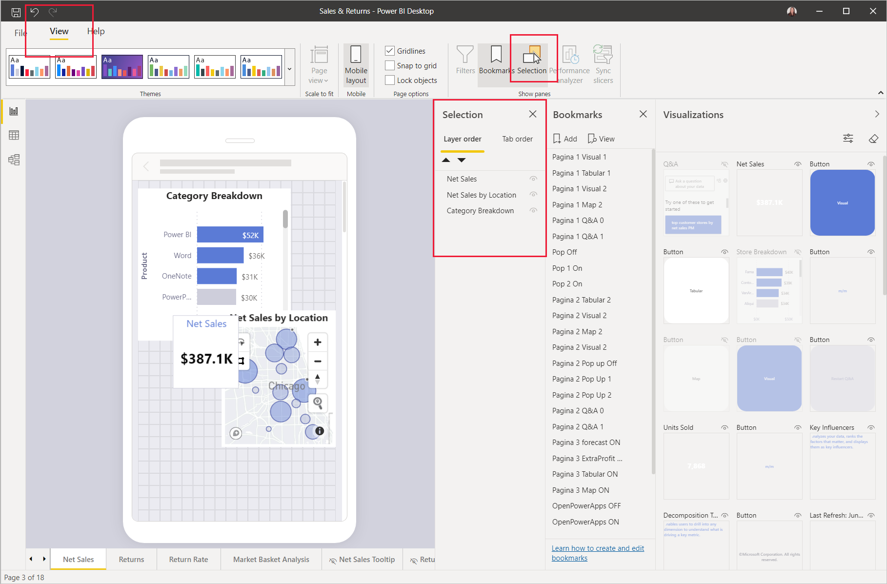
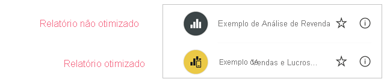

# Otimizar relatórios do Power BI para a aplicação móvel

Os utilizadores da aplicação móvel podem ver qualquer página de relatório do Power BI na orientação horizontal. No entanto, os autores do relatório podem criar uma vista adicional, otimizada para os dispositivos móveis, que é apresentada na orientação vertical. Esta opção de design, disponível no Power BI Desktop e no serviço Power BI, permite aos autores selecionarem e reorganizem apenas os elementos visuais que fazem sentido para os utilizadores de dispositivos móveis em movimento.

O Power BI proporciona uma série de funcionalidades que o ajudam a criar versões otimizadas para dispositivos móveis dos relatórios:
* Uma vista de esquema para dispositivos móveis, onde pode criar o relatório otimizado para dispositivos móveis ao arrastar e largar elementos visuais numa tela de emulador do telemóvel.
* Elementos visuais e segmentações que podem ser otimizados para utilização nos ecrãs pequenos dos telemóveis.

Estas capacidades tornam possível conceber e criar relatórios atraentes e interativos otimizados para dispositivos móveis.

## Criar uma versão vertical de uma página de relatório otimizada para dispositivos móveis

**Pré-requisito**: O primeiro passo consiste em conceber e criar o relatório na vista Web normal. Após criar o relatório, poderá otimizá-lo para telemóveis e tablets.

Para criar a vista otimizada para dispositivos móveis, abra o relatório no Power BI Desktop ou no serviço Power BI. Quando o relatório estiver aberto, aceda à vista de esquema para dispositivos móveis:
   * No Power BI Desktop, selecione o friso **Vista** e escolha **Esquema para dispositivos móveis**.
   * No serviço Power BI, escolha **Editar relatório > Esquema para dispositivos móveis**. Se a opção Editar não estiver visível, procure em **Mais opções (...)** .

   Verá uma tela deslocável em forma de telefone e um painel **Visualizações**, que lista todos os elementos visuais que estão na página do relatório original.

* Cada elemento visual no painel **Visualizações** é apresentado com o nome para uma identificação fácil.
* Cada elemento visual também tem um indicador de visibilidade. O indicador de visibilidade de um elemento visual muda dependendo do estado de visibilidade do elemento visual no estado atual da vista do relatório Web. O indicador de visibilidade é útil ao trabalhar com marcadores.

   

## Adicionar elementos visuais à tela de esquema para dispositivos móveis
Para adicionar um elemento visual ao esquema para dispositivos móveis, arraste-o do painel **Visualizações** para a tela do telemóvel. Quando arrasta um elemento visual para a tela, este é ajustado para a grelha. Em alternativa, pode fazer duplo clique no elemento visual no painel Visualizações para o adicionar à tela.

Pode adicionar alguns ou todos os elementos visuais da página de relatório Web à página de relatório otimizada para dispositivos móveis. Só pode adicionar cada elemento visual uma vez e não precisa de incluir todos os elementos visuais.

>[!NOTE]
> Pode arrastar e largar elementos visuais ocultos na tela. Serão adicionados, mas não apresentados, exceto se o estado de visibilidade for alterado na vista do relatório Web atual.

Os elementos visuais podem ser colocados em camadas uns sobre os outros para criar relatórios interativos com marcadores ou para criar relatórios atraentes ao aplicar elementos visuais em camadas sobre as imagens. Pode alterar a ordem das camadas dos elementos visuais no [painel Seleção](#set-the-layering-order-of-visuals-on-the-mobile-layout-canvas).

Após colocar um elemento visual na tela, poderá redimensioná-lo ao arrastar as alças que aparecem à volta da extremidade do elemento visual quando o seleciona. Para manter a proporção do elemento visual durante o redimensionamento, prima a tecla **Shift** enquanto arrasta as alças de redimensionamento.

A imagem abaixo ilustra o arrastar e largar de elementos visuais do painel **Visualizações** para a tela, bem como o redimensionamento e a sobreposição de alguns deles.

   

A grelha de relatório de telemóvel é dimensionada nos telemóveis de tamanhos diferentes, pelo que o relatório é apresentado corretamente em ecrãs pequenos e grandes.

## Definir a ordem das camadas dos elementos visuais na tela de esquema para dispositivos móveis

De cada vez que arrasta um elemento visual para a tela, o mesmo é adicionado na respetiva camada sobre quaisquer outros elementos visuais que já estejam na tela. O painel **Seleção** permite-lhe alterar a ordem das camadas.

Para abrir o painel **Seleção**, clique no botão **Seleção** na secção **Mostrar painéis** no separador **Vista**. 

O painel **Seleção** lista todos os elementos visuais na tela. A ordem da lista reflete a ordenação das camadas na tela: o primeiro elemento visual listado está na camada superior, o último elemento visual listado está na camada inferior. Para alterar a ordem, pode arrastar e soltar um elemento visual para outro lugar na lista ou selecionar um elemento visual e utilizar os botões de seta para movê-lo para cima ou para baixo.

O painel **Seleção** também tem uma indicação de visibilidade para cada elemento visual na lista, mas não é possível alterar a visibilidade na vista de esquema para dispositivos móveis. Tal tem de ser feito na vista normal de esquema para a Web.

## Remover elementos visuais da tela do esquema para dispositivos móveis
Para remover um elemento visual do esquema para dispositivos móveis, clique no **X** no canto superior direito do elemento visual na tela do telemóvel ou selecione o elemento visual e prima **Eliminar**.

Pode remover todas as visualizações da tela ao clicar na borracha no painel **Visualização**.

A remoção dos elementos visuais da tela do esquema para dispositivos móveis remove-os apenas da tela. Os elementos visuais ainda aparecem no painel de visualização, e o relatório original permanece inalterado.

## Configurar os elementos visuais e as segmentações de dados para utilização nos relatórios otimizados para dispositivos móveis

### Visuais

Por predefinição, muitos elementos visuais, particularmente elementos visuais do tipo gráfico, são reativos,  o que significa que são dinamicamente alterados para apresentarem a quantidade máxima de dados e informações, independentemente do tamanho do ecrã.

À medida que o elemento visual muda de tamanho, o Power BI dá prioridade aos dados. Por exemplo, pode remover o preenchimento e mover a legenda para a parte superior do elemento visual automaticamente, para que o elemento visual permaneça informativo mesmo enquanto fica mais pequeno.

 
Se por algum motivo quiser desativar a capacidade de resposta, poderá fazê-lo na secção **Geral** das definições de formato do elemento visual.

### Segmentações

As segmentações de dados disponibilizam uma filtragem na tela dos dados de relatório. Quando conceber segmentações de dados no modo de criação de relatórios normal, pode modificar algumas definições de segmentação de dados para torná-las mais utilizáveis nos relatórios otimizados para dispositivos móveis:
* Pode decidir se permite que os leitores de relatórios selecionem apenas um item ou vários itens.
* Pode tornar as segmentações de dados verticais, horizontais ou reativas (as segmentações de dados reativas devem ser horizontais).

Se tornar a segmentação reativa, ao alterar o seu tamanho e forma esta mostrará mais ou menos opções. Pode aumentá-la ou diminui-la na vertical ou na horizontal. Se a diminuir muito, esta transforma-se num ícone de filtro na página do relatório.

 
Leia mais sobre a [criação de segmentações de dados reativas](power-bi-slicer-filter-responsive.md).

## Publicar um relatório otimizado para dispositivos móveis
Para publicar uma versão de um relatório otimizada para dispositivos móveis, [publique o relatório principal do Power BI Desktop para o serviço Power BI](desktop-upload-desktop-files.md). Publica assim a versão otimizada para dispositivos móveis ao mesmo tempo.

## Ver relatórios otimizados e não otimizados num telemóvel ou tablet

Nas aplicações móveis do Power BI, os relatórios otimizados para dispositivos móveis são indicados por um ícone especial.

Nos telemóveis, a aplicação deteta automaticamente se o relatório está ou não otimizado para dispositivos móveis.
* Se existir um relatório otimizado para dispositivos móveis, a aplicação abre automaticamente o relatório no modo otimizado para dispositivos móveis.
* Se não existir um relatório otimizado para dispositivo móvel, o relatório será aberto na vista horizontal não otimizada.

Manter um telemóvel numa orientação horizontal abre o relatório na vista não otimizada com o esquema do relatório original, independentemente de o relatório estar ou não otimizado.

Se otimizar apenas algumas páginas, quando os leitores acederem a uma página não otimizada, ser-lhes-á pedido que mudem para a vista horizontal. Virar o telemóvel ou o tablet de lado permitirá que vejam a página no modo horizontal. [Leia mais sobre como interagir com relatórios do Power BI otimizados para o modo vertical](../consumer/mobile/mobile-apps-view-phone-report.md).

## Considerações ao criar esquemas otimizados para dispositivos móveis
* Para relatórios com várias páginas, pode otimizar todas as páginas ou apenas algumas.
* Se tiver definido uma cor de fundo para uma página de relatório, o relatório otimizado para dispositivos móveis terá a mesma cor de fundo.
* Não pode modificar as definições de formato apenas para o relatório otimizado para dispositivos móveis. A formatação é consistente entre os esquemas principal e de dispositivo móvel. Por exemplo, os tamanhos dos tipos de letra serão idênticos.
* Para alterar um elemento visual, como alterar a formatação, o conjunto de dados, os filtros ou qualquer outro atributo, volte ao modo de criação de relatórios Web.

## Próximos passos
* [Criar uma vista de telemóvel de um dashboard no Power BI](service-create-dashboard-mobile-phone-view.md).
* [Ver relatórios do Power BI otimizados para o seu telemóvel](../consumer/mobile/mobile-apps-view-phone-report.md).
* [Documentação do Power BI sobre criação de relatórios e dashboards](./index.yml).
* Mais perguntas? [Experimente perguntar à Comunidade do Power BI](https://community.powerbi.com/).
