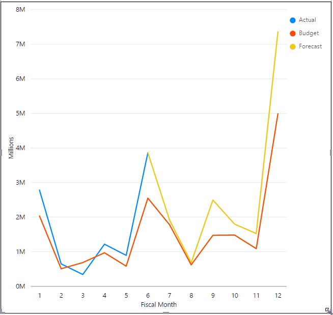

# Otimizar relatórios do Power BI para a aplicação móvel
Pode melhorar a experiência de visualização dos seus relatórios nas aplicações móveis ao criar um esquema vertical. No Power BI Desktop e no serviço Power BI, reorganiza e redimensiona os elementos visuais de relatórios para uma experiência ideal no modo vertical.  

Em vez disso, procura informações sobre como ver relatórios num dispositivo móvel? Experimente este início rápido, [Explorar dashboards e relatórios nas aplicações móveis do Power BI](../consumer/mobile/mobile-apps-quickstart-view-dashboard-report.md).

Pode criar [elementos visuais reativos](#optimize-a-visual-for-any-size) e [segmentações de dados reativas](#enhance-slicers-to-work-well-in-phone-reports) que sejam redimensionados em qualquer plataforma. Se adicionar filtros ao relatório, estes aparecem automaticamente no relatório otimizado.

## Mostrar uma versão vertical de uma página de relatório

Depois de criar um relatório, pode otimizá-lo para telemóveis e tablets.

1. Na vista **Relatório** do Power BI Desktop, no separador **Ver**, selecione **Esquema de Telemóvel**.  
   
    
   
    No serviço Power BI, selecione **Editar relatório** > **Esquema Móvel**.

    Vai ver uma tela em branco com a forma de um telefone. Todos os elementos visuais na página de relatório original estão listados no painel **Visualizações** à direita.

1. Para adicionar um elemento visual ao esquema de telemóvel, arraste-o do painel **Visualizações** para a tela do telemóvel.
   
    Os relatórios de telemóvel utilizam um esquema de grelha. À medida que arrasta os elementos visuais para a tela do telemóvel, estes ajustam-se a essa grelha.
   
    
   
    Pode adicionar alguns ou todos os elementos visuais do relatório principal à página de relatório de telemóvel. Só pode adicionar cada elemento visual uma vez e não tem de incluir todos os elementos visuais.

1. Pode redimensionar os elementos visuais na grelha, tal como faria para mosaicos em dashboards e dashboards móveis.
   
   A grelha de relatório de telemóvel é dimensionada nos telemóveis de tamanhos diferentes, pelo que o relatório é apresentado corretamente em ecrãs pequenos e grandes.
   
   

## Otimizar um elemento visual para qualquer tamanho
Pode definir os visuais no seu dashboard ou reportar como *reativo*. Os elementos visuais são dinamicamente alterados para apresentarem a quantidade máxima de dados e informações, independentemente do tamanho do ecrã. 

À medida que o elemento visual muda de tamanho, o Power BI dá prioridade à vista de dados. Por exemplo, pode remover o preenchimento e mover a legenda para a parte superior do elemento visual automaticamente, para que o elemento visual permaneça informativo mesmo enquanto fica mais pequeno.

Escolha se quer ativar a capacidade de resposta de cada elemento visual. Leia mais sobre como [otimizar elementos visuais](../visuals/power-bi-report-visualizations.md).

## Considerações ao criar esquemas de relatório de telemóvel
* Para relatórios com múltiplas páginas, pode otimizar todas as páginas ou apenas algumas. 
* Se tiver definido uma cor de fundo para uma página de relatório, o relatório de telemóvel terá a mesma cor de fundo.
* Não pode modificar as definições de formatação apenas para o telemóvel. A formatação é consistente entre esquemas principais e de telemóvel. Por exemplo, os tamanhos dos tipos de letra serão idênticos.
* Para alterar um elemento visual, como alterar a formatação, o conjunto de dados, os filtros ou qualquer outro atributo, volte ao modo de criação de relatórios normal.
* O Power BI fornece títulos e nomes de página predefinidos para relatórios de telemóvel na aplicação móvel. Se tiver criado elementos visuais de texto para títulos e nomes de página no relatório, considere não os adicionar aos seus relatórios de telemóvel.     

## Remover um elemento visual do esquema de telemóvel
* Para remover um elemento visual, selecione o **X** no canto superior direito do elemento visual na tela do telemóvel ou selecione-o e prima **Delete**.
  
   A remoção deste elemento visual só o remove da tela do esquema de telemóvel. O elemento visual e o relatório original não são afetados.
  
   

## Melhorar as segmentações de dados para um correto funcionamento nos relatórios de telemóvel
As segmentações de dados disponibilizam uma filtragem na tela dos dados de relatório. Quando conceber segmentações de dados no modo de criação de relatórios normal, pode modificar algumas definições de segmentação de dados para torná-las mais utilizáveis nos relatórios de telemóvel:

* Decida se os leitores de relatórios podem selecionar apenas um ou múltiplos itens.
* Coloque uma caixa à volta da segmentação de dados para facilitar a análise do relatório.
* Torne a segmentação vertical, horizontal ou *reativa*. 

Se tornar a segmentação reativa, ao alterar o seu tamanho e forma esta mostrará mais ou menos opções. Pode aumentá-la ou diminui-la na vertical ou na horizontal. Se a diminuir muito, esta transforma-se num ícone de filtro na página do relatório. 

Leia mais sobre a [criação de segmentações de dados reativas](power-bi-slicer-filter-responsive.md).

## Publicar um relatório de telemóvel
Para publicar a versão para telemóvel de um relatório, pode [publicar o relatório principal do Power BI Desktop para o serviço Power BI](desktop-upload-desktop-files.md) e a versão para telemóvel publica em simultâneo.
  
Leia mais sobre [partilhas e permissões no Power BI](../collaborate-share/service-how-to-collaborate-distribute-dashboards-reports.md).

## Ver relatórios otimizados e não otimizados num telemóvel ou tablet
Em aplicações móveis em telemóveis, o Power BI deteta automaticamente os relatórios otimizados e não otimizados. Se existir um relatório otimizado para telemóvel, a aplicação de telemóvel do Power BI abre automaticamente o relatório no modo de relatório de telemóvel.

Se não existir um relatório otimizado para telemóvel, o relatório é aberto na vista horizontal não otimizada.  

Quando estiver num relatório de telemóvel, a alteração da orientação do telemóvel para horizontal abre o relatório na vista não otimizada com o esquema de relatório original, quer o relatório esteja ou não otimizado.

Se otimizar apenas algumas páginas, os leitores verão uma mensagem na vista vertical a indicar que o relatório se encontra disponível na vista horizontal.

Os leitores de relatórios podem colocar os telemóveis ou tablets de lado para ver a página no modo horizontal. Leia mais sobre como [interagir com relatórios do Power BI otimizados para o modo vertical](../consumer/mobile/mobile-apps-view-phone-report.md).

## Próximas etapas
* [Criar uma vista de telemóvel de um dashboard no Power BI](service-create-dashboard-mobile-phone-view.md).
* [Ver relatórios do Power BI otimizados para o seu telemóvel](../consumer/mobile/mobile-apps-view-phone-report.md).
* [Criar elementos visuais reativos otimizados para qualquer tamanho](../visuals/power-bi-report-visualizations.md).
* Mais perguntas? [Experimente perguntar à Comunidade do Power BI](https://community.powerbi.com/).
