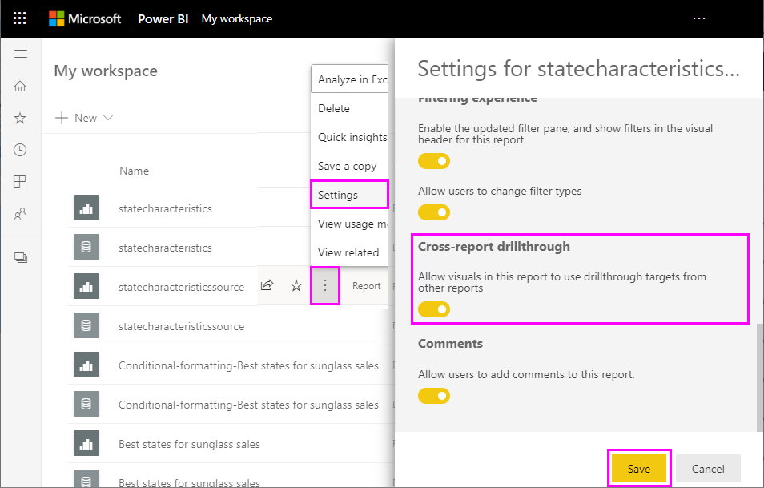

# Utilizar a pormenorização de relatórios cruzados no Power BI

Com a funcionalidade de *pormenorização de relatórios cruzados* do Power BI, pode saltar contextualmente de um relatório para outro na mesma aplicação ou área de trabalho do serviço Power BI. Pode utilizar a pormenorização de relatórios cruzados para associar dois ou mais relatórios com conteúdos relacionados e transmitir o contexto de filtro junto com a associação d relatórios cruzados. 

Para iniciar a pormenorização de relatórios cruzados, selecione um ponto de dados num *elemento visual de origem* de um *relatório de origem* e, em seguida, selecione o destino de **Pormenorização** de relatórios cruzados no menu de contexto. 

A ação de pormenorização abre a *página de destino* no *relatório de destino*. 

Este artigo mostra como configurar e utilizar a pormenorização de relatórios cruzados para relatórios do Power BI.

> [!NOTE]
> Não pode utilizar a pormenorização de relatórios cruzados com relatórios [Partilhados comigo](../collaborate-share/service-share-dashboards.md#share-a-dashboard-or-report) partilhados individualmente. Para utilizar a pormenorização de relatórios cruzados, tem de aceder aos relatórios nas áreas de trabalho das quais é membro.

## Ativar a pormenorização de relatórios cruzados

O primeiro passo na ativação da pormenorização de relatórios cruzados consiste em validar os modelos de dados dos relatórios de origem e de destino. Embora os esquemas em cada relatório não tenham de ser os mesmos, os campos que pretende transmitir têm de existir em ambos os modelos de dados. Os nomes dos campos e os nomes das tabelas a que pertencem têm de ser idênticos. As cadeias têm de coincidir e são sensíveis a maiúsculas e minúsculas.

Por exemplo, se quiser transmitir um filtro no campo **Estado** na tabela **E.U.A.** , ambos os modelos têm de ter uma tabela **E.U.A.** e um campo **Estado** dentro desta tabela. Caso contrário, terá de atualizar o nome do campo ou o nome da tabela no modelo subjacente. A atualização do nome a apresentar dos campos não funciona corretamente na pormenorização de relatórios cruzados.

Após validar os seus modelos, ative o relatório de origem para utilizar a pormenorização de relatórios cruzados. 

1. No Power BI Desktop, aceda a **Ficheiro** > **Opções e definições** > **Opções**. 
1. No painel de navegação esquerdo da janela **Opções**, na parte inferior da secção **Ficheiro atual**, selecione**Definições do relatório**. 
1. No canto inferior direito, em **Pormenorização de relatórios cruzados**, selecione **Permitir elementos visuais neste relatório para utilizar destinos de pormenorização dos outros relatórios**. 
1. Selecione **OK**. 
   
   

Também pode ativar a pormenorização de relatórios cruzados a partir do serviço Power BI.
1. No serviço Power BI, selecione a área de trabalho que contém os seus relatórios de origem e destino.
1. Junto ao nome do relatório de origem na lista da área de trabalho, selecione o símbolo **Mais opções** e, em seguida, selecione **Definições**. 
1. Junto à parte inferior do painel **Definições**, em **Pormenorização de relatórios cruzados**, selecione **Permitir elementos visuais neste relatório para utilizar destinos de pormenorização dos outros relatórios**. Em seguida, selecione **Guardar**.
   
   

## Configurar um destino de pormenorização de relatórios cruzados

A configuração de uma página de destino para a pormenorização de relatórios cruzados é semelhante à configuração de pormenorização dentro de um relatório. Ao ativar a pormenorização na página de destino, permite que os outros elementos visuais sejam direcionados para a página para pormenorização. Para criar a pormenorização num único relatório, veja [Utilizar a pormenorização no Power BI Desktop](desktop-drillthrough.md).

Pode configurar um destino para a pormenorização de relatórios cruzados no Power BI Desktop ou no serviço Power BI. 
1. Edite o ficheiro de destino e selecione a secção **Campos** do painel **Visualizações** na página de destino do relatório de destino. 
1. Em **Pormenorização**, defina **Relatórios cruzados** como **Ativado**. 
1. Arraste os campos que pretende utilizar como destinos de pormenorização para **Adicionar os campos de pormenorização aqui**. Para cada campo, selecione se quer permitir a pormenorização quando o campo é utilizado como uma categoria ou resumido como uma medida. 
1. Selecione se quer **Manter todos os filtros** para o elemento visual. Se não quiser transmitir os filtros aplicados ao elemento visual de origem para o elemento visual de destino, selecione **Desativado**.
   
   
   
1. Se estiver a utilizar a página apenas para pormenorização de relatórios cruzados, elimine o botão **Voltar** que é adicionado automaticamente à tela. O botão **Voltar** funciona apenas para a navegação dentro de um relatório. 
1. Após a página de destino ter sido configurada, guarde o relatório se estiver a utilizar o serviço Power BI ou guarde e publique o relatório se estiver a utilizar o Power BI Desktop.

Já está! Os relatórios estão prontos para a pormenorização de relatórios cruzados. 

## Utilizar a pormenorização de relatórios cruzados

Para utilizar a pormenorização de relatórios cruzados, selecione o relatório de origem no serviço Power BI. Em seguida, selecione um elemento visual que utiliza o campo de pormenorização da forma especificada quando configurou a página de destino. Clique com o botão direito do rato num ponto de dados para abrir o menu de contexto do elemento visual. Selecione **Pormenorização** e, em seguida, selecione o destino de pormenorização. Os destinos de pormenorização de relatórios cruzados são formatados como **Nome da página [Nome do relatório]** .

Verá os resultados na página de pormenorização de relatórios cruzados de destino tal como os configurou ao criar o destino. Os resultados são filtrados de acordo com as definições de pormenorização.

> [!IMPORTANT]
> O Power BI coloca em cache os destinos da pormenorização de relatórios cruzados. Se fizer alterações, certifique-se de que atualiza o browser caso não veja os destinos de pormenorização conforme esperado. 

Se definir **Manter todos os filtros** como **Ativado** quando configura a página de destino, o contexto de filtro do elemento visual de origem pode incluir o seguinte: 

- Filtros de nível de relatório, página e elemento visual que afetam o elemento visual de origem 
- Filtro cruzado e realce cruzado que afetam o elemento visual de origem 
- Segmentações de dados e segmentações de dados síncronas na página
- Parâmetros de URL

Ao aceder ao relatório de destino para a pormenorização, o Power BI aplica apenas filtros para os campos com correspondências exatas das cadeias de carateres do nome de campo e do nome de tabela. 

O Power BI não aplica filtros fixos do relatório de destino, mas aplica o seu marcador pessoal padrão, se tiver um. Por exemplo, se o marcador pessoal predefinido incluir um filtro ao nível do relatório para *País = E.U.A.* , o Power BI aplicará este filtro antes de aplicar o contexto do filtro do elemento visual de origem. 

Para a pormenorização de relatórios cruzados, o Power BI transmite o contexto do filtro a páginas predefinidas no relatório de destino. O Power BI não transmite o contexto do filtro das páginas de descrição, pois as páginas de descrição são filtradas com base no elemento visual de origem que invoca a descrição.

Se quiser regressar ao relatório de origem após a ação de pormenorização dos relatórios cruzados, utilize o botão **Voltar** do browser. 

## Considerações e limitações

A pormenorização de relatórios cruzados não funciona em relatórios do Power BI no Power BI Report Server.

## Próximos passos

Poderá também estar interessado nos seguintes artigos:

- [Segmentação de Dados no Power BI](../visuals/power-bi-visualization-slicers.md)
- [Utilizar a pormenorização no Power BI Desktop](desktop-drillthrough.md)
