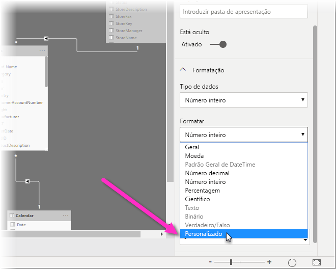
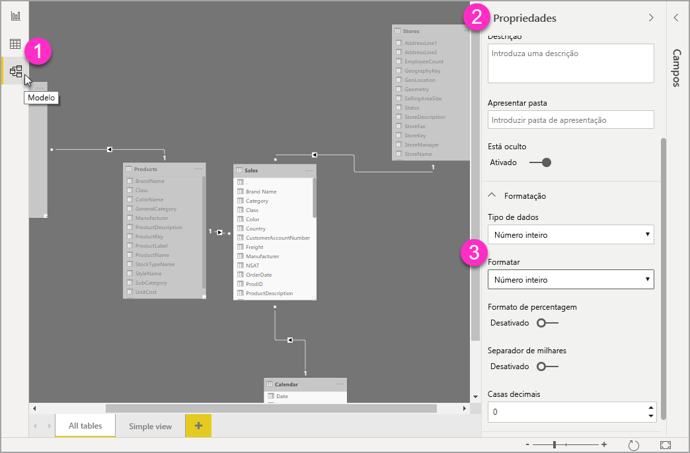
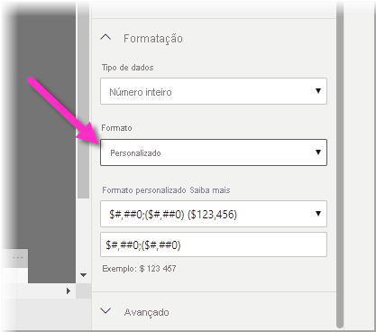

# Utilizar cadeias de formato personalizado no Power BI Desktop

Com as cadeias de formato personalizado no **Power BI Desktop**, pode personalizar o aspeto dos campos nos elementos visuais e ter a certeza de que os relatórios têm o aspeto que quer que tenham.

## Como utilizar as cadeias de formato personalizado

Para criar cadeias de formato personalizado, selecione a vista **Modelagem** e, em seguida, selecione **Formato** no painel **Propriedades**.

Depois de ter selecionado **Personalizado** na lista pendente **Formato**, pode selecionar numa lista de cadeias de formato utilizadas com frequência. 

## Sintaxe suportada de formato personalizado

As cadeias de formato personalizado seguem a sintaxe de estilo VBA, comum ao Excel e a outros produtos da Microsoft, mas não suportam todas as sintaxes utilizadas noutros produtos. 

As tabelas a seguir definem a sintaxe suportada no Power BI.

A tabela a seguir mostra os **símbolos de Data** suportados:

| **Símbolo** | **Intervalo** |
| --- | --- |
| _d_ | 1-31 (dia do mês, sem zero à esquerda) |
| _dd_ | 01-31 (dia do mês, com um zero à esquerda) |
| _m_ | 1-12 (mês do ano, sem zero à esquerda, a começar em janeiro = 1) |
| _mm_ | 01-12 (mês do ano, com um zero à esquerda, a começar em janeiro = 01) |
| _mmm_ | Apresenta os nomes dos meses abreviados (os nomes de meses islâmicos não têm abreviaturas) |
| _mmmm_ | Apresenta os nomes completos dos meses |
| _yy_ | 00-99 (últimos dois dígitos do ano) |
| _yyyy_ | 100-9999 (ano de três ou quatro dígitos) |

A tabela a seguir mostra os **símbolos de Hora** suportados:

| **Símbolo** | **Intervalo** |
| --- | --- |
| _h_ | 0- 23 (1-12 com &quot;AM&quot; ou &quot;PM&quot; acrescentado) (hora do dia, sem zero à esquerda) |
| _hh_ | 00-23 (01-12 com &quot;AM&quot; ou &quot;PM&quot; acrescentado) (hora do dia, com um zero à esquerda) |
| _n_ | 0-59 (minuto da hora, sem zero à esquerda) |
| _nn_ | 00-59 (minuto da hora, com um zero à esquerda) |
| _m_ | 0-59 (minuto da hora, sem zero à esquerda). Apenas se precedido por _h_ ou _hh_ |
| _mm_ | 00-59 (minuto da hora, com um zero à esquerda). Apenas se precedido por _h_ ou _hh_ |
| _s_ | 0-59 (segundo do minuto, sem zero à esquerda) |
| _ss_ | 00-59 (segundo do minuto, com um zero à esquerda) |

Pode ver um [exemplo](/office/vba/language/reference/user-interface-help/format-function-visual-basic-for-applications#example) de como formatar as cadeias de valores personalizadas.

Uma expressão de formato definida pelo utilizador para números pode ter de uma a três secções separadas por ponto e vírgula. Se incluir o ponto e vírgula sem nada entre as secções, a seção ausente não será apresentada (será &quot;&quot;). Se o ponto e vírgula não for especificado, a secção utilizará o formato positivo.

Aqui estão exemplos de formatos diferentes para diferentes cadeias de valores:

|   | **Cadeias de Formato** |   |   |   |
| --- | --- | --- | --- | --- |
| **Valores** | **0.00;-0.0;&quot;Zero&quot;** | **0.00;;** | **0.00;-0.0;** | **0.00;** |
| **-1.234** | -1.2 | &quot;&quot; | -1.2 | &quot;&quot; |
| **0** | &quot;Zero&quot; | &quot;&quot; | &quot;&quot; | 0,00 |
| **1.234** | 1.23 | 1.23 | 1.23 | 1.23 |

A tabela a seguir identifica os **formatos de data e hora nomeados** predefinidos:

| **Nome do formato** | **Descrição** |
| --- | --- |
| **Data Geral** | Apresenta uma data e/ou hora, por exemplo, 4/3/93 05:34 PM. Se não houver nenhuma parte fracionária, apresentará apenas uma data, por exemplo, 4/3/93. Se não houver nenhuma parte inteira, apresentará apenas a hora, por exemplo, 05:34 PM. A apresentação da data é determinada pelas definições do sistema. |
| **Data por Extenso** | Apresenta uma data com o formato de data por extenso do sistema. |
| **Data Abreviada** | Apresenta uma data com o formato de data abreviada do sistema. |
| **Hora por Extenso** | Apresenta uma hora com o formato de hora por extenso do sistema; inclui horas, minutos, segundos. |
| **Hora Abreviada** | Apresenta uma hora com o formato de 24 horas, por exemplo, 17:45. |

Formatos numéricos nomeados

A tabela a seguir identifica os **formatos numéricos nomeados** predefinidos:

| **Nome do formato** | **Descrição** |
| --- | --- |
| **Número Geral** | Apresenta o número sem o separador de milhares. |
| **Moeda** | Apresenta o número com o separador de milhares, se for apropriado; apresenta dois dígitos à direita do separador decimal. O resultado baseia-se nas definições de região do sistema. |
| **Fixo** | Apresenta pelo menos um dígito à esquerda e dois dígitos à direita do separador decimal. |
| **Padrão** | Apresenta o número com o separador de milhares, com pelo menos um dígito à esquerda e dois dígitos à direita do separador decimal. |
| **Percentagem** | Apresenta o número multiplicado por 100 com um sinal de percentagem ( **%** ) acrescentado à direita; apresenta sempre dois dígitos à direita do separador decimal. |
| **Científico** | Utiliza a notação científica padrão. |

A tabela a seguir identifica os carateres que pode utilizar para criar **formatos de data/hora definidos pelo utilizador**.

| **Caráter** | **Descrição** |
| --- | --- |
| ( **:** ) | Separador de hora. Em certas regiões, podem ser utilizados outros carateres para representar o separador de hora. O separador de hora separa as horas, os minutos e os segundos quando os valores das horas são formatados. O caráter real utilizado como separador de hora na saída formatada é determinado pelas definições do sistema. |
| ( **/** ) | Separador de data. Em certas regiões, podem ser utilizados outros carateres para representar o separador de data. O separador de data separa o dia, o mês e o ano quando os valores de data são formatados. O caráter real utilizado como separador de data na saída formatada é determinado pelas definições do sistema. |
| d | Apresenta o dia como um número sem um zero à esquerda (1-31). |
| dd | Apresenta o dia como um número com um zero à esquerda (01-31). |
| ddd | Apresenta o dia como uma abreviatura (Dom-Sáb). Localizado. |
| dddd | Apresenta o dia como um nome completo (Domingo-Sábado). Localizado. |
| m | Apresenta o mês como um número sem um zero à esquerda (1-12). Se o m seguir imediatamente h ou hh, será apresentado o minuto em vez do mês. |
| mm | Apresenta o mês como um número com um zero à esquerda (01-12). Se o m seguir imediatamente h ou hh, será apresentado o minuto em vez do mês. |
| mmm | Apresenta o mês como uma abreviatura (Jan-Dez). Localizado. |
| mmmm | Apresenta o mês como um nome completo (Janeiro-Dezembro). Localizado. |
| yy | Apresenta o ano como um número de 2 dígitos (00-99). |
| yyyy | Apresenta o ano como um número de 4 dígitos (100-9999). |
| h | Apresenta a hora como um número sem um zero à esquerda (0-23). |
| hh | Apresenta a hora como um número com um zero à esquerda (00-23). |
| n | Apresenta o minuto como um número sem um zero à esquerda (0-59). |
| nn | Apresenta o minuto como um número com um zero à esquerda (00-59). |
| t | Apresenta o segundo como um número sem um zero à esquerda (0-59). |
| ss | Apresenta o segundo como um número com um zero à esquerda (00-59). |
| AM/PM | Utiliza o relógio de 12 horas e apresenta AM em maiúsculas para qualquer hora antes do meio-dia; apresenta PM em maiúsculas para qualquer hora entre meio-dia e as 11:59 PM. |

A tabela a seguir identifica os carateres que pode utilizar para criar **formatos de número definidos pelo utilizador**.

| **Caráter** | **Descrição** |
| --- | --- |
| Nenhum | Apresenta o número sem qualquer formatação. |
| ( **0** ) | Marcador de posição do dígito. Apresenta um dígito ou um zero. Se a expressão tiver um dígito na posição onde o 0 surge na cadeia de formato, será apresentado; caso contrário, apresenta um zero nessa posição. Se o número tiver menos dígitos do que zeros (em ambos os lados do separador decimal) na expressão de formato, apresentará zeros à esquerda ou à direita. Se o número tiver mais dígitos à direita do separador decimal do que zeros à direita do separador decimal na expressão de formato, arredondará o número para tantas casas decimais quantos forem os zeros. Se o número tiver mais dígitos à esquerda do separador decimal do que zeros à esquerda do separador decimal na expressão de formato, apresentará os dígitos extras sem modificação. |
| ( **#** ) | Marcador de posição do dígito. Apresenta um dígito ou nada. Se a expressão tiver um dígito na posição onde o # surge na cadeia de formato, será apresentado; caso contrário, não apresentará nada nessa posição. Este símbolo funciona como o marcador de posição do dígito 0, exceto que os zero à esquerda e à direita não serão apresentados se o número tiver o mesmo número de dígitos ou menos dígitos do que os carateres # em ambos os lados do separador decimal na expressão de formato. |
| ( **.** ) | Marcador de posição decimal. Em certas regiões, é utilizada uma vírgula como separador decimal. O marcador de posição decimal determina quantos dígitos são apresentados à esquerda e à direita do separador decimal. Se a expressão de formato contiver apenas sinais de número à esquerda deste símbolo, os números inferiores a 1 começarão com um separador decimal. Para apresentar um zero à esquerda apresentados com números fracionários, utilize 0 como o primeiro marcador de posição de dígito à esquerda do separador decimal. O caráter real utilizado como um marcador de posição decimal na saída formatada depende do Formato de Número reconhecido pelo sistema. |
| ( **%)** | Marcador de posição de percentagem. A expressão é multiplicada por 100. O caráter de percentagem ( **%** ) é introduzido na posição onde aparece na cadeia de formato. |
| ( **,** ) | Separador dos milhares. Em certas regiões, é utilizado um ponto ou um espaço como separador dos milhares. O separador de milhares separa os milhares das centenas dentro de um número que tem quatro ou mais casas à esquerda do separador decimal. A utilização padrão do separador de milhares será especificada se o formato contiver um separador de milhares rodeado por marcadores de posição de dígitos (**0** ou **#** ). Dois separadores de milhares adjacentes ou um separador de milhares imediatamente à esquerda do separador decimal (se uma décima for ou não especificada) significa &quot;dimensionar o número ao dividi-lo por 1000, arredondando conforme necessário.&quot; Por exemplo, pode utilizar a cadeia de formato &quot;##0,,&quot; para representar 100 milhões como 100. Os números inferiores a 1 milhão são apresentados como 0. Dois separadores de milhares adjacentes em qualquer posição que não seja a imediatamente à esquerda do separador decimal são tratados simplesmente como especificar a utilização de um separador de milhares. O caráter real utilizado como o separador de milhares na saída formatada depende do Formato de Número reconhecido pelo sistema. |
| ( **:** ) | Separador de hora. Em certas regiões, podem ser utilizados outros carateres para representar o separador de hora. O separador de hora separa as horas, os minutos e os segundos quando os valores das horas são formatados. O caráter real utilizado como separador de hora na saída formatada é determinado pelas definições do sistema. |
| ( **/** ) | Separador de data. Em certas regiões, podem ser utilizados outros carateres para representar o separador de data. O separador de data separa o dia, o mês e o ano quando os valores de data são formatados. O caráter real utilizado como separador de data na saída formatada é determinado pelas definições do sistema. |
| ( **E- E+ e- e+** ) | Formato científico. Se a expressão de formato contiver pelo menos um marcador de posição de dígito (**0** ou **#** ) à direita de E-, E+, e- ou e+, o número será apresentado no formato científico e será introduzido E ou e entre o número e o expoente. O número de marcadores de posição de dígitos à direita determina o número de dígitos no expoente. Utilize E- ou e- para colocar um sinal de menos junto dos expoentes negativos. Utilize E+ ou e+ para colocar um sinal de menos junto dos expoentes negativos e um sinal de mais junto dos expoentes positivos. |
| **- + $**  ( ) | Apresenta um caráter literal. Para apresentar um caráter diferente de um dos carateres listados, preceda-o de uma barra invertida (\) ou coloque-o entre aspas duplas (&quot; &quot;). |
| ( * *\** ) | Apresenta o próximo caráter na cadeia de formato. Para apresentar um caráter que tenha um significado especial como um caráter literal, preceda-o por uma barra invertida (\). A própria barra invertida não é apresentada. Utilizar uma barra invertida é o mesmo que colocar o próximo caráter entre aspas duplas. Para apresentar uma barra invertida, utilize duas barras invertidas (\\). Exemplos de carateres que não podem ser apresentados como carateres literais são os carateres de formatação de data e hora (a, c, d, h, m, n, p, q, s, t, w, / e :), os carateres de formatação numérica (#, 0, %, E, e, vírgula e ponto) e os carateres de formatação de cadeia (@, &amp;, \&lt;, \&gt; e !). |
| (&quot;ABC&quot;) | Apresenta a cadeia de carateres entre aspas duplas (&quot; &quot;). |

## Próximos passos
Poderá também estar interessado nos seguintes artigos:

* [VBA format strings](/office/vba/language/reference/user-interface-help/format-function-visual-basic-for-applications#example) (Cadeias de formato VBA)
* [Medidas no Power BI Desktop](../transform-model/desktop-measures.md)
* [Tipos de dados no Power BI Desktop](../connect-data/desktop-data-types.md)
* [Formatação condicional em tabelas](desktop-conditional-table-formatting.md)