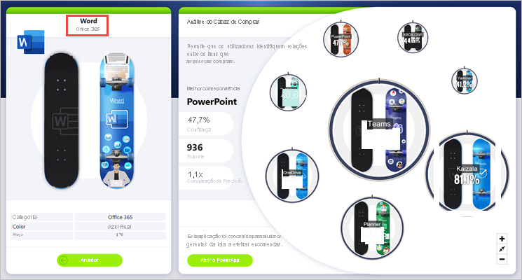
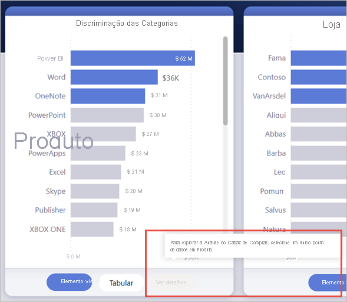
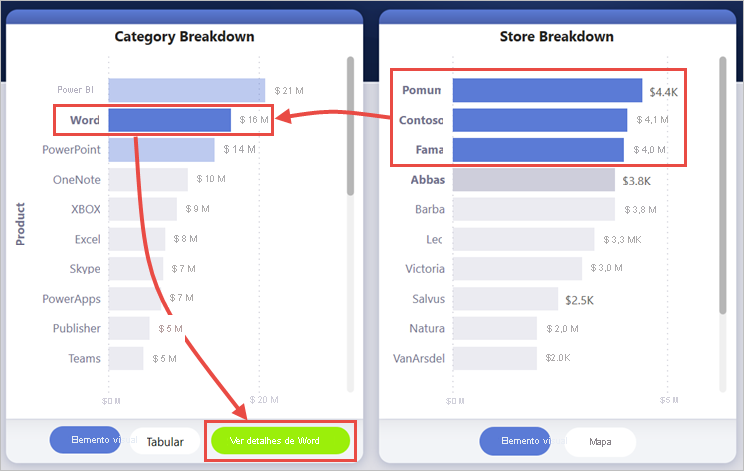
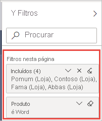
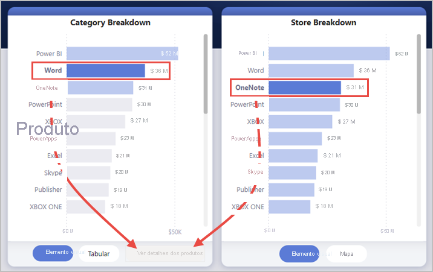
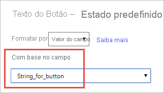
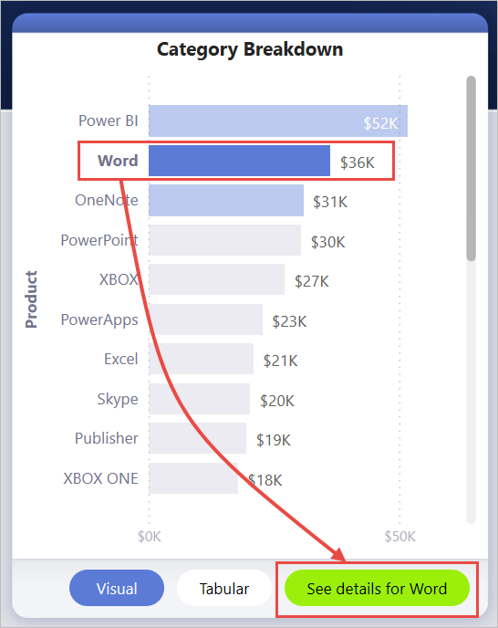

# <a name="create-a-drill-through-button-in-power-bi"></a>Criar um botão de exploração no Power BI

Pode criar um botão de *exploração* no Power BI, isto é, um botão que direciona para uma página com detalhes filtrados de acordo com um contexto específico.

Uma forma de explorar um relatório consiste em clicar com o botão direito do rato num elemento visual. Se quiser que a ação de exploração seja mais óbvia, pode optar por criar um botão de exploração. O botão pode aumentar a capacidade de deteção de cenários de exploração importantes nos seus relatórios. Pode determinar condicionalmente grande parte do aspeto e comportamento do botão. Por exemplo, pode mostrar texto diferente num botão se forem satisfeitas determinadas condições. Continue a ler para obter mais informações. 

Neste exemplo, após selecionar a barra do Word no gráfico, é ativado o botão **Ver detalhes**.


Quando seleciona o botão **Ver detalhes**, explora a página Market Basket Analysis. Como pode ver no elemento visual à esquerda, a página de exploração está agora filtrada para o Word.



## <a name="set-up-a-drill-through-button"></a>Configurar um botão de exploração

Para configurar um botão de exploração, primeiro tem de [configurar uma página de exploração válida](desktop-drillthrough.md) no seu relatório. Em seguida, tem de criar um botão com o tipo de ação **Explorar** e selecionar a página de exploração como **Destino**.

Como o botão de exploração tem dois estados (ativo e inativo), verá que existem duas opções de descrição.


Se deixar as caixas das descrições em branco, o Power BI irá gerar descrições automaticamente. Essas descrições são baseadas no destino e nos campos de exploração.

Segue-se um exemplo da descrição gerada automaticamente quando o botão está inativo:

"Para explorar Market Basket Analysis [a página de destino], selecione um ponto de dados único a partir de Product [o campo de exploração]."



Segue-se um exemplo da descrição gerada automaticamente quando o botão está ativo:

"Clique para explorar Market Basket Analysis [a página de destino]."


No entanto, se quiser fornecer descrições personalizadas, pode inserir uma cadeia estática. Também pode aplicar [formatação condicional às descrições](#set-formatting-for-tooltips-conditionally).

## <a name="pass-filter-context"></a>Transmitir o contexto do filtro

O botão funciona como a exploração normal: pode transmitir filtros em campos adicionais ao efetuar a filtragem cruzada dos elementos visuais que contêm o campo de exploração. Por exemplo, ao utilizar **Ctrl** + **clique** e a filtragem cruzada, pode transmitir múltiplos filtros em Store para a página de exploração, visto que as suas seleções efetuam a filtragem cruzada do elemento visual que contém Product, o campo de exploração:



Quando seleciona o botão de exploração, vê filtros em Store e Product a serem transmitidos para a página de destino:



### <a name="ambiguous-filter-context"></a>Contexto de filtro ambíguo

Como o botão de exploração não está associado a um único elemento visual, se a sua seleção for ambígua, o botão será desativado.

Neste exemplo, o botão está inativo porque os dois elementos visuais contêm uma única seleção em Product. Há ambiguidade em relação ao ponto de dados de um elemento visual ao qual se associa a ação de exploração:



## <a name="customize-formatting-for-disabled-buttons"></a>Personalizar a formatação dos botões inativos
Pode personalizar as opções de formatação do estado inativo dos botões de exploração.


:::image type="content" source="media/desktop-drill-through-buttons/drill-through-customize-disabled-button.png" alt-text="Personalizar a formatação dos botões inativos":::
 
As opções de formatação incluem:
- **Controlos do texto dos botões**: texto, cor, preenchimento, alinhamento, tamanho e família de tipos de letra

    :::image type="content" source="media/desktop-drill-through-buttons/drill-through-disabled-button-text.png" alt-text="Formatar o texto dos botões inativos":::

- **Controlos do preenchimento dos botões**: cor, transparência e *nova* imagem de preenchimento (mais detalhes sobre esta opção na secção seguinte)

    :::image type="content" source="media/desktop-drill-through-buttons/drill-through-disabled-button-fill.png" alt-text="Preenchimento dos botões inativos":::

- **Controlos do ícone**: forma, preenchimento, alinhamento, cor da linha, transparência e peso

    :::image type="content" source="media/desktop-drill-through-buttons/drill-through-disabled-button-icon.png" alt-text="Ícones dos botões inativos":::

- **Controlos do contorno**: cor, transparência, peso, contornos arredondados

     :::image type="content" source="media/desktop-drill-through-buttons/drill-through-disabled-button-outline.png" alt-text="Contorno dos botões inativos":::

## <a name="set-formatting-for-button-text-conditionally"></a>Definir a formatação do texto do botão condicionalmente
Pode utilizar a formatação condicional para alterar o texto do botão com base no valor selecionado de um campo. Para fazê-lo, tem de criar uma medida que tenha como resultado a cadeia pretendida, com base na função DAX SELECTEDVALUE.

Segue-se uma medida de exemplo que devolve "Ver detalhes de produto" se um único valor de Product NÃO for selecionado; caso contrário, devolve "Ver detalhes de [Product selecionado]":

```dax
String_for_button = If(SELECTEDVALUE('Product'[Product], 0) == 0, "See product details", "See details for " & SELECTEDVALUE('Product'[Product]))
```

Assim que criar esta medida, selecione a opção **Formatação condicional** para o texto do botão:


Em seguida, selecione a medida que criou para o texto do botão:



Quando um único produto for selecionado, o texto do botão será:

"Ver detalhes de Word"



Quando não há produtos selecionados ou mais de um produto é selecionado, o botão é desativado. O texto do botão será:

"Ver detalhes de produto"


## <a name="set-formatting-for-tooltips-conditionally"></a>Definir a formatação das descrições condicionalmente

Pode formatar condicionalmente a descrição do botão de exploração quando este está ativo ou inativo. Se utilizou formatação condicional para definir dinamicamente o destino de exploração, pode pretender que a descrição do estado do botão seja mais informativa, com base na seleção do utilizador final. Eis alguns exemplos:

- Pode definir a descrição do estado inativo para ser prescritiva caso a caso ao utilizar uma medida personalizada. Por exemplo, se quiser que o utilizador selecione um único produto *e* uma única loja antes de poder explorar a página Market Analysis, pode criar uma medida com a lógica seguinte:

    Se o utilizador não tiver selecionado um único produto ou uma única loja, a medida devolve: "Selecione um único produto e utilize Ctrl + clique para selecionar também uma única loja."

    Se o utilizador tiver selecionado um único produto, mas não uma única loja, a medida devolve: "Utilize Ctrl + clique para selecionar também uma única loja."

- Do mesmo modo, pode definir a descrição do estado ativo para ser específica para a seleção do utilizador. Por exemplo, se quiser que o utilizador saiba para que produto e loja a página de exploração será filtrada, pode criar uma medida que devolva:

    "Clique para explorar [nome da página de exploração] para ver mais detalhes sobre as vendas de [nome do produto] em lojas [nome das lojas]."


## <a name="set-the-drill-through-destination-conditionally"></a>Definir o destino de exploração condicionalmente

Pode utilizar formatação condicional para definir o destino de exploração com base na saída de uma medida.

Seguem-se alguns cenários nos quais poderá querer que o destino de exploração do botão seja condicional:

- Quer ativar a exploração de uma página apenas **quando várias condições forem satisfeitas**. Caso contrário, o botão estará inativo.

    Por exemplo, quer que os utilizadores selecionem um único produto *e* uma única loja para poderem explorar a página Detalhes do mercado. Caso contrário, o botão estará inativo.

    :::image type="content" source="media/desktop-drill-through-buttons/drill-through-select-product-store.png" alt-text="Selecionar um produto e uma loja":::
 
- Quer que o botão **suporte vários destinos de exploração** com base nas seleções dos utilizadores.

    Por exemplo, suponhamos que tem vários destinos (Detalhes do mercado e Detalhes da loja) que os utilizadores podem explorar. Pode solicitar que estes selecionem um destino específico a explorar antes de o botão ficar ativo para o mesmo.

    :::image type="content" source="media/desktop-drill-through-buttons/drill-through-select-product-destination.png" alt-text="Selecionar produto e destino":::
 
- Também pode ter **casos interessantes para um cenário híbrido** de modo a suportar vários destinos de exploração e condições específicas para desativar o botão. Continue a ler para obter detalhes sobre estas três opções.

### <a name="disable-the-button-until-multiple-conditions-are-met"></a>Desativar o botão até várias condições serem satisfeitas

Vamos considerar o primeiro caso, em que quer que o botão permaneça inativo até serem satisfeitas condições adicionais. Tem de criar uma medida DAX básica que devolva uma cadeia vazia ("") a menos que a condição seja satisfeita. Quando a condição for satisfeita, a medida devolve o nome da página de destino de exploração.

Segue-se um exemplo de uma medida DAX que requer a seleção de uma Store para que o utilizador possa explorar a partir de um Product para uma página de detalhes da Store:

```dax
Destination logic = If(SELECTEDVALUE(Store[Store], “”)==””, “”, “Store details”)
```

Depois de criar a medida, seleciona o botão de formatação condicional (fx) junto ao **Destino** do botão:

:::image type="content" source="media/desktop-drill-through-buttons/drill-through-select-formula.png" alt-text="Selecionar o botão de formatação condicional":::
 
No último passo, seleciona a medida DAX que criou como o valor do campo para o destino:

:::image type="content" source="media/desktop-drill-through-buttons/drill-through-based-formula.png" alt-text="Destino com base no campo"::: 

Agora, pode ver que o botão está inativo mesmo quando é selecionado um único produto, uma vez que a medida também exige que seja selecionada uma única loja:

:::image type="content" source="media/desktop-drill-through-buttons/drill-through-button-disabled.png" alt-text="Botão de exploração inativo":::

### <a name="support-multiple-destinations"></a>Suportar vários destinos
 
Para o outro caso comum no qual quer suportar vários destinos, começa por criar uma tabela de uma única coluna com os nomes dos destinos de exploração:

:::image type="content" source="media/desktop-drill-through-buttons/drill-through-create-table.png" alt-text="Criar uma tabela":::

O Power BI utiliza uma correspondência exata de cadeias para definir o destino de exploração, por isso, confirme que os valores introduzidos estão exatamente alinhados com os nomes das páginas de exploração.

Depois de criar a tabela, adicione-a à página como uma segmentação de dados de seleção única:

:::image type="content" source="media/desktop-drill-through-buttons/drill-through-slicer.png" alt-text="Segmentação de dados de exploração":::
 
Se precisar de mais espaço vertical, converta a segmentação de dados numa lista pendente. Remova o cabeçalho da segmentação de dados e adicione uma caixa de texto com o título junto à mesma:

:::image type="content" source="media/desktop-drill-through-buttons/drill-through-drop-down-slicer.png" alt-text="Segmentação de dados de exploração sem cabeçalho":::
 
Em alternativa, altere a orientação da segmentação de dados de lista da vertical para a horizontal:

:::image type="content" source="media/desktop-drill-through-buttons/drill-through-horizontal-slicer.png" alt-text="Segmentação de dados horizontal":::

Para a entrada de destino da ação de exploração, selecione o botão de formatação condicional (fx) junto ao **Destino** do botão:

:::image type="content" source="media/desktop-drill-through-buttons/drill-through-select-formula.png" alt-text="Selecionar o botão de formatação condicional":::
 
Selecione o nome da coluna que criou, neste caso, **Selecionar um destino**:

:::image type="content" source="media/desktop-drill-through-buttons/drill-through-select-destination.png" alt-text="Selecionar um destino":::
 
Agora, pode ver que o botão de exploração apenas está ativo quando é selecionado um produto *e* um destino:

:::image type="content" source="media/desktop-drill-through-buttons/drill-through-select-product-destination.png" alt-text="Selecionar produto e destino":::
 
### <a name="hybrid-of-the-two-scenarios"></a>Híbrido dos dois cenários

Se tiver interesse num híbrido dos dois cenários, pode criar e referenciar uma medida DAX para adicionar mais lógica à seleção do destino.

Segue-se um exemplo de uma medida DAX que requer que o utilizador selecione uma Store para poder explorar a partir de um Product para qualquer página de exploração:

```dax
Destination logic = If(SELECTEDVALUE(Store[Store], “”)==””, “”, SELECTEDVALUE(‘Table'[Select a destination]))
```

Em seguida, seleciona a medida DAX que criou como o valor do campo para o destino.
Neste exemplo, o utilizador teria de selecionar um Product, uma Store *e* uma página de destino para ativar o botão de exploração:

:::image type="content" source="media/desktop-drill-through-buttons/drill-through-product-store-destination.png" alt-text="Selecionar produto, loja e destino":::

## <a name="limitations"></a>Limitações

- Este botão não permite múltiplos destinos com um único botão.
- Este botão só suporta explorações no mesmo relatório, ou seja, não suporta a exploração de relatórios cruzados.
- A formatação de estado desativada para o botão está associada às classes de cores no tema do seu relatório. Saiba mais sobre as [classes de cores](desktop-report-themes.md#setting-structural-colors).
- A ação de exploração funciona com todos os elementos visuais incorporados e *alguns* elementos visuais importados do AppSource. No entanto, não é garantido que funcione com *todos* os elementos visuais importados do AppSource.

## <a name="next-steps"></a>Passos seguintes
Para obter mais informações sobre funcionalidades semelhantes ou como interagir com botões, veja os artigos seguintes:

* [Criar botões](desktop-buttons.md)
* [Utilizar a exploração em relatórios do Power BI](desktop-drillthrough.md)
* [Utilizar marcadores para partilhar informações e criar histórias no Power BI](desktop-bookmarks.md)

