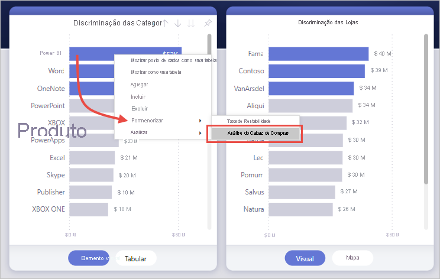
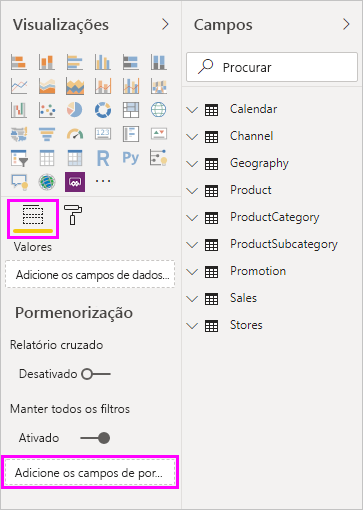
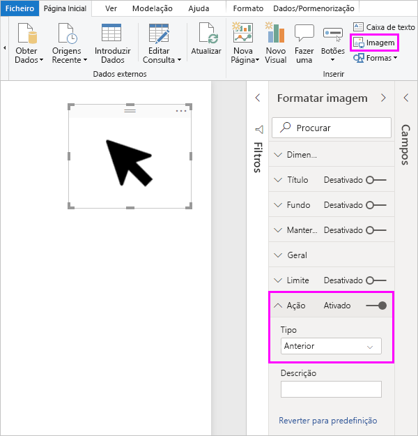
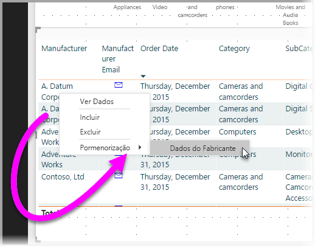
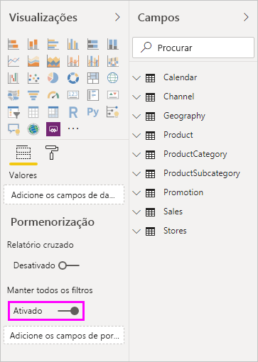
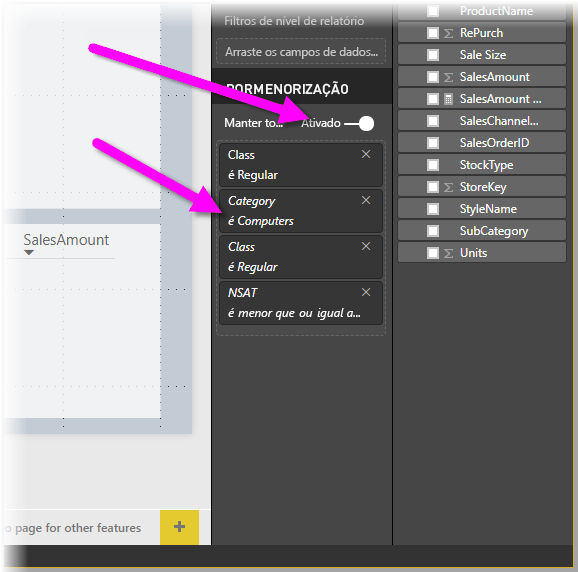
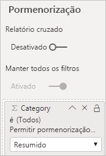

# Configurar a pormenorização em relatórios do Power BI
Com a *pormenorização* em relatórios do Power BI, pode criar uma página no relatório centrada numa entidade específica, por exemplo, um fornecedor, um cliente ou um fabricante. Quando os leitores do relatório utilizam a pormenorização, clicam com o botão direito do rato num ponto de dados noutras páginas do relatório. Em seguida, podem pormenorizar a página em destaque para obter detalhes filtrados em função desse contexto. Também pode [criar um botão que pormenoriza](desktop-drill-through-buttons.md) para obter detalhes quando os leitores clicam no mesmo.

Pode configurar a pormenorização nos seus relatórios no Power BI Desktop ou no serviço Power BI.

## Configurar a página de destino da pormenorização
1. Para configurar a pormenorização, crie uma página de relatório com os elementos visuais que pretende para o tipo de entidade para o qual vai fornecer pormenorização. 

    Por exemplo, imagine que pretende fornecer pormenorização para fabricantes. Neste caso, pode criar uma página de pormenorização com elementos visuais que demonstram as vendas totais, as unidades enviadas totais, as vendas por categoria, as vendas por região e assim por diante. Desta forma, quando pormenorizar nesta página, os elementos visuais são específicos do fabricante selecionado.

2. Em seguida, na página de pormenorização, na secção **Campos** do painel **Visualizações**, arraste o campo para o qual quer ativar a pormenorização para a área **Filtros de pormenorização**.

    

    Quando adiciona um campo à área **Filtros de pormenorização**, o Power BI cria automaticamente um elemento visual de botão *Anterior*. Esse elemento visual torna-se num botão nos relatórios publicados. Os utilizadores que consomem o seu relatório no serviço Power BI utilizam este botão para voltar à página de relatório anterior.

    

> [!IMPORTANT]
> Pode configurar e executar uma pormenorização de uma página no mesmo relatório. No entanto, não pode executar uma pormenorização de uma página num relatório diferente.  

## Utilizar a sua própria imagem para um botão Anterior    
 Como o botão anterior é uma imagem, pode substituir a imagem desse elemento visual por qualquer imagem desejada. O botão continua a funcionar como um botão Anterior para que os consumidores de relatórios possam voltar à página original. 

Para utilizar a sua própria imagem para um botão anterior, siga os passos seguintes:

1. No separador **Base**, selecione **Imagem**. Em seguida, localize a imagem e coloque-a na página de pormenorização.

2. Selecione a sua nova imagem na página de pormenorização. No painel **Formatar imagem**, defina o controlo de deslize **Ação** como **Ativado** e, em seguida, defina o **Tipo** como **Anterior**. A imagem funciona agora como um botão de retrocesso.

    

    
     Agora, os utilizadores podem clicar com o botão direito do rato num ponto de dados no seu relatório e obter um menu de contexto que permite a pormenorização nessa página. 

    

    Quando os consumidores de relatórios escolherem a pormenorização, a página é filtrada para mostrar informações acerca do ponto de dados no qual clicaram com o botão direito do rato. Por exemplo, imaginemos que clicaram com o botão direito do rato num ponto de dados sobre a Contoso (um fabricante) e selecionaram pormenorização. A página de pormenorização à qual acederam é filtrada para a Contoso.

## Transmitir todos os filtros na pormenorização

Pode transmitir todos os filtros aplicados à janela de pormenorização. Por exemplo, pode selecionar apenas uma determinada categoria de produtos e os elementos visuais dessa categoria e, em seguida, selecionar a pormenorização. Poderá estar interessado no aspeto que essa pormenorização teria com todos os filtros aplicados.

Para manter todos os filtros aplicados, na secção **Pormenorização** do painel **Visualizações**, defina o botão **Manter todos os filtros** como **Ativado**. 

Quando realiza o processo de pormenorização num elemento visual, pode ver quais os filtros aplicados como resultado do facto de o elemento visual de origem ter filtros aplicados temporariamente. Na secção **Pormenorização** do painel de **Visualização**, esses filtros transitórios são apresentados em itálico. 

Embora pudesse fazer isto com páginas de descrições, acabaria por se tornar uma experiência estranha, uma vez que a descrição pareceria não estar a funcionar corretamente. Por esse motivo, não é recomendado fazê-lo com descrições.

## Adicionar uma medida à pormenorização

Além de transmitir todos os filtros para a janela de pormenorização, também pode adicionar uma medida ou uma coluna numérica resumida à área de pormenorização. Arraste o campo de pormenorização para o cartão de **Pormenorização** para o aplicar. 

Ao adicionar uma medida ou uma coluna numérica resumida, pode explorar a página quando o campo for utilizado na área *Valor* de um elemento visual.

É tudo o que precisa de saber acerca da utilização da pormenorização nos relatórios. É uma excelente forma de obter uma vista expandida das informações da entidade que selecionou para o seu filtro de pormenorização.

## Próximas etapas

Poderá também estar interessado nos seguintes artigos:

* [Utilizar a pormenorização de relatórios cruzados em relatórios do Power BI](desktop-cross-report-drill-through.md)
* [Utilizar a segmentação de dados no Power BI Desktop](../visuals/power-bi-visualization-slicers.md)
