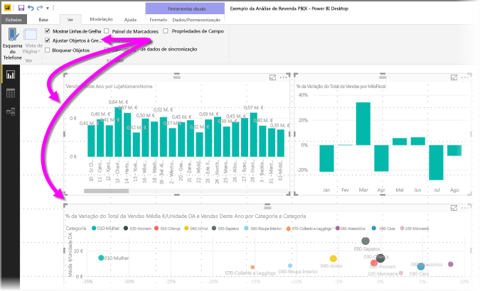
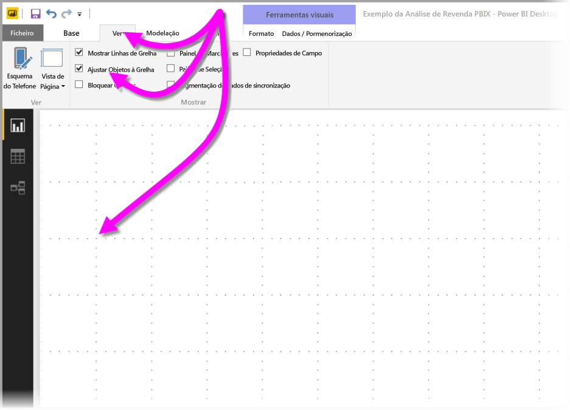
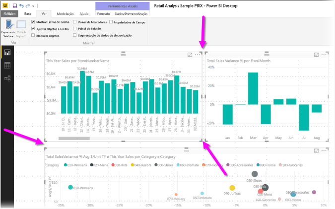
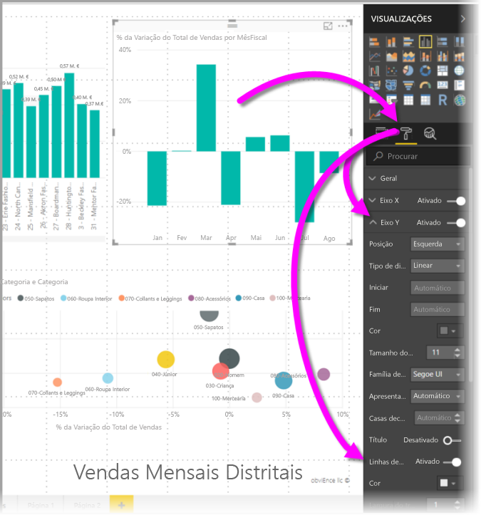
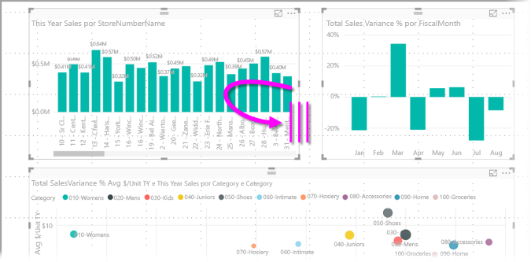
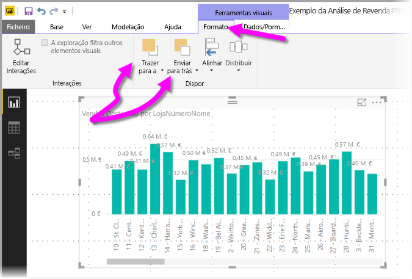
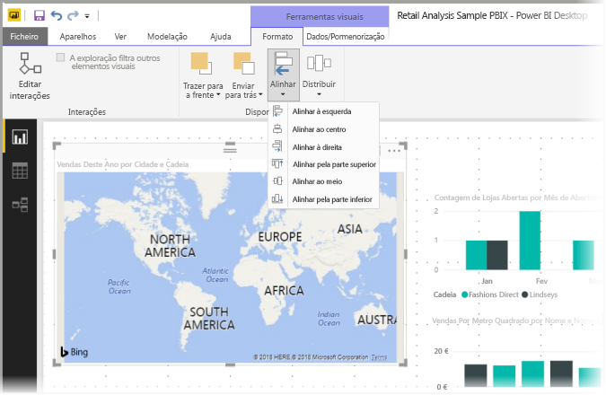
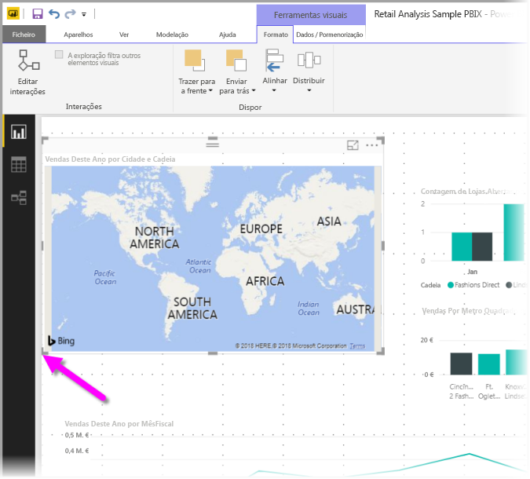
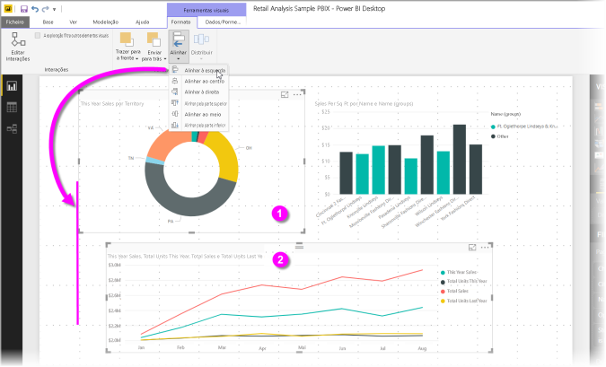
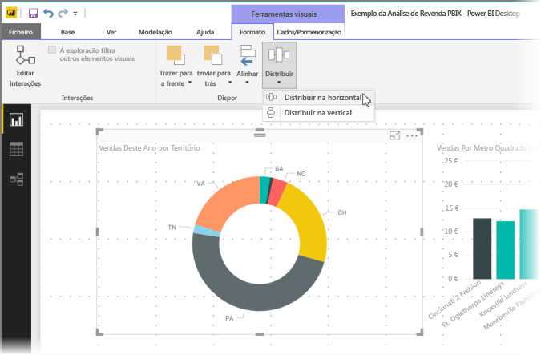

# Utilizar linhas de grelha e ajustar à grelha em relatórios do Power BI Desktop
A tela de relatório do **Power BI Desktop** fornece linhas de grelha que lhe permitem, de forma organizada, alinhar elementos visuais numa página de relatório utilizar funcionalidades de ajuste à grelha, para que os elementos visuais no seu relatório tenham um aspeto organizado, alinhado e com espaçamentos regulares.

No **Power BI Desktop**, também pode ajustar a ordenação z (trazer para a frente, enviar para trás) de objetos num relatório e alinhar ou distribuir uniformemente os elementos visuais selecionados na tela.

## Ativar linhas de grelha e ajuste à grelha
Para ativar as linhas de grelha e o ajuste à grelha, selecione o friso **Ver** e, em seguida, ative as caixas de verificação **Mostrar linhas de grelha** e **Ajustar objetos à grelha**. Pode selecionar uma ou ambas as opções, pois têm um funcionamento independente.

> [!NOTE]
> Se as opções **Mostrar linhas de grelha** e **Ajustar objetos à grelha** estiverem desativadas, ligue-se a uma origem de dados para ativá-las.

## Utilizar linhas de grelha
As linhas de grelha são guias visíveis que o ajudam a alinhar os elementos visuais. Quando estiver a tentar determinar se dois (ou mais) elementos visuais estão alinhados horizontal ou verticalmente, utilize as linhas de grelha para determinar se os limites estão alinhados.

Utilize Ctrl+Clique para selecionar dois ou mais elementos visuais de cada vez, o que mostra todos os limites dos elementos visuais selecionados e mostra se os elementos visuais estão devidamente alinhados.

### Utilizar linhas de grelha dentro de visuais
No Power BI, também existem linhas de grelha dentro de elementos visuais que fornecem guias visíveis para comparar pontos de dados e valores. A partir da versão do **Power BI Desktop** de setembro de 2017, pode gerir as linhas de grelha em visuais utilizando o cartão do **Eixo X** ou o cartão do **Eixo Y** (conforme adequado com base no tipo de visual), que se encontra na secção **Formatar** do painel **Visualizações**. Pode gerir os seguintes elementos das linhas de grelha num visual:

* Ativar ou desativar linhas de grelha
* Alterar a cor das linhas de grelha
* Ajustar o traço (largura) das linhas de grelha
* Selecione o estilo da linha das linhas de grelha no visual, como por exemplo sólido, tracejado ou pontilhado

Pode ser especialmente útil modificar determinados elementos de linhas de grelha em relatórios que utilizem fundos escuros para visuais. A seguinte imagem mostra a secção **Linhas de grelha** no cartão **Eixo Y**.

## Utilizar ajuste à grelha
Quando ativar a opção **Ajustar objetos à grelha**, todos os visuais na tela do **Power BI Desktop** que mover (ou redimensionar) serão automaticamente alinhados com o eixo de grelha mais próximo, o que torna muito mais fácil garantir que dois ou mais visuais se alinham com o mesmo tamanho ou localização vertical ou horizontal.

E é tudo o que precisa de saber sobre a utilização de **linhas de grelha** e **ajuste à grelha** para garantir que os elementos visuais nos seus relatórios estão bem alinhados.

## Utilizar a ordenação z, alinhar e distribuir
Pode gerir a ordem de frente para trás dos elementos visuais num relatório, normalmente conhecida como a *ordenação z* dos elementos. Esta funcionalidade permite-lhe sobrepor elementos visuais como quiser e, em seguida, ajustar a ordenação de frente para trás de cada um. Pode definir a ordem dos seus elementos visuais através dos botões **Trazer Para a Frente** e **Enviar Para Trás** que se encontram na secção **Dispor** do friso **Formatar**. O friso **Formatar** é apresentado assim que seleciona um ou mais elementos visuais na página.

O friso **Formatar** permite-lhe alinhar os seus elementos visuais de muitas formas diferentes, o que garante que os seus elementos visuais são apresentados na página no melhor alinhamento.

O botão **Alinhar** alinha um elemento visual selecionado com o limite (ou o centro) da tela de relatório, conforme apresentado na seguinte imagem.

Quando dois ou mais elementos visuais estiverem selecionados, estes alinham-se e utilizam o limite alinhado existente dos elementos visuais para alinhamento dos mesmos. Por exemplo, se selecionar dois elementos visuais e escolher a opção **Alinhar à Esquerda** os elementos visuais alinham-se com o limite mais à esquerda de todos os elementos visuais selecionados.

Pode também distribuir os seus visuais uniformemente na tela de relatório, seja vertical ou horizontalmente. Basta utilizar o botão **Distribuir** do friso **Formatar**.

Com algumas seleções destas ferramentas de linhas de grelha, alinhamento e distribuição, os seus relatórios terão exatamente o aspeto que pretende.

