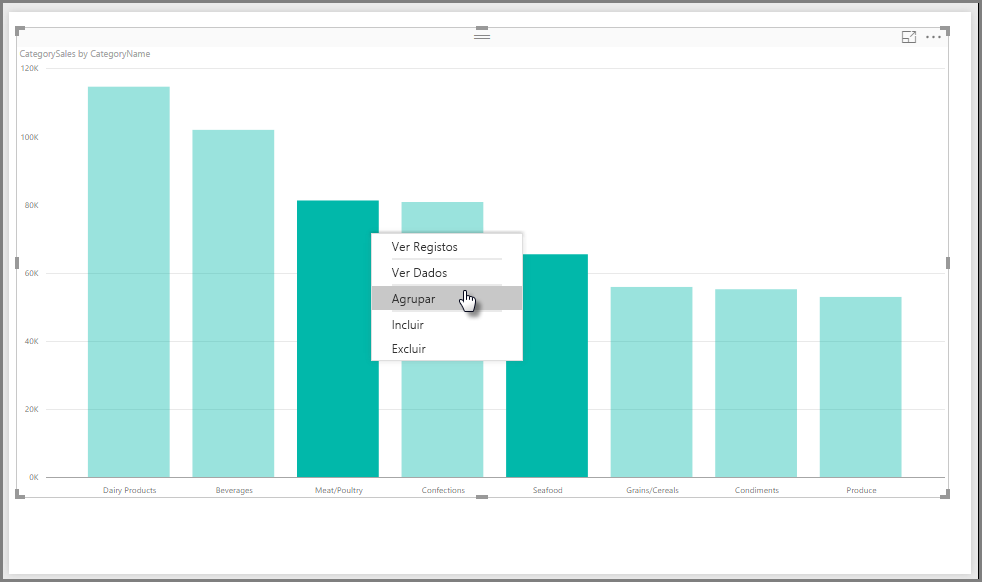
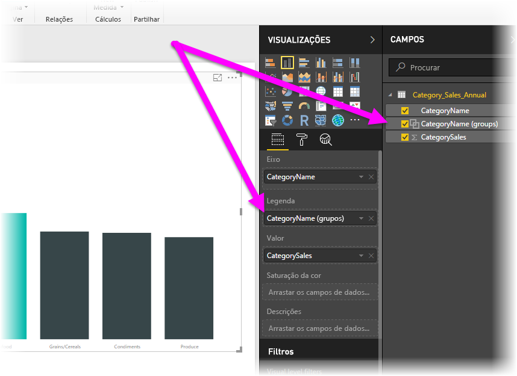
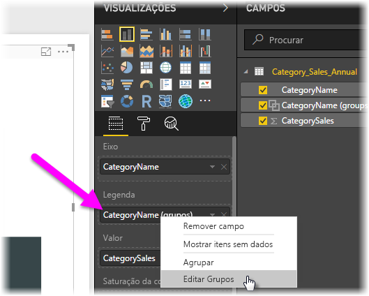
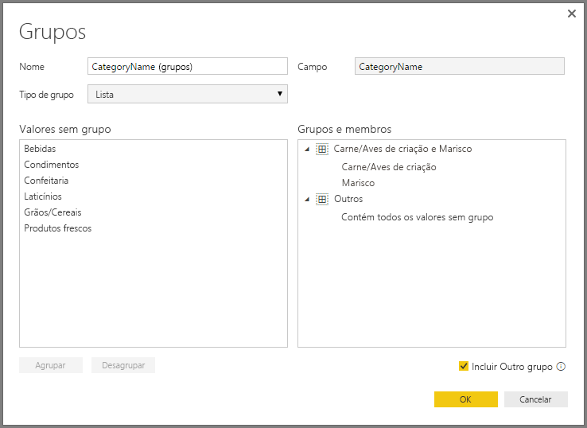
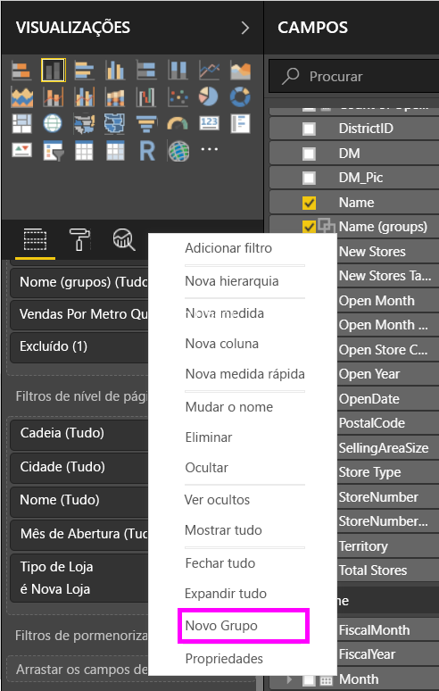
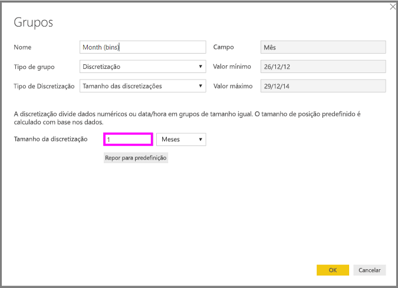
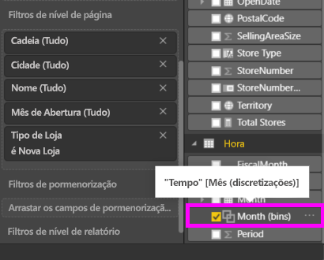

# Utilizar agrupamento e discretização no Power BI Desktop
Quando o Power BI Desktop cria elementos visuais, agrega os dados em segmentos (ou grupos) com base nos valores encontrados nos dados subjacentes. Muitas vezes não há problema, mas poderá haver alturas em que queira refinar a forma como os segmentos são apresentados. Por exemplo, pode querer colocar três categorias de produtos numa categoria maior (um *grupo*). Em alternativa, poderá querer ver os valores das vendas inseridos em tamanhos de discretização de 1 000 000 dólares, em vez de tranches de 923 983 dólares.

No Power BI Desktop, pode *agrupar* pontos de dados para ajudar a ver, analisar e explorar dados e tendências nos elementos visuais de forma mais clara. Também pode definir o *tamanho de discretização*, para colocar os valores em grupos de tamanho igual que permitem ver melhor os dados de formas significativas. Esta ação costuma chamar-se *discretização*.

## Utilizar o agrupamento
Para utilizar o agrupamento, selecione dois ou mais elementos num elemento visual através de Ctrl+Clique para selecionar múltiplos elementos. Depois, clique com o botão direito do rato num dos elementos de seleção múltipla e selecione **Agrupar** no menu de contexto.

Uma vez criado, o grupo é adicionado ao registo **Legenda** do elemento visual. O grupo surge também na lista **Campos**.

Quando tiver um grupo, pode facilmente editar os membros do mesmo. Clique com o botão direito do rato no campo no registo **Legenda** ou na lista de **Campos** e, em seguida, selecione **Editar Grupos**.

Na caixa de diálogo **Grupos**, pode criar novos grupos ou modificar os grupos existentes. Pode também *mudar o nome* de qualquer grupo. Faça duplo clique sobre o título do grupo na caixa **Grupos e membros** e, em seguida, introduza um novo nome.

Há inúmeras coisas que pode fazer com os grupos. Pode adicionar itens da lista **Valores sem grupo** a um novo grupo ou a um dos grupos existentes. Para criar um novo grupo, selecione dois ou mais itens (com Ctrl+Clique) na caixa **Valores sem grupo** e, em seguida, selecione o botão **Grupo** por baixo dessa caixa.

Pode adicionar um valor sem grupo a um grupo existente: basta selecionar um dos **Valores sem grupo** e, em seguida, selecionar o grupo existente ao qual quer adicionar o valor e selecionar o botão **Agrupar**. Para remover um item de um grupo, selecione-o na caixa **Grupos e membros** e, em seguida, selecione **Desagrupar**. Pode também mover categorias sem grupo para o grupo **Outros** ou deixá-las sem grupo.

> [!NOTE]
> Pode criar grupos para qualquer campo no painel **Campos**, sem ter de selecionar múltiplos itens a partir de um elemento visual existente. Basta clicar com o botão direito do rato e selecionar **Novo Grupo** no menu apresentado.

## Utilizar a discretização
Pode definir o tamanho de discretização dos campos numéricos e temporais no **Power BI Desktop.** Pode utilizar a discretização para dimensionar os dados apresentados pelo Power BI Desktop.

Para aplicar um tamanho de discretização, clique com o botão direito do rato num **Campo** e selecione **Novo Grupo**.

Na caixa de diálogo **Grupos**, defina o **Tamanho da discretização** para o tamanho pretendido.

Quando selecionar **OK**, será apresentado um novo campo no painel **Campos** com **(discretizações)** anexado. Em seguida, pode arrastar esse campo para a tela para utilizar o tamanho da discretização num elemento visual.

Para ver a *discretização* em ação, veja este [vídeo](https://www.youtube.com/watch?v=BRvdZSfO0DY).

E é tudo o que precisa de saber sobre a utilização do *agrupamento* e da *discretização* para garantir que os elementos visuais nos seus relatórios mostram os dados conforme quer.
