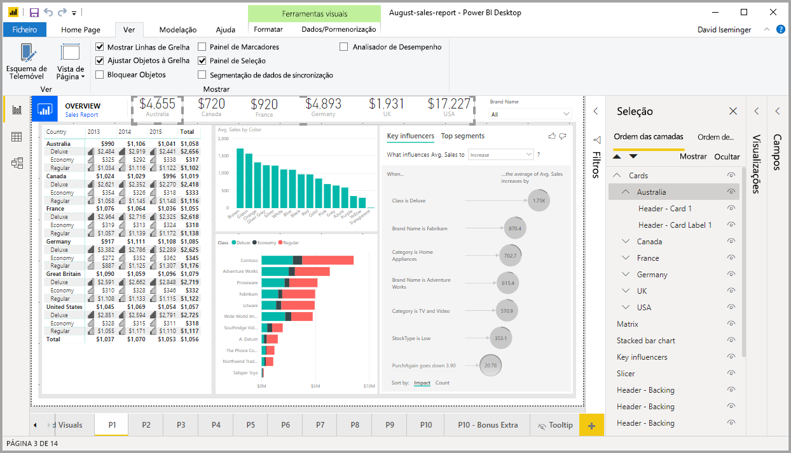
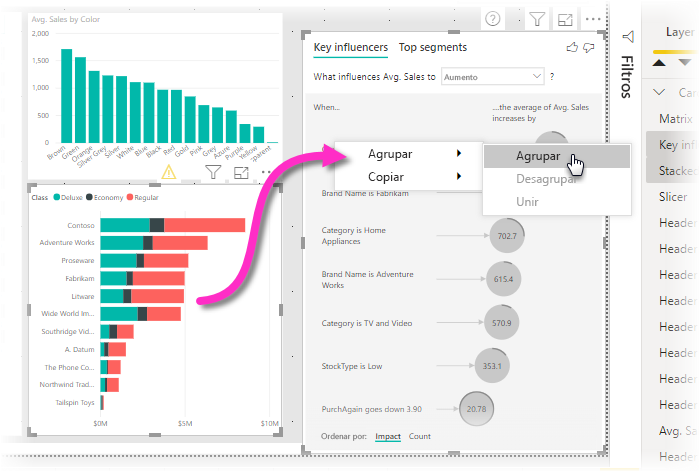
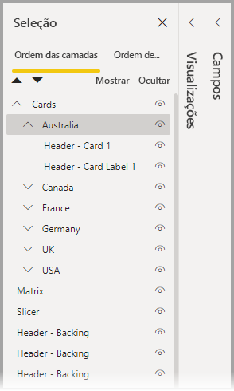
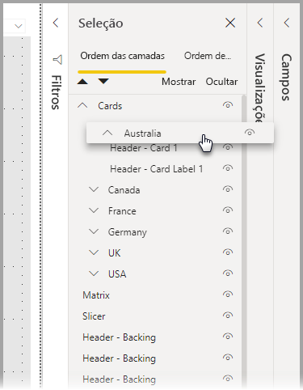
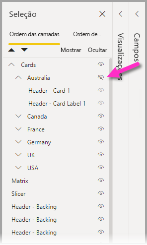
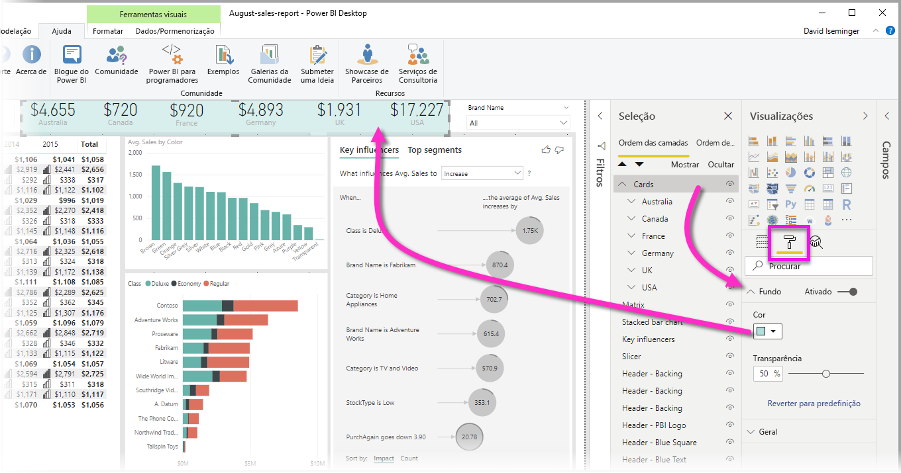

# Agrupar elementos visuais nos relatórios do Power BI Desktop
Com o **agrupamento** no **Power BI Desktop**, pode agrupar elementos visuais no seu relatório, como botões, caixas de texto, formas, imagens e quaisquer elementos visuais que criar, tal como agrupa itens no PowerPoint. Agrupar elementos visuais num relatório permite que trate o grupo como um único objeto, movendo, redimensionando e trabalhando com camadas no seu relatório de forma mais fácil, rápida e intuitiva.

## Criar grupos

Para criar um grupo de elementos visuais no Power BI Desktop, selecione o primeiro elemento visual na tela e, mantendo a tecla Ctrl premida, clique num ou mais elementos visuais adicionais que pretende ter no grupo. Em seguida, clique com o botão direito na coleção de elementos visuais e selecione **Agrupar** no menu apresentado.

Os grupos são apresentados no painel de **Seleção**. Pode ter qualquer número de grupos de elementos visuais de que o seu relatório precisar. Também pode aninhar grupos de elementos visuais. Na seguinte imagem, o grupo *Austrália* está aninhado no grupo *Cartões*. Pode expandir um grupo ao selecionar a seta junto ao nome do grupo e fechá-lo ao selecioná-la novamente. 

No painel **Seleção**, também pode arrastar e largar elementos visuais individuais para os incluir num grupo, removê-los de um grupo, aninhar um grupo ou remover um grupo ou elemento visual individual de um aninhamento. Basta arrastar o elemento visual que pretende ajustar e colocá-lo onde quiser. A disposição em camadas de elementos visuais, em caso de sobreposição, é determinada pela sua ordem na lista *Ordem de disposição em camadas*.

Para desagrupar, selecione o grupo, clique com o botão direito e selecione **desagrupar** no menu apresentado.

## Ocultar e mostrar elementos visuais ou grupos

Pode facilmente ocultar ou mostrar grupos com o painel **Seleção**. Para ocultar um grupo, selecione o botão de olho junto ao nome do grupo (ou qualquer elemento visual individual) para mostrar ou ocultar o elemento visual ou grupo. Na seguinte imagem, o grupo *Austrália* está ocultado e os restantes grupos aninhados no grupo *Cartões* estão visíveis.

Quando ocultar um grupo, todos os elementos visuais dentro desse grupo serão ocultados, indicado pelos botões de olho estarem a cinzento (indisponíveis para ativar ou desativar, porque todo o grupo está oculto). Para ocultar apenas determinados elementos visuais dentro de um grupo, basta utilizar o botão de olho junto a esse elemento visual, e apenas esse elemento visual no grupo será ocultado.

## Selecionar elementos visuais num grupo

Há algumas formas de navegar e selecionar itens dentro de um grupo de elementos visuais. A seguinte lista descreve o comportamento:

* Clicar num espaço vazio dentro de um grupo (como um espaço em branco entre elementos visuais) não seleciona nada
* Clicar num elemento visual dentro de um grupo seleciona o grupo inteiro, um segundo clique seleciona o elemento visual individual
* Selecionar um grupo e, em seguida, outro objeto na tela de relatório, e depois selecionar **Agrupar** no menu de contexto cria um grupo aninhado
* Selecionar dois grupos e clicar com o botão direito mostra uma opção para intercalar os grupos selecionados, em vez de os aninhar

## Aplicar cor de fundo

Também pode aplicar uma cor de fundo a um grupo com a secção **Formatação** do painel **Visualizações**, conforme ilustrado na seguinte imagem. 

Depois de aplicar uma cor de fundo, clicar no espaço entre elementos visuais no grupo seleciona o grupo (em contraste com o clicar no espaço em branco entre os elementos visuais num grupo, o que não seleciona o grupo). 

## Próximas etapas
Para obter mais informações sobre agrupamentos, veja o seguinte vídeo:

* [Agrupamentos no Power BI Desktop – vídeo](https://youtu.be/sf4n7VXoQHY?t=10)

Poderá também estar interessado nos seguintes artigos:

* [Utilizar a pormenorização de relatório cruzado no Power BI Desktop](desktop-cross-report-drill-through.md)
* [Utilizar a segmentação de dados no Power BI Desktop](../visuals/power-bi-visualization-slicers.md)
