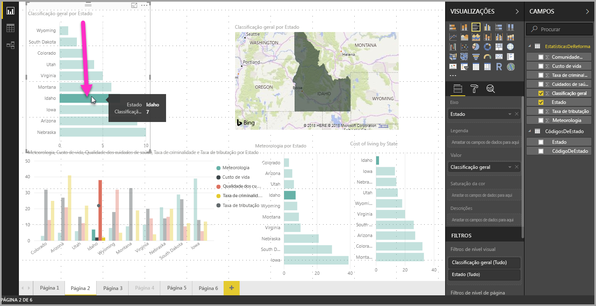
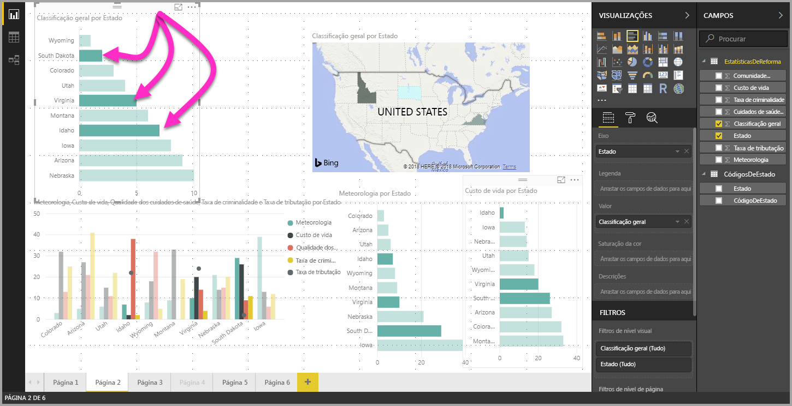

# Selecionar vários elementos de dados, pontos de dados e elementos visuais no Power BI Desktop

Pode selecionar vários elementos de dados num elemento visual, vários pontos de dados num elemento visual ou vários elementos visuais num relatório através do Power BI Desktop. As secções seguintes descrevem um passo de cada vez.

## Selecione vários pontos de dados

No Power BI Desktop, pode realçar um ponto de dados num determinado elemento visual ao clicar simplesmente no ponto de dados no elemento visual. Por exemplo, se tiver um elemento do gráfico ou barra importante e pretender outros elementos visuais na página do relatório para realçar os dados com base na seleção, poderá clicar no elemento de dados num elemento visual e ver os resultados refletidos noutros elementos visuais na página. Trata-se de um realce básico ou de seleção única. A imagem seguinte mostra um realce básico. 

Com a seleção múltipla, pode agora selecionar mais do que um ponto de dados na página de relatório do **Power BI Desktop** e realçar os resultados nos vários elementos visuais na página. Este procedimento é equivalente a uma funcionalidade ou instrução **e** , como “realçar resultados para Lisboa **e** Porto”. Para selecionar vários pontos de dados em elementos visuais, utilize **CTRL+Clique** . A imagem seguinte mostra **vários pontos de dados** selecionados (seleção múltipla).

Parece uma funcionalidade simples, mas permite todo um leque de oportunidades quando criar, partilhar e interagir com relatórios. 

## Selecionar vários elementos através da seleção de retângulo (pré-visualização)

Pode selecionar vários elementos de dados num elemento visual ou vários visuais num relatório, através da seleção retangular, geralmente também referido como *seleção de laço* . 

### Selecionar vários elementos visuais na tela

Selecione vários elementos visuais e outros elementos de relatórios ao clicar e arrastar sobre a tela para criar um laço retangular. Todos os elementos visuais que são totalmente encapsulados dentro do laço são selecionados. Se premir a tecla *Ctrl* ou *Shift* (conforme faça várias seleções através do atalho CTRL + clique em elementos visuais individuais), o laço adicional adicionará seleções de elementos visuais à seleção múltipla atual. 

Se um elemento visual já estiver selecionado e estiver com um laço, usar o atalho *Ctrl* ou *Shift* alterna essa seleção. O laço não seleciona elementos visuais individuais dentro de grupos, mas pode selecionar grupos ao encapsular todo o grupo.

A tela não se desloca automaticamente com a seleção de laço retangular. 

### Selecionar vários pontos de dados num elemento visual

Pode selecionar vários pontos de dados num elemento visual através dos mesmos passos para o laço retangular. Ao manter premida a tecla *Ctrl* , clique e arraste dentro de um elemento visual para selecionar vários pontos de dados. Quando solta o botão do rato, todos os pontos que se sobrepõem ao retângulo de seleção são selecionados e todas as seleções de laço anteriores são também preservadas. Se selecionar com um laço uma área que incorpore os pontos selecionados anteriormente com o *Ctrl* enquanto selecionar, esses pontos de dados são desselecionados (desativados); usar o laço tem o mesmo efeito que o *Ctrl* + clique em cada ponto individualmente. 

Quando usa a tecla *Shift* enquanto faz uma seleção de laço, as seleções anteriores são preservadas e os pontos de dados já selecionados permanecem selecionados. Portanto, usar o *Shift* ao executar uma seleção de laço apenas adiciona pontos de dados à sua seleção, em vez de alternar os pontos de dados na área selecionada.

Pode limpar a sua seleção atual ao clicar num espaço vazio na área de desenho sem premir uma tecla do teclado.

Para obter mais informações sobre esta caraterística, veja a [publicação de blogue sobre o lançamento desta caraterística](https://powerbi.microsoft.com/blog/power-bi-desktop-august-2020-feature-summary/#_Data_point).

Há algumas limitações e considerações para a seleção múltipla de pontos de dados num elemento visual:

* Seleção de laço de linha, área, gráfico de dispersão e suporte de mapa de árvore
* O número máximo de pontos de dados que pode selecionar ao mesmo tempo é 300
* Ao ver um relatório no serviço Power BI, a seleção de retângulo será ativada apenas se a caraterística de seleção de laço tiver sido ativada quando o relatório foi guardado e publicado

## Próximos passos

Poderá também estar interessado nos seguintes artigos:

* [Utilizar linhas de grelha e ajustar à grelha em relatórios do Power BI Desktop](desktop-gridlines-snap-to-grid.md)
* [Sobre filtros e realces em relatórios do Power BI](power-bi-reports-filters-and-highlighting.md)

