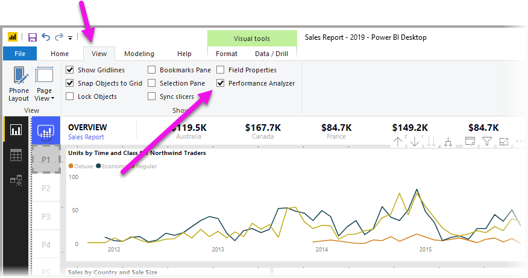
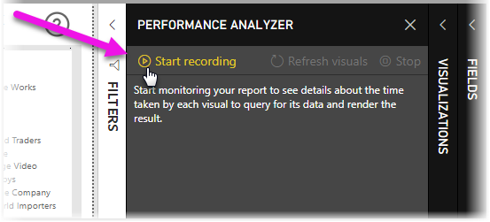

# Utilizar o Analisador de Desempenho para examinar o desempenho do elemento de relatório

No **Power BI Desktop**, pode saber o desempenho de cada um dos seus elementos de relatórios, como elementos visuais e fórmulas DAX. Com o **Analisador de Desempenho**, pode ver e criar registos que medem o desempenho de cada um dos seus elementos de relatórios quando os utilizadores interagem com os mesmos, bem como os aspetos do seu desempenho que consomem mais (ou menos) recursos.

O Analisador de Desempenho inspeciona e mostra a duração necessária para atualizar todos os elementos visuais que as interações com utilizadores iniciam, e apresenta as informações para que possa ver, desagregar ou exportar os resultados. O Analisador de Desempenho pode ajudá-lo a identificar elementos visuais que estão a afetar o desempenho dos seus relatórios e a identificar o motivo do impacto.

## Mostrar o painel do Analisador de Desempenho

No **Power BI Desktop**, selecione o friso **Ver**. Na área **Mostrar** do friso **Ver**, pode selecionar a caixa de verificação junto a **Analisador de Desempenho** para mostrar o painel do Analisador de Desempenho.

Depois de selecionado, o Analisador de Desempenho é mostrado no próprio painel, à direita da tela do relatório.

## Utilizar o Analisador de Desempenho

O Analisador de Desempenho mede o tempo de processamento (incluindo o tempo para criar ou atualizar um elemento visual) necessário para atualizar os elementos de relatórios iniciados devido a interações dos utilizadores e que resultem na execução de uma consulta. Por exemplo, ajustar uma segmentação de dados exige que o elemento visual da segmentação de dados seja modificado, que uma consulta seja enviada para o modelo de dados e que os elementos visuais afetados tenham de ser atualizados como resultado das novas definições. 

Para que o Analisador de Desempenho comece a gravar, basta selecionar **Iniciar gravação**

Todas as ações que efetuar no relatório são apresentadas e registadas no painel do Analisador de Desempenho, para que o elemento visual seja carregado pelo Power BI. Por exemplo, talvez tenha um relatório que os utilizadores afirmam demorar muito tempo a ser atualizado. Ou determinados elementos visuais no relatório podem demorar muito tempo a ser apresentados quando um controlo de deslize é ajustado. O Analisador de Desempenho pode informar que elemento visual é responsável e identifica quais os aspetos do elemento visual que duram mais tempo a processar. 

Após iniciar a gravação, o botão **Iniciar gravação** fica a cinzento (inativo, pois já foi iniciada a gravação) e o botão **Parar** fica ativo. 

O Analisador de Desempenho recolhe e mostra as informações de medição de desempenho em tempo real. Por isso, sempre que clicar num elemento visual, mover uma segmentação de dados ou interagir de outra forma, o Analisador de Desempenho mostra imediatamente os resultados de desempenho no respetivo painel.

Se o painel tiver mais informações do que as que podem ser apresentadas, aparece uma barra de deslocamento que permite navegar para informações adicionais.

Cada interação tem um identificador de secção no painel, que descreve a ação que iniciou as entradas de registo. Na imagem seguinte, a interação consistiu nos utilizadores a alterarem uma segmentação de dados.

As informações de registo de cada elemento visual incluem o tempo passado (duração) para concluir as seguintes categorias de tarefas:

* **Consulta DAX** – se for necessária uma consulta DAX, este é o tempo entre a altura em que o elemento visual envia a consulta e a altura em que o Analysis Services devolve os resultados.
* **Apresentação do elemento visual** – o tempo necessário para que o elemento visual surja no ecrã, incluindo o tempo necessário para obter imagens Web ou geocodificação. 
* **Outros** – o tempo que o elemento visual necessita para preparar consultas, aguardar que outros elementos visuais sejam concluídos ou executar outro processamento em segundo plano.

Os valores de **Duração (ms)** indicam a diferença entre um carimbo de data/hora de *início* e *fim* para cada operação. A maioria das operações de tela e elementos visuais é executada sequencialmente num único tópico da Interface de Utilizador, que é partilhado por várias operações. As durações comunicadas incluem o tempo despendido em fila de espera enquanto outras operações são concluídas. O [exemplo do Analisador de Desempenho](https://github.com/microsoft/powerbi-desktop-samples/tree/master/Performance%20Analyzer) no GitHub e a sua [documentação](https://github.com/microsoft/powerbi-desktop-samples/blob/master/Performance%20Analyzer/Power%20BI%20Performance%20Analyzer%20Export%20File%20Format.docx) associada fornecem detalhes sobre como os elementos visuais consultam os dados e como efetuam a composição.

Após interagir com os elementos do relatório que pretende medir com o Analisador de Desempenho, pode selecionar o botão **Parar**. As informações de desempenho permanecem no painel após ter selecionado **Parar**, para que as possa analisar.

Para limpar as informações no painel do Analisador de Desempenho, selecione **Limpar**. Todas as informações são apagadas quando seleciona **Limpar**, e não são guardadas. Veja a secção seguinte para saber como guardar informações nos registos. 

## Atualizar elementos visuais

Pode selecionar **Atualizar elementos visuais** no painel do Analisador de Desempenho para atualizar todos os elementos visuais na página atual do relatório, para que o Analisador de Desempenho recolha informações sobre todos esses elementos visuais.

Também pode atualizar elementos visuais individuais. Quando o Analisador de Desempenho estiver a gravar, pode selecionar **Atualizar este elemento visual**, no canto superior direito de cada elemento visual, para atualizar o mesmo, e capturar as respetivas informações de desempenho.

## Guardar informações de desempenho

Pode guardar as informações que o Analisador de Desempenho cria sobre um relatório ao selecionar o botão **Exportar**. Selecionar **Exportar** cria um ficheiro .json com informações do painel do Analisador de Desempenho. 

## Próximas etapas
Para obter mais informações sobre o **Power BI Desktop**, e sobre como começar, consulte os seguintes artigos.

* [O que é o Power BI Desktop?](../fundamentals/desktop-what-is-desktop.md)
* [Descrição Geral das Consultas com o Power BI Desktop](../transform-model/desktop-query-overview.md)
* [Origens de Dados no Power BI Desktop](../connect-data/desktop-data-sources.md)
* [Ligar a Dados no Power BI Desktop](../connect-data/desktop-connect-to-data.md)
* [Moldar e Combinar Dados com o Power BI Desktop](../connect-data/desktop-shape-and-combine-data.md)
* [Tarefas de Consulta Comuns no Power BI Desktop](../transform-model/desktop-common-query-tasks.md)   

Para obter informações sobre o exemplo do Analisador de Desempenho, veja os seguintes recursos.

* [Exemplo do Analisador de Desempenho](https://github.com/microsoft/powerbi-desktop-samples/tree/master/Performance%20Analyzer)
* [Documentação de exemplo do Analisador de Desempenho](https://github.com/microsoft/powerbi-desktop-samples/blob/master/Performance%20Analyzer/Power%20BI%20Performance%20Analyzer%20Export%20File%20Format.docx)
