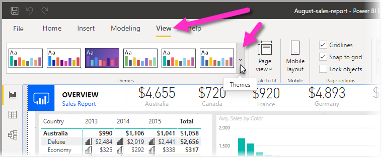
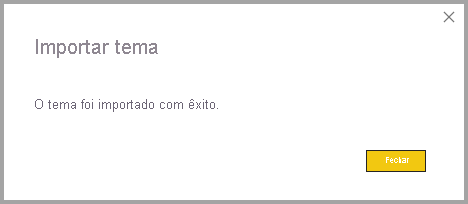
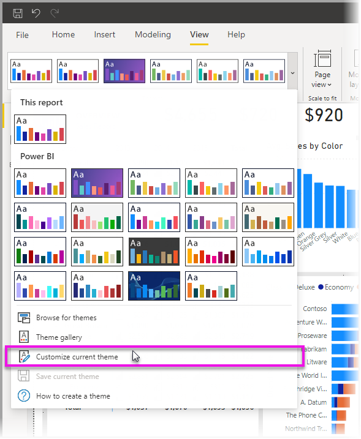
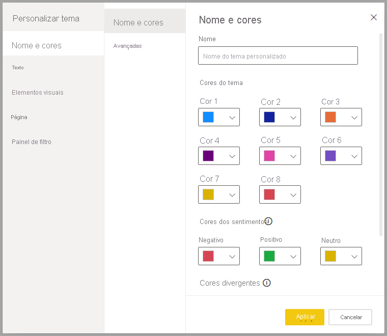
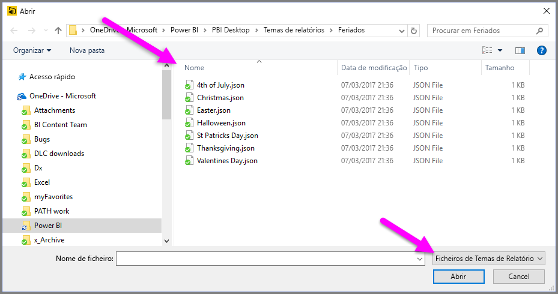

# <a name="use-report-themes-in-power-bi-desktop"></a>Utilizar temas de relatório no Power BI Desktop

Com os *temas de relatório* do Power BI Desktop, pode aplicar alterações de design a todo o relatório, como utilizar cores da empresa, alterar conjuntos de ícones ou aplicar uma nova formatação visual predefinida. Quando aplica um tema de relatório, todos os elementos visuais no relatório utilizam as cores e a formatação do tema selecionado como predefinição. Existem algumas exceções, descritas mais à frente neste artigo.

Os temas de relatório podem ser selecionados ao navegar para o friso **Ver**, ao selecionar o botão de seta para baixo na secção **Temas** do friso e, em seguida, ao selecionar o tema pretendido. Os temas disponíveis são semelhantes aos apresentados noutros produtos Microsoft, como o Microsoft PowerPoint.


Existem dois tipos de temas de relatório: temas de relatório incorporados e ficheiros de temas de relatório personalizados.

- Os temas de relatório **incorporados** fornecem diferentes tipos de esquemas de cores predefinidos que são instalados com o Power BI Desktop. Pode selecionar os temas de relatório incorporados diretamente no menu do Power BI Desktop.

- Os temas de relatório **personalizados** são criados ao ajustar um tema atual e, em seguida, ao guardá-lo como um tema personalizado ou ao criar o seu próprio tema personalizado com um ficheiro JSON. O ficheiro JSON proporciona um controlo granular sobre vários aspetos de um tema de relatório, conforme descrito mais adiante neste artigo. 

Vamos abordar a forma como os temas de relatório funcionam e, em seguida, como criar temas de relatório personalizados.


## <a name="how-report-themes-work"></a>Como funcionam os temas de relatório

Para aplicar um tema de relatório a um relatório do Power BI Desktop, pode selecionar uma das seguintes opções:

* Selecione um dos [temas de relatório incorporados disponíveis](#built-in-report-themes), que estão incorporados no Power BI Desktop.
* Personalize um tema ao utilizar a caixa de diálogo **Personalizar tema**.
* [Importe um ficheiro JSON de tema personalizado](#import-custom-report-theme-files).

Iremos analisar cada uma destas opções individualmente.

> [!NOTE]
> Os temas só podem ser aplicados ao utilizar o Power BI Desktop. Não pode aplicar temas a relatórios existentes no serviço Power BI. 

### <a name="built-in-report-themes"></a>Temas de relatório incorporados

Para selecionar de entre os temas de relatório incorporados disponíveis:

1. Selecione o botão de seta para baixo **Mudar Tema** na secção **Temas** do friso **Ver**.

   

2. Selecione um dos temas incluídos no menu pendente apresentado.

   

   O tema de relatório é agora aplicado ao relatório.

    A tabela seguinte mostra os temas de relatório incorporados disponíveis.
    
    | Tema de relatório incorporado | Sequência de cores predefinidas |
    |------ |---------- |
    | Predefinição | |
    | Highrise | |
    | Executivo | |
    | Fronteira| |
    | Inovador | |
    | Em flor | |
    | Tidal| |
    | Temperatura | |
    | Solar| |
    | Divergente | |
    | Tempestade | |
    | Clássico | |
    | Parque da cidade | |
    | Sala de aula | |
    | Seguro para daltónicos | |
    | Elétrico | |
    | Alto contraste | |
    | Pôr-do-sol | |
    | Crepúsculo | |
    
3. Também pode procurar na coleção de temas criados por membros da Comunidade do Power BI ao selecionar **Galeria de temas** no menu pendente Temas.

   

    Na galeria, pode selecionar um tema de que gosta e transferir o respetivo ficheiro JSON associado. 

    Para instalar o ficheiro transferido, selecione **Procurar temas** no menu pendente **Temas**, navegue até ao local para onde transferiu o ficheiro JSON e selecione-o para importar o tema para o Power BI Desktop como um novo tema.

    Se o processo for concluído com êxito, o Power BI apresentará uma caixa de diálogo a indicar que a importação foi bem-sucedida.

   

## <a name="customize-report-themes"></a>Personalizar temas de relatório

Pode personalizar e padronizar praticamente todos os elementos listados na secção **Formatar** do painel **Visualizações**, quer através de personalizações feitas diretamente no Power BI Desktop, quer através de um ficheiro JSON de temas de relatório. O objetivo é fornecer o controlo total sobre o aspeto e a funcionalidade predefinidos do relatório, a nível granular.

As duas formas de personalizar temas de relatório são as seguintes:

- [Criar e personalizar um tema no Power BI Desktop](#create-and-customize-a-theme-in-power-bi-desktop)
- [Criar e personalizar um ficheiro JSON de temas de relatório personalizados](#introduction-to-report-theme-json-files)

Vamos analisar cada uma destas abordagens individualmente nas secções seguintes.

### <a name="create-and-customize-a-theme-in-power-bi-desktop"></a>Criar e personalizar um tema no Power BI Desktop

Para personalizar um tema diretamente no Power BI Desktop, pode selecionar um tema próximo do que pretende e fazer alguns ajustes. Primeiro, selecione o tema próximo do que pretende (ou comece com qualquer tema e personalize-o) e siga os seguintes passos:

1. No friso **Ver**, selecione o botão de lista pendente **Temas** e, em seguida, selecione **Personalizar tema atual**.

   

2. É apresentada uma caixa de diálogo onde pode fazer todo o tipo de alterações ao tema atual e, em seguida, guardar as suas definições como um novo tema.

   

As definições de temas personalizáveis encontram-se nas seguintes categorias, apresentadas na janela **Personalizar tema**:

- **Nome e cores**: as definições de nome e de cores do tema incluem as [cores do tema](#how-report-theme-colors-stick-with-your-reports), as cores dos sentimentos, cores divergentes e [cores estruturais (Avançadas)](#setting-structural-colors).
- **Text**: as definições de texto incluem família, tamanho e cor do tipo de letra, o que define [as predefinições de classe de texto primárias](#setting-formatted-text-defaults) para etiquetas, títulos, cartões e KPIs e cabeçalhos de separador.
- **Elementos visuais**: as definições dos elementos visuais incluem o fundo, o limite, o cabeçalho e as descrições.
- **Página**: as definições dos elementos da página incluem o padrão de fundo e o fundo.
- **Painel de filtro**: as definições do painel de filtro incluem a cor de fundo, a transparência, a cor do tipo de letra e do ícone, o tamanho e os cartões de filtro.

Depois de fazer as alterações, selecione **Aplicar e guardar** para guardar o tema. O tema pode agora ser utilizado no relatório atual e ser exportado.

Personalizar o tema atual desta forma acelera e facilita a personalização dos temas. No entanto, pode fazer ajustes mais precisos aos temas, o que requer a modificação do [ficheiro JSON](#report-theme-json-file-format) do tema.

> [!TIP]
> Pode personalizar as opções de temas de relatórios mais comuns ao utilizar os controlos na caixa de diálogo **Personalizar tema**. Para obter ainda mais controlo, pode opcionalmente exportar o ficheiro JSON de um tema e fazer ajustes precisos ao modificar manualmente as definições nesse ficheiro. Pode mudar o nome desse ficheiro JSON ajustado e importá-lo mais tarde.

### <a name="import-custom-report-theme-files"></a>Importar ficheiros de temas de relatório personalizados

Também pode importar um ficheiro de temas de relatório personalizados ao seguir os seguintes passos:

1. Selecione o friso **Ver** e, no botão de lista pendente **Temas**, selecione **Procurar temas**.

   

   É apresentada uma janela que lhe permite navegar para a localização do ficheiro de tema JSON.

2. Na imagem seguinte, estão disponíveis alguns ficheiros de tema de feriado. Vamos escolher um tema de feriado de março, *St Patricks Day.json*.

   

   Quando o ficheiro de temas tiver sido carregado com êxito, o Power BI Desktop apresenta uma mensagem.

   

## <a name="introduction-to-report-theme-json-files"></a>Introdução aos ficheiros JSON de temas de relatório

 Quando abre o ficheiro JSON básico mencionado na secção anterior (St Patricks Day.json), este aparece da seguinte forma:

 ```json
    {
        "name": "St Patrick's Day",
        "dataColors": ["#568410", "#3A6108", "#70A322", "#915203", "#D79A12", "#bb7711", "#114400", "#aacc66"],
        "background":"#FFFFFF",
        "foreground": "#3A6108",
        "tableAccent": "#568410"
    }
```

Este ficheiro JSON de temas de relatório tem as seguintes linhas:

- **name**: nome do tema de relatório. Este é o único campo obrigatório.
- **dataColors**: a lista de códigos de cor hexadecimais a utilizar para os dados em elementos visuais do Power BI Desktop. Esta lista pode ter o número de cores que quiser.
- **background**, **firstLevelElements** e **tableAccent** (etc.): classes de cores. As classes de cores permitem definir várias cores estruturais no relatório de uma só vez.

Pode utilizar este ficheiro JSON como base para criar o seu próprio ficheiro de temas de relatório personalizados a importar. Se quiser ajustar apenas as cores básicas do relatório, altere o nome e os códigos hexadecimais no ficheiro.

Num ficheiro JSON de temas de relatório, define apenas a formatação que deseja alterar. Tudo o que não especificar no ficheiro JSON é revertido para as predefinições do Power BI Desktop.

São várias as vantagens de criar um ficheiro JSON. Por exemplo, pode especificar que todos os gráficos utilizam um tamanho de tipo de letra 12, que determinados elementos visuais utilizam uma determinada família de tipos de letra ou que as etiquetas de dados estão desativadas para tipos de gráfico específicos. Ao utilizar um ficheiro JSON, pode criar um ficheiro de temas de relatório que uniformize os gráficos e os relatórios, o que torna os relatórios da organização mais consistentes.

Para obter mais informações sobre o formato do ficheiro JSON, veja [Formato do ficheiro JSON de temas de relatório](#report-theme-json-file-format).

> [!NOTE]
> É seguro modificar um tema de relatório JSON personalizado com a caixa de diálogo [**Personalizar tema**](#create-and-customize-a-theme-in-power-bi-desktop).  A caixa de diálogo não irá modificar as definições de tema que não pode controlar e irá atualizar as alterações efetuadas ao tema de relatório existente.

## <a name="how-report-theme-colors-stick-with-your-reports"></a>Como as cores do tema de relatório permanecem nos relatórios

Ao publicar o relatório no serviço Power BI, as cores do tema de relatório permanecem no mesmo. A secção **Cores de dados** do painel **Formatar** reflete o tema de relatório.

Para ver as cores disponíveis num tema de relatório:

1. Selecione um elemento visual.

2. Na secção **Formatar** do painel **Visualização**, selecione **Cores de dados**.

3. Selecione a lista pendente de um item para ver as informações das **Cores do tema** do tema de relatório.

   

No nosso exemplo, depois de aplicar as inúmeras cores verdes e castanhas do tema de relatório do Dia de São Patrício, veja as cores do tema. Vê todo este verde? Tal acontece porque estas cores fazem parte do tema de relatório que importámos e aplicámos.

As cores na paleta de cores são relativas ao tema atual. Por exemplo, suponha que seleciona a terceira cor da linha superior para um ponto de dados. Mais tarde, se alterar para um tema diferente, a cor desse ponto de dados será atualizada automaticamente para a terceira cor da linha superior no novo tema, assim como veria ao alterar os temas no Microsoft Office.

Definir um tema num relatório altera as cores predefinidas utilizadas em elementos visuais em todo o relatório. O Power BI mantém uma lista composta por centenas de cores, para garantir que os elementos visuais têm muitas cores únicas para apresentar num relatório. Quando o Power BI atribui cores a uma série de elementos visuais, as cores são selecionadas por ordem de chegada, à medida que as cores da série são atribuídas. Quando importa um tema, o mapeamento de cores de uma série de dados é reposto. 

O Power BI localiza a cor de uma série dinâmica e utiliza a mesma cor para esse valor noutros elementos visuais. Numa *série dinâmica*, o número de séries apresentadas em elementos visuais pode mudar com base em medidas, valores ou outros aspetos. Por exemplo, se mostrar *Lucro por Região* num relatório, o número de regiões de vendas poderá ser cinco ou poderá ser nove. O número de regiões é dinâmico, pelo que é considerado uma série dinâmica. 

Por outro lado, nas *séries estáticas*, o número de séries é conhecido. Por exemplo, *Lucro* e *Receita* são séries estáticas. Nas séries estáticas, o Power BI atribui cores por índice nas paletas de temas. Pode substituir a atribuição de cores predefinida ao selecionar uma cor a partir do painel de formatação em **Cores de dados**. Pode ter de alterar as seleções de segmentações de dados para ver todos os potenciais valores de séries e definir também as cores dos mesmos. Se definir explicitamente uma cor para um único elemento visual através do painel **Propriedades**, o tema importado não será aplicado a nenhuma dessas cores explicitamente definidas. 

Para permitir que o tema seja aplicado a essas cores explicitamente selecionadas, utilize **Reverter para predefinição** na secção **Cores de Dados** do elemento visual para o qual a cor foi explicitamente definida, para anular a aplicação de cor explícita e permitir que o tema seja aplicado.


### <a name="situations-when-report-theme-colors-wont-stick-to-your-reports"></a>Situações em que as cores do tema de relatório não permanecem nos relatórios

Suponha que aplica um conjunto de cores personalizadas (ou uma cor individual) a um determinado ponto de dados num elemento visual com a opção **Cor personalizada** do seletor de cores. Quando aplica um tema de relatório, este *não* substitui essa cor personalizada do ponto de dados.

Imagine que quer definir manualmente a cor de um ponto de dados com a secção **Cores do tema**. Quando aplica um novo tema de relatório, as cores *não* são atualizadas. Para voltar a ter as cores predefinidas, para que sejam atualizadas quando aplicar um novo tema de relatório, selecione **Reverter para a predefinição** ou selecione uma cor na paleta **Cores do tema** do seletor de cores.


Muitos elementos visuais do Power BI não se aplicam aos temas de relatório.

## <a name="custom-report-theme-files-you-can-use-right-now"></a>Ficheiros de temas de relatório personalizados que pode utilizar atualmente

Quer começar a utilizar temas de relatório? Confira os temas de relatório personalizados na [galeria de temas](https://community.powerbi.com/t5/Themes-Gallery/bd-p/ThemesGallery) ou experimente os seguintes ficheiros JSON de temas de relatório personalizados, que pode transferir e importar para o relatório do Power BI Desktop:

- [Tema de onda](https://community.powerbi.com/t5/Themes-Gallery/Waveform/m-p/140536). Este tema de relatório foi introduzido na [publicação de blogue](https://powerbi.microsoft.com/blog/power-bi-desktop-march-feature-summary/) que anunciou o primeiro lançamento de temas de relatório. [Transferir Waveform.json](https://go.microsoft.com/fwlink/?linkid=843924).

  

- [Tema adequado para daltónicos](https://community.powerbi.com/t5/Themes-Gallery/Color-Blind-Friendly/m-p/140597).
Este tema de relatório é mais fácil de ler para pessoas com deficiências visuais. [Transferir ColorblindSafe-Longer.json](https://go.microsoft.com/fwlink/?linkid=843923).

  .

- Temas do Power View, incluindo Apothecary.json. [Transferir temas do Power View num ficheiro zip](https://go.microsoft.com/fwlink/?linkid=843925).

  

- Tema do Dia de São Valentim.

  

  Veja a seguir o código do ficheiro JSON do Dia de São Valentim:

   ```json
       {
           "name": "Valentine's Day",
           "dataColors": ["#990011", "#cc1144", "#ee7799", "#eebbcc", "#cc4477", "#cc5555", "#882222", "#A30E33"],
           "background":"#FFFFFF",
           "foreground": "#ee7799",
           "tableAccent": "#990011"
       }
   ```

Seguem-se mais alguns temas de relatório que pode utilizar como pontos de partida:

- [Girassóis ao entardecer](https://community.powerbi.com/t5/Themes-Gallery/Sunflower-Twilight/m-p/140749)
- [Ameixa](https://community.powerbi.com/t5/Themes-Gallery/Plum/m-p/140711)
- [Outono](https://community.powerbi.com/t5/Themes-Gallery/Autumn/m-p/140746)
- [Alto contraste](https://community.powerbi.com/t5/Themes-Gallery/Color-Blind-Friendly/m-p/140597)

Os temas de relatório podem tornar os seus relatórios do Power BI Desktop numa reflexão colorida de si, da organização ou mesmo da época ou feriado atual.

## <a name="export-report-themes"></a>Exportar temas de relatório

Pode exportar o tema de relatório atualmente aplicado diretamente do Power BI Desktop para um ficheiro JSON. Depois de exportar um tema de relatório, poderá reutilizá-lo noutros relatórios. Esta opção permite exportar o ficheiro JSON para a maioria dos temas incorporados. As únicas exceções são os temas base, Clássico e Predefinido, em que outros temas se baseiam quando são importados.

Para exportar o tema atualmente aplicado do Power BI Desktop:

1. Selecione **Ficheiro** > **Opções e definições** > **Opções**.

2. Na secção **Funcionalidades de pré-visualização**, selecione **Personalizar tema atual** e, em seguida, selecione **OK**.

   Pode ser-lhe pedido para reiniciar o Power BI Desktop para que a funcionalidade de pré-visualização seja ativada. Depois de reiniciar, pode começar a exportar o tema aplicado atualmente.

3. No friso **Base**, selecione **Mudar tema** > **Exportar tema atual**.

4. Na caixa de diálogo **Guardar Como**, navegue para um diretório para guardar o ficheiro JSON e, em seguida, selecione **Guardar**.

## <a name="report-theme-json-file-format"></a>Formato de ficheiro JSON do tema de relatório

No seu nível mais básico, o ficheiro JSON de temas tem apenas uma linha necessária: **name**.

```json
{
    "name": "Custom Theme"
}
```

Além de **name**, tudo o resto é opcional, o que significa que é livre de adicionar apenas as propriedades que pretende formatar especificamente para o ficheiro de temas e continuar a utilizar as predefinições do Power BI para o resto.

### <a name="setting-theme-colors"></a>Definição de cores do tema

Em **name**, pode adicionar as seguintes propriedades básicas relacionadas com a cor dos dados:

- **dataColors**: A lista de códigos de cor hexadecimais a utilizar para as formas de cores que representam os dados em elementos visuais do Power BI Desktop. Esta lista pode ter o número de cores que quiser. Após todas as cores desta lista terem sido utilizadas, se o elemento visual ainda precisar de mais cores, será revertido para utilizar a paleta de cores predefinida do Power BI.
- **good**, **neutral**, **bad**: estas propriedades definem as cores do estado utilizadas pelo gráfico de cascata e pelo elemento visual do KPI.
- **maximum**, **center**, **minimum**, **null**: estas cores definem as várias cores de gradiente na caixa de diálogo da formatação condicional.

Um tema básico que define estas cores teria o seguinte aspeto:

```json
{
    "name": "Custom Theme",
    "dataColors": [
        "#118DFF",
        "#12239E",
        "#E66C37",
        "#6B007B",
        "#E044A7",
        "#744EC2",
        "#D9B300",
        "#D64550",
        "#197278",
        "#1AAB40"
    ],
    "good": "#1AAB40",
    "neutral": "#D9B300",
    "bad": "#D64554",
    "maximum": "#118DFF",
    "center": "#D9B300",
    "minimum": "#DEEFFF",
    "null": "#FF7F48"
}
```

### <a name="setting-structural-colors"></a>Definição de cores estruturais

Em seguida, pode adicionar várias classes de cores, como **background** e **firstLevelElements**. Estas classes de cores definem as cores estruturais para os elementos no relatório, tais como linhas de grelha de eixo, cores de realce e cores de fundo para elementos visuais.

A tabela seguinte mostra as seis classes de cores que pode formatar.  Os nomes **Classe de cores** correspondem aos nomes na subsecção "Advanced" da secção "Name and Colors" na caixa de diálogo [**Personalizar tema**](#create-and-customize-a-theme-in-power-bi-desktop).

|Classe de cores  |O que é formatado  |
|---------|---------|
| **firstLevelElements** <br> **foreground** (preterido) | Cor do fundo das etiquetas (quando estiver fora dos pontos de dados) <br> Cor da linha de tendência <br>  Cor predefinida da caixa de texto <br> Valores de tabela e matriz e cores de tipo de letra totais Cor do eixo das barras de dados <br> Etiquetas de dados de cartão <br> Valor de cor de chamada de medidor <br> Cor do objetivo do KPI <br>  Cor do texto do KPI <br> Cor do item da segmentação (quando no modo de detalhe)  <br> Cor do tipo de letra do item pendente da segmentação <br> Cor do tipo de letra da entrada numérica da segmentação <br> Cor do tipo de letra do cabeçalho da segmentação <br> Cor da linha de proporção do gráfico de dispersão <br> Cor da linha da previsão do gráfico de linhas <br> Cor da linha de preenchimento do mapa <br> Cor do painel de filtro e texto do cartão|
| **secondLevelElements** <br> **foregroundNeutralSecondary** (preterido) | [classes de texto secundárias](#setting-formatted-text-defaults) "light" <br> Cores da etiqueta  <br> Cor da etiqueta da legenda <br> Cor da etiqueta do eixo <br> Cor do tipo de letra do cabeçalho da tabela e da matriz <br> Cor da linha de preenchimento de destino e destino do medidor <br>  Cor do eixo de tendência do KPI <br> Cor do controlo de deslize da segmentação <br> Cor do tipo de letra do item da segmentação <br> Cor do contorno da segmentação <br> Cor do cursor do gráfico de linhas <br> Cor do título do cartão multilinhas <br> Cor do traço do gráfico do friso <br> Cor do limite do mapa de forma <br> Cor do tipo de letra do texto do botão <br> Cor da linha do ícone do botão <br> Cor do contorno do botão |
| **thirdLevelElements** <br >**backgroundLight** (preterido) | Cor da linha de grelha do eixo <br> Cor da grelha de tabela e matriz <br> Cor do fundo do cabeçalho da segmentação (quando no modo de detalhe)  <br> Cor do contorno do cartão multilinhas  <br> Cor de preenchimento da forma <br> Cor de fundo do arco do medidor <br> Cor do fundo do cartão de filtro aplicado <br> Quando o fundo = FFFFFF: <br> Cor de preenchimento do botão desativado <br> Cor do contorno do botão desativado <br> |
| **fourthLevelElements** <br> **foregroundNeutralTertiary** (preterido) | cor esbatida da legenda <br> Cor das etiquetas de categoria do cartão <br> Cor das etiquetas de categoria do cartão multilinhas <br> Cor da barra do cartão multilinhas <br> Cor do traço da taxa de conversão do gráfico de funil <br> Cor do tipo de letra do texto do botão desativado <br> Cor da linha do ícone do botão desativado <br> |
| **background** | Cor do fundo das etiquetas (quando estiver dentro dos pontos de dados) <br> Cor do fundo de itens pendentes da segmentação  <br> Cor do traço do gráfico em anel <br> Cor do traço do gráfico treemap <br> Cor do fundo do gráfico de combinação <br> Cor de preenchimento do botão <br> Cor do fundo do cartão do painel de filtro e do filtro disponível |
| **secondaryBackground** <br> **backgroundNeutral** (preterido) | Cor do contorno da grelha de tabela e matriz <br> Cor predefinida do mapa de forma <br> Cor de preenchimento do friso do gráfico de friso (quando a opção Fazer corresponder série está desativada) <br> Quando o fundo != FFFFFF: <br> Cor de preenchimento do botão desativado <br> Cor do contorno do botão desativado <br> |
| **tableAccent** | Substitui a cor do contorno da grelha da tabela e da matriz quando presente |

Veja a seguir um tema de exemplo que define as classes de cores:

```json
{
    "name": "Custom Theme",
    "firstLevelElements": "#252423",
    "secondLevelElements": "#605E5C",
    "thirdLevelElements": "#F3F2F1",
    "fourthLevelElements": "#B3B0AD",
    "background": "#FFFFFF",
    "secondaryBackground": "#C8C6C4",
    "tableAccent": "#118DFF"
}
```

> [!TIP]
> Se estiver a criar um "dark theme" ou outro tema colorido que seja diferente do típico estilo "black" **firstLevelElements** em estilo de **fundo** "white", certifique-se de que define os valores para outras cores estruturais e as [cores de classe de texto primárias](#setting-formatted-text-defaults).  Tal irá garantir que, por exemplo, as etiquetas de dados em gráficos com um fundo de etiqueta irão corresponder ao estilo antecipado e serão legíveis, bem como garantir que as linhas de grelha do eixo são visíveis.

### <a name="setting-formatted-text-defaults"></a>Predefinir de texto formatado

Em seguida, pode adicionar as classes de texto ao ficheiro JSON. As classes de texto são semelhantes às classes de cores, mas são concebidas para permitir que atualize o tamanho do tipo de letra, a cor e a família dos grupos de texto no relatório.

Existem 12 classes de texto, mas tem de definir apenas quatro classes, chamadas *classes primárias*, para alterar toda a formatação de texto no relatório.  Estas quatro classes primárias podem ser definidas na caixa de diálogo [**Personalizar tema**](#create-and-customize-a-theme-in-power-bi-desktop) na secção "Text": "General" corresponde a **etiqueta**, "Title" a **título**, "Cards and KPIs" a **chamada** e "Tab headers" a **cabeçalho**.

Outras classes de texto, consideradas *classes secundárias*, derivam automaticamente as suas propriedades das classes primárias associadas. Geralmente, uma classe secundária seleciona uma tonalidade mais clara de cor de texto ou de um tamanho de texto em percentagem maior ou menor em relação à classe primária.

Considere a classe **etiqueta** como exemplo. A formatação predefinida da classe **label** é Segoe UI, #252423 (cor cinzento escuro) e 12 pontos. Esta classe é utilizada para formatar os valores na tabela e na matriz. Normalmente, os totais numa tabela ou numa matriz têm formatação semelhante, mas estão a negrito com a classe **bold label** para que fiquem destacados. No entanto, não tem de especificar essa classe no JSON de temas; o Power BI faz isso automaticamente. Mais tarde, se decidir especificar etiquetas com um tipo de letra 14 pt no tema, não será necessário atualizar a classe **bold label**, uma vez que herdará a formatação da classe **label**.

A tabela abaixo mostra as seguintes informações:

- Cada uma das quatro classes de texto primárias, o que é formatado e as predefinições
- Cada classe secundária, o que é formatado e a predefinição que é exclusiva em comparação com a classe primária

|Classe primária  |Classes secundárias  |Nome da classe JSON  | Predefinições  |Objetos visuais associados  |
|---------|---------|---------|---------|---------|
| Chamada | N/D | chamada | DIN <br> #252423 <br> 45pt |Etiquetas de dados de cartão <br> Indicadores KPI|
|Cabeçalho|N/D|cabeçalho|Segoe UI Semibold <br> #252423 <br> 12pt |Cabeçalhos de influenciadores principais |
| Título || título |DIN <br> #252423 <br> 12pt |Título do eixo das categorias <br> Título do eixo dos valores <br> Título do cartão multilinhas * <br> Cabeçalho da segmentação|
|-| Título grande | largeTitle |14pt |Título do elemento visual |
|Etiqueta ||etiqueta |Segoe UI<br>#252423<br>10pt |Cabeçalhos das colunas da tabela e da matriz <br> Cabeçalhos das linhas da matriz<br>Grelha da tabela e da matriz<br>Valores da tabela e da matriz |
|-|Seminegrito |semiboldLabel| Segoe UI Semibold | Texto do perfil dos influenciadores principais
|-|Grande |largeLabel |12pt | Etiqueta de dados do cartão multilinhas |
|-|Small |smallLabel |9pt |Etiquetas da linha de referência * <br>Etiquetas de intervalo de datas da segmentação<br> Estilo de texto da entrada numérica da segmentação<br>Caixa de pesquisa da segmentação<br>Texto do influenciador dos influenciadores principais|
|-|Light |lightLabel |#605E5C |Texto da legenda<br>Texto do botão<br>Etiquetas do Eixo das Categorias<br>Etiquetas de dados do gráfico de funil<br>Etiquetas da taxa de conversão do gráfico de funil<br>Destino do medidor<br>Etiqueta de categoria do gráfico de dispersão<br>Itens da segmentação|
|-|Negrito |boldLabel |Segoe UI Bold |Subtotais da matriz<br>Totais gerais da matriz<br>Totais da tabela |
|-|Grande e Leve |largeLightLabel |#605E5C<br>12pt |Etiquetas de categoria do cartão<br>Etiquetas do medidor<br>Cor das etiquetas das categorias do cartão multilinhas |
|-|Pequeno e Leve |smallLightLabel |#605E5C<br>9pt |Etiquetas de dados<br>Etiquetas do eixo de valores|

*\* Os itens marcados com estrela também são coloridos com base na primeira cor de dados do tema do relatório.*

> [!TIP]
> As variações *claras* das classes de texto variações vão buscar a sua cor clara às [cores estruturais](#setting-structural-colors) definidas acima.  Se estiver a criar um "dark theme", certifique-se de definir também as cores "firstLevelElements" (a corresponder à cor de texto primário), "secondLevelElements" (a corresponder à cor "clara" antecipada para o "text") e "background" (com contraste suficiente para as cores dos elementos de primeiro e segundo nível).

Veja um tema de exemplo que define apenas as classes de texto primárias:

```json
{
    "name": "Custom Theme",
    "textClasses": {
        "callout": {
            "fontSize": 45,
            "fontFace": "DIN",
            "color": "#252423"
        },
        "title": {
            "fontSize": 12,
            "fontFace": "DIN",
            "color": "#252423"
        },
        "header": {
            "fontSize": 12,
            "fontFace": "Segoe UI Semibold",
            "color": "#252423"
        },
        "label": {
            "fontSize": 10,
            "fontFace": "Segoe UI",
            "color": "#252423"
        }
    }
}
```

Como as classes secundárias herdam as classes primárias, não tem de defini-las no ficheiro de temas. No entanto, se não gostar das regras de herança (por exemplo, se não quiser que os totais sejam uma versão a negrito dos valores numa tabela), pode formatar explicitamente as classes secundárias no ficheiro de tema, assim como pode formatar as classes primárias.

### <a name="setting-visual-property-defaults-visualstyles"></a>Definição de predefinições de propriedades de elemento visual (`visualStyles`)

Por último, para criar um ficheiro JSON de formato expandido, com controlo mais detalhado e granular sobre toda a formatação visual num relatório, adicione uma secção **visualStyles** ao ficheiro JSON para aninhar as especificações de formatação. Veja um exemplo baseado num modelo da secção **visualStyles**:

```json
    "visualStyles": {
        "<visualName>": {
            "<styleName>": {
                "<cardName>": [{
                    "<propertyName>": <propertyValue>
                }]
            }
        }
    }
```

Para as secções **visualName** e **cardName**, utilize um elemento visual específico e um nome de cartão. Atualmente, **styleName** é sempre um asterisco (*), mas numa versão futura, poderá criar estilos diferentes para os elementos visuais e dar-lhes nomes (semelhantes à funcionalidade de estilo de tabela e de matriz). **PropertyName** é o nome da opção de formatação e **propertyValue** é o valor dessa opção de formatação.

Para **visualName** e **cardName**, utilize um asterisco entre aspas se quiser que esta definição seja aplicada a todos os elementos visuais ou cartões com uma propriedade. Se utilizar um asterisco para o nome do elemento visual e do cartão, estará efetivamente a aplicar uma definição globalmente no relatório, como um tamanho de tipo de letra ou uma família de tipos de letras específica para todo o texto em todos os elementos visuais.

Veja a seguir um exemplo que define algumas propriedades através dos estilos visuais:

```json
{
   "name":"Custom Theme",
   "visualStyles":{
      "*": {
         "*": {
            "*": [{
                "wordWrap": true
            }],
            "categoryAxis": [{
                "gridlineStyle": "dotted"
            }],
            "filterCard": [
              {
                "$id": "Applied",
                "foregroundColor": {"solid": {"color": "#252423" } }
              },
              {
                "$id":"Available",
                "border": true
              }
            ]
         }
      },
      "scatterChart": {
         "*": {
            "bubbles": [{
                  "bubbleSize": -10
            }]
         }
      }
   }
}
```

Este exemplo utiliza as seguintes definições:

- Ativa a moldagem do texto em todo o lado
- Define o estilo da linha de grelha como pontilhado para todos os elementos visuais com um eixo de categoria
- Define alguma formatação para os cartões de filtro disponíveis e aplicados (repare no formato que utiliza "$id" para definir as diferentes versões dos cartões de filtro)
- Define o tamanho da bolha dos gráficos de dispersão como -10.

> [!NOTE]
> Apenas tem de especificar os elementos de formatação que quer ajustar. Todos os elementos de formatação não incluídos no ficheiro JSON serão revertidos para as definições e valores predefinidos.

### <a name="visualstyles-definition-list"></a>Lista de definição `visualStyles`

As tabelas nesta secção definem os nomes dos elementos visuais (**visualName**), os nomes dos cartões (**cardName**), nomes de propriedades (**propertyName**) e as enumerações necessárias para criar o ficheiro JSON.

| Valores de visualName |
| --- |
| areaChart |
| barChart |
| basicShape |
| cartão |
| clusteredBarChart |
| clusteredColumnChart |
| columnChart |
| comboChart |
| donutChart |
| filledMap |
| funil |
| medidor |
| hundredPercentStackedBarChart |
| hundredPercentStackedColumnChart |
| image |
| kpi |
| lineChart |
| lineClusteredColumnComboChart |
| lineStackedColumnComboChart |
| mapa |
| multiRowCard |
| pieChart |
| pivotTable |
| ribbonChart |
| scatterChart |
| shapeMap |
| slicer |
| stackedAreaChart |
| tableEx |
| treemap |
| waterfallChart |

A tabela seguinte define os valores de **cardName**. O primeiro valor em cada célula é o termo do ficheiro JSON. O segundo valor é o nome do cartão, conforme mostrado na interface de utilizador do Power BI Desktop.

| Valores de cardName |
| --- |
| eixo: Eixo de medidor |
| divisão: Divisão |
| bolhas: Bolhas |
| calloutValue: Valor de Nota de Aviso |
| cartão: Cartão |
| cardTitle: Título do Cartão |
| categoryAxis: Eixo X |
| categoryLabels: Etiquetas de categoria |
| columnFormatting: Formatação de campos |
| columnHeaders: Cabeçalhos de coluna |
| dataLabels: Etiquetas de dados |
| preencher: Preenchimento |
| fillPoint: Ponto de preenchimento |
| previsão: Previsão |
| geral: Geral |
| objetivos: Objetivos |
| grelha: Grelha |
| cabeçalho: Cabeçalho |
| imageScaling: Dimensionamento |
| indicador: Indicador |
| itens: Itens |
| etiquetas: Etiquetas de dados |
| legenda: Legenda |
| lineStyles: Formas |
| mapControls: Controlos de mapa |
| mapStyles: Estilos de mapa |
| numericInputStyle: Entradas numéricas |
| percentBarLabel: Etiqueta de Taxa de Conversão |
| plotArea: Área de Desenho |
| plotAreaShading: Sombreado de simetria |
| ratioLine: Linha de relação |
| referenceLine: Linha Constante |
| ribbonChart: Frisos |
| rotação: Rotação |
| rowHeaders: Cabeçalhos de linha |
| seleção: Controlos de Seleção |
| sentimentColors: Cores de sentimentos |
| formas: Forma |
| controlo de deslize: Controlo de deslize |
| estado: Codificação de cores |
| subtotais: Subtotais |
| destino: Destino |
| total: Total geral |
| tendência: Linha de Tendência |
| trendline: Eixo de tendência |
| valueAxis: Eixo Y |
| valores: Valores |
| wordWrap: Moldagem do texto |
| xAxisReferenceLine: Linha Constante do Eixo X |
| y1AxisReferenceLine: Linha Constante |
| zoom: Zoom |

### <a name="properties-within-each-card"></a>Propriedades em cada cartão

A secção seguinte define as propriedades em cada cartão. O nome do cartão é seguido pelo nome de cada propriedade. Para cada propriedade: o nome que verá se for apresentado o painel de formatação, uma descrição do que faz a opção de formatação e o tipo da opção de formatação. Esta abordagem permite que saiba que tipo de valores pode utilizar no ficheiro de temas.

Quando utilizar **dateTime**, a data tem de ser uma data ISO entre plicas, com datetime no início. Veja o seguinte exemplo:

  "datetime'2011-10-05T14:48:00.000Z'"

Os valores booleanos são true ou false. As cadeias têm de estar entre aspas, tal como "trata-se de uma cadeia". Os números são apenas o valor em si, não entre aspas.

As cores utilizam o seguinte formato, em que o código hexadecimal personalizado substitui "FFFFFF" no exemplo seguinte:

```json
{ "solid": { "color": "#FFFFFF" } }
```

Uma enumeração, habitualmente mais utilizada para opções de formatação de lista pendente, significa que pode ser definida como qualquer uma das opções vistas no painel, por exemplo, “RightCenter” para a posição da legenda ou “Valor de dados, percentagem do total” para a etiqueta de dados do gráfico circular. As opções de enumeração são mostradas abaixo da lista de propriedades.

```json
{
      "general":{
        "responsive": {
          "type": [
            "bool"
          ],
          "displayName": [
            "(Preview) Responsive"
          ],
          "description": [
            "The visual will adapt to size changes"
          ]
        },
        "legend": {
        "show": {
          "type": [
            "bool"
          ],
          "displayName": [
            "Show"
          ]
        },
        "position": {
          "type": [
            "enumeration"
          ],
          "displayName": [
            "Position"
          ],
          "description": [
            "Select the location for the legend"
          ]
        },
        "showTitle": {
          "type": [
            "bool"
          ],
          "displayName": [
            "Title"
          ],
          "description": [
            "Display a title for legend symbols"
          ]
        },
        "labelColor": {
          "type": [
            "fill"
          ],
          "displayName": [
            "Color"
          ]
        },
        "fontFamily": {
          "type": [
            "formatting"
          ],
          "displayName": [
            "Font family"
          ]
        },
        "fontSize": {
          "type": [
            "formatting"
          ],
          "displayName": [
            "Text Size"
          ]
        }
      },
      "categoryAxis": {
        "show": {
          "type": [
            "bool"
          ],
          "displayName": [
            "Show"
          ]
        },
        "axisScale": {
          "type": [
            "enumeration"
          ],
          "displayName": [
            "Scale type"
          ]
        },
        "start": {
          "type": [
            "numeric",
            "dateTime"
          ],
          "displayName": [
            "Start"
          ],
          "description": [
            "Enter a starting value (optional)"
          ]
        },
        "end": {
          "type": [
            "numeric",
            "dateTime"
          ],
          "displayName": [
            "End"
          ],
          "description": [
            "Enter an ending value (optional)"
          ]
        },
        "axisType": {
          "type": [
            "enumeration"
          ],
          "displayName": [
            "Type"
          ]
        },
        "showAxisTitle": {
          "type": [
            "bool"
          ],
          "displayName": [
            "Title"
          ],
          "description": [
            "Title for the X-axis",
            "Title for the Y-axis"
          ]
        },
        "axisStyle": {
          "type": [
            "enumeration"
          ],
          "displayName": [
            "Style"
          ]
        },
        "labelColor": {
          "type": [
            "fill"
          ],
          "displayName": [
            "Color"
          ]
        },
        "fontFamily": {
          "type": [
            "formatting"
          ],
          "displayName": [
            "Font family"
          ]
        },
        "fontSize": {
          "type": [
            "formatting"
          ],
          "displayName": [
            "Text Size"
          ]
        },
        "labelDisplayUnits": {
          "type": [
            "formatting"
          ],
          "displayName": [
            "Display units"
          ],
          "description": [
            "Select the units (millions, billions, etc.)"
          ]
        },
        "labelPrecision": {
          "type": [
            "numeric"
          ],
          "displayName": [
            "Value decimal places"
          ],
          "description": [
            "Select the number of decimal places to display for the values"
          ]
        },
        "concatenateLabels": {
          "type": [
            "bool"
          ],
          "displayName": [
            "Concatenate labels"
          ],
          "description": [
            "Always concatenate levels of the hierarchy instead of drawing the hierarchy."
          ]
        },
        "preferredCategoryWidth": {
          "type": [
            "numeric"
          ],
          "displayName": [
            "Minimum category width"
          ]
        },
        "titleColor": {
          "type": [
            "fill"
          ],
          "displayName": [
            "Title color"
          ]
        },
        "titleFontFamily": {
          "type": [
            "formatting"
          ],
          "displayName": [
            "Font family"
          ]
        },
        "titleFontSize": {
          "type": [
            "formatting"
          ],
          "displayName": [
            "Title text size"
          ]
        },
        "position": {
          "type": [
            "enumeration"
          ],
          "displayName": [
            "Position"
          ],
          "description": [
            "Select left or right"
          ]
        },
        "color": {
          "type": [
            "fill"
          ],
          "displayName": [
            "Color"
          ],
          "description": [
            "Select color for data labels"
          ]
        },
        "duration": {
          "type": [
            "numeric"
          ]
        }
      },
      "valueAxis": {
        "show": {
          "type": [
            "bool"
          ],
          "displayName": [
            "Show"
          ]
        },
        "position": {
          "type": [
            "enumeration"
          ],
          "displayName": [
            "Position"
          ],
          "description": [
            "Select left or right"
          ]
        },
        "axisScale": {
          "type": [
            "enumeration"
          ],
          "displayName": [
            "Scale type"
          ]
        },
        "start": {
          "type": [
            "numeric",
            "dateTime"
          ],
          "displayName": [
            "Start"
          ],
          "description": [
            "Enter a starting value (optional)"
          ]
        },
        "end": {
          "type": [
            "numeric",
            "dateTime"
          ],
          "displayName": [
            "End"
          ],
          "description": [
            "Enter an ending value (optional)"
          ]
        },
        "showAxisTitle": {
          "type": [
            "bool"
          ],
          "displayName": [
            "Title"
          ],
          "description": [
            "Title for the Y-axis",
            "Title for the X-axis"
          ]
        },
        "axisStyle": {
          "type": [
            "enumeration"
          ],
          "displayName": [
            "Style"
          ]
        },
        "labelColor": {
          "type": [
            "fill"
          ],
          "displayName": [
            "Color"
          ]
        },
        "fontFamily": {
          "type": [
            "formatting"
          ],
          "displayName": [
            "Font family"
          ]
        },
        "fontSize": {
          "type": [
            "formatting"
          ],
          "displayName": [
            "Text Size"
          ]
        },
        "labelDisplayUnits": {
          "type": [
            "formatting"
          ],
          "displayName": [
            "Display units"
          ],
          "description": [
            "Select the units (millions, billions, etc.)"
          ]
        },
        "labelPrecision": {
          "type": [
            "numeric"
          ],
          "displayName": [
            "Value decimal places"
          ],
          "description": [
            "Select the number of decimal places to display for the values"
          ]
        },
        "titleColor": {
          "type": [
            "fill"
          ],
          "displayName": [
            "Title color"
          ]
        },
        "titleFontFamily": {
          "type": [
            "formatting"
          ],
          "displayName": [
            "Font family"
          ]
        },
        "titleFontSize": {
          "type": [
            "formatting"
          ],
          "displayName": [
            "Title text size"
          ]
        },
        "axisLabel": {
          "type": [
            "none"
          ],
          "displayName": [
            "Y-Axis (Column)"
          ]
        },
        "secShow": {
          "type": [
            "bool"
          ],
          "displayName": [
            "Show secondary"
          ]
        },
        "alignZeros": {
          "type": [
            "bool"
          ],
          "displayName": [
            "Align zeros"
          ],
          "description": [
            "Align the zero tick marks for both value axes"
          ]
        },
        "secAxisLabel": {
          "type": [
            "none"
          ],
          "displayName": [
            "Y-Axis (Line)"
          ]
        },
        "secPosition": {
          "type": [
            "enumeration"
          ],
          "displayName": [
            "Position"
          ],
          "description": [
            "Select left or right"
          ]
        },
        "secAxisScale": {
          "type": [
            "enumeration"
          ],
          "displayName": [
            "Scale type"
          ]
        },
        "secStart": {
          "type": [
            "numeric"
          ],
          "displayName": [
            "Start"
          ],
          "description": [
            "Enter a starting value (optional)"
          ]
        },
        "secEnd": {
          "type": [
            "numeric"
          ],
          "displayName": [
            "End"
          ],
          "description": [
            "Enter an ending value (optional)"
          ]
        },
        "secShowAxisTitle": {
          "type": [
            "bool"
          ],
          "displayName": [
            "Title"
          ],
          "description": [
            "Title for the Y-axis"
          ]
        },
        "secAxisStyle": {
          "type": [
            "enumeration"
          ],
          "displayName": [
            "Style"
          ]
        },
        "secLabelColor": {
          "type": [
            "fill"
          ],
          "displayName": [
            "Color"
          ]
        },
        "secFontFamily": {
          "type": [
            "formatting"
          ],
          "displayName": [
            "Font family"
          ]
        },
        "secFontSize": {
          "type": [
            "formatting"
          ],
          "displayName": [
            "Text Size"
          ]
        },
        "secLabelDisplayUnits": {
          "type": [
            "formatting"
          ],
          "displayName": [
            "Display units"
          ],
          "description": [
            "Select the units (millions, billions, etc.)"
          ]
        },
        "secLabelPrecision": {
          "type": [
            "numeric"
          ],
          "displayName": [
            "Value decimal places"
          ],
          "description": [
            "Select the number of decimal places to display for the values"
          ]
        },
        "secTitleColor": {
          "type": [
            "fill"
          ],
          "displayName": [
            "Title color"
          ]
        },
        "secTitleFontFamily": {
          "type": [
            "formatting"
          ],
          "displayName": [
            "Font family"
          ]
        },
        "secTitleFontSize": {
          "type": [
            "formatting"
          ],
          "displayName": [
            "Title text size"
          ]
        }
      },
      "dataPoint": {
        "defaultColor": {
          "type": [
            "fill"
          ],
          "displayName": [
            "Default color",
            "Default Column Color"
          ]
        },
        "fill": {
          "type": [
            "fill"
          ],
          "displayName": [
            "Fill"
          ]
        },
        "defaultCategoryColor": {
          "type": [
            "fill"
          ],
          "displayName": [
            "Default color",
            "Default Column Color"
          ]
        },
        "showAllDataPoints": {
          "type": [
            "bool"
          ],
          "displayName": [
            "Show all"
          ]
        }
      },
      "labels": {
        "show": {
          "type": [
            "bool"
          ],
          "displayName": [
            "Show"
          ]
        },
        "showSeries": {
          "type": [
            "bool"
          ],
          "displayName": [
            "Show"
          ]
        },
        "color": {
          "type": [
            "fill"
          ],
          "displayName": [
            "Color"
          ],
          "description": [
            "Select color for data labels"
          ]
        },
        "labelDisplayUnits": {
          "type": [
            "formatting"
          ],
          "displayName": [
            "Display units"
          ],
          "description": [
            "Select the units (millions, billions, etc.)"
          ]
        },
        "labelPrecision": {
          "type": [
            "numeric"
          ],
          "displayName": [
            "Value decimal places"
          ],
          "description": [
            "Select the number of decimal places to display for the values"
          ]
        },
        "showAll": {
          "type": [
            "bool"
          ],
          "displayName": [
            "Customize series"
          ]
        },
        "fontSize": {
          "type": [
            "formatting"
          ],
          "displayName": [
            "Text Size"
          ]
        },
        "fontFamily": {
          "type": [
            "formatting"
          ],
          "displayName": [
            "Font family"
          ]
        },
        "labelDensity": {
          "type": [
            "formatting"
          ],
          "displayName": [
            "Label density"
          ]
        },
        "labelOrientation": {
          "type": [
            "enumeration"
          ],
          "displayName": [
            "Orientation"
          ]
        },
        "labelPosition": {
          "type": [
            "enumeration"
          ],
          "displayName": [
            "Position"
          ]
        },
        "percentageLabelPrecision": {
          "type": [
            "numeric"
          ],
          "displayName": [
            "% decimal places"
          ],
          "description": [
            "Select the number of decimal places to display for the percentages"
          ]
        },
        "labelStyle": {
          "type": [
            "enumeration"
          ],
          "displayName": [
            "Label style"
          ]
        }
      },
      "lineStyles": {
        "strokeWidth": {
          "type": [
            "numeric"
          ],
          "displayName": [
            "Stroke width"
          ]
        },
        "strokeLineJoin": {
          "type": [
            "enumeration"
          ],
          "displayName": [
            "Join type"
          ]
        },
        "lineStyle": {
          "type": [
            "enumeration"
          ],
          "displayName": [
            "Line style"
          ]
        },
        "showMarker": {
          "type": [
            "bool"
          ],
          "displayName": [
            "Show marker"
          ]
        },
        "markerShape": {
          "type": [
            "enumeration"
          ],
          "displayName": [
            "Marker shape"
          ]
        },
        "markerSize": {
          "type": [
            "numeric"
          ],
          "displayName": [
            "Marker size"
          ]
        },
        "markerColor": {
          "type": [
            "fill"
          ],
          "displayName": [
            "Marker color"
          ]
        },
        "showSeries": {
          "type": [
            "bool"
          ],
          "displayName": [
            "Customize series",
            "Show"
          ]
        },
        "shadeArea": {
          "type": [
            "bool"
          ],
          "displayName": [
            "Shade area"
          ]
        }
      },
      "plotArea": {
        "transparency": {
          "type": [
            "numeric"
          ],
          "displayName": [
            "Transparency"
          ],
          "description": [
            "Set transparency for background color"
          ]
        }
      },
      "trend": {
        "show": {
          "type": [
            "bool"
          ],
          "displayName": [
            "Show"
          ]
        },
        "displayName": {
          "type": [
            "text"
          ],
          "displayName": [
            "Name"
          ],
          "description": [
            "Set trend line name"
          ]
        },
        "lineColor": {
          "type": [
            "fill"
          ],
          "displayName": [
            "Color"
          ],
          "description": [
            "Set trend line color"
          ]
        },
        "transparency": {
          "type": [
            "numeric"
          ],
          "displayName": [
            "Transparency"
          ],
          "description": [
            "Set transparency for trend line color"
          ]
        },
        "style": {
          "type": [
            "enumeration"
          ],
          "displayName": [
            "Style"
          ],
          "description": [
            "Set trend line style"
          ]
        },
        "combineSeries": {
          "type": [
            "bool"
          ],
          "displayName": [
            "Combine Series"
          ],
          "description": [
            "Show one trend line per series or combine"
          ]
        }
      },
      "y1AxisReferenceLine": {
        "show": {
          "type": [
            "bool"
          ],
          "displayName": [
            "Show"
          ]
        },
        "value": {
          "type": [
            "numeric"
          ],
          "displayName": [
            "Value"
          ],
          "description": [
            "Set reference line numeric value"
          ]
        },
        "lineColor": {
          "type": [
            "fill"
          ],
          "displayName": [
            "Color"
          ],
          "description": [
            "Set reference line color"
          ]
        },
        "transparency": {
          "type": [
            "numeric"
          ],
          "displayName": [
            "Transparency"
          ],
          "description": [
            "Set transparency for reference line color"
          ]
        },
        "style": {
          "type": [
            "enumeration"
          ],
          "displayName": [
            "Line style"
          ]
        },
        "position": {
          "type": [
            "enumeration"
          ],
          "displayName": [
            "Position"
          ],
          "description": [
            "Arrange relative to chart data points"
          ]
        },
        "dataLabelShow": {
          "type": [
            "bool"
          ],
          "displayName": [
            "Data label"
          ],
          "description": [
            "Display a data label for the reference line"
          ]
        },
        "dataLabelColor": {
          "type": [
            "fill"
          ],
          "displayName": [
            "Color"
          ],
          "description": [
            "Set the reference line data label color"
          ]
        },
        "dataLabelDecimalPoints": {
          "type": [
            "numeric"
          ],
          "displayName": [
            "Decimal Places"
          ]
        },
        "dataLabelHorizontalPosition": {
          "type": [
            "enumeration"
          ],
          "displayName": [
            "Horizontal Position"
          ],
          "description": [
            "Set the horizontal position for the reference line data label"
          ]
        },
        "dataLabelVerticalPosition": {
          "type": [
            "enumeration"
          ],
          "displayName": [
            "Vertical Position"
          ],
          "description": [
            "Set the vertical position for the reference line data label"
          ]
        },
        "dataLabelDisplayUnits": {
          "type": [
            "formatting"
          ],
          "displayName": [
            "Display units"
          ],
          "description": [
            "Select the units (millions, billions, etc.)"
          ]
        }
      },
      "referenceLine": {
        "show": {
          "type": [
            "bool"
          ],
          "displayName": [
            "Show"
          ]
        },
        "displayName": {
          "type": [
            "text"
          ],
          "displayName": [
            "Name"
          ],
          "description": [
            "Set reference line name"
          ]
        },
        "value": {
          "type": [
            "numeric"
          ],
          "displayName": [
            "Value"
          ],
          "description": [
            "Set reference line numeric value"
          ]
        },
        "lineColor": {
          "type": [
            "fill"
          ],
          "displayName": [
            "Color"
          ],
          "description": [
            "Set reference line color"
          ]
        },
        "transparency": {
          "type": [
            "numeric"
          ],
          "displayName": [
            "Transparency"
          ],
          "description": [
            "Set transparency for reference line color"
          ]
        },
        "style": {
          "type": [
            "enumeration"
          ],
          "displayName": [
            "Line style"
          ]
        },
        "position": {
          "type": [
            "enumeration"
          ],
          "displayName": [
            "Position"
          ],
          "description": [
            "Arrange relative to chart data points"
          ]
        },
        "dataLabelShow": {
          "type": [
            "bool"
          ],
          "displayName": [
            "Data label"
          ],
          "description": [
            "Display a data label for the reference line"
          ]
        },
        "dataLabelColor": {
          "type": [
            "fill"
          ],
          "displayName": [
            "Color"
          ],
          "description": [
            "Set the reference line data label color"
          ]
        },
        "dataLabelDecimalPoints": {
          "type": [
            "numeric"
          ],
          "displayName": [
            "Decimal Places"
          ]
        },
        "dataLabelHorizontalPosition": {
          "type": [
            "enumeration"
          ],
          "displayName": [
            "Horizontal Position"
          ],
          "description": [
            "Set the horizontal position for the reference line data label"
          ]
        },
        "dataLabelVerticalPosition": {
          "type": [
            "enumeration"
          ],
          "displayName": [
            "Vertical Position"
          ],
          "description": [
            "Set the vertical position for the reference line data label"
          ]
        },
        "dataLabelDisplayUnits": {
          "type": [
            "formatting"
          ],
          "displayName": [
            "Display units"
          ],
          "description": [
            "Select the units (millions, billions, etc.)"
          ]
        }
      },
      "line": {
        "lineColor": {
          "type": [
            "fill"
          ],
          "displayName": [
            "Line color"
          ]
        },
        "transparency": {
          "type": [
            "numeric"
          ],
          "displayName": [
            "Transparency"
          ],
          "description": [
            "Set transparency for background color"
          ]
        },
        "weight": {
          "type": [
            "numeric"
          ],
          "displayName": [
            "Weight"
          ]
        },
        "roundEdge": {
          "type": [
            "numeric"
          ],
          "displayName": [
            "Round edges"
          ]
        }
      },
      "fill": {
        "show": {
          "type": [
            "bool"
          ],
          "displayName": [
            "Show"
          ]
        },
        "fillColor": {
          "type": [
            "fill"
          ],
          "displayName": [
            "Fill color"
          ]
        },
        "transparency": {
          "type": [
            "numeric"
          ],
          "displayName": [
            "Transparency"
          ],
          "description": [
            "Set transparency for background color"
          ]
        }
      },
      "rotation": {
        "angle": {
          "type": [
            "numeric"
          ],
          "displayName": [
            "Rotation"
          ]
        }
      },
      "categoryLabels": {
        "show": {
          "type": [
            "bool"
          ],
          "displayName": [
            "Show"
          ]
        },
        "color": {
          "type": [
            "fill"
          ],
          "displayName": [
            "Color"
          ],
          "description": [
            "Select color for data labels"
          ]
        },
        "fontSize": {
          "type": [
            "formatting"
          ],
          "displayName": [
            "Text Size"
          ]
        },
        "fontFamily": {
          "type": [
            "formatting"
          ],
          "displayName": [
            "Font family"
          ]
        }
      },
      "wordWrap": {
        "show": {
          "type": [
            "bool"
          ],
          "displayName": [
            "Show"
          ]
        }
      },
      "dataLabels": {
        "color": {
          "type": [
            "fill"
          ],
          "displayName": [
            "Color"
          ],
          "description": [
            "Select color for data labels"
          ]
        },
        "fontSize": {
          "type": [
            "formatting"
          ],
          "displayName": [
            "Text Size"
          ]
        },
        "fontFamily": {
          "type": [
            "formatting"
          ],
          "displayName": [
            "Font family"
          ]
        }
      },
      "cardTitle": {
        "color": {
          "type": [
            "fill"
          ],
          "displayName": [
            "Color"
          ],
          "description": [
            "Select color for data labels"
          ]
        },
        "fontSize": {
          "type": [
            "formatting"
          ],
          "displayName": [
            "Text Size"
          ]
        },
        "fontFamily": {
          "type": [
            "formatting"
          ],
          "displayName": [
            "Font family"
          ]
        }
      },
      "card": {
        "outline": {
          "type": [
            "enumeration"
          ],
          "displayName": [
            "Outline"
          ]
        },
        "outlineColor": {
          "type": [
            "fill"
          ],
          "displayName": [
            "Outline color"
          ],
          "description": [
            "Color of the outline"
          ]
        },
        "outlineWeight": {
          "type": [
            "numeric"
          ],
          "displayName": [
            "Outline weight"
          ],
          "description": [
            "Thickness of the outline in pixels"
          ]
        },
        "barShow": {
          "type": [
            "bool"
          ],
          "displayName": [
            "Show bar"
          ],
          "description": [
            "Display a bar to the left side of the card as an accent"
          ]
        },
        "barColor": {
          "type": [
            "fill"
          ],
          "displayName": [
            "Bar color"
          ]
        },
        "barWeight": {
          "type": [
            "numeric"
          ],
          "displayName": [
            "Bar thickness"
          ],
          "description": [
            "Thickness of the bar in pixels"
          ]
        },
        "cardPadding": {
          "type": [
            "numeric"
          ],
          "displayName": [
            "Padding"
          ],
          "description": [
            "Background"
          ]
        },
        "cardBackground": {
          "type": [
            "fill"
          ],
          "displayName": [
            "Background"
          ]
        }
      },
      "percentBarLabel": {
        "show": {
          "type": [
            "bool"
          ],
          "displayName": [
            "Show"
          ]
        },
        "color": {
          "type": [
            "fill"
          ],
          "displayName": [
            "Color"
          ],
          "description": [
            "Select color for data labels"
          ]
        },
        "fontSize": {
          "type": [
            "formatting"
          ],
          "displayName": [
            "Text Size"
          ]
        },
        "fontFamily": {
          "type": [
            "formatting"
          ],
          "displayName": [
            "Font family"
          ]
        }
      },
      "axis": {
        "min": {
          "type": [
            "numeric"
          ],
          "displayName": [
            "Min"
          ]
        },
        "max": {
          "type": [
            "numeric"
          ],
          "displayName": [
            "Max"
          ]
        },
        "target": {
          "type": [
            "numeric"
          ],
          "displayName": [
            "Target"
          ]
        }
      },
      "target": {
        "show": {
          "type": [
            "bool"
          ],
          "displayName": [
            "Show"
          ]
        },
        "color": {
          "type": [
            "fill"
          ],
          "displayName": [
            "Color"
          ],
          "description": [
            "Select color for data labels"
          ]
        },
        "labelDisplayUnits": {
          "type": [
            "formatting"
          ],
          "displayName": [
            "Display units"
          ],
          "description": [
            "Select the units (millions, billions, etc.)"
          ]
        },
        "labelPrecision": {
          "type": [
            "numeric"
          ],
          "displayName": [
            "Value decimal places"
          ],
          "description": [
            "Select the number of decimal places to display for the values"
          ]
        },
        "fontSize": {
          "type": [
            "formatting"
          ],
          "displayName": [
            "Text Size"
          ]
        },
        "fontFamily": {
          "type": [
            "formatting"
          ],
          "displayName": [
            "Font family"
          ]
        }
      },
      "calloutValue": {
        "show": {
          "type": [
            "bool"
          ],
          "displayName": [
            "Show"
          ]
        },
        "color": {
          "type": [
            "fill"
          ],
          "displayName": [
            "Color"
          ],
          "description": [
            "Select color for data labels"
          ]
        },
        "labelDisplayUnits": {
          "type": [
            "formatting"
          ],
          "displayName": [
            "Display units"
          ],
          "description": [
            "Select the units (millions, billions, etc.)"
          ]
        },
        "labelPrecision": {
          "type": [
            "numeric"
          ],
          "displayName": [
            "Value decimal places"
          ],
          "description": [
            "Select the number of decimal places to display for the values"
          ]
        }
      },
      "forecast": {
        "show": {
          "type": [
            "bool"
          ],
          "displayName": [
            "Show"
          ]
        },
        "displayName": {
          "type": [
            "text"
          ],
          "displayName": [
            "Name"
          ],
          "description": [
            "Set forecast name"
          ]
        },
        "confidenceBandStyle": {
          "type": [
            "enumeration"
          ],
          "displayName": [
            "Confidence band style"
          ],
          "description": [
            "Set forecast confidence band style"
          ]
        },
        "lineColor": {
          "type": [
            "fill"
          ],
          "displayName": [
            "Color"
          ],
          "description": [
            "Set forecast line color"
          ]
        },
        "transparency": {
          "type": [
            "numeric"
          ],
          "displayName": [
            "Transparency"
          ],
          "description": [
            "Set transparency for background color"
          ]
        },
        "style": {
          "type": [
            "enumeration"
          ],
          "displayName": [
            "Line style"
          ]
        },
        "transform": {
          "type": [
            "queryTransform"
          ]
        }
      },
      "bubbles": {
        "bubbleSize": {
          "type": [
            "formatting"
          ],
          "displayName": [
            "Size"
          ]
        }
      },
      "mapControls": {
        "autoZoom": {
          "type": [
            "bool"
          ],
          "displayName": [
            "Auto zoom"
          ]
        },
        "zoomLevel": {
          "type": [
            "numeric"
          ]
        },
        "centerLatitude": {
          "type": [
            "numeric"
          ]
        },
        "centerLongitude": {
          "type": [
            "numeric"
          ]
        }
      },
      "mapStyles": {
        "mapTheme": {
          "type": [
            "enumeration"
          ],
          "displayName": [
            "Theme"
          ]
        }
      },
      "shape": {
        "map": {
          "type": [
            "geoJson"
          ]
        },
        "projectionEnum": {
          "type": [
            "enumeration"
          ],
          "displayName": [
            "Projection"
          ],
          "description": [
            "Projection"
          ]
        }
      },
      "zoom": {
        "autoZoom": {
          "type": [
            "bool"
          ],
          "displayName": [
            "Auto zoom"
          ],
          "description": [
            "Zoom in on shapes with available data"
          ]
        },
        "selectionZoom": {
          "type": [
            "bool"
          ],
          "displayName": [
            "Selection zoom"
          ],
          "description": [
            "Zoom in on selected shapes"
          ]
        },
        "manualZoom": {
          "type": [
            "bool"
          ],
          "displayName": [
            "Manual zoom"
          ],
          "description": [
            "Allow user to zoom and pan"
          ]
        }
      },
      "xAxisReferenceLine": {
        "show": {
          "type": [
            "bool"
          ],
          "displayName": [
            "Show"
          ]
        },
        "value": {
          "type": [
            "numeric"
          ],
          "displayName": [
            "Value"
          ],
          "description": [
            "Set reference line numeric value"
          ]
        },
        "lineColor": {
          "type": [
            "fill"
          ],
          "displayName": [
            "Color"
          ],
          "description": [
            "Set reference line color"
          ]
        },
        "transparency": {
          "type": [
            "numeric"
          ],
          "displayName": [
            "Transparency"
          ],
          "description": [
            "Set transparency for reference line color"
          ]
        },
        "style": {
          "type": [
            "enumeration"
          ],
          "displayName": [
            "Line style"
          ]
        },
        "position": {
          "type": [
            "enumeration"
          ],
          "displayName": [
            "Position"
          ],
          "description": [
            "Arrange relative to chart data points"
          ]
        },
        "dataLabelShow": {
          "type": [
            "bool"
          ],
          "displayName": [
            "Data label"
          ],
          "description": [
            "Display a data label for the reference line"
          ]
        },
        "dataLabelColor": {
          "type": [
            "fill"
          ],
          "displayName": [
            "Color"
          ],
          "description": [
            "Set the reference line data label color"
          ]
        },
        "dataLabelDecimalPoints": {
          "type": [
            "numeric"
          ],
          "displayName": [
            "Decimal Places"
          ]
        },
        "dataLabelHorizontalPosition": {
          "type": [
            "enumeration"
          ],
          "displayName": [
            "Horizontal Position"
          ],
          "description": [
            "Set the horizontal position for the reference line data label"
          ]
        },
        "dataLabelVerticalPosition": {
          "type": [
            "enumeration"
          ],
          "displayName": [
            "Vertical Position"
          ],
          "description": [
            "Set the vertical position for the reference line data label"
          ]
        },
        "dataLabelDisplayUnits": {
          "type": [
            "formatting"
          ],
          "displayName": [
            "Display units"
          ],
          "description": [
            "Select the units (millions, billions, etc.)"
          ]
        }
      },
      "fillPoint": {
        "show": {
          "type": [
            "bool"
          ],
          "displayName": [
            "Show"
          ]
        }
      },
      "colorByCategory": {
        "show": {
          "type": [
            "bool"
          ],
          "displayName": [
            "Show"
          ]
        }
      },
      "plotAreaShading": {
        "show": {
          "type": [
            "bool"
          ],
          "displayName": [
            "Show"
          ]
        },
        "upperShadingColor": {
          "type": [
            "fill"
          ],
          "displayName": [
            "Upper shading"
          ],
          "description": [
            "Shading color of the upper region"
          ]
        },
        "lowerShadingColor": {
          "type": [
            "fill"
          ],
          "displayName": [
            "Lower shading"
          ],
          "description": [
            "Shading color of the lower region"
          ]
        },
        "transparency": {
          "type": [
            "numeric"
          ],
          "displayName": [
            "Transparency"
          ],
          "description": [
            "Set transparency for background color"
          ]
        }
      },
      "ratioLine": {
        "show": {
          "type": [
            "bool"
          ],
          "displayName": [
            "Show"
          ]
        },
        "lineColor": {
          "type": [
            "fill"
          ],
          "displayName": [
            "Color"
          ],
          "description": [
            "Set reference line color"
          ]
        },
        "transparency": {
          "type": [
            "numeric"
          ],
          "displayName": [
            "Transparency"
          ],
          "description": [
            "Set transparency for line color"
          ]
        },
        "style": {
          "type": [
            "enumeration"
          ],
          "displayName": [
            "Line style"
          ]
        }
      },
      "grid": {
        "outlineColor": {
          "type": [
            "fill"
          ],
          "displayName": [
            "Outline color"
          ],
          "description": [
            "Color of the outline"
          ]
        },
        "outlineWeight": {
          "type": [
            "numeric"
          ],
          "displayName": [
            "Outline weight"
          ],
          "description": [
            "Thickness of the outline in pixels"
          ]
        },
        "gridVertical": {
          "type": [
            "bool"
          ],
          "displayName": [
            "Vert grid"
          ],
          "description": [
            "Show/Hide the vertical gridlines"
          ]
        },
        "gridVerticalColor": {
          "type": [
            "fill"
          ],
          "displayName": [
            "Vert grid color"
          ],
          "description": [
            "Color for the vertical gridlines"
          ]
        },
        "gridVerticalWeight": {
          "type": [
            "numeric"
          ],
          "displayName": [
            "Vert grid thickness"
          ],
          "description": [
            "Thickness of the vertical gridlines in pixels"
          ]
        },
        "gridHorizontal": {
          "type": [
            "bool"
          ],
          "displayName": [
            "Horiz grid"
          ],
          "description": [
            "Show/Hide the horizontal gridlines"
          ]
        },
        "gridHorizontalColor": {
          "type": [
            "fill"
          ],
          "displayName": [
            "Horiz grid color"
          ],
          "description": [
            "Color for the horizontal gridlines"
          ]
        },
        "gridHorizontalWeight": {
          "type": [
            "numeric"
          ],
          "displayName": [
            "Horiz grid thickness"
          ],
          "description": [
            "Thickness of the horizontal gridlines in pixels"
          ]
        },
        "rowPadding": {
          "type": [
            "numeric"
          ],
          "displayName": [
            "Row padding"
          ],
          "description": [
            "Padding in pixels applied to top and bottom of every row"
          ]
        },
        "imageHeight": {
          "type": [
            "numeric"
          ],
          "displayName": [
            "Image height"
          ],
          "description": [
            "The height of images in pixels"
          ]
        },
        "textSize": {
          "type": [
            "numeric"
          ],
          "displayName": [
            "Text Size"
          ]
        }
      },
      "columnHeaders": {
        "outline": {
          "type": [
            "enumeration"
          ],
          "displayName": [
            "Outline"
          ]
        },
        "fontColor": {
          "type": [
            "fill"
          ],
          "displayName": [
            "Font color"
          ],
          "description": [
            "Font color of the cells"
          ]
        },
        "backColor": {
          "type": [
            "fill"
          ],
          "displayName": [
            "Background color"
          ],
          "description": [
            "Background color of the cells"
          ]
        },
        "wordWrap": {
          "type": [
            "bool"
          ],
          "displayName": [
            "Word wrap"
          ]
        },
        "fontFamily": {
          "type": [
            "formatting"
          ],
          "displayName": [
            "Font family"
          ]
        },
        "fontSize": {
          "type": [
            "formatting"
          ],
          "displayName": [
            "Text Size"
          ]
        },
        "autoSizeColumnWidth": {
          "type": [
            "bool"
          ],
          "displayName": [
            "Auto-size column width"
          ]
        },
        "urlIcon": {
          "type": [
            "bool"
          ],
          "displayName": [
            "URL icon"
          ],
          "description": [
            "Show an icon instead of the full URL"
          ]
        }
      },
      "values": {
        "outline": {
          "type": [
            "enumeration"
          ],
          "displayName": [
            "Outline"
          ]
        },
        "backColor": {
          "type": [
            "fill"
          ],
          "displayName": [
            "Color scales"
          ]
        },
        "fontColorPrimary": {
          "type": [
            "fill"
          ],
          "displayName": [
            "Font color"
          ],
          "description": [
            "Font color of the odd rows"
          ]
        },
        "backColorPrimary": {
          "type": [
            "fill"
          ],
          "displayName": [
            "Background color"
          ],
          "description": [
            "Background color of the odd rows"
          ]
        },
        "fontColorSecondary": {
          "type": [
            "fill"
          ],
          "displayName": [
            "Alternate font color"
          ],
          "description": [
            "Font color of the even rows"
          ]
        },
        "backColorSecondary": {
          "type": [
            "fill"
          ],
          "displayName": [
            "Alternate background color"
          ],
          "description": [
            "Background color of the even rows"
          ]
        },
        "urlIcon": {
          "type": [
            "bool"
          ],
          "displayName": [
            "URL icon"
          ],
          "description": [
            "Show an icon instead of the full URL"
          ]
        },
        "fontFamily": {
          "type": [
            "formatting"
          ],
          "displayName": [
            "Font family"
          ]
        },
        "fontSize": {
          "type": [
            "formatting"
          ],
          "displayName": [
            "Text Size"
          ]
        },
        "wordWrap": {
          "type": [
            "bool"
          ],
          "displayName": [
            "Word wrap"
          ]
        },
        "bandedRowHeaders": {
          "type": [
            "bool"
          ],
          "displayName": [
            "Banded row style"
          ],
          "description": [
            "Apply banded row style to the last level of the row group headers, using the colors of the values."
          ]
        },
        "valuesOnRow": {
          "type": [
            "bool"
          ],
          "displayName": [
            "Show on rows"
          ],
          "description": [
            "Show values in row groups rather than columns"
          ]
        }
      },
      "total": {
        "outline": {
          "type": [
            "enumeration"
          ],
          "displayName": [
            "Outline"
          ]
        },
        "fontColor": {
          "type": [
            "fill"
          ],
          "displayName": [
            "Font color"
          ],
          "description": [
            "Font color of the cells"
          ]
        },
        "backColor": {
          "type": [
            "fill"
          ],
          "displayName": [
            "Background color"
          ],
          "description": [
            "Background color of the cells"
          ]
        },
        "applyToHeaders": {
          "type": [
            "bool"
          ],
          "displayName": [
            "Apply to labels"
          ]
        },
        "totals": {
          "type": [
            "bool"
          ],
          "displayName": [
            "Totals"
          ]
        },
        "fontFamily": {
          "type": [
            "formatting"
          ],
          "displayName": [
            "Font family"
          ]
        },
        "fontSize": {
          "type": [
            "formatting"
          ],
          "displayName": [
            "Text Size"
          ]
        }
      },
      "columnFormatting": {
        "fontColor": {
          "type": [
            "fill"
          ],
          "displayName": [
            "Font color"
          ],
          "description": [
            "Font color of the cells"
          ]
        },
        "backColor": {
          "type": [
            "fill"
          ],
          "displayName": [
            "Background color"
          ],
          "description": [
            "Background color of the cells"
          ]
        },
        "styleHeader": {
          "type": [
            "bool"
          ],
          "displayName": [
            "Color header"
          ]
        },
        "styleValues": {
          "type": [
            "bool"
          ],
          "displayName": [
            "Color values"
          ]
        },
        "styleTotal": {
          "type": [
            "bool"
          ],
          "displayName": [
            "Color total"
          ]
        },
        "styleSubtotals": {
          "type": [
            "bool"
          ],
          "displayName": [
            "Color subtotals"
          ]
        }
      },
      "rowHeaders": {
        "outline": {
          "type": [
            "enumeration"
          ],
          "displayName": [
            "Outline"
          ]
        },
        "fontColor": {
          "type": [
            "fill"
          ],
          "displayName": [
            "Font color"
          ],
          "description": [
            "Font color of the cells"
          ]
        },
        "backColor": {
          "type": [
            "fill"
          ],
          "displayName": [
            "Background color"
          ],
          "description": [
            "Background color of the cells"
          ]
        },
        "wordWrap": {
          "type": [
            "bool"
          ],
          "displayName": [
            "Word wrap"
          ]
        },
        "fontFamily": {
          "type": [
            "formatting"
          ],
          "displayName": [
            "Font family"
          ]
        },
        "fontSize": {
          "type": [
            "formatting"
          ],
          "displayName": [
            "Text Size"
          ]
        },
        "stepped": {
          "type": [
            "bool"
          ],
          "displayName": [
            "Stepped layout"
          ],
          "description": [
            "Render row headers with stepped layout"
          ]
        },
        "steppedLayoutIndentation": {
          "type": [
            "numeric"
          ],
          "displayName": [
            "Stepped layout indentation"
          ],
          "description": [
            "Set the indentation, in pixels, applied to row headers"
          ]
        },
        "urlIcon": {
          "type": [
            "bool"
          ],
          "displayName": [
            "URL icon"
          ],
          "description": [
            "Show an icon instead of the full URL"
          ]
        }
      },
      "subTotals": {
        "outline": {
          "type": [
            "enumeration"
          ],
          "displayName": [
            "Outline"
          ]
        },
        "fontColor": {
          "type": [
            "fill"
          ],
          "displayName": [
            "Font color"
          ],
          "description": [
            "Font color of the cells"
          ]
        },
        "backColor": {
          "type": [
            "fill"
          ],
          "displayName": [
            "Background color"
          ],
          "description": [
            "Background color of the cells"
          ]
        },
        "fontFamily": {
          "type": [
            "formatting"
          ],
          "displayName": [
            "Font family"
          ]
        },
        "fontSize": {
          "type": [
            "formatting"
          ],
          "displayName": [
            "Text Size"
          ]
        },
        "rowSubtotals": {
          "type": [
            "bool"
          ],
          "displayName": [
            "Total row"
          ]
        },
        "columnSubtotals": {
          "type": [
            "bool"
          ],
          "displayName": [
            "Total column"
          ]
        },
        "applyToHeaders": {
          "type": [
            "bool"
          ],
          "displayName": [
            "Apply to labels"
          ]
        }
      },
      "selection": {
        "selectAllCheckboxEnabled": {
          "type": [
            "bool"
          ],
          "displayName": [
            "Select All"
          ]
        },
        "singleSelect": {
          "type": [
            "bool"
          ],
          "displayName": [
            "Single Select"
          ]
        }
      },
      "header": {
        "show": {
          "type": [
            "bool"
          ],
          "displayName": [
            "Show"
          ]
        },
        "fontColor": {
          "type": [
            "fill"
          ],
          "displayName": [
            "Font color"
          ],
          "description": [
            "Font color of the cells"
          ]
        },
        "background": {
          "type": [
            "fill"
          ],
          "displayName": [
            "Background"
          ]
        },
        "outline": {
          "type": [
            "enumeration"
          ],
          "displayName": [
            "Outline"
          ]
        },
        "textSize": {
          "type": [
            "numeric"
          ],
          "displayName": [
            "Text Size"
          ]
        },
        "fontFamily": {
          "type": [
            "formatting"
          ],
          "displayName": [
            "Font family"
          ]
        }
      },
      "items": {
        "fontColor": {
          "type": [
            "fill"
          ],
          "displayName": [
            "Font color"
          ],
          "description": [
            "Font color of the cells"
          ]
        },
        "background": {
          "type": [
            "fill"
          ],
          "displayName": [
            "Background"
          ]
        },
        "outline": {
          "type": [
            "enumeration"
          ],
          "displayName": [
            "Outline"
          ]
        },
        "textSize": {
          "type": [
            "numeric"
          ],
          "displayName": [
            "Text Size"
          ]
        },
        "fontFamily": {
          "type": [
            "formatting"
          ],
          "displayName": [
            "Font family"
          ]
        }
      },
      "numericInputStyle": {
        "fontColor": {
          "type": [
            "fill"
          ],
          "displayName": [
            "Font color"
          ],
          "description": [
            "Font color of the cells"
          ]
        },
        "textSize": {
          "type": [
            "numeric"
          ],
          "displayName": [
            "Text Size"
          ]
        },
        "fontFamily": {
          "type": [
            "formatting"
          ],
          "displayName": [
            "Font family"
          ]
        },
        "background": {
          "type": [
            "fill"
          ],
          "displayName": [
            "Background"
          ]
        }
      },
      "slider": {
        "show": {
          "type": [
            "bool"
          ],
          "displayName": [
            "Show"
          ]
        },
        "color": {
          "type": [
            "fill"
          ],
          "displayName": [
            "Color"
          ]
        }
      },
      "dateRange": {
        "includeToday": {
          "type": [
            "bool"
          ],
          "displayName": [
            "Include today"
          ]
        }
      },
      "sentimentColors": {
        "increaseFill": {
          "type": [
            "fill"
          ],
          "displayName": [
            "Increase"
          ]
        },
        "decreaseFill": {
          "type": [
            "fill"
          ],
          "displayName": [
            "Decrease"
          ]
        },
        "totalFill": {
          "type": [
            "fill"
          ],
          "displayName": [
            "Total"
          ]
        },
        "otherFill": {
          "type": [
            "fill"
          ],
          "displayName": [
            "Other"
          ]
        }
      },
      "breakdown": {
        "maxBreakdowns": {
          "type": [
            "integer"
          ],
          "displayName": [
            "Max breakdowns"
          ],
          "description": [
            "The number of individual breakdowns to show (rest grouped into Other)"
          ]
        }
      },
      "indicator": {
        "indicatorDisplayUnits": {
          "type": [
            "formatting"
          ],
          "displayName": [
            "Display units"
          ],
          "description": [
            "Select the units (millions, billions, etc.)"
          ]
        },
        "indicatorPrecision": {
          "type": [
            "numeric"
          ],
          "displayName": [
            "Value decimal places"
          ],
          "description": [
            "Select the number of decimal places to display for the values"
          ]
        },
        "kpiFormat": {
          "type": [
            "text"
          ],
          "displayName": [
            "Format"
          ]
        }
      },
      "trendline": {
        "show": {
          "type": [
            "bool"
          ],
          "displayName": [
            "Show"
          ]
        }
      },
      "goals": {
        "showGoal": {
          "type": [
            "bool"
          ],
          "displayName": [
            "Goal"
          ]
        },
        "showDistance": {
          "type": [
            "bool"
          ],
          "displayName": [
            "Distance"
          ]
        }
      },
      "status": {
        "direction": {
          "type": [
            "enumeration"
          ],
          "displayName": [
            "Direction"
          ]
        },
        "goodColor": {
          "type": [
            "fill"
          ],
          "displayName": [
            "Good Color"
          ]
        },
        "neutralColor": {
          "type": [
            "fill"
          ],
          "displayName": [
            "Neutral Color"
          ]
        },
        "badColor": {
          "type": [
            "fill"
          ],
          "displayName": [
            "Bad Color"
          ]
        }
      }
```


### <a name="enumerations-in-the-json-file"></a>Enumerações no ficheiro JSON
A secção seguinte define as enumerações que pode utilizar no ficheiro JSON.

```json
    {
        "legend": {
            "position": [
                {
                    "value": "Top",
                    "displayName": "Top"
                },
                {
                    "value": "Bottom",
                    "displayName": "Bottom"
                },
                {
                    "value": "Left",
                    "displayName": "Left"
                },
                {
                    "value": "Right",
                    "displayName": "Right"
                },
                {
                    "value": "TopCenter",
                    "displayName": "Top Center"
                },
                {
                    "value": "BottomCenter",
                    "displayName": "Bottom Center"
                },
                {
                    "value": "LeftCenter",
                    "displayName": "Left Center"
                },
                {
                    "value": "RightCenter",
                    "displayName": "Right center"
                }
            ],
            "legendMarkerRendering": [
                {
                    "value": "markerOnly",
                    "displayName": "Markers only"
                },
                {
                    "value": "lineAndMarker",
                    "displayName": "Line and markers"
                },
                {
                    "value": "lineOnly",
                    "displayName": "Line only"
                }
            ]
        },
        "categoryAxis": {
            "axisScale": [
                {
                    "value": "linear",
                    "displayName": "Linear"
                },
                {
                    "value": "log",
                    "displayName": "Log"
                }
            ],
            "axisType": [
                {
                    "value": "Scalar",
                    "displayName": "Continuous"
                },
                {
                    "value": "Categorical",
                    "displayName": "Categorical"
                }
            ],
            "axisStyle": [
                {
                    "value": "showTitleOnly",
                    "displayName": "Show title only"
                },
                {
                    "value": "showUnitOnly",
                    "displayName": "Show unit only"
                },
                {
                    "value": "showBoth",
                    "displayName": "Show both"
                }
            ],
            "gridlineStyle": [
                {
                    "value": "dashed",
                    "displayName": "Dashed"
                },
                {
                    "value": "solid",
                    "displayName": "Solid"
                },
                {
                    "value": "dotted",
                    "displayName": "Dotted"
                }
            ],
            "position": [
                {
                    "value": "Left",
                    "displayName": "Left"
                },
                {
                    "value": "Right",
                    "displayName": "Right"
                }
            ]
        },
        "valueAxis": {
            "position": [
                {
                    "value": "Left",
                    "displayName": "Left"
                },
                {
                    "value": "Right",
                    "displayName": "Right"
                }
            ],
            "axisScale": [
                {
                    "value": "linear",
                    "displayName": "Linear"
                },
                {
                    "value": "log",
                    "displayName": "Log"
                }
            ],
            "axisStyle": [
                {
                    "value": "showTitleOnly",
                    "displayName": "Show title only"
                },
                {
                    "value": "showUnitOnly",
                    "displayName": "Show unit only"
                },
                {
                    "value": "showBoth",
                    "displayName": "Show both"
                }
            ],
            "gridlineStyle": [
                {
                    "value": "dashed",
                    "displayName": "Dashed"
                },
                {
                    "value": "solid",
                    "displayName": "Solid"
                },
                {
                    "value": "dotted",
                    "displayName": "Dotted"
                }
            ],
            "secPosition": [
                {
                    "value": "Left",
                    "displayName": "Left"
                },
                {
                    "value": "Right",
                    "displayName": "Right"
                }
            ],
            "secAxisScale": [
                {
                    "value": "linear",
                    "displayName": "Linear"
                },
                {
                    "value": "log",
                    "displayName": "Log"
                }
            ],
            "secAxisStyle": [
                {
                    "value": "showTitleOnly",
                    "displayName": "Show title only"
                },
                {
                    "value": "showUnitOnly",
                    "displayName": "Show unit only"
                },
                {
                    "value": "showBoth",
                    "displayName": "Show both"
                }
            ]
        },
        "lineStyles": {
            "strokeLineJoin": [
                {
                    "value": "miter",
                    "displayName": "Miter"
                },
                {
                    "value": "round",
                    "displayName": "Round"
                },
                {
                    "value": "bevel",
                    "displayName": "Bevel"
                }
            ],
            "lineStyle": [
                {
                    "value": "dashed",
                    "displayName": "Dashed"
                },
                {
                    "value": "solid",
                    "displayName": "Solid"
                },
                {
                    "value": "dotted",
                    "displayName": "Dotted"
                }
            ],
            "markerShape": [
                {
                    "value": "circle",
                    "displayName": "●"
                },
                {
                    "value": "square",
                    "displayName": "■"
                },
                {
                    "value": "diamond",
                    "displayName": "◆"
                },
                {
                    "value": "triangle",
                    "displayName": "▲"
                },
                {
                    "value": "x",
                    "displayName": "☓"
                },
                {
                    "value": "shortDash",
                    "displayName": " -"
                },
                {
                    "value": "longDash",
                    "displayName": "—"
                },
                {
                    "value": "plus",
                    "displayName": "+"
                }
            ]
        },
        "trend": {
            "style": [
                {
                    "value": "dashed",
                    "displayName": "Dashed"
                },
                {
                    "value": "solid",
                    "displayName": "Solid"
                },
                {
                    "value": "dotted",
                    "displayName": "Dotted"
            }
        ]
    },
    "y1AxisReferenceLine": {
        "style": [
            {
                "value": "dashed",
                "displayName": "Dashed"
            },
            {
                "value": "solid",
                "displayName": "Solid"
            },
            {
                "value": "dotted",
                "displayName": "Dotted"
            }
        ],
        "position": [
            {
                "value": "back",
                "displayName": "Behind"
            },
            {
                "value": "front",
                "displayName": "In Front"
            }
        ],
        "dataLabelText": [
            {
                "value": "Value",
                "displayName": "Value"
            },
            {
                "value": "Name",
                "displayName": "Name"
            },
            {
                "value": "ValueAndName",
                "displayName": "Name and Value"
            }
        ],
        "dataLabelHorizontalPosition": [
            {
                "value": "left",
                "displayName": "Left"
            },
            {
                "value": "right",
                "displayName": "Right"
            }
        ],
        "dataLabelVerticalPosition": [
            {
                "value": "above",
                "displayName": "Above"
            },
            {
                "value": "under",
                "displayName": "Under"
            }
        ]
    },
    "referenceLine": {
        "style": [
            {
                "value": "dashed",
                "displayName": "Dashed"
            },
            {
                "value": "solid",
                "displayName": "Solid"
            },
            {
                "value": "dotted",
                "displayName": "Dotted"
            }
        ],
        "position": [
            {
                "value": "back",
                "displayName": "Behind"
            },
            {
                "value": "front",
                "displayName": "In Front"
            }
        ],
        "dataLabelText": [
      {
        "value": "Value",
        "displayName": "Value"
      },
      {
        "value": "Name",
        "displayName": "Name"
      },
      {
        "value": "ValueAndName",
        "displayName": "Name and Value"
      }
    ],
    "dataLabelHorizontalPosition": [
      {
        "value": "left",
        "displayName": "Left"
      },
      {
        "value": "right",
        "displayName": "Right"
      }
    ],
    "dataLabelVerticalPosition": [
      {
        "value": "above",
        "displayName": "Above"
      },
      {
        "value": "under",
        "displayName": "Under"
      }
    ]
    },
    "labels": {
    "labelOrientation": [
      {
        "value": "vertical",
        "displayName": "Vertical"
      },
      {
        "value": "horizontal",
        "displayName": "Horizontal"
      }
    ],
    "labelPosition": [
      {
        "value": "Auto",
        "displayName": "Auto"
      },
      {
        "value": "InsideEnd",
        "displayName": "Inside End"
      },
      {
        "value": "OutsideEnd",
        "displayName": "Outside End"
      },
      {
        "value": "InsideCenter",
        "displayName": "Inside Center"
      },
      {
        "value": "InsideBase",
        "displayName": "Inside Base"
      }
    ],
    "labelStyle": [
      {
        "value": "Category",
        "displayName": "Category"
      },
      {
        "value": "Data",
        "displayName": "Data value"
      },
      {
        "value": "Percent of total",
        "displayName": "Percent of total"
      },
      {
        "value": "Both",
        "displayName": "Category, data value"
      },
      {
        "value": "Category, percent of total",
        "displayName": "Category, percent of total"
      },
      {
        "value": "Data value, percent of total",
        "displayName": "Data value, percent of total"
      },
      {
        "value": "Category, data value, percent of total",
        "displayName": "All detail labels"
      }
     ]
    },
    "card": {
        "outline": [
          {
            "value": "None",
            "displayName": "None"
          },
          {
            "value": "BottomOnly",
            "displayName": "Bottom only"
          },
          {
            "value": "TopOnly",
            "displayName": "Top only"
          },
          {
            "value": "LeftOnly",
            "displayName": "Left only"
          },
          {
            "value": "RightOnly",
            "displayName": "Right only"
          },
          {
            "value": "TopBottom",
            "displayName": "Top + bottom"
          },
          {
            "value": "LeftRight",
            "displayName": "Left + right"
          },
          {
            "value": "Frame",
            "displayName": "Frame"
          }
         ]
    },
    "imageScaling": {
        "imageScalingType": [
          {
            "value": "Normal",
            "displayName": "Normal"
          },
          {
            "value": "Fit",
            "displayName": "Fit"
          },
          {
            "value": "Fill",
            "displayName": "Fill"
          }
        ]
    },
    "forecast": {
        "confidenceBandStyle": [
          {
            "value": "fill",
            "displayName": "Fill"
          },
          {
            "value": "line",
            "displayName": "Line"
          },
          {
            "value": "none",
            "displayName": "None"
          }
        ],
        "style": [
          {
            "value": "dashed",
            "displayName": "Dashed"
          },
          {
            "value": "solid",
            "displayName": "Solid"
          },
          {
            "value": "dotted",
            "displayName": "Dotted"
          }
        ]
        },
        "mapStyles": {
        "mapTheme": [
          {
            "value": "aerial",
            "displayName": "Aerial"
          },
          {
            "value": "canvasDark",
            "displayName": "Dark"
          },
          {
            "value": "canvasLight",
            "displayName": "Light"
          },
          {
            "value": "grayscale",
            "displayName": "Grayscale"
          },
          {
            "value": "road",
            "displayName": "Road"
          }
        ]
    },
    "shape": {
        "projectionEnum": [
          {
            "value": "albersUsa",
            "displayName": "Albers USA"
          },
          {
            "value": "equirectangular",
            "displayName": "Equirectangular"
          },
          {
            "value": "mercator",
            "displayName": "Mercator"
          },
          {
            "value": "orthographic",
            "displayName": "Orthographic"
          }
        ]
        },
        "xAxisReferenceLine": {
        "style": [
          {
            "value": "dashed",
            "displayName": "Dashed"
          },
          {
            "value": "solid",
            "displayName": "Solid"
          },
          {
            "value": "dotted",
            "displayName": "Dotted"
          }
        ],
        "position": [
          {
            "value": "back",
            "displayName": "Behind"
          },
          {
            "value": "front",
            "displayName": "In Front"
          }
        ],
        "dataLabelText": [
          {
            "value": "Value",
            "displayName": "Value"
          },
          {
            "value": "Name",
            "displayName": "Name"
          },
          {
            "value": "ValueAndName",
            "displayName": "Name and Value"
          }
        ],
        "dataLabelHorizontalPosition": [
          {
            "value": "left",
            "displayName": "Left"
          },
          {
            "value": "right",
            "displayName": "Right"
          }
        ],
        "dataLabelVerticalPosition": [
          {
            "value": "above",
            "displayName": "Above"
          },
          {
            "value": "under",
            "displayName": "Under"
          }
        ]
        },
        "ratioLine": {
        "style": [
          {
            "value": "dashed",
            "displayName": "Dashed"
          },
          {
            "value": "solid",
            "displayName": "Solid"
          },
          {
            "value": "dotted",
            "displayName": "Dotted"
          }
        ]
        },
        "columnHeaders": {
        "outline": [
          {
            "value": "None",
            "displayName": "None"
          },
          {
            "value": "BottomOnly",
            "displayName": "Bottom only"
          },
          {
            "value": "TopOnly",
            "displayName": "Top only"
          },
          {
            "value": "LeftOnly",
            "displayName": "Left only"
          },
          {
            "value": "RightOnly",
            "displayName": "Right only"
          },
          {
            "value": "TopBottom",
            "displayName": "Top + bottom"
          },
          {
            "value": "LeftRight",
            "displayName": "Left + right"
          },
          {
            "value": "Frame",
            "displayName": "Frame"
          }
        ]
        },
        "values": {
        "outline": [
          {
            "value": "None",
            "displayName": "None"
          },
          {
            "value": "BottomOnly",
            "displayName": "Bottom only"
          },
          {
            "value": "TopOnly",
            "displayName": "Top only"
          },
          {
            "value": "LeftOnly",
            "displayName": "Left only"
          },
          {
            "value": "RightOnly",
            "displayName": "Right only"
          },
          {
            "value": "TopBottom",
            "displayName": "Top + bottom"
          },
          {
            "value": "LeftRight",
            "displayName": "Left + right"
          },
          {
            "value": "Frame",
            "displayName": "Frame"
          }
        ]
        },
        "total": {
        "outline": [
          {
            "value": "None",
            "displayName": "None"
          },
          {
            "value": "BottomOnly",
            "displayName": "Bottom only"
          },
          {
            "value": "TopOnly",
            "displayName": "Top only"
          },
          {
            "value": "LeftOnly",
            "displayName": "Left only"
          },
          {
            "value": "RightOnly",
            "displayName": "Right only"
          },
          {
            "value": "TopBottom",
            "displayName": "Top + bottom"
          },
          {
            "value": "LeftRight",
            "displayName": "Left + right"
          },
          {
            "value": "Frame",
            "displayName": "Frame"
          }
        ]
        },
        "rowHeaders": {
        "outline": [
          {
            "value": "None",
            "displayName": "None"
          },
          {
            "value": "BottomOnly",
            "displayName": "Bottom only"
          },
          {
            "value": "TopOnly",
            "displayName": "Top only"
          },
          {
            "value": "LeftOnly",
            "displayName": "Left only"
          },
          {
            "value": "RightOnly",
            "displayName": "Right only"
          },
          {
            "value": "TopBottom",
            "displayName": "Top + bottom"
          },
          {
            "value": "LeftRight",
            "displayName": "Left + right"
          },
          {
            "value": "Frame",
            "displayName": "Frame"
          }
        ]
        },
        "subTotals": {
        "outline": [
          {
            "value": "None",
            "displayName": "None"
          },
          {
            "value": "BottomOnly",
            "displayName": "Bottom only"
          },
          {
            "value": "TopOnly",
            "displayName": "Top only"
          },
          {
            "value": "LeftOnly",
            "displayName": "Left only"
          },
          {
            "value": "RightOnly",
            "displayName": "Right only"
          },
          {
            "value": "TopBottom",
            "displayName": "Top + bottom"
          },
          {
            "value": "LeftRight",
            "displayName": "Left + right"
          },
          {
            "value": "Frame",
            "displayName": "Frame"
          }
        ],
        "rowSubtotalsPosition": [
          {
            "value": "Top",
            "displayName": "Top"
          },
          {
            "value": "Bottom",
            "displayName": "Bottom"
          }
        ]
        },
        "general": {
        "orientation": [
          {
            "value": "vertical",
            "displayName": "Vertical"
          },
          {
            "value": "horizontal",
            "displayName": "Horizontal"
          }
        ]
        },
        "data": {
        "relativeRange": [
          {
            "value": "Last",
            "displayName": "Last"
          },
          {
            "value": "Next",
            "displayName": "Next"
          },
          {
            "value": "This",
            "displayName": "This"
          }
        ],
        "relativePeriod": [
          {
            "value": "None",
            "displayName": "Select"
          },
          {
            "value": "Days",
            "displayName": "Days"
          },
          {
            "value": "Weeks",
            "displayName": "Weeks"
          },
          {
            "value": "Calendar Weeks",
            "displayName": "Weeks (Calendar)"
          },
          {
            "value": "Months",
            "displayName": "Months"
          },
          {
            "value": "Calendar Months",
            "displayName": "Months (Calendar)"
          },
          {
            "value": "Years",
            "displayName": "Years"
          },
          {
            "value": "Calendar Years",
            "displayName": "Years (Calendar)"
          }
        ],
        "mode": [
          {
            "value": "Between",
            "displayName": "Between"
          },
          {
            "value": "Before",
            "displayName": "Before"
          },
          {
            "value": "After",
            "displayName": "After"
          },
          {
            "value": "Basic",
            "displayName": "List"
          },
          {
            "value": "Dropdown",
            "displayName": "Dropdown"
          },
          {
            "value": "Relative",
            "displayName": "Relative"
          },
          {
            "value": "Single",
            "displayName": "Single Value"
          }
        ]
        },
        "header": {
        "outline": [
          {
            "value": "None",
            "displayName": "None"
          },
          {
            "value": "BottomOnly",
            "displayName": "Bottom only"
          },
          {
            "value": "TopOnly",
            "displayName": "Top only"
          },
          {
            "value": "LeftOnly",
            "displayName": "Left only"
          },
          {
            "value": "RightOnly",
            "displayName": "Right only"
          },
          {
            "value": "TopBottom",
            "displayName": "Top + bottom"
          },
          {
            "value": "LeftRight",
            "displayName": "Left + right"
          },
          {
            "value": "Frame",
            "displayName": "Frame"
          }
        ]
        },
        "items": {
        "outline": [
          {
            "value": "None",
            "displayName": "None"
          },
          {
            "value": "BottomOnly",
            "displayName": "Bottom only"
          },
          {
            "value": "TopOnly",
            "displayName": "Top only"
          },
          {
            "value": "LeftOnly",
            "displayName": "Left only"
          },
          {
            "value": "RightOnly",
            "displayName": "Right only"
          },
          {
            "value": "TopBottom",
            "displayName": "Top + bottom"
          },
          {
            "value": "LeftRight",
            "displayName": "Left + right"
          },
          {
            "value": "Frame",
            "displayName": "Frame"
          }
        ]
        },
        "status": {
        "direction": [
          {
            "value": "Positive",
            "displayName": "High is good"
          },
          {
            "value": "Negative",
            "displayName": "Low is good"
          }
         ]
       }
    }
  }
}
```

## <a name="limitations-and-considerations"></a>Limitações e considerações

Se estiver a utilizar um dos nossos temas originais, o tema "Clássico" ou um tema personalizado que importou sobre um destes, a secção de texto da caixa de diálogo de temas não está disponível para configuração.

Os temas incorporados que são afetados por esta limitação incluem os seguintes temas:
* Clássico
* Parque da cidade
* Sala de aula
* Seguro para daltónicos
* Elétrico
* Alto contraste
* Pôr-do-sol
* Crepúsculo

Se estiver a utilizar um dos temas afetados e não precisar de modificar as definições de texto, pode utilizar com segurança os outros separadores da caixa de diálogo sem problemas. No entanto, se pretender utilizar as classes de texto com um dos temas afetados, tem algumas opções:

- A forma mais rápida e fácil de ativar as classes de texto consiste em selecionar as opções de tema Predefinido.
- Se quiser manter o seu tema personalizado atual, para ativar o separador de texto:
  1. Exporte o seu tema atual.
  1. Selecione o tema predefinido.
  1. Importe o tema personalizado que exportou no primeiro passo.

O texto no seu relatório irá ter um aspeto diferente mas irá poder aceder ao separador de texto na caixa de diálogo do tema.


