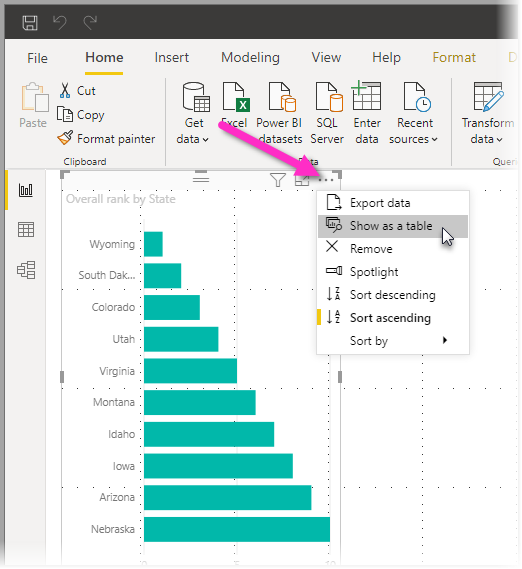
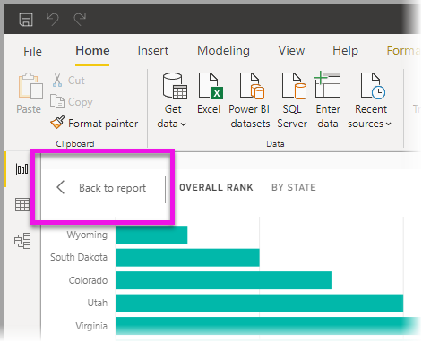
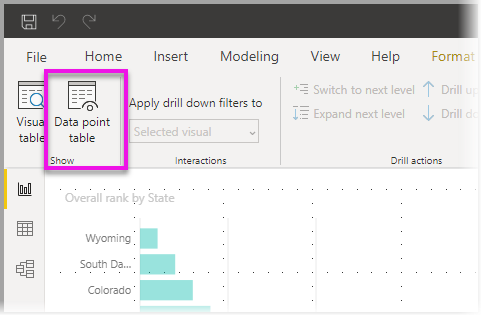

# Utilizar a Tabela de elementos visuais e a Tabela de ponto de dados no Power BI Desktop
No **Power BI Desktop**, pode explorar os detalhes de uma visualização e ver representações textuais dos dados subjacentes ou registos dos dados individuais do elemento visual selecionado. Estas funcionalidades são, por vezes, referidas como *clicável*, *exploração* ou *exploração de detalhes*.

Pode utilizar a **Tabela de elementos visuais** para visualizar os dados num elemento visual como uma tabela ou pode utilizar uma **Tabela de ponto de dados** para visualizar uma tabela dos dados utilizados para calcular um único ponto de dados. 

>[!IMPORTANT]
>A **Tabela de elementos visuais** e a **Tabela de ponto de dados** suportam apenas os seguintes tipos de visualização:
>  - Gráfico de barras
>  - Gráfico de colunas
>  - Gráfico em anel
>  - Mapa de manchas
>  - Funil
>  - Mapa
>  - Gráfico circular
>  - Treemap

## Utilizar a Tabela de elementos visuais no Power BI Desktop

A **Tabela de elementos visuais** mostra os dados subjacentes a uma visualização. A **Tabela de elementos visuais** aparece no separador **Dados/Pormenorização**, na secção **Mostrar** do friso, quando está selecionado um elemento visual.

Também pode ver os dados ao clicar com o botão direito do rato numa visualização e, em seguida, selecionar **Mostrar Dados** no menu apresentado ou selecionar **Mais opções** (…) no canto superior direito de uma visualização e, em seguida, selecionar **Mostrar como uma tabela**.

&nbsp;&nbsp;

> [!NOTE]
> Tem de colocar o cursor do rato sobre um ponto de dados no elemento visual para que o menu de contexto esteja disponível.

Quando selecionar **Tabela de elementos visuais** ou **Tabela de ponto de dados**, a tela do Power BI Desktop apresenta o elemento visual e a representação textual dos dados. Na *vista horizontal*, o elemento visual é apresentado na metade superior da tela e os dados são mostrados na metade inferior. 

Pode alternar entre a vista horizontal e a *vista vertical* ao selecionar o ícone no canto superior direito da tela.

Para voltar ao relatório, selecione **< Voltar ao Relatório** no canto superior esquerdo da tela.

## Utilizar a Tabela de ponto de dados no Power BI Desktop

Também pode concentrar-se num registo de dados numa visualização e explorar os dados. Para utilizar a **Tabela de ponto de dados**, selecione uma visualização e, em seguida, **Tabela de ponto de dados** no separador **Dados/Pormenorização** na secção **Ferramentas Visuais** do friso e, em seguida, selecione um ponto de dados ou uma linha na visualização. 

> [!NOTE]
> Se o botão **Tabela de ponto de dados** no friso estiver desativado e indisponível, significa que a visualização selecionada não suporta a **Tabela de ponto de dados**.

Também pode clicar com o botão direito do rato num elemento de dados e selecionar **Tabela de ponto de dados** no menu apresentado.

Quando selecionar **Tabela de ponto de dados** para um elemento de dados, a tela do Power BI Desktop apresenta todos os dados associados ao elemento selecionado. 

Para voltar ao relatório, selecione **< Voltar ao Relatório** no canto superior esquerdo da tela.

> [!NOTE]
>A **Tabela de ponto de dados** tem as seguintes limitações:
> - Não pode alterar os dados na vista **Tabela de ponto de dados** e guardá-los novamente no relatório.
> - Não pode utilizar a **Tabela de ponto de dados** quando o elemento visual utiliza uma medida calculada num grupo de medidas (multidimensional).
> - Não pode utilizar a **Tabela de ponto de dados** quando estiver ligado a um modelo multidimensional (MD).

## Próximos passos
Existem todos os tipos de formatação de relatórios e funcionalidades de gestão de dados no **Power BI Desktop**. Consulte os seguintes recursos para alguns exemplos:

* [Utilizar agrupamento e discretização no Power BI Desktop](desktop-grouping-and-binning.md)
* [Utilizar linhas de grelha, ajustar à grelha, ordenação z, alinhamento e distribuição em relatórios do Power BI Desktop](desktop-gridlines-snap-to-grid.md)

