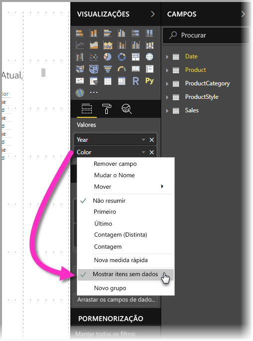
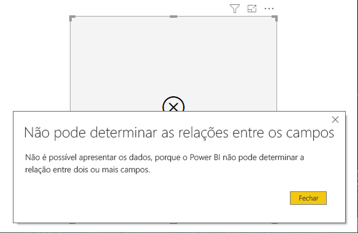
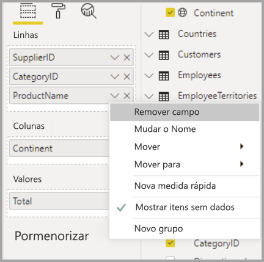

# Mostrar itens sem dados no Power BI

O Power BI permite-lhe visualizar todos os tipos de dados de várias origens. Ao criar um elemento visual, o Power BI apenas mostra os dados relevantes para permitir gerir adequadamente a forma como os dados são apresentados e visualizados. O Power BI determina que dados são relevantes com base na configuração do elemento visual e no modelo de dados subjacente. Este artigo descreve o comportamento do Power BI ao determinar os dados relevantes, com exemplos que ilustram a forma como as determinações são feitas.

## Determinar os dados relevantes

Para começar a compreender a forma como o Power BI determina os dados cuja apresentação é relevante, consideremos uma tabela como um exemplo simples. Com o modelo representado na secção [modelo de dados de exemplo](#example-data-model), disponível no fim deste artigo, pondere criar uma tabela com as seguintes definições:

**1. Grupos da mesma tabela:** *Product[Color] - Product[Size]*

|*Product[Color]*  |*Product[Size]*  |
|---------|---------|
|Azul     |Grande         |
|Azul     |Média         |
|Azul     |Small         |
|Vermelho     |Grande         |

Neste exemplo, o Power BI apresenta as combinações de *[Color-Size]* que existem na tabela *[Product]* . 

Vejamos agora outra combinação:

**2. Grupos de tabelas diferentes, mas diretamente relacionadas, e uma medida:** *ProductStyle[Finish] - Product[Color] - Sum(Sales[Quantity])*

|*ProductStyle[Finish]*  |*Product[Color]*  |*[SumQuantity]*  |
|---------|---------|---------|
|Brilhante     |Azul         |10         |
|Mate     |Azul         |15         |

Neste exemplo, o Power BI só mostra combinações que existem. Por exemplo, não apresentará (“Nenhum” + “Azul”) ou (“Mate” + “Vermelho”) porque estas combinações não existem no modelo. A condição que determina que combinações existem é o valor de *Sum(Sales[Quantity])* não estar em branco.

Vejamos um caso diferente: 

**3. Grupos de tabelas diferentes, mas diretamente relacionadas, e sem medida:** *ProductStyle[Finish] - Product[Color]*

|*ProductStyle[Finish]*  |*Product[Color]*  |
|---------|---------|
|Brilhante     |Azul         |
|Brilhante     |Vermelho         |
|Mate     |Azul         |

Uma vez que não há uma medida explícita e as duas tabelas estão diretamente relacionadas, o Power BI tenta injetar uma medida para limitar as combinações resultantes. Neste caso, o Power BI injeta a medida *CALCULATE(COUNTROWS('Product'))* , que não deve estar em branco, uma vez que *Product* é a tabela comum a ambas as tabelas.

Como tal, o Power BI apresenta as combinações que têm entradas na tabela Product, o que exclui as combinações de *("Nenhum" + "Azul")* e *("Mate" + "Vermelho”)* .

**4. Grupos de tabelas diferentes e não relacionadas**

O modelo de exemplo não tem esta combinação. Contudo, se existissem grupos de tabelas diferentes e não relacionadas, o Power BI não conseguiria relacionar as duas colunas. O resultado seria uma união de todos os valores de cada coluna. Nesse caso, o Power BI emite um erro do tipo *associação não limitada*, uma vez que o cálculo dessas uniões na base de dados é moroso e aquelas não disponibilizam muitas informações aos utilizadores. 

## Mostrar itens sem dados

A secção anterior descreveu a forma como o Power BI determina que dados são relevantes para apresentar. No entanto, poderá haver situações em que *pretende* mostrar itens sem dados. 

A funcionalidade **Mostrar itens sem dados** permite-lhe fazer precisamente o que o nome diz - incluir linhas e colunas de dados que não contêm dados de medidas (valores de medidas em branco).

Para ativar a funcionalidade **Mostrar itens sem dados**, selecione um elemento visual e, em **Campos**, clique com o botão direito do rato no campo e selecione **Mostrar itens sem dados**, no menu que aparece, conforme mostrado na imagem seguinte:

A funcionalidade **Mostrar itens sem dados***não* tem efeito nas circunstâncias abaixo:

* Não há medidas adicionadas ao elemento visual e as colunas de agrupamento são provenientes da mesma tabela
* Os grupos não são relacionados; o Power BI não executa consultas para elementos visuais que têm grupos não relacionados
* A medida não está relacionada com nenhum dos grupos; isto deve-se ao facto de que a medida nunca vai estar em branco apenas para algumas combinações de grupos.
* Existe um filtro de medida definido pelo utilizador que exclui medidas em branco, como, por exemplo: *SalesAmount > 0*

### Como Mostrar itens sem dados funciona

Os casos de utilização mais interessantes de **Mostrar itens sem dados** são aqueles nos quais estão presentes medidas. Vejamos uma situação em que os grupos são provenientes da mesma tabela ou podem ser relacionados através de um caminho no modelo. Por exemplo, *ProductStyle* está diretamente relacionado com *Product* e indiretamente relacionado com *Sales*, *ProductStyle* e *ProductCategory* podem ser relacionados através da tabela *Product* e assim sucessivamente.

Vejamos dois exemplos interessantes e façamos a comparação quando **Mostrar itens sem dados** está desativado e ativado. 

**1. Agrupar colunas da mesma tabela:** *Product[Color] - Product[Size] - Sum(Sales[Quantity])*

Como aparece se a funcionalidade **Mostrar itens sem dados** estiver desativada:

|*Product[Color]*  |*Product[Size]*  |*[SumQuantity]*  |
|---------|---------|---------|
|Azul     |Média         |15         |
|Azul     |Small         |10         |

Como aparece se a funcionalidade **Mostrar itens sem dados** estiver ativada:

|*Product[Color]*  |*Product[Size]*  |*[SumQuantity]*  |
|---------|---------|---------|
|Azul     |Grande         |         |
|Azul     |Média         |15         |
|Azul     |Small         |10         |
|Vermelho     |Grande         |         |

Repare como as duas combinações novas apareceram quando a funcionalidade está ativada: *Azul - Grande* e *Vermelho - Grande*. Nenhuma das entradas tem *Quantity* correspondente na tabela *Sales*. No entanto, são apresentadas na tabela *Product*.

**2. Agrupar colunas de tabelas relacionadas:** *ProductStyle[Finish] - Product[Color] - Sum(Sales[Quantity])*

Como aparece se a funcionalidade **Mostrar itens sem dados** estiver desativada:

|*ProductStyle[Finish]*  |*Product[Color]*  |*[SumQuantity]*  |
|---------|---------|---------|
|Brilhante     |Azul         |10         |
|Mate     |Azul         |15         |

Como aparece se a funcionalidade **Mostrar itens sem dados** estiver ativada:

|*ProductStyle[Finish]*  |*Product[Color]*  |*[SumQuantity]*  |
|---------|---------|---------|
|Brilhante     |Azul         |10         |
|Brilhante     |Vermelho         |         |
|Mate     |Azul         |15         |
|Nenhum     |         |         |

Repare como *(Brilhante - Vermelho)* e *(Nenhum, em branco)* apareceram como combinações. Eis o motivo de isso ter acontecido:
* O Power BI considerou primeiro ProductStyle[Finish] e selecionou todos os valores a apresentar, o que resultou em Brilhante, Mate e Nenhum.
* Utilizando cada um destes valores, o Power BI selecionou todas as entradas de *Product[Color]* correspondentes. 
* Uma vez que *Nenhum* não corresponde a nenhum *Product[Color]* , este valor fica em branco

É importante ter em conta que o mecanismo de seleção dos valores para as colunas depende da ordem e pode ser encarado como uma operação de *externa à esquerda* entre tabelas. Se a ordem da coluna for alterada, os resultados também mudarão.

Vejamos um exemplo da alteração da ordem e como os resultados são afetados. É igual ao item **2** nesta secção, com a ordem alterada.

**Product[Color] - ProductStyle[Finish] - Sum(Sales[Quantity])**

Como aparece se a funcionalidade **Mostrar itens sem dados** estiver ativada:

|*Product[Color]* |*ProductStyle[Finish]*  |*[SumQuantity]*  |
|---------|---------|---------|
|Azul     |Brilhante         |10         |
|Azul     |Mate         |15         |
|Vermelho     |Brilhante         |         |

Neste caso, repare como *ProductStyle[Finish]=None* não aparece na tabela. Isto deve-se ao facto de que, neste caso, o Power BI selecionou primeiro todos os valores de *Color* na tabela *Product*. Depois, para cada cor, selecionou os valores de *Finish* correspondentes que continham dados. Uma vez que *Nenhum* não aparece em nenhuma combinação de *Color*, não é selecionado.

## Comportamento dos elementos visuais do Power BI

Quando a opção **Mostrar itens sem dados** está ativa num campo de um elemento visual, a funcionalidade é automaticamente ativada para todos os outros campos que estão no mesmo *registo de elemento visual* ou na mesma hierarquia. Um registo de elemento visual ou uma hierarquia pode ser o **Eixo** ou a **Legenda** ou a **Categoria**, as **Linhas** e as **Colunas**.

Por exemplo, num Elemento visual de matriz com quatro campos no registo **Linhas**, se um campo tiver a opção **Mostrar itens sem dados** ativa, todos os itens na matriz também a terão. Na seguinte imagem, a opção **Mostrar itens sem dados** está ativa no primeiro campo do registo **Linhas**, o campo *IDdeFornecedor*. Os outros campos no registo **Linhas** também têm a opção ativa automaticamente.

Em contrapartida, o campo *Continente* apresentado no registo **Colunas***não* tem a opção **Mostrar itens sem dados** ativa automaticamente. 

O comportamento deste elemento visual é comum quando um elemento visual é convertido num tipo diferente, por exemplo, quando ocorre a conversão de um Elemento visual de matriz num elemento visual de tabela. Nestas conversões, a opção **Mostrar itens sem dados** é automaticamente ativada em qualquer campo movido para um registo que inclua um campo que tenha a funcionalidade ativa. No exemplo anterior, se o campo *IDdeFornecedor* tivesse a funcionalidade **Mostrar itens sem dados** ativa e o elemento visual fosse convertido numa tabela, o campo *Continente* do registo **Colunas** seria movido (juntamente com os campos no registo **Linhas**) para o único registo utilizado num elemento visual de tabela – o registo **Valores**. Assim, todos os campos no registo **Valores** teriam a funcionalidade **Mostrar itens sem dados** ativa.

### Exportar dados

Ao utilizar a funcionalidade **Exportar dados resumidos**, o comportamento da funcionalidade **Mostrar itens sem dados** será o mesmo que se verificaria se o resultado da exportação fosse convertido num Elemento visual de tabela. Assim, ao exportar um elemento visual como um elemento de Matriz de Gráfico, os dados exportados podem aparecer de forma diferente do elemento visual apresentado. Esta situação deve-se ao facto de a conversão num elemento visual de tabela, como parte do processo de exportação, levar à ativação da opção **Mostrar itens sem dados** para todos os campos a ser exportados. 

## Modelo de dados de exemplo

Esta secção mostra o modelo de dados de exemplo utilizado nos exemplos deste artigo.

**Modelo**: 

**Dados**:

|Product[ProductId]|    Product[ProductName]|   Product[Color]| Product[Size]|  Product[CategoryId]|    Product[StyleId]|
|---------|---------|---------|---------|---------|---------|
|1  |Prod1  |Azul   |Small  |1  |1 |
|2  |Prod2  |Azul   |Média |2  |2 |
|3  |Prod3  |Vermelho    |Grande  |1  |1 |
|4  |Prod4  |Azul   |Grande  |2  |2 |

|ProductCategory[CategoryId]|   ProductCategory[CategoryName]|
|---------|---------|
|1  |Telefone   |
|2  |Câmara |
|3  |TV |

|ProductStyle[StyleId]| ProductStyle[Finish]|   ProductStyle[Polished]|
|---------|---------|---------|
|1  |Brilhante  |Sim |
|2  |Mate  |Não |
|3  |Nenhum   |Não |

|Sales[SaleId]| Sales[ProductId]|   Sales[Date]|    Sales[Quantity]|
|---------|---------|---------|---------|
|1  |1  |1/1/2012 0:00| 10 |
|2  |2  |1/1/2013 0:00| 15 |

## Próximos passos

Este artigo descreveu como ativar a funcionalidade **Mostrar itens sem dados** no Power BI. Poderá também estar interessado nos seguintes artigos: 

* [Membro predefinido em modelos multidimensionais no Power BI](../connect-data/desktop-default-member-multidimensional-models.md)
