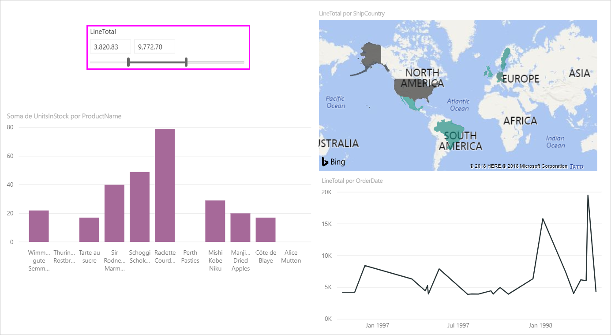
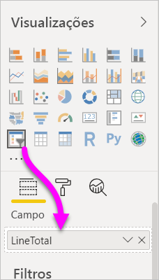
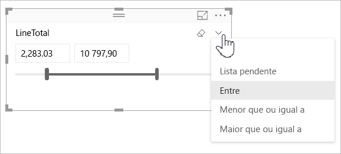
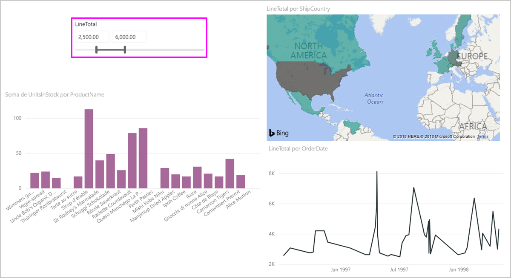
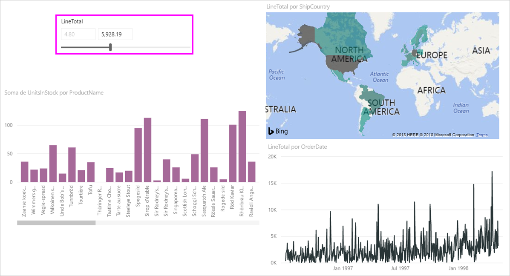
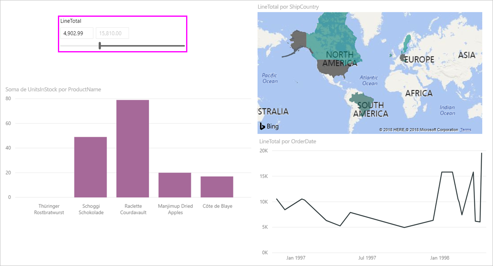

# Utilizar a segmentação de dados de intervalo numérico no Power BI

[!INCLUDE [applies-to](../includes/applies-to.md)] [!INCLUDE [yes-desktop](../includes/yes-desktop.md)] [!INCLUDE [yes-service](../includes/yes-service.md)]

Com a segmentação de dados de intervalo numérico, pode aplicar todos os tipos de filtros a qualquer coluna numérica no seu modelo de dados. Há três opções para filtrar os seus dados numéricos: entre números, menor que ou igual a um número, ou maior que ou igual a um número. Esta técnica simples é uma forma avançada de filtrar os seus dados.

## Vídeo

Neste vídeo, o Will orienta-o durante a criação de uma segmentação de dados de intervalo numérico.

> [!NOTE]
> Este vídeo utiliza uma versão mais antiga do Power BI Desktop.

<iframe width="560" height="315" src="https://www.youtube.com/embed/zIZPA0UrJyA" frameborder="0" allowfullscreen></iframe> 

## Adicionar uma segmentação de dados de intervalo numérico

Pode utilizar a segmentação de dados de intervalo numérico tal como utilizaria qualquer outra segmentação de dados. Basta criar um elemento visual de **Segmentação de dados** para o relatório e selecionar um valor numérico para o valor **Campo**. Na seguinte imagem, selecionámos o campo **LineTotal**.

Selecione a seta para baixo no canto superior direito da segmentação de dados do intervalo numérico e será apresentado um menu.

Para intervalos numéricos, pode selecionar uma das seguintes três opções:

* **Entre**
* **Menor que ou igual a**
* **Maior que ou igual a**

Quando selecionar **Entre** no menu, será apresentado um controlo de deslize. Pode utilizar o controlo de deslize para selecionar valores numéricos que se encontrem entre os números. Por vezes, a granularidade associada à movimentação da barra de segmentação de dados dificulta a seleção exata desse número. Também pode utilizar o controlo de deslize e selecionar uma das caixas para escrever os valores pretendidos. Esta opção é útil quando quer segmentar em números específicos.

Na seguinte imagem, a página de relatório filtra os valores de **LineTotal** entre 2500,00 e 6000,00.

Quando seleciona **Menor que ou igual a**, a alça esquerda (valor inferior) da barra de controlo de deslize desaparece e só pode ajustar o limite superior da barra de controlo de deslize. Na imagem seguinte, definimos o valor máximo da barra de controlo de deslize para 5928,19.

Por fim, se selecionar **Maior que ou igual a**, a alça direita (valor superior) da barra de controlo de deslize desaparece. Em seguida, pode ajustar o valor mais baixo conforme mostrado na seguinte imagem. Agora, apenas os itens com o campo **LineTotal** maior que ou igual a 4902,99 são apresentados nos elementos visuais na página de relatório.

## Ajustar para números inteiros com a segmentação de dados do intervalo numérico

A segmentação de dados do intervalo numérico ajusta-se para números inteiros se o tipo de dados do campo subjacente for *Número Inteiro*. Esta funcionalidade permite que a segmentação de dados se alinhe corretamente com números inteiros. Os campos *Número Decimal* permitem-lhe introduzir ou selecionar frações de um número. A formatação definida na caixa de texto corresponde à formatação definida no campo, mesmo que possa escrever ou selecionar números mais precisos.

## Formato de apresentação com a segmentação de dados de intervalo de datas

Quando utiliza uma segmentação de dados para apresentar ou definir um intervalo de datas, estas são apresentadas no formato *Data Abreviada*. A região do sistema operativo ou do browser do utilizador determina o formato de data. Como tal, será o formato de apresentação independentemente das definições do tipo de dados do modelo ou dos dados subjacentes.

O formato do seu tipo de dados subjacente pode, por exemplo, ser o formato de data por extenso. Neste caso, um formato de data como *dddd, dd de MMMM de aaaa* formataria uma data noutros elementos visuais ou circunstâncias no formato *quarta-feira, 14 de março de 2001*. Contudo, na segmentação de dados de intervalo de datas, essa data é apresentada na segmentação de dados como *14/03/2001*.

Apresentar o formato Data Abreviada na segmentação de dados garante que o comprimento da cadeia permanece consistente e compacto na segmentação de dados.

## Limitações e considerações

As seguintes limitações e considerações aplicam-se à segmentação de dados de intervalo numérico:

* A segmentação de dados de intervalo numérico filtra todas as linhas subjacentes nos dados e não os valores agregados. Por exemplo, imaginemos que utiliza um campo *Montante das Vendas*. A segmentação de dados filtra cada transação com base no montante das vendas e não na soma dos montantes das vendas de cada ponto de dados de um elemento visual.
* Atualmente, não funciona em medidas.
* Pode escrever qualquer número numa segmentação numérica, mesmo que esta esteja fora do intervalo de valores na coluna subjacente. Esta opção permite-lhe definir filtros se souber que os dados poderão ser alterados no futuro.
* A segmentação do intervalo de datas permite quaisquer valores de data, mesmo que não existam na coluna de data subjacente.
