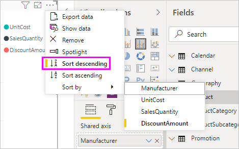
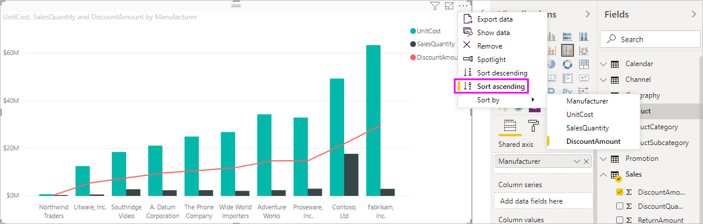
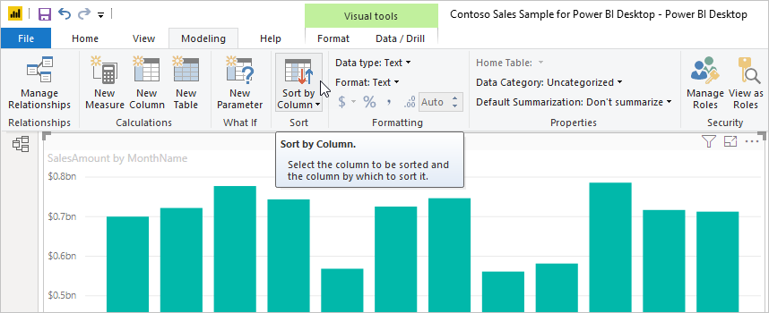
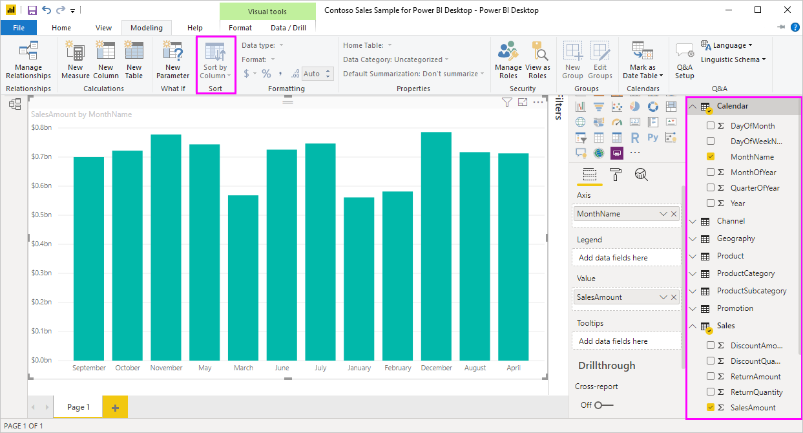

# Sort by column in Power BI Desktop (Ordenar por coluna no Power BI Desktop)
No Power BI Desktop e no serviço Power BI, pode alterar o aspeto de um elemento visual ao ordená-lo por campos de dados diferentes. Ao alterar a forma como ordena um elemento visual, pode destacar as informações que pretende transmitir e certificar-se de que o elemento visual reflete essa tendência (ou ênfase).

Se estiver a utilizar dados numéricos (como o volume de vendas) ou dados de texto (como nomes de estado), pode ordenar as visualizações e dar-lhes o aspeto que preferir. O Power BI oferece muita flexibilidade para fins de ordenação e menus rápidos para utilização. Para ordenar qualquer elemento visual, selecione o respetivo menu **Mais opções** (...), selecione **Ordenar por** e, em seguida, selecione o campo a partir do qual pretende ordenar.

## Exemplo de ordenação
Vamos utilizar um exemplo mais completo e ver como funciona no Power BI Desktop.

A seguinte visualização mostra os custos, quantidades e montantes pelo nome do fabricante. Eis o aspeto da visualização antes de fazermos qualquer ordenação adicional:

O elemento visual está atualmente ordenado com base na coluna **QuantidadeDeVendas**. Podemos determinar a coluna de ordenação ao corresponder a cor das barras ascendentes à legenda, mas existe uma forma ainda melhor: o menu **Mais opções**, ao qual pode aceder ao selecionar o menu de reticências (…).

Seguem-se as seleções de ordenação:

* O campo de ordenação atual é **QuantidadeDeVendas**, indicado por **QuantidadeDeVendas** a negrito e precedido por uma barra amarela. 

* O campo de ordenação atual é ascendente, indicado por **Ordenação ascendente** a negrito e precedido por uma barra amarela.

Iremos analisar a direção e o campo de ordenação nas duas secções seguintes.

## Selecionar a coluna a utilizar para ordenação
Já deve ter reparado na barra amarela antes de **QuantidadeDeVendas** no menu **Mais Opções**, que indica que o elemento visual está ordenado de acordo com a coluna **QuantidadeDeVendas**. É fácil ordenar por outra coluna. Selecione o menu de reticências (…) para ver o menu **Mais opções**, selecione **Ordenar por** e, em seguida, selecione uma coluna diferente.

Na seguinte imagem, selecionamos **MontanteDoDesconto** como a coluna pela qual pretendemos ordenar. Essa coluna é apresentada como uma das linhas do elemento visual e não uma das barras. 

Repare como o elemento visual foi alterado. Os valores estão agora ordenados do valor mais elevado do **MontanteDoDesconto** (Fabrikam Inc.) ao mais baixo (Northwind Traders). 

Mas e se queremos ordenar de forma ascendente, em vez de descendente? A secção seguinte mostra como é simples fazê-lo.

## Selecionar a sequência de ordenação
Se virmos bem o menu **Mais opções** da imagem anterior, podemos ver que a opção **Ordenação descendente** está a negrito e é precedida por uma barra amarela.

Quando a opção **Ordenação descendente** está selecionada, significa que o elemento visual está a ser ordenado pela coluna selecionada, ou seja, do valor mais elevado para o mais baixo. Pretende alterar esta ordem? Não há problema. Basta selecionar **Ordenação ascendente** e a sequência de ordenação da coluna selecionada muda do valor mais baixo para o mais elevado.

Eis o mesmo elemento visual após a alteração da ordenação do **MontanteDoDesconto**. Repare que a Northwind Traders é agora o primeiro fabricante listado e a Fabrikam Inc. é o último (o oposto da ordenação anterior).

Pode ordenar por qualquer coluna incluída no elemento visual. Podemos facilmente selecionar **QuantidadeDeVendas** como a coluna pela qual pretendemos ordenar para apresentar, em primeiro lugar, os fabricantes com o maior número de vendas e manter as outras colunas no elemento visual tal como se aplicam ao fabricante. Eis o aspeto do elemento visual com essas definições:

## Ordenação utiliza botão de Ordenar Por Coluna
Existe outra forma de ordenar os dados: através do botão **Ordenar por Coluna** no friso **Modelação**.

Para utilizar este método de ordenação, terá de selecionar a coluna (campo) para efetuar a ordenação a partir do painel **Campos**. Em seguida, selecione **Modelação** > **Ordenar por Coluna** para ordenar o seu elemento visual. Se não selecionar uma coluna, o botão **Ordenar por Coluna** fica inativo.

Vejamos um exemplo comum. Tem dados de todos os meses do ano e pretende ordená-los com base na ordem cronológica. Os passos seguintes mostram-lhe como pode fazê-lo:

1. Tenha em atenção que quando o elemento visual está selecionado, mas não está selecionada nenhuma coluna no painel **Campos**, o botão **Ordenar por Coluna** está inativo (cinzento).
   
   

2. Quando selecionamos a coluna pela qual pretendemos ordenar, no painel **Campos**, o botão **Ordenar por Coluna** fica ativo.
   
   
3. Agora, com o elemento visual selecionado, podemos selecionar **MêsDoAno**, em vez da predefinição **NomeDoMês**, e o elemento visual ordena pela ordem pretendida: pelo mês do ano.
   
   

<!---
This functionality is no longer active. Jan 2020

## Getting back to default column for sorting
You can sort by any column you'd like, but there may be times when you want the visual to return to its default sorting column. No problem. For a visual that has a sort column selected, open the **More options** menu and select that column again, and the visualization returns to its default sort column.

For example, here's our previous chart:

When we go back to the menu and select **SalesQuantity** again, the visual defaults to being ordered alphabetically by **Manufacturer**, as shown in the following image.

With so many options for sorting your visuals, creating just the chart or image you want is easy.
--->

## Próximas etapas

Poderá também estar interessado nos seguintes artigos:

* [Utilizar a pormenorização de relatório cruzado no Power BI Desktop](desktop-cross-report-drill-through.md)
* [Segmentação de Dados no Power BI](../visuals/power-bi-visualization-slicers.md)
