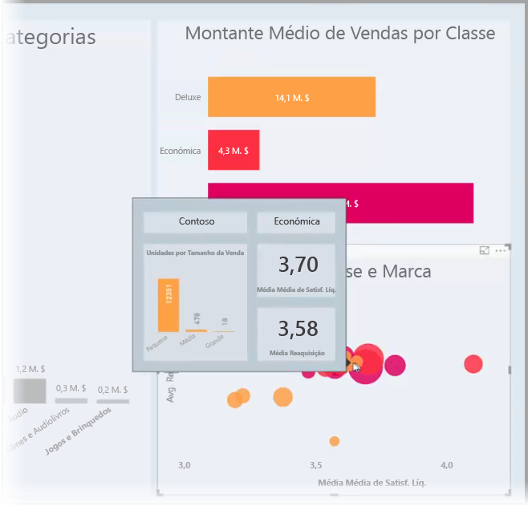
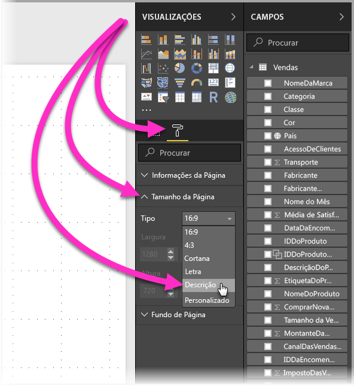
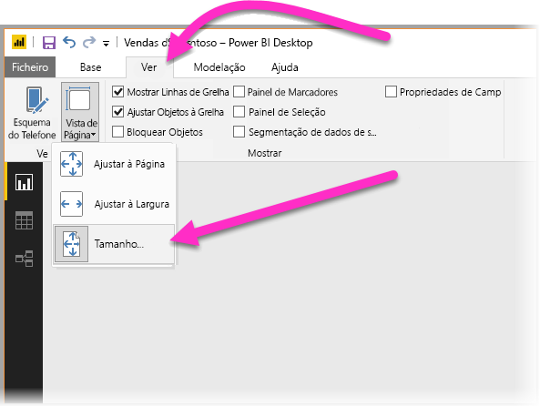
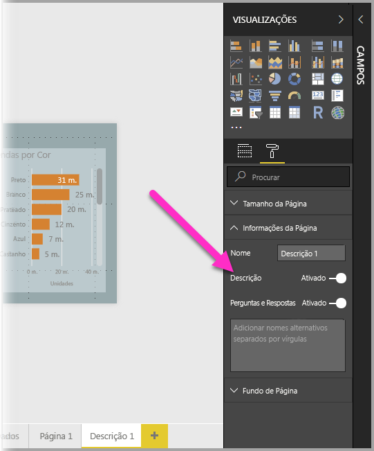
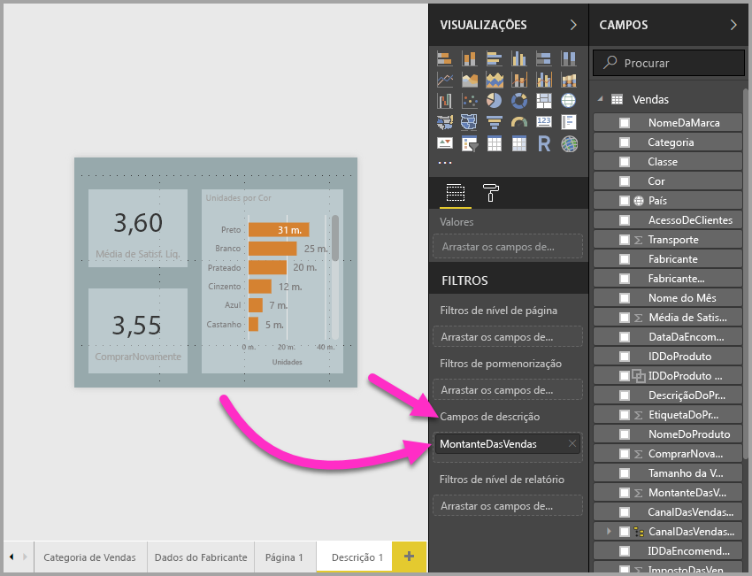
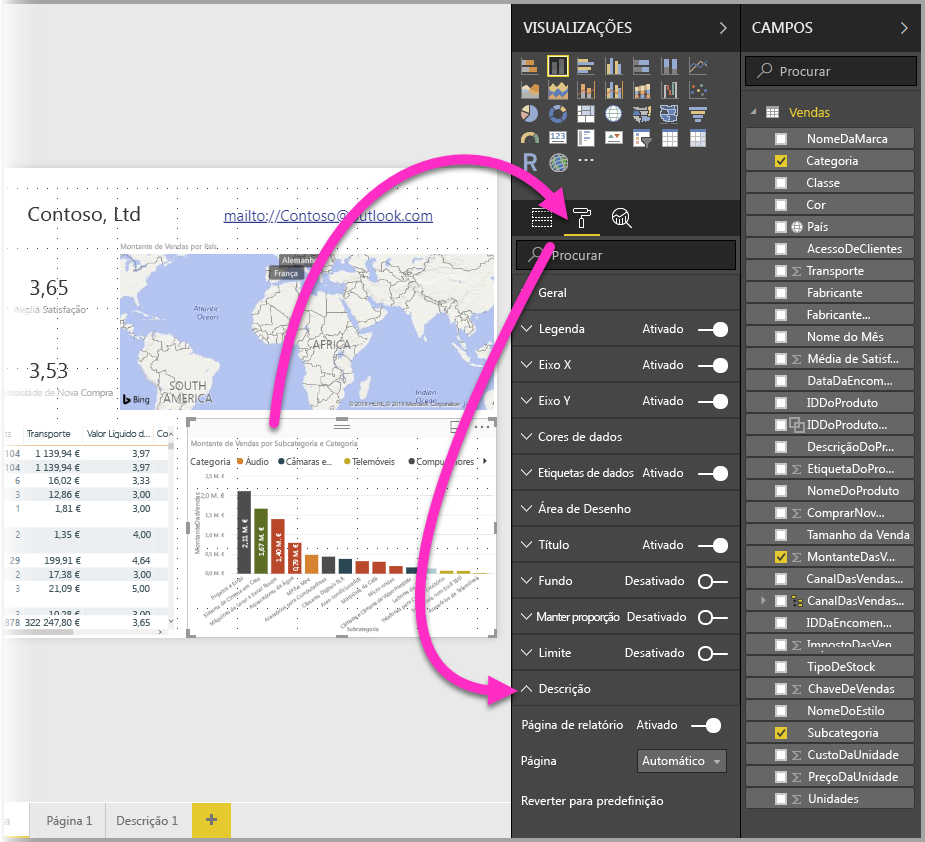
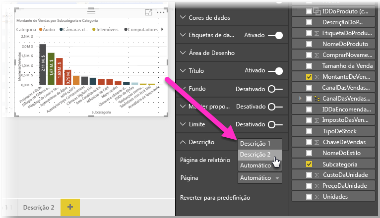
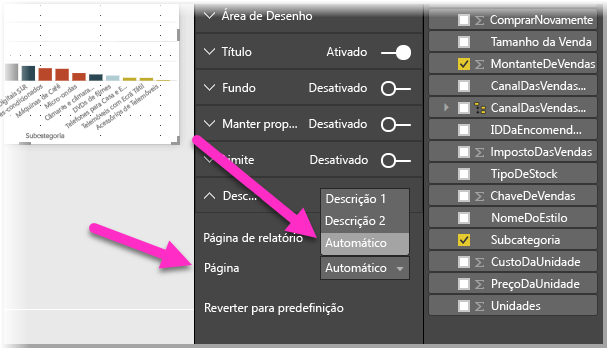
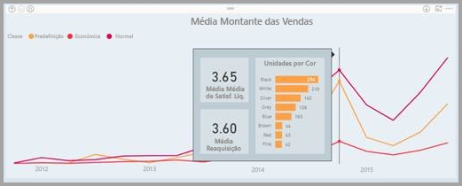
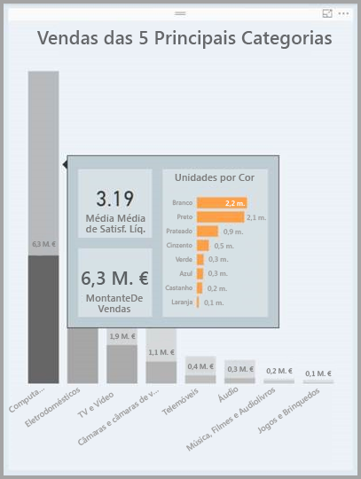

# Criar descrições com base em páginas de relatório no Power BI Desktop
Pode criar **descrições de relatórios** visualmente avançadas que surgem ao pairar o cursor sobre elementos visuais, com base nas páginas de relatórios que criar no **Power BI Desktop**. Ao criar uma página de relatório que serve como descrição, as suas descrições personalizadas podem incluir elementos visuais, imagens e qualquer outra coleção de itens que criar na página do relatório. 

Pode criar as páginas de descrição que pretender. Cada página de descrição pode ser associada a um ou mais campos do relatório de forma a que, quando pairar o cursor sobre um elemento visual que inclua o campo selecionado, a descrição criada na página de descrição seja apresentada, filtrada com base no ponto de dados sobre o qual está a pairar o cursor do rato. 

Existem inúmeras coisas interessantes que pode fazer com as descrições de relatórios. Veja como pode criar descrições e o que tem de fazer para as configurar.

## Criar uma página de descrições de relatórios
Para começar, crie uma nova página de relatório ao clicar no botão **+** , que se encontra na parte inferior da tela do **Power BI Desktop**, na área de separadores de página. O botão encontra-se junto à última página no relatório. 

Pode criar uma descrição com o tamanho que quiser. No entanto, tenha em atenção que as descrições pairam sobre a tela do relatório, pelo que as deve manter razoavelmente pequenas. No painel **Formato** no cartão **Tamanho da Página**, poderá ver um novo modelo de tamanho de página denominado *Descrição*. Este modelo fornece um tamanho de tela da página de relatório pronto a utilizar para a sua descrição.

Por predefinição, o **Power BI Desktop** ajusta a tela do seu relatório ao espaço disponível na página. Muitas vezes essa é uma boa opção, mas não no caso das descrições. Para compreender melhor e ver o aspeto da sua descrição quando tiver terminado, pode alterar a **Vista de Página** para o tamanho real. 

Para tal, selecione o separador **Ver** no friso. A partir daí, selecione **Vista de Página > Tamanho Real**, conforme apresentado na imagem seguinte.

Também pode atribuir um nome à página do relatório para tornar o seu propósito mais claro. Selecione o cartão **Informações da Página** no painel **Formato** e, em seguida, escreva o nome no campo **Nome** que lhe for apresentado. Na imagem seguinte, o nome do relatório da descrição é *Descrição 1*, mas pode mudá-lo para um nome mais sugestivo.

A partir daí, pode criar os elementos visuais que pretende que sejam apresentados na sua descrição. Na imagem seguinte, existem dois cartões e um gráfico de barras agrupadas na página de descrição, juntamente com uma cor de fundo da própria página e fundos para cada um dos elementos visuais, de modo a dar o aspeto que pretende.

Existem mais passos que tem de concluir antes de a descrição da página de relatório estar pronta a funcionar como uma descrição. Tem de configurar a página de descrição de diversas formas, conforme descrito na secção seguinte. 

## Configurar a página de relatório da descrição

Assim que tiver criado a página de relatório da descrição, terá de configurar a página de modo a que o **Power BI Desktop** possa registá-la como uma descrição e de garantir que esta é apresentada nos elementos visuais corretos.

Para começar, tem de definir o controlo de deslize **Descrição** para a posição **Ativado**, no cartão **Informações da Página**, para tornar a página numa descrição. 

Assim que definir o controlo de deslize para Ativado, especifique os campos onde pretende que a descrição do relatório seja apresentada. A descrição será apresentada para os elementos visuais no relatório que incluírem o campo especificado. Pode especificar os campos aplicáveis ao arrastá-los para o registo **Campos de descrição**, que se encontra na secção **Campos** do painel **Visualizações**. Na imagem seguinte, o campo *MontanteDeVendas* foi arrastado para o registo **Campos de descrição**.

 
Pode adicionar campos numéricos e de categorias no registo **Campos de descrição**, incluindo medidas.

Assim que terminar, a página de relatório da descrição que criar será utilizada como uma descrição em elementos visuais no relatório que utilizar qualquer um dos campos que colocou no registo **Campos de descrição**, ao substituir a descrição predefinida do Power BI.

## Definir manualmente uma descrição de relatório

Para além de criar uma descrição que é apresentada automaticamente ao pairar o cursor sobre um elemento visual que contém o campo especificado, pode definir uma descrição manualmente. 

Qualquer elemento visual que suportar descrições de relatório passará a incluir um cartão **Descrição** no respetivo painel **Formatação**. 

Para definir manualmente uma descrição, selecione o elemento visual para o qual pretende especificar a descrição manual e, em seguida, no painel **Visualizações**, selecione a secção **Formato** e expanda o cartão **Descrição**.

Em seguida, no menu pendente **Página**, selecione a página de descrição que pretende utilizar para o elemento visual selecionado. Tenha em atenção que apenas as páginas de relatório especificadas como páginas de **Descrição** são apresentadas na caixa de diálogo.

Pode utilizar a definição manual de descrições de várias formas. Pode definir uma página em branco para uma descrição e, deste modo, substituir a descrição do Power BI predefinida. A definição manual também se aplica quando não pretende utilizar a descrição selecionada automaticamente pelo Power BI. Por exemplo, se tiver um elemento visual que inclui dois campos e existir uma descrição associada a ambos, o Power BI só seleciona uma para apresentação. Se quiser que isso não aconteça, poderá selecionar manualmente a descrição que deve ser apresentada.

## Reverter para as descrições predefinidas

Se criar uma descrição manual para um elemento visual, mas decidir que pretende a descrição predefinida fornecida pelo Power BI, poderá sempre regressar a essa descrição predefinida. Para tal, quando um elemento visual estiver selecionado e o cartão **Descrição** estiver expandido, selecione *Automático* no menu pendente **Página** para regressar à predefinição.

## Descrições de relatórios e gráficos de linhas personalizados

Existem algumas considerações a ter em conta quando as suas descrições de relatórios interagem com elementos visuais de gráficos de linhas e com elementos visuais realçados de forma cruzada.

### Descrições de relatórios e gráficos de linhas

Quando uma descrição de relatório é apresentada para um gráfico de linhas, só é apresentada uma única descrição para todas as linhas no gráfico. Este comportamento é semelhante ao da descrição predefinida para gráficos de linhas, que também apresenta apenas uma única descrição. 

Isto acontece porque o campo na legenda não passa por um filtro na descrição. Na imagem seguinte, a descrição apresentada mostra todas as unidades vendidas nesse dia nas três categorias expostas na descrição do relatório (neste exemplo, Deluxe, Económica e Normal). 

### Descrições de relatórios e realce de forma cruzada

Quando um elemento visual é realçado de forma cruzada num relatório, as descrições de relatórios mostram sempre os dados realçados de forma cruzada, mesmo que paire o cursor sobre a secção desvanecida do ponto de dados. Na imagem seguinte, o cursor do rato está a pairar sobre a secção desvanecida do gráfico de barras (a secção que não está realçada), mas a descrição do relatório continua a mostrar os dados da parte realçada nesse ponto de dados (os dados realçados).

## Limitações e considerações
Existem algumas limitações e considerações a ter em conta relativamente às **descrições**.

* A partir da versão de dezembro de 2018 do **Power BI Desktop**, os elementos visuais de botões também suportam descrições.
* As descrições de relatórios não são suportadas para elementos visuais do Power BI. 
* Atualmente, os clusters não são suportados como campos que podem ser apresentados em descrições de relatórios. 
* Ao selecionar um campo a apresentar em descrições de relatórios, se utilizar um campo em vez de uma categoria, os elementos visuais que contêm esse campo só mostrarão a descrição especificada quando o resumo do campo selecionado corresponder. 

## Próximas etapas
Para obter mais informações sobre funcionalidades semelhantes ou como interagir com descrições de relatórios, veja os artigos seguintes:

* [Utilizar a pormenorização no Power BI Desktop](desktop-drillthrough.md)
* [Apresentar um mosaico do dashboard ou um elemento visual do relatório no modo de detalhe](../consumer/end-user-focus.md)
