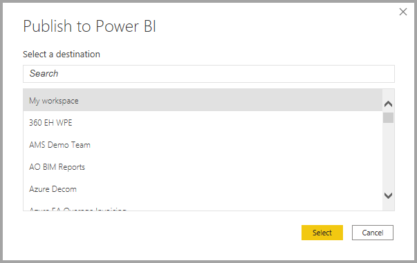
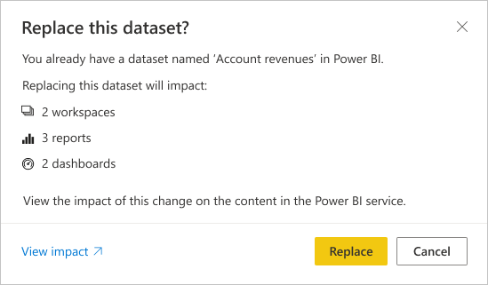

# Publicar conjuntos de dados e relatórios a partir do Power BI Desktop
Quando publica um ficheiro do Power BI Desktop no serviço Power BI, os dados no modelo são publicados na sua área de trabalho do Power BI. O mesmo acontece com quaisquer relatórios que tenha criado na vista **Relatório**. Verá um novo conjunto de dados com o mesmo nome e todos os relatórios no navegador da Área de Trabalho.

Publicar através do Power BI Desktop tem o mesmo efeito que utilizar a opção **Obter Dados** no Power BI para ligar e carregar um ficheiro do Power BI Desktop.

> [!NOTE]
> Todas as alterações que fizer ao relatório no Power BI não serão guardadas novamente no ficheiro original do Power BI Desktop. O mesmo acontece quando adiciona, elimina ou altera visualizações em relatórios.
> 
> 

## Para publicar um conjunto de dados e relatórios do Power BI Desktop
1. No Power BI Desktop, selecione **Ficheiro** \> **Publicar** \> **Publicar no Power BI** ou selecione **Publicar** no friso.  

   

2. Inicie sessão no Power BI.
3. Selecione o destino.

   

Quando terminar a publicação, receberá uma ligação para o seu relatório. Selecione a ligação para abrir o relatório no seu site do Power BI.

## Publicar novamente ou substituir um conjunto de dados publicado a partir do Power BI Desktop
Ao publicar um ficheiro do Power BI Desktop, o conjunto de dados e os relatórios criados no Power BI Desktop são carregados no seu site do Power BI. Quando publicar novamente o ficheiro do Power BI Desktop, o conjunto de dados no seu site do Power BI é substituído pelo conjunto de dados atualizado do ficheiro do Power BI Desktop.

Este processo é muito simples, mas existem alguns aspetos que deve saber:

* A existência de dois ou mais conjuntos de dados no Power BI com o mesmo nome que o ficheiro do Power BI Desktop poderá fazer com que a publicação falhe. Verifique se tem apenas um conjunto de dados no Power BI com o mesmo nome. Também pode mudar o nome do ficheiro e publicar ao criar um novo conjunto de dados com o mesmo nome do ficheiro.
* Se mudar o nome ou eliminar uma coluna ou medida, quaisquer visualizações já existentes no Power BI com esse campo podem ficar corrompidas. 
* O Power BI ignora as alterações de formato de colunas existentes. Por exemplo, se alterar o formato de uma coluna de 0,25% para 25%.
* Digamos que tem uma agenda de atualização configurada para o seu conjunto de dados existente no Power BI. Quando adicionar novas origens de dados ao seu ficheiro e depois voltar a publicar, terá de iniciar sessão nessas origens antes da próxima atualização agendada.
* Quando publica novamente um conjunto de dados a partir do Power BI Desktop e tem uma agenda de atualização definida, é iniciada uma atualização do conjunto de dados assim que volta a publicar.
* Quando faz uma alteração a um conjunto de dados e, em seguida, o publica novamente, uma mensagem mostra quantas áreas de trabalho, relatórios e dashboards são potencialmente afetados pela alteração e pede para confirmar se quer substituir o conjunto de dados publicado atualmente pelo modificado. A mensagem também fornece uma ligação para a análise completa de impacto dos conjuntos de dados no serviço Power BI, onde pode ver mais informações e efetuar ações para mitigar os riscos da alteração.

   

   [Saiba mais sobre a Análise de impacto dos conjuntos de dados](../collaborate-share/service-dataset-impact-analysis.md).