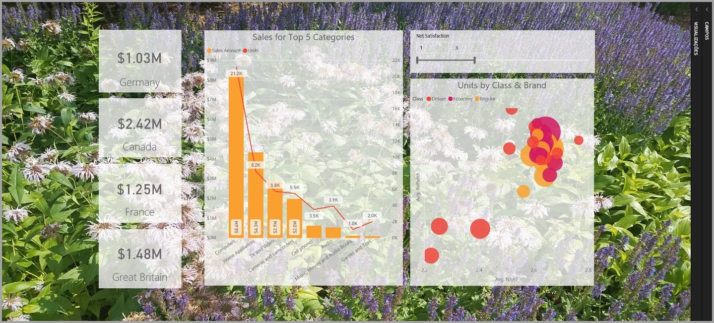
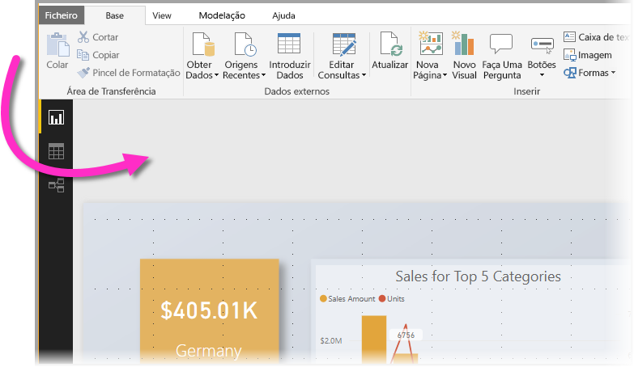
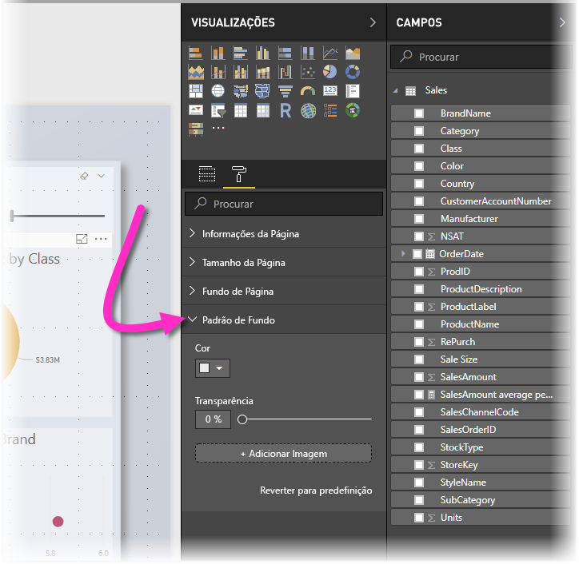
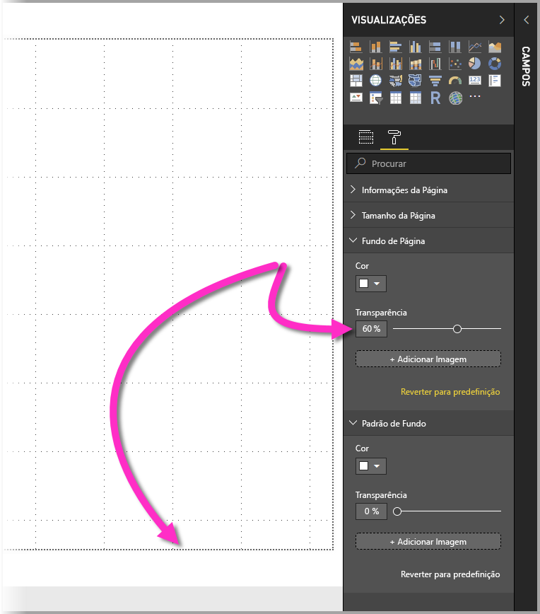
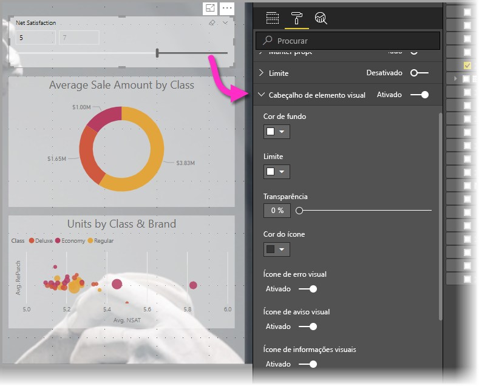
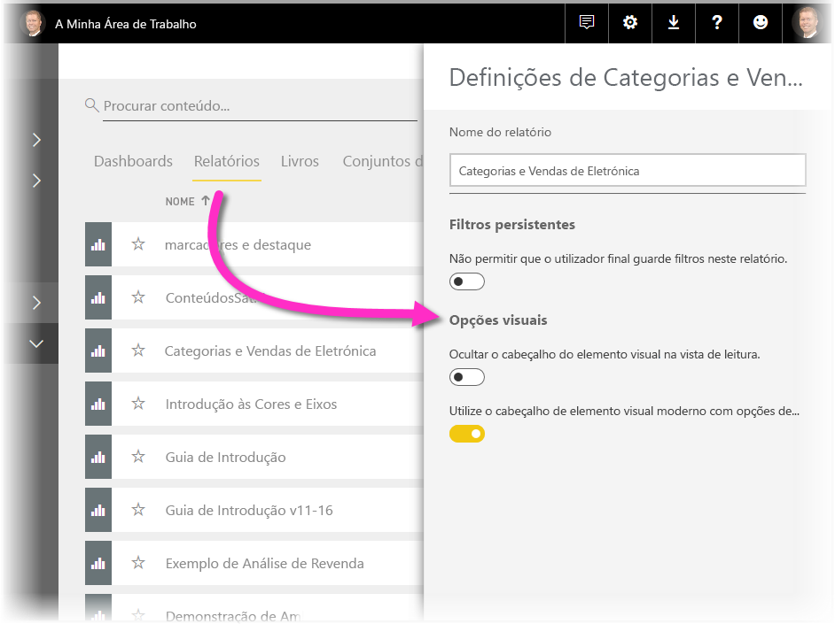
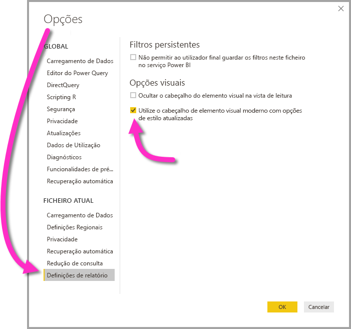

# Utilizar elementos visuais para melhorar relatórios do Power BI

Com o **Power BI Desktop** pode utilizar elementos visuais, como o padrão de fundo e os cabeçalhos de elementos visuais melhorados para visualizações, para melhorar a aparência dos relatórios.

A partir da versão de julho de 2018 do **Power BI Desktop**, pode utilizar os melhoramentos nos relatórios e tornar as análises e os relatórios ainda mais atraentes do que antes. Os melhoramentos discutidos neste artigo incluem os seguintes: 

* Aplicar o **padrão de fundo** aos relatórios de modo que o seu fundo possa melhorar ou realçar os elementos da história que quer contar com os seus dados
* Utilizar os **cabeçalhos de elementos visuais** melhorados para visualizações individuais para criar elementos visuais perfeitamente alinhados na tela do relatório. 

As secções seguintes descrevem como usar esses melhoramentos e como aplicá-los aos relatórios.

## Utilizar o padrão de fundo em relatórios do Power BI

Pode formatar a área cinzenta fora da página do seu relatório com o **padrão de fundo**. A imagem seguinte tem uma seta que esclarece onde se aplica a área do padrão de fundo. 

Pode definir o padrão de fundo para cada página do relatório ou ter o mesmo padrão de fundo para todas as páginas no relatório. Para definir o padrão de fundo, toque ou clique no ícone **Formatação** quando não está selecionado nenhum elemento visual no relatório e quando o cartão **Padrão de fundo** aparece no painel.

Pode escolher uma cor para aplicar como **padrão de fundo** ao selecionar o menu pendente **Cor** ou pode selecionar o botão **Adicionar Imagem** para selecionar uma imagem para aplicar como padrão de fundo. Também pode aplicar transparência ao padrão de fundo, quer se trate de uma cor ou de uma imagem, com o controlo de deslize **Transparência**.

É útil ter em mente as seguintes definições que dizem respeito ao **padrão de fundo**:

* A área cinzenta fora da área do relatório é a área do **padrão de fundo**
* A área na tela onde pode colocar os elementos visuais é referida como a **página** do relatório e pode ser modificada no **painel Formatar** através da lista pendente **Fundo de página**.

A **página** de relatório está sempre no primeiro plano (em comparação com o padrão de fundo), enquanto o **padrão de fundo** está atrás dela e é o elemento mais atrás na página do relatório. Quando aplica transparência à página, a transparência também é aplicada aos elementos visuais no relatório, o que permite que o padrão de fundo seja visível em segundo plano nos elementos visuais.

Para todos os novos relatórios, as configurações padrão são as seguintes:

* A **página** de relatório está definida como **branca** e a transparência está definida como **100%**
* O **padrão de fundo** está definido como **branco** e a transparência definida como **0%**

Ao definir o fundo de página como tendo mais do que 50% de transparência, é apresentada uma borda pontilhada enquanto estiver a criar ou editar o relatório, para mostrar o limite da borda da tela do relatório. 

É importante ter em atenção que o limite pontilhado *apenas* aparece quando edita o relatório e *não* aparece para as pessoas que estão a ver o relatório publicado, por exemplo, quando for visualizado no **serviço do Power BI**.

> [!NOTE]
> Se utilizar imagens de cores escuras como padrão de fundo e definir a cor do texto para branco ou para uma cor muito clara, tenha em atenção que a funcionalidade **Exportar para PDF** não inclui um padrão de fundo, pelo que todos os relatórios com tipos de letra brancos serão praticamente invisíveis no ficheiro PDF exportado. Veja [Export to PDF](desktop-export-to-pdf.md) (Exportar para PDF) para obter mais informações sobre a opção **Exportar para PDF**.

## Utilizar cabeçalhos de elementos visuais melhorados em relatórios do Power BI

A partir da versão de julho de 2018 do **Power BI Desktop**, os cabeçalhos dos elementos visuais nos relatórios foram significativamente melhorados. As principais melhorias prendem-se com o facto de o cabeçalho ter sido separado do elemento visual, pelo que a sua posição pode ser ajustada de acordo com a sua preferência de layout e de posicionamento. O cabeçalho agora é apresentado dentro do elemento visual em vez de flutuar acima dele. 

Por predefinição, o cabeçalho é apresentado dentro do elemento visual alinhado com o título. Na imagem seguinte, pode ver o cabeçalho (o ícone de afixação, o ícone de expansão e o ícone de reticências) no elemento visual e alinhado à direita, juntamente com a mesma posição horizontal como o título do elemento visual.

Se o elemento visual não tiver um título, o cabeçalho flutuará acima da parte superior do elemento visual alinhado à direita, conforme mostrado na imagem seguinte. 

Se o elemento visual estiver posicionado na parte superior do relatório, o cabeçalho ajusta-se antes à parte inferior do elemento visual. 

Cada elemento visual também tem um cartão na secção **Formatação** do painel **Visualizações**, denominado **Cabeçalho do elemento visual**. Nesse cartão, pode ajustar todos os tipos de características do cabeçalho

> [!NOTE]
> A visibilidade dos botões de alternar não afeta o relatório durante a criação ou edição do relatório. Tem de publicar o relatório e vê-lo no modo de leitura para ver o efeito. Esse comportamento garante que as várias opções fornecidas nos cabeçalhos são importantes durante a edição, especialmente os ícones de aviso que o alertam sobre problemas durante a edição.

Para relatórios que só são apresentados no **serviço Power BI**, pode ajustar a utilização de cabeçalhos de elementos visuais ao aceder a **Minha Área de Trabalho > Relatórios** e, em seguida, selecionar o ícone **Definições**. Aí pode ver as definições do relatório para o qual selecionou **Definições** e pode ajustar as definições a partir daí, conforme mostrado na imagem seguinte.

### Ativar cabeçalhos de elementos visuais melhorados para os relatórios existentes

O novo cabeçalho de elemento visual é o comportamento predefinido para todos os novos relatórios. Para os relatórios existentes, tem de ativar esse comportamento no **Power BI Desktop** através de **Ficheiro > Opções e definições > Opções** e, em seguida, na secção **Definições do relatório**, ative a caixa de verificação **Utilizar o cabeçalho de elemento visual moderno com opções de estilo atualizadas**.

## Próximas etapas
Para obter mais informações sobre o **Power BI Desktop**, e sobre como começar, consulte os seguintes artigos.

* [O que é o Power BI Desktop?](../fundamentals/desktop-what-is-desktop.md)
* [Descrição Geral das Consultas com o Power BI Desktop](../transform-model/desktop-query-overview.md)
* [Origens de Dados no Power BI Desktop](../connect-data/desktop-data-sources.md)
* [Ligar a Dados no Power BI Desktop](../connect-data/desktop-connect-to-data.md)
* [Moldar e Combinar Dados com o Power BI Desktop](../connect-data/desktop-shape-and-combine-data.md)
* [Tarefas de Consulta Comuns no Power BI Desktop](../transform-model/desktop-common-query-tasks.md)   
