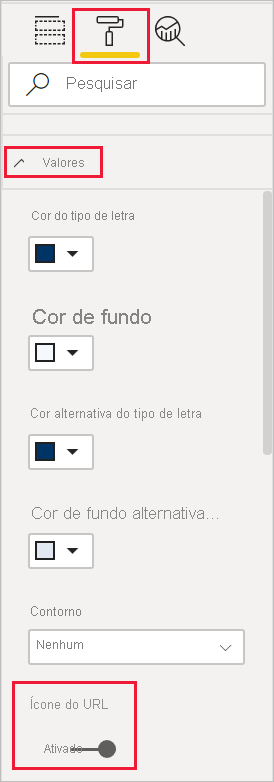
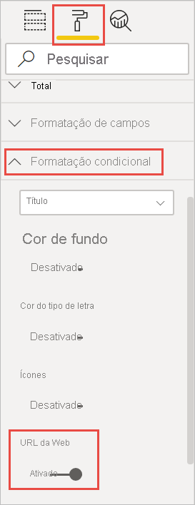
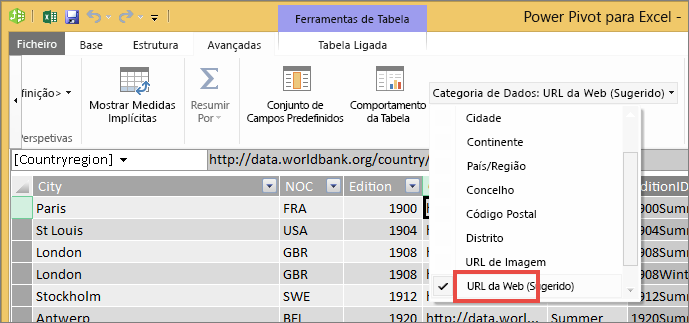

# Adicionar hiperligações (URLs) a uma tabela ou matriz
Este tópico explica como adicionar hiperligações (URLs) a uma tabela. Pode utilizar o Power BI Desktop para adicionar hiperligações (URLs) a um conjunto de dados. Pode adicionar essas hiperligações às matrizes e tabelas de relatório no Power BI Desktop ou no serviço Power BI. Em seguida, pode visualizar o URL ou um ícone de ligação ou formatar outra coluna como texto da ligação.

No serviço Power BI e no Power BI Desktop, pode ainda criar hiperligações em [caixas de texto nos relatórios](service-add-hyperlink-to-text-box.md). De igual forma, no serviço Power BI, pode criar hiperligações para [mosaicos nos dashboards](service-dashboard-edit-tile.md) e nas [caixas de texto nos dashboards](service-dashboard-add-widget.md). 

## Formatar um URL como uma hiperligação no Power BI Desktop

Pode formatar um campo com URLs como hiperligações no Power BI Desktop, mas não no serviço Power BI. Também pode [formatar hiperligações no Power Pivot para Excel](#create-a-table-or-matrix-hyperlink-in-excel-power-pivot) antes de importar o livro para o Power BI.

1. No Power BI Desktop, se ainda não existir nenhum campo com uma hiperligação no conjunto de dados, adicione-o como uma [coluna personalizada](../transform-model/desktop-common-query-tasks.md).

    > [!NOTE]
    > Não pode criar colunas no modo DirectQuery.  Porém, pode transformá-los em hiperligações se os dados já contiverem URLs.

2. Na vista Dados ou Relatório, selecione a coluna. 

3. No separador **Modelação**, selecione **Categoria de Dados** > **URL da Web**.
   
    

    > [!NOTE]
    > Os URLs têm de começar com determinados prefixos. Veja [Considerações e resolução de problemas](#considerations-and-troubleshooting) neste artigo para conhecer a lista completa.

## Criar uma tabela ou matriz com uma hiperligação

1. Depois de ter [formatado uma hiperligação como um URL](#format-a-url-as-a-hyperlink-in-power-bi-desktop), alterne para a Vista de relatório.
2. Crie uma tabela ou matriz com o campo que categorizou como URL da Web. As hiperligações são azuis e estão sublinhadas.

    

## Apresentar um ícone de hiperligação em vez de um URL

Se não quiser apresentar um URL longo numa tabela, pode apresentar, um ícone de hiperligação  como alternativa. 

> [!NOTE]
> Não pode apresentar ícones numa matriz.
   
1. Primeiro, [crie uma tabela com uma hiperligação](#create-a-table-or-matrix-with-a-hyperlink).

2. Selecione a tabela para a ativar.

    Selecione o ícone **Formatar**  para abrir o separador Formatação.

    Expanda **Valores**, localize o **ícone de URL** e defina-o como **Ativo**.

    

1. (Opcional) [Publique o relatório](desktop-upload-desktop-files.md) do Power BI Desktop no serviço Power BI. Quando abrir o relatório no serviço Power BI, as hiperligações também funcionarão.

## Formatar o texto da ligação como uma hiperligação

Também pode formatar outro campo numa tabela como a hiperligação, sem ter uma coluna para o URL. Neste caso, não formata a coluna como um URL da Web.

> [!NOTE]
> Não pode formatar outro campo como a hiperligação numa matriz.

1. Se um campo com uma hiperligação ainda não existir no conjunto de dados, utilize o Power BI Desktop para o adicionar como uma [coluna personalizada](../transform-model/desktop-common-query-tasks.md). Novamente, não pode criar colunas no modo DirectQuery.  Porém, pode transformá-los em hiperligações se os dados já contiverem URLs.

2. Na vista Dados ou Relatório, selecione a coluna que contém o URL. 

3. No separador **Modelação**, selecione **Categoria de Dados**. Certifique-se de que a coluna está formatada como **Sem Categoria**.

2. Na vista Relatório, crie uma tabela ou matriz com a coluna de URL e a coluna que pretende formatar como texto da ligação.

3. Com a tabela selecionada, selecione o ícone **Formatar**  para abrir o separador Formatação.

4. Expanda a **Formatação condicional** e confirme que o nome na caixa é a coluna que quer como texto da ligação. Localize o **URL da Web** e defina-o como **Ativado**.

    

    > [!NOTE]
    > Se não vir uma opção **URL da Web**, certifique-se de que a coluna que contém as hiperligações *não* está formatada como **URL da Web** na caixa da lista pendente **Categoria de Dados**.

5. Na caixa de diálogo **URL da Web**, selecione o campo que contém o URL na caixa **Baseado no campo** > **OK**.

    

    Agora, o texto nessa coluna é formatado como a ligação.

    

1. (Opcional) [Publique o relatório](desktop-upload-desktop-files.md) do Power BI Desktop no serviço Power BI. Quando abrir o relatório no serviço Power BI, as hiperligações também funcionarão.

## Criar uma hiperligação de tabela ou matriz no Excel Power Pivot

Outra forma de adicionar hiperligações às tabelas e matrizes do Power BI é criar as hiperligações no conjunto de dados antes de importar/ligar a esse conjunto de dados a partir do Power BI. Este exemplo utiliza um livro do Excel.

1. Abra o livro no Excel.
2. Selecione o separador **PowerPivot** e, em seguida, escolha **Gerir**.
   
   
1. Quando o PowerPivot abrir, selecione o separador **Avançadas**.
   
   
4. Coloque o cursor na coluna que contém os URLs que deseja transformar em hiperligações nas tabelas do Power BI.
   
   > [!NOTE]
   > Os URLs têm de começar com determinados prefixos. Veja [Considerações e resolução de problemas](#considerations-and-troubleshooting) para conhecer a lista completa.
   > 
   
5. No grupo **Propriedades de Relatório**, selecione na lista pendente **Categoria de Dados** e escolha **URL da Web**. 
   
   

6. A partir do serviço Power BI ou do Power BI Desktop, ligue a este livro ou importe-o.
7. Crie uma visualização de tabela que contenha o campo URL.
   
   

## Considerações e resolução de problemas

Os URLs têm de começar por um dos seguintes:
- http
- https
- -mailto
- ftp
- news
- telnet

P: Posso utilizar um URL personalizado como uma hiperligação numa tabela ou numa matriz?    
R: Não. Pode utilizar um ícone de ligação. Se necessitar de texto personalizado para as hiperligações e se a sua lista de URLs for pequena, considere utilizar antes uma caixa de texto.

## Próximos passos
[Visualizações em relatórios do Power BI](../visuals/power-bi-report-visualizations.md)

[Conceitos básicos para designers no serviço Power BI](../fundamentals/service-basic-concepts.md)

Mais perguntas? [Pergunte à Comunidade do Power BI](https://community.powerbi.com/)
