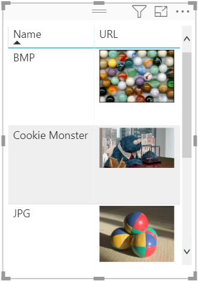
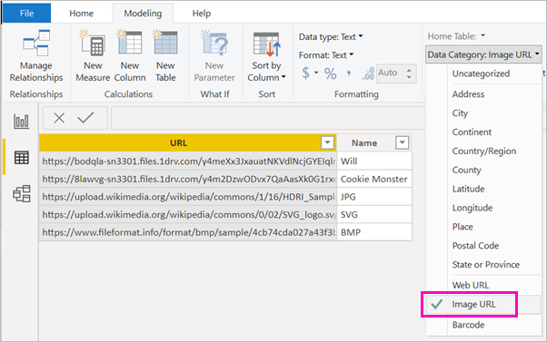
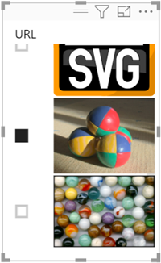

# Apresentar imagens numa tabela, matriz ou segmentação de dados num relatório

Uma boa maneira de melhorar os relatórios é através da adição de imagens. As imagens estáticas na página são boas para algumas finalidades. Mas, às vezes, precisa de imagens que se relacionem com os dados no relatório. Este tópico ensina como apresentar imagens numa tabela, numa matriz, numa segmentação de dados ou num cartão multilinhas. 

## Adicionar imagens ao relatório

1. Crie uma coluna com os URLs das imagens. Veja as [Considerações](#considerations) mais adiante neste artigo para obter os requisitos.

1. Selecione essa coluna. No friso **Modelagem**, para **Categoria de dados**, selecione **URL da imagem**.

    

1. Adicione a coluna a uma tabela, matriz, segmentação de dados ou cartão multilinhas.

    

## Considerações

- A imagem precisa de estar num destes formatos de ficheiro: .bmp, .jpg, .jpeg, .gif, .png ou .svg
- O URL precisa de ser acessível de forma anónima, não num site que exija início de sessão, como o SharePoint. No entanto, se as imagens estiverem alojadas no SharePoint ou no OneDrive, poderá obter um código de incorporação que aponte diretamente para elas. 

## Próximas etapas

[Formatação e esquema de página](/learn/modules/visuals-in-power-bi/12-formatting)

[Conceitos básicos para designers no serviço Power BI](../fundamentals/service-basic-concepts.md)

Mais perguntas? [Pergunte à Comunidade do Power BI](https://community.powerbi.com/)
