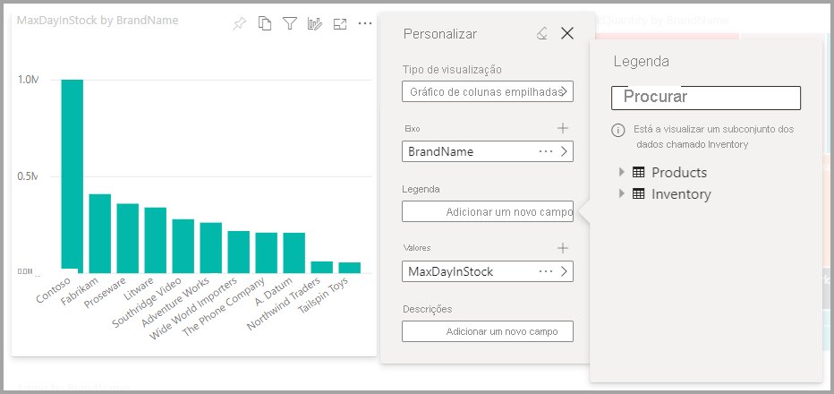
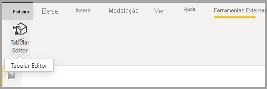
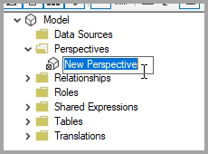
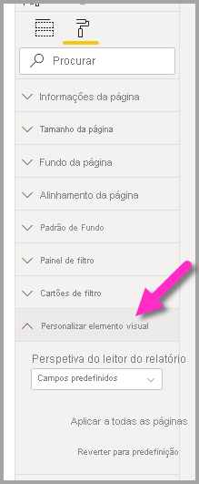
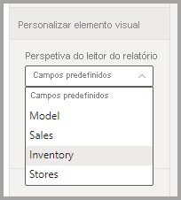

# Permitir que os utilizadores personalizem elementos visuais num relatório

[!INCLUDE [applies-to](../includes/applies-to.md)] [!INCLUDE [yes-desktop](../includes/yes-desktop.md)] [!INCLUDE [yes-service](../includes/yes-service.md)]

Quando partilha um relatório com uma audiência alargada, alguns utilizadores podem querer ver vistas ligeiramente diferentes de elementos visuais específicos. Poderão querer trocar os dados no eixo, alterar o tipo de elemento visual ou adicionar algo à descrição. É difícil criar um elemento visual que satisfaça os requisitos de todos. Com esta nova capacidade, permite aos utilizadores finais explorar e personalizar elementos visuais, tudo na vista de leitura do relatório. Podem ajustar o elemento visual conforme preferirem e guardá-lo como marcador para consulta posterior. Não precisam de ter permissão de edição no relatório nem de contactar o autor do relatório para fazer alterações.

:::image type="content" source="media/power-bi-personalize-visuals/power-bi-personalize-visual.png" alt-text="Personalizar um elemento visual":::
 
## O que os utilizadores de relatórios podem alterar

Esta funcionalidade permite aos utilizadores empresarias obter mais informações através de uma exploração ad-hoc dos elementos visuais num relatório do Power BI. Para saber mais sobre como utilizar esta funcionalidade como utilizador, veja [Personalizar os elementos visuais nos relatórios](../consumer/end-user-personalize-visuals.md). Esta funcionalidade é ideal para criadores de relatórios que pretendem permitir cenários básicos de exploração para os leitores dos seus relatórios. Eis as modificações que os leitores de relatórios podem fazer:

- Alterar o tipo de visualização
- Trocar uma medida ou dimensão
- Adicionar ou remover uma legenda
- Comparar duas ou mais medidas
- Alterar agregações, etc.

Esta funcionalidade permite novas capacidades de exploração, Além de incluir formas de os utilizadores capturarem e partilharem as suas alterações:

- Capturar as suas alterações
- Partilhar as suas alterações
- Repor todas as suas alterações a um relatório
- Repor todas as suas alterações a um elemento visual
- Limpar as suas alterações recentes

## Usar as Perspetivas para uma vista mais focada

Para Personalizar elementos visuais, pode utilizar as **Perspetivas** para escolher um subconjunto de um modelo que proporciona uma vista mais focada. Escolher um subconjunto pode ser útil ao trabalhar com um modelo de dados grande, permitindo que se foque num subconjunto de campos que pode ser gerido, em vez de sobrecarregar os leitores do relatório com a coleção completa de campos nesse modelo grande. 

Tenha em mente as seguintes considerações ao trabalhar com perspetivas:

* As perspetivas não se destinam a serem utilizadas como mecanismo de segurança; são uma ferramenta que proporciona uma melhor experiência ao utilizador final. Toda a segurança de uma perspetiva é herdada do modelo subjacente.

* São suportadas perspetivas em modelos tabulares e multidimensionais. No entanto, para perspetivas em modelos multidimensionais, só pode definir a perspetiva para ser igual ao o cubo base do relatório.

* Antes de eliminar uma perspetiva de um modelo, verifique se a perspetiva não está a ser utilizada na experiência Personalizar elementos visuais. 

Para utilizar as Perspetivas, tem de ativar a opção Personalizar elementos visuais no relatório. Tem também de criar pelo menos uma Perspetiva que inclua as dimensões e medidas com as quais pretende que os utilizadores finais interajam na experiência Personalizar elementos visuais.

Para criar a perspetiva, utilize o [Tabular Editor](https://tabulareditor.com/), que pode transferir na localização seguinte: transferir o Tabular Editor

Depois de instalar o **Tabular Editor**, abra o seu relatório no **Power BI Desktop** e abra o **Tabular Editor** no separador **Ferramentas Externas** do friso, como mostrado na imagem seguinte.

No Tabular Editor, clique com o botão direito do rato na pasta **Perspectives** (Perspetivas) para criar uma nova perspetiva.

Pode fazer duplo clique no texto para mudar o nome da perspetiva.

Em seguida, adicione campos à perspetiva ao abrir a pasta **Tables** (Tabelas) no Tabular Editor e, em seguida, clicar com o botão direito do rato nos campos que pretende mostrar na perspetiva.

Repita esse processo para cada campo que pretenda adicionar à perspetiva. Não pode adicionar campos duplicados numa perspetiva, pelo que quaisquer campos que já tenha adicionado a uma perspetiva terão a opção de adição desativada.

Após adicionar todos os campos que pretende, lembre-se de guardar as definições, tanto no Tabular Editor como no Power BI Desktop.

Depois de guardar a nova perspetiva no modelo e de guardar o relatório do Power BI Desktop, navegue para o painel **Formatar** da página, onde verá uma nova secção para **Personalizar elemento visual**.

A seleção de *Perspetiva do leitor do relatório* está definida inicialmente como *Campos predefinidos*. Quando selecionar a seta pendente, verá as outras Perspetivas que criou.

Após definir a Perspetiva para a página do relatório, a experiência Personalizar elementos visuais dessa página é filtrada segundo a Perspetiva selecionada. Selecionar **Aplicar a todas as páginas** permite-lhe aplicar a sua definição de Perspetiva a todas as páginas existentes no seu relatório.

## Ativar a personalização num relatório

A funcionalidade pode ser ativada no Power BI Desktop ou no serviço Power BI. Pode também ativá-la nos relatórios incorporados.

### No Power BI Desktop

Para ativar a funcionalidade no Power BI Desktop, aceda a **Ficheiro** > **Opções e Definições** > **Opções** > **Ficheiro atual** > **Definições de relatórios**. Certifique-se de que a definição **Personalizar elementos visuais** está ativada.

:::image type="content" source="media/power-bi-personalize-visuals/personalize-report-setting-desktop.png" alt-text="Ativar a personalização num relatório":::

### No serviço Power BI

Para ativar a funcionalidade no serviço Power BI, aceda às **Definições** do seu relatório.

:::image type="content" source="media/power-bi-personalize-visuals/power-bi-report-service-settings-personalize-visual.png" alt-text="Definições de relatórios no serviço Power BI":::

Ative **Personalizar elementos visuais** > **Guardar**.

:::image type="content" source="media/power-bi-personalize-visuals/personalize-report-setting-service.png" alt-text="Ativar Personalizar elementos visuais no serviço":::

## Ativar ou desativar a funcionalidade num nível de página ou de elemento visual

Quando ativa a definição Personalizar elementos visuais para um determinado relatório, por predefinição, todos os elementos visuais nesse relatório podem ser personalizados. Se não quiser que todos os elementos visuais sejam personalizados, pode ativar ou desativar a definição por página ou por elemento visual.

### Por página

Selecione o separador da página > selecione **Formato** no painel **Visualizações**.

:::image type="content" source="media/power-bi-personalize-visuals/personalize-page-level-setting.png" alt-text="Selecione Personalizar Elemento Visual para uma página.":::
 
Deslize a opção **Personalizar elemento visual** para a posição  >  **Ativado** ou **Desativado**.

### Por elemento visual

Selecione o elemento visual > selecione **Formatar** no painel **Visualizações** > expanda **Cabeçalho de elemento visual**.

:::image type="content" source="media/power-bi-personalize-visuals/power-bi-format-visual-header-personalize.png" alt-text="Selecionar Cabeçalho de elemento visual":::
 
Deslize a opção **Personalizar elemento visual** para a posição  >  **Ativado** ou **Desativado**.

:::image type="content" source="media/power-bi-personalize-visuals/power-bi-format-visual-personalize-on-off.png" alt-text="Deslizar a opção Personalizar elemento visual para a posição ativado ou desativado":::

## Limitações

Atualmente, a funcionalidade tem algumas limitações que devem ser tidas em conta.

- Esta funcionalidade não é suportada para publicar na Web.
- As explorações de utilizadores não persistem automaticamente. Tem de guardar a sua vista como um marcador pessoal para capturar as alterações.
- Esta funcionalidade é suportada nas aplicações móveis do Power BI para tablets iOS e Android e na aplicação Windows do Power BI; não é suportada nas aplicações móveis do Power BI para telemóveis. No entanto, qualquer alteração a um elemento visual que guardar num marcador pessoal enquanto está no serviço Power BI será respeitada em todas as aplicações móveis do Power BI.

## Passos seguintes

[Personalizar os elementos visuais nos seus relatórios](../consumer/end-user-personalize-visuals.md).     

Experimente a nova experiência de personalização de elementos visuais. Envie-nos os seus comentários sobre esta funcionalidade e indique-nos como a podemos continuar a melhorar no [site Power BI Ideas](https://ideas.powerbi.com/forums/265200-power-bi). 

Mais perguntas? [Pergunte à Comunidade do Power BI](https://community.powerbi.com/)
