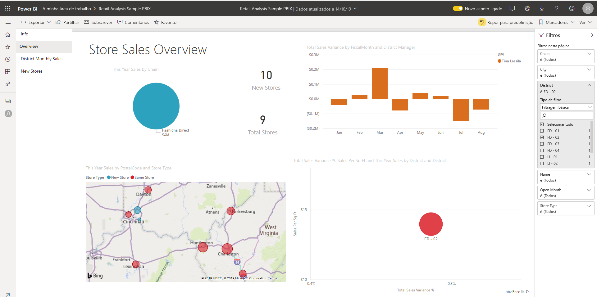
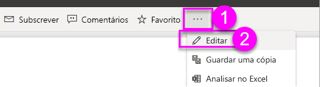
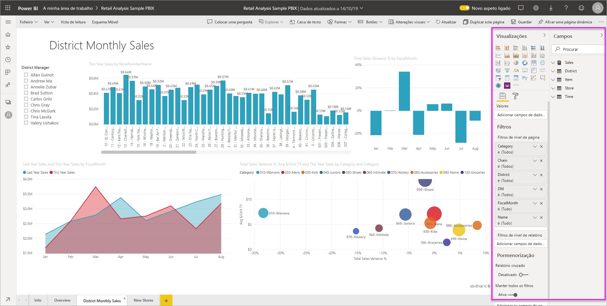
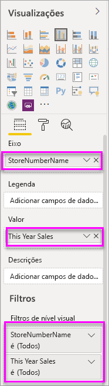
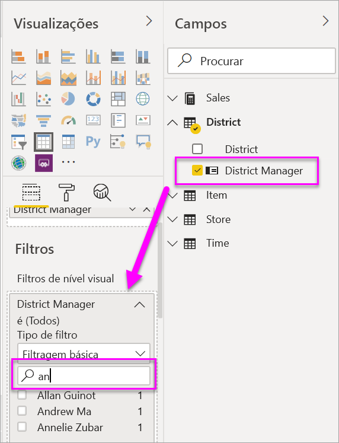

# Add a filter to a report in Power BI (Adicionar um filtro a um relatório no Power BI)

Este artigo explica como adicionar um filtro de visualização, filtro de página ou filtro de relatório a um relatório no Power BI. É necessário que seja capaz de editar um relatório para adicionar filtros. Os exemplos deste artigo estão no serviço Power BI, e os passos são quase idênticos no Power BI Desktop. À procura de uma visão geral? Confira [os Filtros e destaque nos relatórios power bi](power-bi-reports-filters-and-highlighting.md) primeiro.

O Power BI disponibiliza vários tipos de filtros: manual, automático, pormenorização, pass-through, entre outros. Saiba mais sobre os [diferentes tipos de filtros](power-bi-report-filter-types.md).

Depois de adicionar filtros, pode [formatar os filtros nos seus relatórios Power BI](power-bi-report-filter.md) para olhar e agir da forma que quiser.

## Filtros na Vista de edição ou na Vista de leitura
Interage com relatórios em duas visões diferentes: Vista de leitura e vista de edição. Este artigo descreve como criar filtros na **Vista de edição** dos relatórios.  Para obter mais informações sobre os filtros na Vista de leitura, veja [Interagir com filtros na Vista de leitura dos relatórios](../consumer/end-user-report-filter.md).

Uma vez que os filtros *persistem*, ao sair do relatório, o Power BI mantém o filtro, a segmentação de dados e outras alterações que fez à vista de dados. Assim, pode retomar a atividade onde a deixou ao regressar ao relatório. Se não quiser que as alterações do filtro persistam, **selecione Reset para predefinido** a partir da barra de menu superior.

:::image type="content" source="../consumer/media/end-user-report-filter/power-bi-reset-icon.png" alt-text="Reinicie para o ícone predefinido.":::

Tenha em mente que, como criador do relatório, quaisquer filtros que guarde com o relatório tornam-se o *estado de filtro padrão* para todos os leitores de relatórios. Quando selecionam **Reset para o padrão,** é a isso que voltam.

## Níveis dos filtros no painel Filtros
Quer esteja a utilizar o serviço Power BI Desktop ou Power BI, o painel de filtros aparece ao longo do lado direito da tela do relatório. Se não vir o painel Filtros, selecione o ícone ">" no canto superior direito para expandi-lo.

Pode definir filtros em três níveis diferentes para o relatório: nível visual, nível de página e nível de relatório. Este artigo explica como definir os diferentes níveis.

## Adicionar um filtro a um elemento visual
Os visuais têm dois tipos diferentes de filtros.
Pode adicionar um filtro de nível visual a um visual de duas maneiras diferentes. 

* Os campos que estão em visuais são automaticamente filtros para esse visual. 
* Como designer de relatórios, pode identificar um campo que já não é o visual, e adicionar esse campo diretamente ao balde de **filtros de nível Visual.**
 
A propósito, este artigo utiliza a amostra de Análise de Varejo, se quiser instalá-la e seguir em frente. Instale o pacote de conteúdo [de amostra de análise](sample-retail-analysis.md#get-the-content-pack-for-this-sample) de varejo.

### Filtrar com um campo que não está no elemento visual

1. No serviço Power BI, selecione **Mais opções (...)**  >  **Editar** para abrir o seu relatório na vista de Edição.
   
   

2. Abra as visualizações, filtros e painéis de campos, se ainda não estiverem abertas.
   
   

3. Selecione um elemento visual para torná-lo ativo. Neste caso, é o gráfico de dispersão na página geral. Todos os campos no visual estão no **painel de Visualizações.** Também estão listados no painel **de filtros,** sob os **filtros desta posição visual.**
   
   
  
1. No painel Campos, selecione o campo que quer adicionar como um novo filtro de nível de elemento visual e arraste-o para a área **Filtros de nível de elemento visual**.  Neste exemplo, arrastamos **categoria** para **adicionar campos de dados aqui** em **Filtros neste visual.**
     
    

    A **categoria de** aviso *não* é adicionada à própria visualização.
     
1. Selecione **Kids**. A carta de dispersão é filtrada, mas os outros visuais permanecem os mesmos.
     
    

    Se guardar o seu relatório com este filtro, os leitores de relatório podem interagir com o filtro **categoria** na vista Reading, selecionando ou limpando valores.
    
    Se arrastar uma *coluna numérica* para o painel Filtros para criar um filtro ao nível do elemento visual, o filtro é aplicado às *linhas de dados subjacentes*. Por exemplo, a adição de um filtro no campo **CustoUnitário** e a definição desse filtro como **CustoUnitário** > 20 só mostraria os dados das linhas de produtos nas quais o custo unitário fosse maior do que 20, independentemente do custo unitário total dos pontos de dados mostrados no elemento visual.

## Adicionar um filtro a uma página inteira

Também pode adicionar um filtro ao nível da página para filtrar uma página inteira.

1. No serviço Power BI, abra o relatório de Análise de Revenda e vá para a página **Vendas Mensais Distritais**. 

2. Selecione **...**  > **Editar relatório** para abrir o relatório na Vista de edição.
   
   

2. Abra as visualizações, filtros e painéis de campos, se ainda não estiverem abertas.

3. No painel Campos, selecione o campo que quer adicionar como um novo filtro de nível de página e arraste-o para a área **Filtros de nível de página**.  
4. Selecione os valores que quer filtrar e defina os controlos de filtragem **Básica** ou **Avançada**.
   
   Todas as visualizações na página são redesenhadas para refletir a alteração.
   
    Se guardar o relatório com o filtro, os leitores do relatório poderão interagir com o filtro na Vista de leitura, ao selecionar ou desmarcar valores.

## Adicionar um filtro ao nível do relatório para filtrar um relatório inteiro

1. Selecione **Editar relatório** para abrir o relatório na Vista de edição.
   
   

2. Abra o painel Visualizações e Filtros e o painel Campos, se ainda não estiverem abertos.
3. No painel Campos, selecione o campo que quer adicionar como um novo filtro de nível de relatório e arraste-o para a área **Filtros de nível de relatório**.  
4. Selecione o valor que quer filtrar.

    Os elementos visuais na página ativa e em todas as páginas do relatório são alterados para refletir o novo filtro. Se guardar o relatório com o filtro, os leitores do relatório poderão interagir com o filtro na Vista de leitura, ao selecionar ou desmarcar valores.

1. Selecione a seta para trás para voltar à página anterior do relatório.

## Considerações e resolução de problemas

- Se não vir o painel Fields, certifique-se de que está na [vista de edição de](service-interact-with-a-report-in-editing-view.md)relatórios.
- Se tiver feito muitas alterações nos filtros e quiser voltar às definições predefinidos, selecione **Reset para predefinição** a partir da barra de menu superior. Lembre-se: Como autor do relatório, quaisquer filtros que estejam no lugar quando guardar o relatório *tornam-se* as definições do filtro predefinido.

## Passos seguintes

[Formate os filtros nos seus relatórios Power BI](power-bi-report-filter.md)

[ Fazer uma visita do painel Filtros](../consumer/end-user-report-filter.md)

[Filtros e realce em relatórios](power-bi-reports-filters-and-highlighting.md)

[Different kinds of filters in Power BI](power-bi-report-filter-types.md) (Os diferentes tipos de filtros no Power BI)

Mais perguntas? [Pergunte à Comunidade do Power BI](https://community.powerbi.com/)
